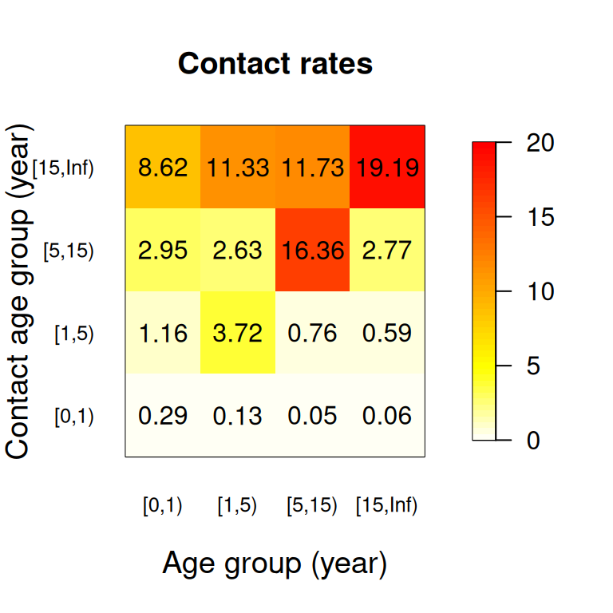
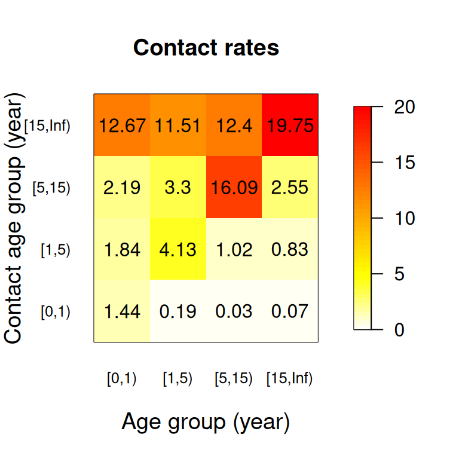
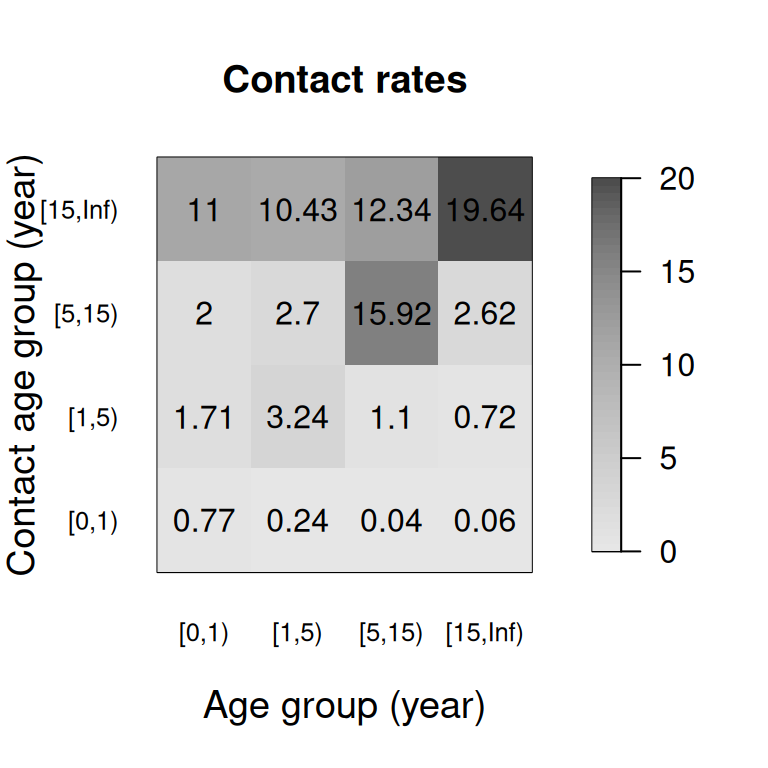

# The socialmixr package

[socialmixr](https://github.com/epiforecasts/socialmixr) is an `R`
package to derive social mixing matrices from survey data. These are
particularly useful for age-structured [infectious disease
models](https://en.wikipedia.org/wiki/Mathematical_modelling_of_infectious_disease).
For background on age-specific mixing matrices and what data inform
them, see, for example, the paper on POLYMOD by
\[@mossong_social_2008\].

## The pipeline workflow

Contact matrices are computed through a small pipeline of composable
functions:

1.  `survey[expr]` – filter participants or contacts.
2.  [`assign_age_groups()`](https://epiforecasts.io/socialmixr/reference/assign_age_groups.md)
    – impute missing ages and assign age groups.
3.  [`weigh()`](https://epiforecasts.io/socialmixr/reference/weigh.md) –
    optionally apply participant weights.
4.  [`compute_matrix()`](https://epiforecasts.io/socialmixr/reference/compute_matrix.md)
    – compute the mean contact matrix.
5.  [`symmetrise()`](https://epiforecasts.io/socialmixr/reference/symmetrise.md),
    [`split_matrix()`](https://epiforecasts.io/socialmixr/reference/split_matrix.md),
    [`per_capita()`](https://epiforecasts.io/socialmixr/reference/per_capita.md)
    – optional post-processing.

Each step is a separate function.

The POLYMOD data are included with the package and can be loaded using

``` r

data(polymod)
```

An example use would be

``` r

polymod[country == "United Kingdom"] |>
  assign_age_groups(age_limits = c(0, 1, 5, 15)) |>
  compute_matrix()
#> 
#> ── Contact matrix (4 age groups) ──
#> 
#> Ages: "[0,1)", "[1,5)", "[5,15)", and "[15,Inf)"
#> Participants: 1011
#> 
#>           contact.age.group
#> age.group       [0,1)     [1,5)   [5,15) [15,Inf)
#>   [0,1)    0.40000000 0.8000000 1.266667 5.933333
#>   [1,5)    0.11250000 1.9375000 1.462500 5.450000
#>   [5,15)   0.02450980 0.5049020 7.946078 6.215686
#>   [15,Inf) 0.03230337 0.3581461 1.290730 9.594101
```

This generates a contact matrix from the UK part of the POLYMOD study,
with age groups 0-1, 1-5, 5-15 and 15+ years. It contains the mean
number of contacts that each member of an age group (row) has reported
with members of the same or another age group (column).

### Assigning age groups

[`assign_age_groups()`](https://epiforecasts.io/socialmixr/reference/assign_age_groups.md)
prepares the survey for matrix computation. It imputes participant and
contact ages from any available ranges, drops or keeps rows with missing
ages (configurable via `missing_participant_age` and
`missing_contact_age`), and adds `age.group` and `contact.age.group`
columns using the `age_limits` you supply:

``` r

uk_grouped <- polymod[country == "United Kingdom"] |>
  assign_age_groups(age_limits = c(0, 1, 5, 15))

head(uk_grouped$participants[, c("part_id", "part_age", "age.group")])
#>    part_id part_age age.group
#>      <int>    <int>    <fctr>
#> 1:    4536        0     [0,1)
#> 2:    4538        0     [0,1)
#> 3:    4540        0     [0,1)
#> 4:    4541        0     [0,1)
#> 5:    4542        0     [0,1)
#> 6:    4546        0     [0,1)
head(uk_grouped$contacts[, c("part_id", "cnt_age", "contact.age.group")])
#>    part_id cnt_age contact.age.group
#>      <int>   <int>            <fctr>
#> 1:    4517       4             [1,5)
#> 2:    4517      40          [15,Inf)
#> 3:    4517      31          [15,Inf)
#> 4:    4517      52          [15,Inf)
#> 5:    4517      29          [15,Inf)
#> 6:    4517      59          [15,Inf)
```

The resulting survey object can be inspected, subset, or passed through
any number of
[`weigh()`](https://epiforecasts.io/socialmixr/reference/weigh.md) calls
before
[`compute_matrix()`](https://epiforecasts.io/socialmixr/reference/compute_matrix.md).

## Surveys

The key argument to the pipeline functions is the `survey` they operate
on. The `socialmixr` package includes the POLYMOD survey. It also
provides access to all surveys in the [Social contact
data](https://zenodo.org/communities/social_contact_data) community on
[Zenodo](https://zenodo.org). The available surveys can be listed (if an
internet connection is available) with

``` r

list_surveys()
```

A survey can be downloaded using the
[`get_survey()`](https://epiforecasts.io/socialmixr/reference/get_survey.md)
command. This will get the relevant data of a survey given its Zenodo
DOI (as returned by
[`list_surveys()`](https://epiforecasts.io/socialmixr/reference/list_surveys.md)).
If a survey is to be used repeatedly it is worth downloading it and
storing it locally to avoid the need for a network connection and speed
up processing.

``` r

peru_survey <- get_survey("https://doi.org/10.5281/zenodo.1095664")
saveRDS(peru_survey, "peru.rds")
```

This way, the `peru` data set can be loaded in the future without the
need for an internet connection using

``` r

peru_survey <- readRDS("peru.rds")
```

Some surveys may contain data from multiple countries. To check this,
look at the `country` column of the participant data:

``` r

unique(polymod$participants$country)
#> [1] Italy          Germany        Luxembourg     Netherlands    Poland        
#> [6] United Kingdom Finland        Belgium       
#> 8 Levels: Belgium Finland Germany Italy Luxembourg Netherlands ... United Kingdom
```

Use the subset method `[` to restrict to one or more countries:

``` r

polymod[country %in% c("United Kingdom", "Germany")]
```

If this is not done, the different sub-surveys contained in a dataset
are combined as a single sample (without country-specific weighting).

A reference for any given survey is in its `reference` field, e.g.

``` r

polymod$reference
#> $title
#> [1] "POLYMOD social contact data"
#> 
#> $bibtype
#> [1] "Misc"
#> 
#> $author
#>  [1] "Joël Mossong"               "Niel Hens"                 
#>  [3] "Mark Jit"                   "Philippe Beutels"          
#>  [5] "Kari Auranen"               "Rafael Mikolajczyk"        
#>  [7] "Marco Massari"              "Stefania Salmaso"          
#>  [9] "Gianpaolo Scalia Tomba"     "Jacco Wallinga"            
#> [11] "Janneke Heijne"             "Malgorzata Sadkowska-Todys"
#> [13] "Magdalena Rosinska"         "W. John Edmunds"           
#> 
#> $year
#> [1] 2017
#> 
#> $note
#> [1] "Version 1.1"
#> 
#> $doi
#> [1] "10.5281/zenodo.1157934"
```

## Bootstrapping

To get an idea of the uncertainty in the contact matrices, participants
can be resampled with replacement. A short helper replicates participant
(and matching contact) rows for each occurrence of a resampled ID, so
that duplicates are preserved:

``` r

bootstrap <- function(survey) {
  sampled_ids <- sample(
    unique(survey$participants$part_id),
    replace = TRUE
  )
  survey$participants <- survey$participants[
    list(sampled_ids), on = "part_id"
  ]
  survey$contacts <- survey$contacts[
    list(sampled_ids),
    on = "part_id",
    nomatch = NULL,
    allow.cartesian = TRUE
  ]
  survey
}

uk <- polymod[country == "United Kingdom"] |>
  assign_age_groups(age_limits = c(0, 1, 5, 15))

m <- suppressWarnings(
  replicate(n = 5, uk |> bootstrap() |> compute_matrix())
)
mr <- Reduce("+", lapply(m["matrix", ], function(x) x / ncol(m)))
mr
#>           contact.age.group
#> age.group       [0,1)     [1,5)    [5,15) [15,Inf)
#>   [0,1)    0.87257409 1.3611455  1.948159 12.18693
#>   [1,5)    0.14264617 4.1499348  3.262223 10.67810
#>   [5,15)   0.08125083 1.2880114 16.003548 14.07385
#>   [15,Inf) 0.05650288 0.6471815  2.580666 19.27007
```

## Demography

Obtaining symmetric contact matrices, splitting out their components
(see below) and population-based participant weights require information
about the underlying demographic composition of the survey population.
This is represented as a `data.frame` with columns `lower.age.limit`
(the lower end of each age group) and `population` (the number of people
in that age group).

### Using custom population data

You can construct any comparable data frame and pass it to the relevant
post-processing step:

``` r

custom_pop <- data.frame(
  lower.age.limit = c(0, 18, 60),
  population = c(12000000, 35000000, 20000000)
)
polymod[country == "United Kingdom"] |>
  assign_age_groups(age_limits = c(0, 18, 60)) |>
  compute_matrix() |>
  symmetrise(survey_pop = custom_pop)
#>           contact.age.group
#> age.group    [0,18)  [18,60) [60,Inf)
#>   [0,18)   7.813187 5.899817 1.166637
#>   [18,60)  2.022794 7.931429 2.084481
#>   [60,Inf) 0.699982 3.647842 1.918033
```

For recent UN World Population Prospects data, the `wpp2024` package is
available from GitHub (`remotes::install_github("PPgp/wpp2024")`):

``` r

data("popAge1dt", package = "wpp2024")
uk_pop <- popAge1dt[name == "United Kingdom" & year == 2020,
  .(lower.age.limit = age, population = pop * 1000)
]
polymod[country == "United Kingdom"] |>
  assign_age_groups(age_limits = c(0, 18, 60)) |>
  compute_matrix() |>
  symmetrise(survey_pop = uk_pop)
#>           contact.age.group
#> age.group     [0,18)  [18,60)  [60,Inf)
#>   [0,18)   7.8131868 5.490727 0.8787841
#>   [18,60)  2.1528265 7.931429 1.7516352
#>   [60,Inf) 0.7665599 3.896982 1.9180328
```

For the rest of this section we use a small constructed `uk_pop` for the
United Kingdom, sufficient to illustrate the post-processing functions:

``` r

uk_pop <- data.frame(
  lower.age.limit = c(0, 1, 5, 15),
  population = c(750000, 3200000, 7500000, 56000000)
)
```

## Symmetric contact matrices

Conceivably, contact matrices should be symmetric: the total number of
contacts made by members of one age group with those of another should
be the same as vice versa. Mathematically, if $`m_{ij}`$ is the mean
number of contacts made by members of age group $`i`$ with members of
age group $`j`$, and the total number of people in age group $`i`$ is
$`N_i`$, then

``` math
m_{ij} N_i = m_{ji}N_j
```

Because of variation in the sample from which the contact matrix is
obtained, this relationship is usually not fulfilled exactly. In order
to obtain a symmetric contact matrix that fulfills it, one can use

``` math
m'_{ij} = \frac{1}{2N_i} (m_{ij} N_i + m_{ji} N_j)
```

To get this version of the contact matrix, pipe the matrix through
[`symmetrise()`](https://epiforecasts.io/socialmixr/reference/symmetrise.md),
passing the population data:

``` r

polymod[country == "United Kingdom"] |>
  assign_age_groups(age_limits = c(0, 1, 5, 15)) |>
  compute_matrix() |>
  symmetrise(survey_pop = uk_pop)
#> Warning in normalise_weighted_matrix(survey_pop = resolved_pop, weighted_matrix = x$matrix, : Large differences in the size of the sub-populations with the current age
#> breaks are likely to result in artefacts after making the matrix symmetric.
#> ! Please reconsider the age breaks to obtain more equally sized
#>   sub-populations.
#> ℹ Normalization factors: [0.3 and 3.1]
#> 
#> ── Contact matrix (4 age groups) ──
#> 
#> Ages: "[0,1)", "[1,5)", "[5,15)", and "[15,Inf)"
#> Participants: 1011
#> 
#>           contact.age.group
#> age.group       [0,1)     [1,5)    [5,15) [15,Inf)
#>   [0,1)    0.40000000 0.6400000 0.7558824 4.172659
#>   [1,5)    0.15000000 1.9375000 1.3229320 5.858778
#>   [5,15)   0.07558824 0.5644510 7.9460784 7.926570
#>   [15,Inf) 0.05588383 0.3347873 1.0615942 9.594101
```

## Contact rates per capita

The contact matrix per capita $`c_{ij}`$ contains the social contact
rates of one individual of age $`i`$ with one individual of age $`j`$,
given the population details. For example, $`c_{ij}`$ is used in
infectious disease modelling to calculate the force of infection, which
is based on the likelihood that one susceptible individual of age $`i`$
will be in contact with one infectious individual of age $`j`$. The
contact rates per capita are calculated as follows:

``` math
c_{ij} =  \tfrac{m_{ij}}{N_{j}}
```

Pipe the matrix through
[`per_capita()`](https://epiforecasts.io/socialmixr/reference/per_capita.md).
If combined with
[`symmetrise()`](https://epiforecasts.io/socialmixr/reference/symmetrise.md),
the contact matrix $`m_{ij}`$ can show asymmetry if the sub-population
sizes are different, but the contact matrix per capita will be fully
symmetric:

``` math
c'_{ij} = \frac{m_{ij} N_i + m_{ji} N_j}{2N_iN_j} = c'_{ji}
```

``` r

de_pop <- data.frame(
  lower.age.limit = c(0, 60),
  population = c(67000000, 16000000)
)

polymod[country == "Germany"] |>
  assign_age_groups(age_limits = c(0, 60)) |>
  compute_matrix() |>
  symmetrise(survey_pop = de_pop) |>
  per_capita(survey_pop = de_pop)
#>           contact.age.group
#> age.group        [0,60)     [60,Inf)
#>   [0,60)   1.155803e-07 4.674434e-08
#>   [60,Inf) 4.674434e-08 1.329225e-07
```

## Splitting contact matrices

[`split_matrix()`](https://epiforecasts.io/socialmixr/reference/split_matrix.md)
decomposes the contact matrix into a *global* component as well as three
components representing *contacts*, *assortativity* and *demography*. In
other words, the elements $`m_{ij}`$ of the contact matrix are modelled
as

``` math
 m_{ij} = c q d_i a_{ij} n_j 
```

where $`c`$ is the mean number of contacts across the whole population,
$`c q d_i`$ is the number of contacts that a member of group $`i`$ makes
across age groups, $`n_j`$ is the proportion of the surveyed population
in age group $`j`$. The constant $`q`$ is set so that $`c q`$ is equal
to the value of the largest eigenvalue of $`m_{ij}`$; if used in an
infectious disease model and assumed that every contact leads to
infection, $`c q`$ can be replaced by the basic reproduction number
$`R_0`$.

[`split_matrix()`](https://epiforecasts.io/socialmixr/reference/split_matrix.md)
returns the assortativity matrix $`a_{ij}`$ in `$matrix`, with
additional components `$mean.contacts` ($`c`$), `$normalisation` ($`q`$)
and `$contacts` ($`d_i`$).

``` r

polymod[country == "United Kingdom"] |>
  assign_age_groups(age_limits = c(0, 1, 5, 15)) |>
  compute_matrix() |>
  split_matrix(survey_pop = uk_pop)
#> 
#> ── Contact matrix (4 age groups) ──
#> 
#> Ages: "[0,1)", "[1,5)", "[5,15)", and "[15,Inf)"
#> Participants: 1011
#> Mean contacts: 11.51
#> 
#>           contact.age.group
#> age.group      [0,1)     [1,5)   [5,15)  [15,Inf)
#>   [0,1)    4.2825397 2.0074405 1.356138 0.8507724
#>   [1,5)    1.1288703 4.5566379 1.467531 0.7324218
#>   [5,15)   0.1500389 0.7244067 4.864262 0.5095965
#>   [15,Inf) 0.2576565 0.6695219 1.029506 1.0248749
```

## Filtering

The `[` method can be used to select particular participants or
contacts. For example, in the `polymod` dataset, the indicators
`cnt_home`, `cnt_work`, `cnt_school`, `cnt_transport`, `cnt_leisure` and
`cnt_otherplace` take value 0 or 1 depending on where a contact
occurred. The filter is evaluated against whichever table contains the
referenced columns (participants, contacts, or both). Multiple filters
can be chained:

``` r

# contact matrix for school-related contacts
polymod[cnt_school == 1] |>
  assign_age_groups(age_limits = c(0, 20, 60)) |>
  compute_matrix()
#>           contact.age.group
#> age.group      [0,20)    [20,60)   [60,Inf)
#>   [0,20)   5.15826279 1.09311741 0.03570114
#>   [20,60)  0.45610034 0.47434436 0.01453820
#>   [60,Inf) 0.08917836 0.07314629 0.03507014

# contact matrix for work-related contacts involving physical contact
polymod[cnt_work == 1][phys_contact == 1] |>
  assign_age_groups(age_limits = c(0, 20, 60)) |>
  compute_matrix()
#>           contact.age.group
#> age.group      [0,20)    [20,60)    [60,Inf)
#>   [0,20)   0.04266274 0.06325855 0.009194557
#>   [20,60)  0.16020525 1.26966933 0.145952109
#>   [60,Inf) 0.04212638 0.29287864 0.062186560

# contact matrix for daily contacts at home with males
polymod[cnt_home == 1][cnt_gender == "M"][duration_multi == 5] |>
  assign_age_groups(age_limits = c(0, 20, 60)) |>
  compute_matrix()
#>           contact.age.group
#> age.group      [0,20)   [20,60)   [60,Inf)
#>   [0,20)   0.39242369 0.5855094 0.03089371
#>   [20,60)  0.25919589 0.3940690 0.04875962
#>   [60,Inf) 0.05717151 0.1153460 0.23871615
```

## Participant weights

### Temporal aspects and demography

Participant weights are commonly used to align sample and population
characteristics in terms of temporal aspects and the age distribution.
For example, the day of the week has been reported as a driving factor
for social contact behaviour, hence to obtain a weekly average, the
survey data should represent the weekly 2/5 distribution of weekend/week
days. To align the survey data to this distribution, one can obtain
participant weights in the form of:
``` math
w_{\textrm{day.of.week}} = \tfrac{5/7}{N_{\textrm{weekday}}/N} \text{  OR   } \tfrac{2/7}{N_{\textrm{weekend}}/N}
```
with sample size $`N`$, and $`N_{weekday}`$ and $`N_{weekend}`$ the
number of participants that were surveyed during weekdays and weekend
days, respectively.

Another driver of social contact patterns is age. To improve the
representativeness of survey data, age-specific weights can be
calculated as:
``` math
w_{age} = \tfrac{P_{a}\ /\ P}{N_{a}\ /\ N}
```
with $`P`$ the population size, $`P_a`$ the population fraction of age
$`a`$, $`N`$ the survey sample size and $`N_a`$ the survey fraction of
age $`a`$. The combination of age-specific and temporal weights for
participant $`i`$ of age $`a`$ can be constructed as:
``` math
w_{i} = w_{\textrm{age}} * w_{\textrm{day.of.week}} 
```

If the social contact analysis is based on stratification by splitting
the population into non-overlapping groups, it requires the weights to
be standardised so that the weighted totals within mutually exclusive
cells equal the known population totals
\[@kolenikov_post-stratification_2016\].
[`compute_matrix()`](https://epiforecasts.io/socialmixr/reference/compute_matrix.md)
applies this post-stratification normalisation within age groups.

[`weigh()`](https://epiforecasts.io/socialmixr/reference/weigh.md) is
composable: each call multiplies new weights into the participants’
`weight` column. Common recipes are wrapped as `weigh_by_*()`
convenience functions:

``` r

polymod[country == "United Kingdom"] |>
  assign_age_groups(age_limits = c(0, 18, 60)) |>
  weigh_by_dayofweek() |>
  weigh_by_age(uk_pop) |>
  compute_matrix()
#>           contact.age.group
#> age.group    [0,18)  [18,60)  [60,Inf)
#>   [0,18)   11.72388 5.092404 0.2908445
#>   [18,60)        NA       NA        NA
#>   [60,Inf)       NA       NA        NA
```

[`weigh_by_dayofweek()`](https://epiforecasts.io/socialmixr/reference/weigh.md)
assigns weekday participants a total weight of 5 and weekend
participants a total weight of 2 (the weekly 5/2 split).
[`weigh_by_age()`](https://epiforecasts.io/socialmixr/reference/weigh.md)
post-stratifies against a target population: it interpolates `uk_pop` to
single-year ages with
[`pop_age()`](https://epiforecasts.io/socialmixr/reference/pop_age.md)
and multiplies in the ratio of target to observed age share.

For arbitrary discrete joins,
[`weigh()`](https://epiforecasts.io/socialmixr/reference/weigh.md)
itself takes a two-column data frame whose key column matches `by` —
e.g. pooling participants across countries by a target share:

``` r

country_target <- data.frame(
  country = c("United Kingdom", "Germany", "Italy"),
  p = c(0.3, 0.4, 0.3),
  stringsAsFactors = FALSE
)
polymod |>
  assign_age_groups(age_limits = c(0, 18, 60)) |>
  weigh("country", target = country_target) |>
  compute_matrix()
```

### User-defined participant weights

[`weigh()`](https://epiforecasts.io/socialmixr/reference/weigh.md) with
no `target` multiplies an existing participant column directly into the
weight. For instance, to give more importance to participants from large
households:

``` r

polymod |>
  assign_age_groups(age_limits = c(0, 18, 60)) |>
  weigh("hh_size") |>
  compute_matrix()
#>           contact.age.group
#> age.group     [0,18)   [18,60)  [60,Inf)
#>   [0,18)   8.9599558  5.907367 0.7338418
#>   [18,60)  2.4650353 10.960550 1.2399199
#>   [60,Inf) 0.9909593  5.659468 2.7081868
```

### Weight threshold

If the survey population differs extensively from the demography, some
participants can end up with relatively high weights and as such, an
excessive contribution to the population average. This warrants the
limitation of single participant influences by a truncation of the
weights.
[`compute_matrix()`](https://epiforecasts.io/socialmixr/reference/compute_matrix.md)
accepts a numeric `weight_threshold` which caps the standardised weights
and re-normalises so that the weight sum equals the group size. Weights
close to the threshold may slightly exceed it after re-normalisation.

``` r

polymod[country == "United Kingdom"] |>
  assign_age_groups(age_limits = c(0, 18, 60)) |>
  weigh_by_dayofweek() |>
  weigh_by_age(uk_pop) |>
  compute_matrix(weight_threshold = 3)
#>           contact.age.group
#> age.group   [0,18)  [18,60)  [60,Inf)
#>   [0,18)   10.2339 5.102618 0.3610971
#>   [18,60)       NA       NA        NA
#>   [60,Inf)      NA       NA        NA
```

### Numerical example

With these numeric examples, we show the importance of
post-stratification weights in contrast to using the crude weights
directly within age-groups. We will apply the weights by age and day of
week separately in these examples, though the combination is
straightforward via multiplication.

#### Get survey data

We start from a survey including 6 participants of 1, 2 and 3 years of
age. The ages are not equally represented in the sample, though we
assume they are equally present in the reference population. We will
calculate the weighted average number of contacts by age and by age
group, using {1,2} and {3} years of age. The following table shows the
reported number of contacts per participant $`i`$, represented by
$`m_i`$:

| age | day.of.week | age.group | m_i |
|----:|:------------|:----------|----:|
|   1 | weekend     | A         |   3 |
|   1 | weekend     | A         |   2 |
|   2 | weekend     | A         |   9 |
|   2 | week        | A         |  10 |
|   2 | week        | A         |   8 |
|   3 | week        | B         |  15 |

The summary statistics for the sample (N) and reference population (P)
are as follows

``` r

N <- 6
N_age <- c(2, 3, 1)
N_age.group <- c(5, 1)
N_day.of.week <- c(3, 3)

P <- 3000
P_age <- c(1000, 1000, 1000)
P_age.group <- c(2000, 1000)

P_day.of.week <- c(5 / 7, 2 / 7) * 3000
```

This survey data results in an unweighted average number of contacts:

    #> unweighted average number of contacts: 7.83

and age-specific unweighted averages on the number of contacts:

| age | age.group |  m_i |
|----:|:----------|-----:|
|   1 | A         |  2.5 |
|   2 | A         |  9.0 |
|   3 | B         | 15.0 |

#### Weight by day of week

The following table contains the participants weights based on the
survey day with and without the population and sample size constants
($`w`$ and $`w'`$, respectively). Note that the standardised weights
$`\tilde{w}`$ and $`\tilde{w'}`$ are the same:

| age | day.of.week | age.group | m_i |    w | w_tilde |  w_dot | w_dot_tilde |
|----:|:------------|:----------|----:|-----:|--------:|-------:|------------:|
|   1 | weekend     | A         |   3 | 0.57 |    0.57 | 285.71 |        0.57 |
|   1 | weekend     | A         |   2 | 0.57 |    0.57 | 285.71 |        0.57 |
|   2 | weekend     | A         |   9 | 0.57 |    0.57 | 285.71 |        0.57 |
|   2 | week        | A         |  10 | 1.43 |    1.43 | 714.29 |        1.43 |
|   2 | week        | A         |   8 | 1.43 |    1.43 | 714.29 |        1.43 |
|   3 | week        | B         |  15 | 1.43 |    1.43 | 714.29 |        1.43 |

Note the different scale of $`w`$ and $`w'`$, and the more
straightforward interpretation of the numerical value of $`w`$ in terms
of relative differences to apply truncation. Using the standardised
weights, we are able to calculate the weighted number of contacts:

| age | day.of.week | age.group | m_i |    w | w_tilde | m_i \* w_tilde |
|----:|:------------|:----------|----:|-----:|--------:|---------------:|
|   1 | weekend     | A         |   3 | 0.57 |    0.57 |           1.71 |
|   1 | weekend     | A         |   2 | 0.57 |    0.57 |           1.14 |
|   2 | weekend     | A         |   9 | 0.57 |    0.57 |           5.13 |
|   2 | week        | A         |  10 | 1.43 |    1.43 |          14.30 |
|   2 | week        | A         |   8 | 1.43 |    1.43 |          11.44 |
|   3 | week        | B         |  15 | 1.43 |    1.43 |          21.45 |

    #> weighted average number of contacts: 9.2

If the population-based weights are directly used in age-specific
groups, the contact behaviour of the 3 year-old participant, which
participated during week day, is inflated due to the
under-representation of week days in the survey sample. In addition, the
number of contacts for 1 year-old participants is decreased because of
the over-representation of weekend days in the survey. Using the
population-weights within the two aggregated age groups, we obtain a
more intuitive weighting for age group A, but it is still skewed for
individuals in age group B. As such, this weighted average for age group
B has no meaning in terms of social contact behaviour:

[TABLE]

If we subdivide the population, we need to use post-stratification
weights (“w_PS”) in which the weighted totals within mutually exclusive
cells equal the sample size. For the age groups, this goes as follows:

| age | day.of.week | age.group | m_i |    w | w_tilde | w_PS |
|----:|:------------|:----------|----:|-----:|--------:|-----:|
|   1 | weekend     | A         |   3 | 0.57 |    0.57 | 0.62 |
|   1 | weekend     | A         |   2 | 0.57 |    0.57 | 0.62 |
|   2 | weekend     | A         |   9 | 0.57 |    0.57 | 0.62 |
|   2 | week        | A         |  10 | 1.43 |    1.43 | 1.56 |
|   2 | week        | A         |   8 | 1.43 |    1.43 | 1.56 |
|   3 | week        | B         |  15 | 1.43 |    1.43 | 1.00 |

The weighted means equal:

| age.group | m_i \* w_PS |
|:----------|------------:|
| A         |       7.352 |
| B         |      15.000 |

#### Weight by age

We repeated the example by calculating age-specific participant weights
on the population and age-group level:

| age | day.of.week | age.group | m_i |    w | w_tilde | w_PS |
|----:|:------------|:----------|----:|-----:|--------:|-----:|
|   1 | weekend     | A         |   3 | 1.00 |    1.00 | 1.25 |
|   1 | weekend     | A         |   2 | 1.00 |    1.00 | 1.25 |
|   2 | weekend     | A         |   9 | 0.67 |    0.67 | 0.83 |
|   2 | week        | A         |  10 | 0.67 |    0.67 | 0.83 |
|   2 | week        | A         |   8 | 0.67 |    0.67 | 0.83 |
|   3 | week        | B         |  15 | 2.00 |    2.00 | 1.00 |

    #> weighted average number of contacts: 8.85

If the age-specific weights are directly used within the age groups, the
contact behaviour for age group B is inflated to unrealistic levels and
the number of contacts for age group A is artificially low:

[TABLE]

Using the post-stratification weights, we end up with:

| age.group | m_i \* w_PS |
|:----------|------------:|
| A         |       5.732 |
| B         |      15.000 |

#### Apply threshold

We start with survey data of 14 participants of 1, 2 and 3 years of age,
sampled from a population in which all ages are equally present. Given
the high representation of participants aged 1 year, the age-specific
proportions are skewed in comparison with the reference population. If
we calculate the age-specific weights and (un)weighted average number of
contacts, we end up with:

| age | day.of.week | age.group | m_i |    w | w_tilde |
|----:|:------------|:----------|----:|-----:|--------:|
|   1 | weekend     | A         |   3 | 0.47 |    0.47 |
|   1 | weekend     | A         |   2 | 0.47 |    0.47 |
|   1 | weekend     | A         |   3 | 0.47 |    0.47 |
|   1 | weekend     | A         |   2 | 0.47 |    0.47 |
|   1 | weekend     | A         |   3 | 0.47 |    0.47 |
|   1 | weekend     | A         |   2 | 0.47 |    0.47 |
|   1 | weekend     | A         |   3 | 0.47 |    0.47 |
|   1 | weekend     | A         |   2 | 0.47 |    0.47 |
|   1 | weekend     | A         |   3 | 0.47 |    0.47 |
|   1 | weekend     | A         |   2 | 0.47 |    0.47 |
|   2 | weekend     | A         |   9 | 1.56 |    1.56 |
|   2 | week        | A         |  10 | 1.56 |    1.56 |
|   2 | week        | A         |   8 | 1.56 |    1.56 |
|   3 | week        | B         |  30 | 4.67 |    4.67 |

    #> unweighted average number of contacts: 5.86
    #> weighted average number of contacts: 13.86

The single participant of 3 years of age has a very large influence on
the weighted population average. As such, we propose to truncate the
relative age-specific weights $`w`$ at 3. As such, the weighted
population average equals:

    #> weighted average number of contacts after truncation: 10.28

## Plotting

### Using ggplot2

The contact matrices can be plotted by using the
[`geom_tile()`](https://ggplot2.tidyverse.org/reference/geom_tile.html)
function of the `ggplot2` package.

``` r

df <- reshape2::melt(
  mr,
  varnames = c("age.group", "age.group.contact"),
  value.name = "contacts"
)
ggplot(df, aes(x = age.group, y = age.group.contact, fill = contacts)) +
  theme(legend.position = "bottom") +
  geom_tile()
```



### Using R base

The contact matrices can also be plotted with the
[`matrix_plot()`](https://epiforecasts.io/socialmixr/reference/matrix_plot.md)
function as a grid of coloured rectangles with the numeric values in the
cells. Heat colours are used by default, though this can be changed.

``` r

matrix_plot(mr)
```



``` r

matrix_plot(mr, color.palette = gray.colors)
```



## References
