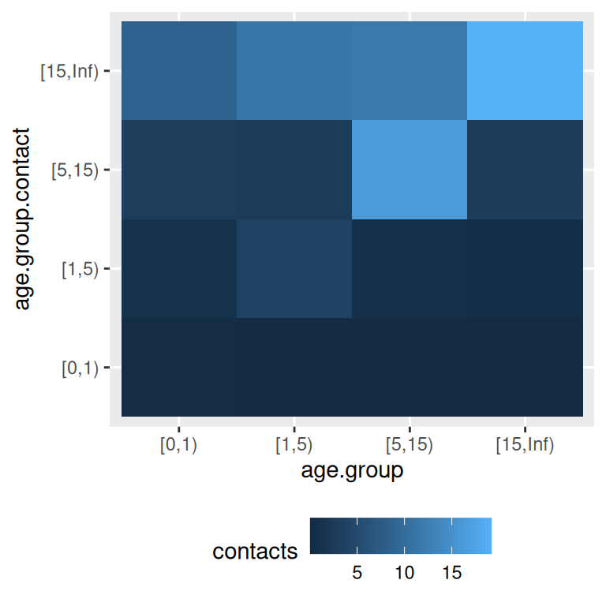
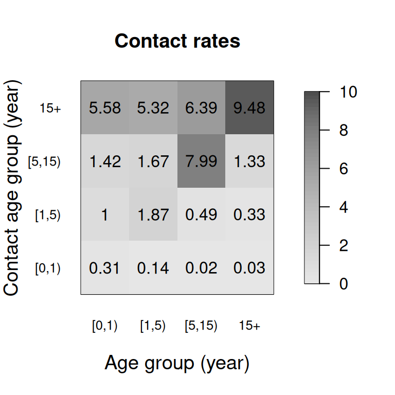

# The socialmixr package

[socialmixr](https://github.com/epiforecasts/socialmixr) is an `R`
package to derive social mixing matrices from survey data. These are
particularly useful for age-structured [infectious disease
models](https://en.wikipedia.org/wiki/Mathematical_modelling_of_infectious_disease).
For background on age-specific mixing matrices and what data inform
them, see, for example, the paper on POLYMOD by
\[@mossong_social_2008\].

## Usage

At the heart of the `socialmixr` package is the
[`contact_matrix()`](https://epiforecasts.io/socialmixr/reference/contact_matrix.md)
function. This extracts a contact matrix from survey data. You can use
the `R` help to find out about usage of the
[`contact_matrix()`](https://epiforecasts.io/socialmixr/reference/contact_matrix.md)
function, including a list of examples:

``` r
?contact_matrix
```

The POLYMOD data are included with the package and can be loaded using

``` r
data(polymod)
```

An example use would be

``` r
contact_matrix(
  polymod, countries = "United Kingdom",
  age_limits = c(0, 1, 5, 15)
)
#> $matrix
#>           contact.age.group
#> age.group       [0,1)     [1,5)   [5,15) [15,Inf)
#>   [0,1)    0.40000000 0.8000000 1.266667 5.933333
#>   [1,5)    0.11250000 1.9375000 1.462500 5.450000
#>   [5,15)   0.02450980 0.5049020 7.946078 6.215686
#>   [15,Inf) 0.03230337 0.3581461 1.290730 9.594101
#> 
#> $participants
#>    age.group participants proportion
#>       <char>        <int>      <num>
#> 1:     [0,1)           15 0.01483680
#> 2:     [1,5)           80 0.07912957
#> 3:    [5,15)          204 0.20178042
#> 4:  [15,Inf)          712 0.70425321
```

This generates a contact matrix from the UK part of the POLYMOD study,
with age groups 0-1, 1-5, 5-15 and 15+ years. It contains the mean
number of contacts that each member of an age group (row) has reported
with members of the same or another age group (column).

## Surveys

The key argument to the
[`contact_matrix()`](https://epiforecasts.io/socialmixr/reference/contact_matrix.md)
function is the `survey` that it supposed to use. The `socialmixr`
package includes the POLYMOD survey, which will be used if not survey is
specified. It also provides access to all surveys in the [Social contact
data](https://zenodo.org/communities/social_contact_data) community on
[Zenodo](https://zenodo.org). The available surveys can be listed (if an
internet connection is available) with

``` r
list_surveys()
```

A survey can be downloaded using the
[`get_survey()`](https://epiforecasts.io/socialmixr/reference/get_survey.md)
command. This will get the relevant data of a survey given its Zenodo
DOI (as returned by
[`list_surveys()`](https://epiforecasts.io/socialmixr/reference/list_surveys.md)).
All other relevant commands in the `socialmixr` package accept a DOI,
but if a survey is to be used repeatedly it is worth downloading it and
storing it locally to avoid the need for a network connection and speed
up processing.

``` r
peru_survey <- get_survey("https://doi.org/10.5281/zenodo.1095664")
saveRDS(peru_survey, "peru.rds")
```

This way, the `peru` data set can be loaded in the future without the
need for an internet connection using

``` r
peru_survey <- readRDS("peru.rds")
```

Some surveys may contain data from multiple countries. To check this,
use the `survey_countries` function

``` r
survey_countries(polymod)
#> Warning: `survey_countries()` was deprecated in socialmixr 0.5.0.
#> ℹ Please use `contactsurveys::download_survey()` instead.
#> ℹ We recommend using contactsurveys::download_survey() to download your
#>   surveys, and then you can load them with socialmixr::load_survey() and
#>   explore which countries are in the data.
#> [1] "Italy"          "Germany"        "Luxembourg"     "Netherlands"   
#> [5] "Poland"         "United Kingdom" "Finland"        "Belgium"
```

If one wishes to get a contact matrix for one or more specific
countries, a `countries` argument can be passed to
[`contact_matrix()`](https://epiforecasts.io/socialmixr/reference/contact_matrix.md).
If this is not done, the different surveys contained in a dataset are
combined as if they were one single sample (i.e., not applying any
population-weighting by country or other correction).

By default, socialmixr uses the POLYMOD survey. A reference for any
given survey can be obtained using
[`get_citation()`](https://epiforecasts.io/socialmixr/reference/get_citation.md),
e.g.

``` r
get_citation(polymod)
#> Warning: `get_citation()` was deprecated in socialmixr 0.5.0.
#> ℹ Please use `contactsurveys::get_citation()` instead.
#> Mossong J, Hens N, Jit M, Beutels P, Auranen K, Mikolajczyk R, Massari
#> M, Salmaso S, Tomba GS, Wallinga J, Heijne J, Sadkowska-Todys M,
#> Rosinska M, Edmunds WJ (2017). "POLYMOD social contact data."
#> doi:10.5281/zenodo.1157934 <https://doi.org/10.5281/zenodo.1157934>,
#> Version 1.1.
```

## Bootstrapping

To get an idea of uncertainty of the contact matrices, a bootstrap can
be used using the `sample_participants` argument of
[`contact_matrix()`](https://epiforecasts.io/socialmixr/reference/contact_matrix.md).
If this argument is set to TRUE, participants are sampled (with
replacement, to get the same number of participants of the original
study) every time the
[`contact_matrix()`](https://epiforecasts.io/socialmixr/reference/contact_matrix.md)
function is called, and thus a different matrix returned every time.
From these matrices, derived quantities can be obtained, for example the
mean:

``` r
m <- replicate(
  n = 5,
  contact_matrix(
    polymod,
    countries = "United Kingdom", age_limits = c(0, 1, 5, 15),
    sample_participants = TRUE
  )
)
mr <- Reduce("+", lapply(m["matrix", ], function(x) x / ncol(m)))
mr
#>           contact.age.group
#> age.group       [0,1)     [1,5)   [5,15) [15,Inf)
#>   [0,1)    0.53174101 0.6918351 1.271718 6.241009
#>   [1,5)    0.10124897 1.7550632 1.335923 5.134656
#>   [5,15)   0.03554597 0.4822985 8.283244 6.175919
#>   [15,Inf) 0.03073673 0.3691875 1.428080 9.726975
```

## Demography

Obtaining symmetric contact matrices, splitting out their components
(see below) and age-specific participant weights require information
about the underlying demographic composition of the survey population.
This can be passed to
[`contact_matrix()`](https://epiforecasts.io/socialmixr/reference/contact_matrix.md)
as the `survey_pop` argument, a `data.frame` with two columns,
`lower.age.limit` (denoting the lower end of the age groups) and
`population` (denoting the number of people in each age group). If no
`survey_pop` is not given,
[`contact_matrix()`](https://epiforecasts.io/socialmixr/reference/contact_matrix.md)
will try to obtain the age structure of the population (as per the
`countries` argument) from the [World Population
Prospects](https://population.un.org/wpp/) of the United Nations, using
estimates from the year that closest matches the year in which the
contact survey was conducted.

If demographic information is used, this is returned by
[`contact_matrix()`](https://epiforecasts.io/socialmixr/reference/contact_matrix.md)
as the `demography` field in the results list. It is possible to enforce
or prevent the function to return demography data by using the
`return_demography` option.

``` r
contact_matrix(polymod,
  countries = "United Kingdom", age_limits = c(0, 20),
  return_demography = TRUE
)$demography
#>    age.group population proportion  year
#>       <char>      <num>      <num> <int>
#> 1:    [0,20)   14799290  0.2454816  2005
#> 2:  [20,Inf)   45487461  0.7545184  2005
```

### Using custom population data

For custom or more recent population data, you can pass a data frame
directly via the `survey_pop` argument. The data frame should have
columns `lower.age.limit` (the lower bound of each age group) and
`population` (the number of people in each age group):

``` r
custom_pop <- data.frame(
  lower.age.limit = c(0, 18, 60),
  population = c(12000000, 35000000, 20000000)
)
contact_matrix(polymod, countries = "United Kingdom", survey_pop = custom_pop)
#> $matrix
#>           contact.age.group
#> age.group       [0,1)      [1,2)      [2,3)      [3,4)      [4,5)      [5,6)
#>   [0,1)    0.40000000 0.20000000 0.13333333 0.33333333 0.13333333 0.13333333
#>   [1,2)    0.25000000 0.50000000 0.25000000 0.56250000 0.06250000 0.37500000
#>   [2,3)    0.05882353 0.35294118 0.11764706 0.82352941 0.23529412 0.11764706
#>   [3,4)    0.07142857 0.28571429 0.32142857 1.07142857 0.46428571 0.10714286
#>   [4,5)    0.10526316 0.10526316 0.10526316 1.31578947 0.94736842 0.36842105
#>   [5,6)    0.00000000 0.22222222 0.27777778 0.27777778 0.50000000 2.16666667
#>   [6,7)    0.00000000 0.00000000 0.30434783 0.13043478 0.17391304 0.39130435
#>   [7,8)    0.00000000 0.00000000 0.04545455 0.09090909 0.13636364 0.18181818
#>   [8,9)    0.06250000 0.25000000 0.06250000 0.31250000 0.12500000 0.31250000
#>   [9,10)   0.00000000 0.04347826 0.08695652 0.13043478 0.17391304 0.17391304
#>   [10,11)  0.00000000 0.19047619 0.09523810 0.14285714 0.14285714 0.38095238
#>   [11,12)  0.08695652 0.04347826 0.08695652 0.08695652 0.13043478 0.08695652
#>   [12,13)  0.08333333 0.04166667 0.00000000 0.04166667 0.08333333 0.16666667
#>   [13,14)  0.00000000 0.06250000 0.12500000 0.00000000 0.06250000 0.12500000
#>   [14,15)  0.00000000 0.05555556 0.05555556 0.22222222 0.22222222 0.00000000
#>   [15,16)  0.04166667 0.04166667 0.12500000 0.04166667 0.00000000 0.04166667
#>   [16,17)  0.00000000 0.12000000 0.04000000 0.04000000 0.24000000 0.24000000
#>   [17,18)  0.00000000 0.06250000 0.00000000 0.00000000 0.06250000 0.12500000
#>   [18,19)  0.00000000 0.04761905 0.00000000 0.00000000 0.00000000 0.00000000
#>   [19,20)  0.00000000 0.00000000 0.10526316 0.05263158 0.10526316 0.05263158
#>   [20,21)  0.00000000 0.11764706 0.05882353 0.00000000 0.00000000 0.00000000
#>   [21,22)  0.07142857 0.07142857 0.21428571 0.14285714 0.00000000 0.14285714
#>   [22,23)  0.00000000 0.00000000 0.00000000 0.10000000 0.70000000 0.30000000
#>   [23,24)  0.00000000 0.20000000 0.00000000 0.00000000 0.20000000 0.00000000
#>   [24,25)  0.00000000 0.15384615 0.15384615 0.07692308 0.15384615 0.07692308
#>   [25,26)  0.22222222 0.00000000 0.11111111 0.33333333 0.44444444 0.00000000
#>   [26,27)  0.06250000 0.31250000 0.06250000 0.00000000 0.25000000 0.25000000
#>   [27,28)  0.22222222 0.22222222 0.33333333 0.22222222 0.11111111 0.00000000
#>   [28,29)  0.00000000 0.08333333 0.33333333 0.25000000 0.08333333 0.33333333
#>   [29,30)  0.00000000 0.15384615 0.00000000 0.07692308 0.00000000 0.00000000
#>   [30,31)  0.00000000 0.11764706 0.05882353 0.35294118 0.17647059 0.23529412
#>   [31,32)  0.16666667 0.00000000 0.00000000 0.33333333 0.00000000 0.16666667
#>   [32,33)  0.06666667 0.13333333 0.13333333 0.06666667 0.13333333 0.13333333
#>   [33,34)  0.00000000 0.25000000 0.25000000 0.00000000 0.12500000 0.12500000
#>   [34,35)  0.21428571 0.21428571 0.14285714 0.21428571 0.07142857 0.00000000
#>   [35,36)  0.21428571 0.07142857 0.28571429 0.71428571 0.64285714 0.07142857
#>   [36,37)  0.12500000 0.12500000 0.37500000 0.25000000 0.25000000 0.12500000
#>   [37,38)  0.00000000 0.08333333 0.00000000 0.08333333 0.16666667 2.08333333
#>   [38,39)  0.00000000 0.00000000 0.00000000 0.50000000 0.00000000 0.22222222
#>   [39,40)  0.05555556 0.00000000 0.22222222 0.16666667 0.05555556 0.22222222
#>   [40,41)  0.00000000 0.13333333 0.13333333 0.20000000 0.00000000 0.13333333
#>   [41,42)  0.00000000 0.11111111 0.00000000 0.00000000 0.11111111 0.11111111
#>   [42,43)  0.00000000 0.00000000 0.00000000 0.00000000 0.00000000 0.00000000
#>   [43,44)  0.00000000 0.15384615 0.15384615 0.07692308 0.00000000 0.15384615
#>   [44,45)  0.00000000 0.00000000 0.06666667 0.00000000 0.00000000 0.13333333
#>   [45,46)  0.00000000 0.05555556 0.00000000 0.11111111 0.00000000 0.00000000
#>   [46,47)  0.00000000 0.00000000 0.00000000 0.00000000 0.12500000 0.00000000
#>   [47,48)  0.00000000 0.09090909 0.00000000 0.00000000 0.18181818 0.09090909
#>   [48,49)  0.00000000 0.00000000 0.40000000 0.20000000 0.00000000 0.00000000
#>   [49,50)  0.00000000 0.00000000 0.07692308 0.00000000 0.07692308 0.00000000
#>   [50,51)  0.00000000 0.00000000 0.00000000 0.15384615 0.07692308 0.00000000
#>   [51,52)  0.00000000 0.14285714 0.00000000 0.28571429 0.00000000 0.00000000
#>   [52,53)  0.00000000 0.15384615 0.00000000 0.15384615 0.00000000 0.07692308
#>   [53,54)  0.00000000 0.00000000 0.25000000 0.00000000 0.25000000 0.00000000
#>   [54,55)  0.16000000 0.08000000 0.08000000 0.04000000 0.04000000 0.08000000
#>   [55,56)  0.00000000 0.00000000 0.00000000 0.06250000 0.06250000 0.00000000
#>   [56,57)  0.00000000 0.66666667 0.00000000 0.00000000 0.00000000 0.33333333
#>   [57,58)  0.00000000 0.00000000 0.12500000 0.00000000 0.00000000 0.00000000
#>   [58,59)  0.00000000 0.00000000 0.00000000 0.12500000 0.12500000 0.00000000
#>   [59,60)  0.00000000 0.00000000 0.10526316 0.10526316 0.00000000 0.00000000
#>   [60,61)  0.06666667 0.06666667 0.06666667 0.06666667 0.06666667 0.00000000
#>   [61,62)  0.00000000 0.00000000 0.00000000 0.00000000 0.00000000 0.00000000
#>   [62,63)  0.09090909 0.00000000 0.27272727 0.09090909 0.00000000 0.09090909
#>   [63,64)  0.00000000 0.00000000 0.06250000 0.00000000 0.00000000 0.06250000
#>   [64,65)  0.00000000 0.00000000 0.00000000 0.06250000 0.06250000 0.00000000
#>   [65,66)  0.00000000 0.07692308 0.07692308 0.15384615 0.15384615 0.07692308
#>   [66,67)  0.00000000 0.00000000 0.00000000 0.33333333 0.00000000 0.33333333
#>   [67,68)  0.00000000 0.00000000 0.00000000 0.00000000 0.00000000 0.00000000
#>   [68,69)  0.00000000 0.00000000 0.00000000 0.00000000 0.00000000 0.00000000
#>   [69,70)  0.00000000 0.00000000 0.00000000 0.00000000 0.00000000 0.00000000
#>   [70,71)  0.00000000 0.00000000 0.00000000 0.00000000 0.00000000 0.00000000
#>   [71,72)  0.00000000 0.00000000 0.00000000 0.00000000 0.00000000 0.00000000
#>   [72,73)  0.00000000 0.00000000 0.00000000 0.00000000 0.25000000 0.00000000
#>   [73,74)  0.00000000 0.00000000 0.00000000 0.66666667 0.00000000 0.33333333
#>   [74,75)  0.00000000 0.00000000 0.00000000 0.00000000 0.00000000 0.00000000
#>   [75,76)  0.00000000 0.00000000 0.00000000 0.00000000 0.00000000 0.00000000
#>   [76,77)          NA         NA         NA         NA         NA         NA
#>   [77,78)  0.00000000 0.00000000 0.00000000 0.00000000 0.00000000 0.00000000
#>   [78,79)  0.00000000 0.00000000 0.00000000 0.00000000 0.00000000 0.00000000
#>   [79,80)  0.00000000 0.00000000 0.00000000 0.00000000 0.00000000 0.00000000
#>   [80,81)          NA         NA         NA         NA         NA         NA
#>   [81,82)          NA         NA         NA         NA         NA         NA
#>   [82,83)          NA         NA         NA         NA         NA         NA
#>   [83,84)          NA         NA         NA         NA         NA         NA
#>   [84,85)          NA         NA         NA         NA         NA         NA
#>   [85,86)          NA         NA         NA         NA         NA         NA
#>   [86,87)          NA         NA         NA         NA         NA         NA
#>   [87,88)          NA         NA         NA         NA         NA         NA
#>   [88,89)          NA         NA         NA         NA         NA         NA
#>   [89,90)          NA         NA         NA         NA         NA         NA
#>   [90,91)          NA         NA         NA         NA         NA         NA
#>   [91,92)          NA         NA         NA         NA         NA         NA
#>   [92,93)          NA         NA         NA         NA         NA         NA
#>   [93,94)          NA         NA         NA         NA         NA         NA
#>   [94,95)          NA         NA         NA         NA         NA         NA
#>   [95,96)          NA         NA         NA         NA         NA         NA
#>   [96,97)          NA         NA         NA         NA         NA         NA
#>   [97,98)          NA         NA         NA         NA         NA         NA
#>   [98,99)          NA         NA         NA         NA         NA         NA
#>   [99,Inf)         NA         NA         NA         NA         NA         NA
#>           contact.age.group
#> age.group       [6,7)      [7,8)      [8,9)     [9,10)    [10,11)    [11,12)
#>   [0,1)    0.06666667 0.20000000 0.20000000 0.20000000 0.33333333 0.00000000
#>   [1,2)    0.18750000 0.06250000 0.12500000 0.18750000 0.00000000 0.06250000
#>   [2,3)    0.23529412 0.11764706 0.00000000 0.05882353 0.11764706 0.00000000
#>   [3,4)    0.28571429 0.28571429 0.07142857 0.07142857 0.07142857 0.03571429
#>   [4,5)    0.36842105 0.36842105 0.31578947 0.21052632 0.15789474 0.21052632
#>   [5,6)    1.22222222 0.44444444 0.27777778 0.00000000 0.11111111 0.11111111
#>   [6,7)    3.56521739 1.17391304 0.43478261 0.30434783 0.13043478 0.13043478
#>   [7,8)    1.22727273 3.81818182 0.54545455 0.36363636 0.27272727 0.22727273
#>   [8,9)    0.43750000 1.87500000 3.00000000 1.93750000 0.43750000 0.43750000
#>   [9,10)   0.30434783 0.47826087 2.52173913 5.73913043 1.95652174 0.65217391
#>   [10,11)  0.23809524 0.57142857 0.38095238 0.66666667 2.52380952 0.61904762
#>   [11,12)  0.17391304 0.00000000 0.39130435 0.39130435 0.65217391 4.52173913
#>   [12,13)  0.08333333 0.04166667 0.20833333 0.37500000 0.29166667 0.70833333
#>   [13,14)  0.00000000 0.25000000 0.06250000 0.18750000 0.31250000 0.18750000
#>   [14,15)  0.16666667 0.11111111 0.05555556 0.16666667 0.22222222 0.44444444
#>   [15,16)  0.04166667 0.12500000 0.00000000 0.20833333 0.04166667 0.16666667
#>   [16,17)  0.08000000 0.08000000 0.12000000 0.12000000 0.08000000 0.08000000
#>   [17,18)  0.12500000 0.06250000 0.62500000 0.18750000 0.18750000 0.12500000
#>   [18,19)  0.04761905 0.61904762 0.00000000 0.19047619 0.28571429 0.00000000
#>   [19,20)  0.10526316 0.52631579 0.00000000 0.10526316 0.10526316 0.21052632
#>   [20,21)  0.00000000 0.00000000 0.05882353 0.00000000 0.11764706 0.11764706
#>   [21,22)  0.07142857 0.07142857 0.00000000 0.00000000 0.07142857 0.00000000
#>   [22,23)  1.30000000 0.10000000 0.50000000 0.80000000 0.20000000 0.10000000
#>   [23,24)  0.00000000 0.00000000 0.00000000 0.00000000 0.20000000 0.00000000
#>   [24,25)  0.00000000 0.00000000 0.00000000 0.00000000 0.00000000 0.00000000
#>   [25,26)  0.11111111 0.11111111 0.00000000 0.00000000 0.00000000 0.00000000
#>   [26,27)  0.12500000 0.06250000 0.06250000 0.06250000 0.00000000 0.06250000
#>   [27,28)  0.22222222 0.00000000 0.00000000 0.33333333 0.00000000 0.00000000
#>   [28,29)  0.00000000 0.25000000 0.00000000 0.16666667 0.08333333 0.00000000
#>   [29,30)  0.07692308 0.61538462 0.61538462 0.15384615 0.07692308 0.07692308
#>   [30,31)  0.23529412 0.17647059 0.17647059 0.05882353 0.23529412 0.00000000
#>   [31,32)  0.00000000 0.16666667 0.00000000 0.16666667 0.00000000 0.00000000
#>   [32,33)  0.26666667 0.33333333 0.20000000 0.33333333 0.20000000 0.06666667
#>   [33,34)  0.00000000 0.37500000 0.12500000 0.12500000 0.12500000 0.00000000
#>   [34,35)  0.14285714 0.50000000 0.21428571 0.14285714 0.28571429 0.14285714
#>   [35,36)  0.21428571 0.21428571 0.71428571 0.00000000 0.21428571 0.14285714
#>   [36,37)  0.25000000 1.62500000 0.25000000 0.37500000 0.25000000 0.12500000
#>   [37,38)  0.00000000 0.08333333 0.00000000 0.41666667 0.25000000 0.08333333
#>   [38,39)  0.16666667 0.27777778 0.11111111 0.11111111 0.11111111 0.11111111
#>   [39,40)  0.11111111 0.11111111 0.00000000 0.22222222 0.05555556 0.22222222
#>   [40,41)  0.20000000 0.06666667 0.06666667 0.13333333 0.13333333 0.20000000
#>   [41,42)  0.11111111 0.44444444 0.11111111 0.44444444 0.00000000 0.22222222
#>   [42,43)  0.10000000 0.10000000 0.00000000 0.20000000 0.20000000 0.10000000
#>   [43,44)  0.15384615 0.53846154 1.07692308 0.23076923 0.38461538 0.23076923
#>   [44,45)  0.00000000 0.00000000 0.06666667 0.06666667 0.13333333 0.06666667
#>   [45,46)  0.00000000 0.00000000 0.11111111 0.00000000 0.00000000 0.00000000
#>   [46,47)  0.00000000 0.00000000 0.25000000 0.00000000 0.00000000 0.12500000
#>   [47,48)  0.00000000 0.00000000 0.00000000 0.09090909 0.18181818 0.18181818
#>   [48,49)  0.00000000 0.20000000 0.20000000 0.00000000 0.00000000 0.00000000
#>   [49,50)  0.00000000 0.00000000 0.07692308 0.00000000 0.00000000 0.00000000
#>   [50,51)  0.00000000 0.00000000 0.07692308 0.07692308 0.00000000 0.07692308
#>   [51,52)  0.00000000 0.14285714 0.00000000 0.14285714 0.28571429 0.00000000
#>   [52,53)  0.00000000 0.00000000 0.07692308 0.07692308 0.00000000 0.00000000
#>   [53,54)  0.00000000 0.12500000 0.12500000 0.00000000 0.12500000 0.00000000
#>   [54,55)  0.12000000 0.08000000 0.12000000 0.04000000 0.08000000 0.00000000
#>   [55,56)  0.06250000 0.00000000 0.06250000 0.00000000 0.00000000 0.00000000
#>   [56,57)  0.33333333 0.00000000 0.00000000 0.00000000 0.33333333 0.00000000
#>   [57,58)  0.00000000 0.00000000 0.00000000 0.00000000 0.12500000 0.00000000
#>   [58,59)  0.12500000 0.00000000 0.12500000 0.00000000 0.25000000 0.00000000
#>   [59,60)  0.10526316 0.00000000 0.10526316 0.10526316 0.10526316 0.15789474
#>   [60,61)  0.60000000 0.26666667 0.20000000 0.06666667 0.13333333 0.00000000
#>   [61,62)  0.00000000 0.00000000 0.00000000 0.00000000 0.00000000 0.00000000
#>   [62,63)  0.09090909 0.09090909 0.18181818 0.00000000 0.00000000 0.00000000
#>   [63,64)  0.00000000 0.06250000 0.06250000 0.12500000 0.06250000 0.00000000
#>   [64,65)  0.00000000 0.06250000 0.06250000 0.25000000 0.25000000 0.00000000
#>   [65,66)  0.00000000 0.15384615 0.15384615 0.07692308 0.07692308 0.07692308
#>   [66,67)  0.00000000 0.00000000 0.33333333 0.66666667 0.66666667 0.00000000
#>   [67,68)  0.33333333 0.00000000 0.00000000 0.00000000 0.00000000 0.00000000
#>   [68,69)  0.00000000 0.00000000 0.16666667 0.00000000 0.00000000 0.00000000
#>   [69,70)  0.00000000 0.50000000 0.00000000 0.00000000 0.00000000 0.00000000
#>   [70,71)  0.00000000 0.12500000 0.12500000 0.00000000 0.12500000 0.00000000
#>   [71,72)  0.00000000 0.00000000 0.00000000 0.00000000 0.00000000 0.00000000
#>   [72,73)  0.00000000 0.00000000 0.00000000 0.00000000 0.25000000 0.00000000
#>   [73,74)  0.00000000 0.00000000 0.00000000 0.00000000 0.00000000 0.00000000
#>   [74,75)  0.00000000 0.00000000 0.00000000 0.00000000 0.00000000 0.00000000
#>   [75,76)  0.00000000 0.00000000 0.00000000 0.00000000 0.00000000 0.00000000
#>   [76,77)          NA         NA         NA         NA         NA         NA
#>   [77,78)  0.00000000 0.00000000 0.00000000 0.00000000 0.00000000 0.00000000
#>   [78,79)  1.00000000 0.00000000 0.00000000 1.00000000 0.00000000 0.00000000
#>   [79,80)  0.00000000 0.00000000 0.00000000 0.00000000 0.00000000 0.00000000
#>   [80,81)          NA         NA         NA         NA         NA         NA
#>   [81,82)          NA         NA         NA         NA         NA         NA
#>   [82,83)          NA         NA         NA         NA         NA         NA
#>   [83,84)          NA         NA         NA         NA         NA         NA
#>   [84,85)          NA         NA         NA         NA         NA         NA
#>   [85,86)          NA         NA         NA         NA         NA         NA
#>   [86,87)          NA         NA         NA         NA         NA         NA
#>   [87,88)          NA         NA         NA         NA         NA         NA
#>   [88,89)          NA         NA         NA         NA         NA         NA
#>   [89,90)          NA         NA         NA         NA         NA         NA
#>   [90,91)          NA         NA         NA         NA         NA         NA
#>   [91,92)          NA         NA         NA         NA         NA         NA
#>   [92,93)          NA         NA         NA         NA         NA         NA
#>   [93,94)          NA         NA         NA         NA         NA         NA
#>   [94,95)          NA         NA         NA         NA         NA         NA
#>   [95,96)          NA         NA         NA         NA         NA         NA
#>   [96,97)          NA         NA         NA         NA         NA         NA
#>   [97,98)          NA         NA         NA         NA         NA         NA
#>   [98,99)          NA         NA         NA         NA         NA         NA
#>   [99,Inf)         NA         NA         NA         NA         NA         NA
#>           contact.age.group
#> age.group     [12,13)    [13,14)    [14,15)    [15,16)    [16,17)    [17,18)
#>   [0,1)    0.00000000 0.06666667 0.06666667 0.00000000 0.06666667 0.06666667
#>   [1,2)    0.12500000 0.06250000 0.00000000 0.00000000 0.06250000 0.06250000
#>   [2,3)    0.05882353 0.00000000 0.05882353 0.05882353 0.11764706 0.23529412
#>   [3,4)    0.07142857 0.17857143 0.17857143 0.07142857 0.03571429 0.00000000
#>   [4,5)    0.21052632 0.10526316 0.15789474 0.05263158 0.00000000 0.05263158
#>   [5,6)    0.00000000 0.16666667 0.05555556 0.05555556 0.00000000 0.16666667
#>   [6,7)    0.13043478 0.08695652 0.17391304 0.00000000 0.08695652 0.00000000
#>   [7,8)    0.09090909 0.09090909 0.04545455 0.04545455 0.04545455 0.04545455
#>   [8,9)    0.12500000 0.18750000 0.06250000 0.06250000 0.00000000 0.06250000
#>   [9,10)   0.26086957 0.34782609 0.04347826 0.13043478 0.13043478 0.00000000
#>   [10,11)  0.52380952 0.33333333 0.23809524 0.14285714 0.23809524 0.19047619
#>   [11,12)  1.52173913 0.52173913 0.13043478 0.21739130 0.08695652 0.04347826
#>   [12,13)  3.79166667 1.87500000 0.45833333 0.54166667 0.29166667 0.25000000
#>   [13,14)  1.56250000 5.81250000 1.06250000 0.31250000 0.25000000 0.18750000
#>   [14,15)  1.05555556 1.38888889 3.94444444 0.55555556 0.38888889 0.27777778
#>   [15,16)  0.41666667 0.54166667 2.04166667 6.45833333 2.16666667 0.25000000
#>   [16,17)  0.40000000 0.40000000 0.68000000 1.96000000 5.44000000 0.72000000
#>   [17,18)  0.06250000 0.31250000 0.43750000 0.06250000 0.56250000 3.68750000
#>   [18,19)  0.14285714 0.14285714 0.19047619 0.09523810 0.61904762 1.76190476
#>   [19,20)  0.05263158 0.05263158 0.00000000 0.52631579 0.26315789 1.00000000
#>   [20,21)  0.05882353 0.00000000 0.05882353 0.11764706 0.05882353 0.41176471
#>   [21,22)  0.14285714 0.00000000 0.07142857 0.35714286 0.28571429 0.42857143
#>   [22,23)  0.00000000 0.10000000 0.00000000 0.10000000 0.20000000 0.20000000
#>   [23,24)  0.20000000 0.00000000 0.00000000 0.00000000 0.00000000 0.00000000
#>   [24,25)  0.00000000 0.00000000 0.00000000 0.07692308 0.07692308 0.00000000
#>   [25,26)  0.00000000 0.11111111 0.11111111 0.00000000 0.11111111 0.22222222
#>   [26,27)  0.12500000 0.06250000 0.06250000 0.00000000 0.12500000 0.00000000
#>   [27,28)  0.00000000 0.00000000 0.00000000 0.00000000 0.11111111 0.00000000
#>   [28,29)  0.16666667 0.16666667 0.08333333 0.16666667 0.08333333 0.00000000
#>   [29,30)  0.00000000 0.23076923 0.00000000 0.38461538 0.07692308 0.15384615
#>   [30,31)  0.00000000 0.05882353 0.00000000 0.00000000 0.05882353 0.29411765
#>   [31,32)  0.00000000 0.00000000 0.00000000 0.00000000 0.00000000 0.00000000
#>   [32,33)  0.13333333 0.06666667 0.20000000 0.06666667 0.06666667 0.00000000
#>   [33,34)  0.25000000 0.12500000 0.25000000 0.00000000 0.12500000 0.37500000
#>   [34,35)  0.14285714 0.00000000 0.00000000 0.07142857 0.07142857 0.21428571
#>   [35,36)  0.07142857 0.07142857 0.07142857 0.07142857 0.00000000 0.00000000
#>   [36,37)  0.12500000 0.00000000 0.37500000 0.25000000 0.37500000 0.25000000
#>   [37,38)  0.33333333 0.08333333 0.25000000 0.00000000 0.00000000 0.16666667
#>   [38,39)  0.22222222 0.11111111 0.16666667 0.00000000 0.22222222 0.11111111
#>   [39,40)  0.11111111 0.05555556 0.27777778 0.16666667 0.00000000 0.16666667
#>   [40,41)  0.33333333 0.13333333 0.06666667 0.13333333 0.26666667 0.80000000
#>   [41,42)  0.33333333 0.00000000 0.66666667 0.22222222 0.22222222 0.11111111
#>   [42,43)  0.40000000 0.10000000 0.40000000 0.10000000 0.10000000 0.00000000
#>   [43,44)  0.53846154 0.07692308 0.15384615 0.07692308 0.07692308 0.00000000
#>   [44,45)  0.06666667 0.00000000 0.26666667 0.06666667 0.40000000 0.26666667
#>   [45,46)  0.00000000 0.11111111 0.05555556 0.11111111 0.33333333 0.66666667
#>   [46,47)  0.50000000 2.00000000 0.25000000 0.00000000 0.25000000 0.50000000
#>   [47,48)  0.36363636 0.00000000 0.00000000 0.36363636 0.00000000 0.09090909
#>   [48,49)  0.20000000 0.00000000 0.20000000 0.00000000 0.00000000 0.20000000
#>   [49,50)  0.00000000 0.07692308 0.07692308 0.00000000 0.30769231 0.30769231
#>   [50,51)  0.00000000 0.00000000 0.07692308 0.07692308 0.07692308 0.23076923
#>   [51,52)  0.28571429 0.00000000 0.71428571 0.42857143 0.28571429 0.42857143
#>   [52,53)  0.00000000 0.23076923 0.00000000 0.00000000 0.00000000 0.00000000
#>   [53,54)  0.12500000 0.12500000 0.25000000 0.12500000 0.12500000 0.25000000
#>   [54,55)  0.00000000 0.00000000 0.00000000 0.16000000 0.24000000 0.08000000
#>   [55,56)  0.12500000 0.12500000 0.06250000 0.06250000 0.00000000 0.00000000
#>   [56,57)  0.00000000 0.00000000 0.00000000 0.00000000 0.00000000 0.00000000
#>   [57,58)  0.00000000 0.00000000 0.25000000 0.00000000 0.00000000 0.00000000
#>   [58,59)  0.25000000 0.12500000 0.00000000 0.12500000 0.25000000 0.00000000
#>   [59,60)  0.00000000 0.15789474 0.10526316 0.00000000 0.05263158 0.10526316
#>   [60,61)  0.06666667 0.00000000 0.20000000 0.00000000 0.06666667 0.06666667
#>   [61,62)  0.12500000 0.00000000 0.00000000 0.00000000 0.00000000 0.00000000
#>   [62,63)  0.00000000 0.00000000 0.00000000 0.00000000 0.00000000 0.00000000
#>   [63,64)  0.06250000 0.06250000 0.06250000 0.00000000 0.06250000 0.06250000
#>   [64,65)  0.12500000 0.00000000 0.06250000 0.06250000 0.00000000 0.06250000
#>   [65,66)  0.07692308 0.23076923 0.07692308 0.00000000 0.00000000 0.15384615
#>   [66,67)  0.00000000 0.00000000 0.00000000 0.00000000 0.00000000 0.00000000
#>   [67,68)  0.00000000 0.00000000 0.00000000 0.00000000 0.00000000 0.00000000
#>   [68,69)  0.00000000 0.00000000 0.16666667 0.00000000 0.00000000 0.16666667
#>   [69,70)  0.00000000 0.00000000 0.50000000 0.00000000 0.00000000 0.50000000
#>   [70,71)  0.00000000 0.00000000 0.00000000 0.25000000 0.00000000 0.12500000
#>   [71,72)  0.50000000 0.00000000 0.00000000 0.00000000 0.00000000 0.50000000
#>   [72,73)  0.00000000 0.25000000 0.00000000 0.25000000 0.00000000 0.00000000
#>   [73,74)  0.00000000 0.33333333 0.66666667 0.00000000 0.33333333 0.00000000
#>   [74,75)  0.00000000 0.40000000 0.00000000 0.20000000 0.20000000 0.20000000
#>   [75,76)  0.00000000 0.00000000 0.00000000 0.00000000 0.00000000 0.00000000
#>   [76,77)          NA         NA         NA         NA         NA         NA
#>   [77,78)  0.00000000 0.00000000 0.00000000 0.00000000 0.00000000 0.00000000
#>   [78,79)  1.00000000 0.00000000 0.00000000 0.00000000 1.00000000 1.00000000
#>   [79,80)  0.00000000 0.00000000 0.00000000 0.50000000 0.00000000 0.00000000
#>   [80,81)          NA         NA         NA         NA         NA         NA
#>   [81,82)          NA         NA         NA         NA         NA         NA
#>   [82,83)          NA         NA         NA         NA         NA         NA
#>   [83,84)          NA         NA         NA         NA         NA         NA
#>   [84,85)          NA         NA         NA         NA         NA         NA
#>   [85,86)          NA         NA         NA         NA         NA         NA
#>   [86,87)          NA         NA         NA         NA         NA         NA
#>   [87,88)          NA         NA         NA         NA         NA         NA
#>   [88,89)          NA         NA         NA         NA         NA         NA
#>   [89,90)          NA         NA         NA         NA         NA         NA
#>   [90,91)          NA         NA         NA         NA         NA         NA
#>   [91,92)          NA         NA         NA         NA         NA         NA
#>   [92,93)          NA         NA         NA         NA         NA         NA
#>   [93,94)          NA         NA         NA         NA         NA         NA
#>   [94,95)          NA         NA         NA         NA         NA         NA
#>   [95,96)          NA         NA         NA         NA         NA         NA
#>   [96,97)          NA         NA         NA         NA         NA         NA
#>   [97,98)          NA         NA         NA         NA         NA         NA
#>   [98,99)          NA         NA         NA         NA         NA         NA
#>   [99,Inf)         NA         NA         NA         NA         NA         NA
#>           contact.age.group
#> age.group     [18,19)    [19,20)    [20,21)    [21,22)    [22,23)    [23,24)
#>   [0,1)    0.06666667 0.00000000 0.00000000 0.20000000 0.06666667 0.20000000
#>   [1,2)    0.00000000 0.12500000 0.37500000 0.25000000 0.12500000 0.00000000
#>   [2,3)    0.17647059 0.29411765 0.11764706 0.05882353 0.29411765 0.00000000
#>   [3,4)    0.10714286 0.00000000 0.10714286 0.03571429 0.00000000 0.03571429
#>   [4,5)    0.00000000 0.05263158 0.00000000 0.00000000 0.00000000 0.05263158
#>   [5,6)    0.05555556 0.16666667 0.11111111 0.16666667 0.16666667 0.11111111
#>   [6,7)    0.00000000 0.00000000 0.00000000 0.00000000 0.04347826 0.00000000
#>   [7,8)    0.18181818 0.00000000 0.04545455 0.04545455 0.00000000 0.04545455
#>   [8,9)    0.12500000 0.12500000 0.06250000 0.00000000 0.06250000 0.00000000
#>   [9,10)   0.21739130 0.04347826 0.08695652 0.08695652 0.08695652 0.04347826
#>   [10,11)  0.23809524 0.00000000 0.09523810 0.04761905 0.09523810 0.04761905
#>   [11,12)  0.08695652 0.04347826 0.00000000 0.00000000 0.04347826 0.04347826
#>   [12,13)  0.16666667 0.04166667 0.08333333 0.00000000 0.04166667 0.00000000
#>   [13,14)  0.18750000 0.18750000 0.12500000 0.00000000 0.12500000 0.00000000
#>   [14,15)  0.22222222 0.11111111 0.11111111 0.00000000 0.16666667 0.00000000
#>   [15,16)  0.12500000 0.29166667 0.00000000 0.12500000 0.12500000 0.04166667
#>   [16,17)  0.20000000 0.24000000 0.08000000 0.40000000 0.24000000 0.08000000
#>   [17,18)  1.00000000 0.37500000 0.12500000 0.12500000 0.31250000 0.43750000
#>   [18,19)  1.57142857 1.09523810 0.33333333 0.14285714 0.61904762 0.04761905
#>   [19,20)  1.15789474 0.68421053 0.10526316 0.26315789 0.42105263 0.05263158
#>   [20,21)  0.70588235 0.76470588 1.00000000 0.17647059 0.58823529 0.64705882
#>   [21,22)  0.92857143 0.71428571 1.00000000 1.14285714 0.64285714 0.21428571
#>   [22,23)  0.10000000 0.40000000 0.20000000 0.40000000 1.10000000 0.20000000
#>   [23,24)  0.00000000 0.20000000 0.20000000 0.20000000 0.80000000 1.40000000
#>   [24,25)  0.07692308 0.46153846 0.23076923 0.53846154 0.61538462 0.23076923
#>   [25,26)  0.22222222 0.11111111 1.44444444 0.11111111 0.22222222 0.44444444
#>   [26,27)  0.81250000 0.12500000 0.25000000 0.18750000 0.56250000 0.31250000
#>   [27,28)  0.22222222 0.22222222 0.33333333 0.11111111 0.44444444 0.22222222
#>   [28,29)  0.08333333 0.08333333 0.00000000 0.33333333 0.00000000 0.16666667
#>   [29,30)  0.00000000 0.15384615 0.30769231 0.23076923 0.46153846 0.30769231
#>   [30,31)  0.00000000 0.00000000 0.00000000 0.00000000 0.64705882 0.11764706
#>   [31,32)  0.00000000 0.00000000 0.00000000 0.16666667 0.00000000 0.16666667
#>   [32,33)  0.06666667 0.06666667 0.06666667 0.26666667 0.20000000 0.00000000
#>   [33,34)  0.00000000 0.12500000 0.37500000 0.00000000 0.50000000 0.00000000
#>   [34,35)  0.14285714 0.21428571 0.07142857 0.21428571 0.28571429 0.07142857
#>   [35,36)  0.07142857 0.00000000 0.07142857 0.07142857 0.00000000 0.00000000
#>   [36,37)  0.00000000 0.12500000 0.37500000 0.00000000 0.00000000 0.50000000
#>   [37,38)  0.00000000 0.16666667 0.08333333 0.00000000 0.41666667 0.00000000
#>   [38,39)  0.33333333 0.16666667 0.11111111 0.00000000 0.27777778 0.11111111
#>   [39,40)  0.11111111 0.11111111 0.16666667 0.05555556 0.44444444 0.05555556
#>   [40,41)  0.13333333 0.00000000 0.06666667 0.13333333 0.33333333 0.00000000
#>   [41,42)  0.00000000 0.11111111 0.11111111 0.33333333 0.11111111 0.00000000
#>   [42,43)  0.10000000 0.00000000 0.20000000 0.20000000 0.20000000 0.00000000
#>   [43,44)  0.23076923 0.15384615 0.15384615 0.07692308 0.38461538 0.23076923
#>   [44,45)  0.20000000 0.20000000 0.33333333 0.20000000 0.33333333 0.06666667
#>   [45,46)  0.33333333 0.27777778 0.05555556 0.22222222 0.22222222 0.00000000
#>   [46,47)  0.25000000 0.12500000 0.12500000 0.25000000 0.62500000 0.00000000
#>   [47,48)  0.27272727 0.45454545 0.27272727 0.18181818 0.27272727 0.09090909
#>   [48,49)  0.20000000 0.00000000 0.60000000 0.60000000 0.20000000 0.00000000
#>   [49,50)  0.00000000 0.07692308 0.15384615 0.15384615 0.15384615 0.07692308
#>   [50,51)  0.07692308 0.00000000 0.07692308 0.07692308 0.00000000 0.07692308
#>   [51,52)  0.00000000 0.42857143 0.42857143 0.00000000 0.42857143 0.14285714
#>   [52,53)  0.00000000 0.30769231 0.07692308 0.23076923 0.07692308 0.23076923
#>   [53,54)  0.50000000 0.12500000 0.25000000 0.25000000 0.25000000 0.12500000
#>   [54,55)  0.08000000 0.08000000 0.40000000 0.16000000 0.40000000 0.12000000
#>   [55,56)  0.06250000 0.18750000 0.31250000 0.25000000 0.25000000 0.06250000
#>   [56,57)  0.00000000 0.33333333 0.00000000 0.33333333 0.00000000 0.00000000
#>   [57,58)  0.12500000 0.00000000 0.12500000 0.12500000 0.25000000 0.12500000
#>   [58,59)  0.00000000 0.12500000 0.12500000 0.12500000 0.00000000 0.12500000
#>   [59,60)  0.00000000 0.10526316 0.05263158 0.10526316 0.21052632 0.00000000
#>   [60,61)  0.13333333 0.26666667 0.06666667 0.00000000 0.33333333 0.06666667
#>   [61,62)  0.00000000 0.12500000 0.00000000 0.00000000 0.50000000 0.00000000
#>   [62,63)  0.00000000 0.00000000 0.00000000 0.09090909 0.18181818 0.09090909
#>   [63,64)  0.00000000 0.00000000 0.18750000 0.00000000 0.50000000 0.12500000
#>   [64,65)  0.00000000 0.00000000 0.06250000 0.00000000 0.12500000 0.00000000
#>   [65,66)  0.23076923 0.00000000 0.23076923 0.07692308 0.00000000 0.00000000
#>   [66,67)  0.66666667 0.33333333 0.33333333 0.00000000 0.00000000 0.00000000
#>   [67,68)  0.00000000 0.33333333 0.00000000 0.00000000 0.00000000 0.33333333
#>   [68,69)  0.00000000 0.16666667 0.00000000 0.00000000 0.16666667 0.00000000
#>   [69,70)  0.50000000 0.00000000 0.00000000 0.50000000 1.00000000 0.00000000
#>   [70,71)  0.12500000 0.12500000 0.00000000 0.00000000 0.00000000 0.00000000
#>   [71,72)  0.00000000 0.00000000 0.00000000 0.00000000 0.00000000 0.00000000
#>   [72,73)  0.00000000 0.25000000 0.00000000 0.25000000 0.25000000 0.00000000
#>   [73,74)  0.00000000 0.66666667 0.00000000 1.00000000 0.33333333 0.33333333
#>   [74,75)  0.20000000 0.20000000 0.00000000 0.00000000 0.20000000 0.00000000
#>   [75,76)  0.00000000 0.00000000 0.00000000 0.00000000 0.00000000 0.00000000
#>   [76,77)          NA         NA         NA         NA         NA         NA
#>   [77,78)  0.00000000 0.00000000 0.00000000 0.00000000 0.50000000 0.00000000
#>   [78,79)  0.00000000 0.00000000 0.00000000 0.00000000 0.00000000 0.00000000
#>   [79,80)  0.00000000 0.00000000 0.00000000 0.00000000 0.00000000 0.00000000
#>   [80,81)          NA         NA         NA         NA         NA         NA
#>   [81,82)          NA         NA         NA         NA         NA         NA
#>   [82,83)          NA         NA         NA         NA         NA         NA
#>   [83,84)          NA         NA         NA         NA         NA         NA
#>   [84,85)          NA         NA         NA         NA         NA         NA
#>   [85,86)          NA         NA         NA         NA         NA         NA
#>   [86,87)          NA         NA         NA         NA         NA         NA
#>   [87,88)          NA         NA         NA         NA         NA         NA
#>   [88,89)          NA         NA         NA         NA         NA         NA
#>   [89,90)          NA         NA         NA         NA         NA         NA
#>   [90,91)          NA         NA         NA         NA         NA         NA
#>   [91,92)          NA         NA         NA         NA         NA         NA
#>   [92,93)          NA         NA         NA         NA         NA         NA
#>   [93,94)          NA         NA         NA         NA         NA         NA
#>   [94,95)          NA         NA         NA         NA         NA         NA
#>   [95,96)          NA         NA         NA         NA         NA         NA
#>   [96,97)          NA         NA         NA         NA         NA         NA
#>   [97,98)          NA         NA         NA         NA         NA         NA
#>   [98,99)          NA         NA         NA         NA         NA         NA
#>   [99,Inf)         NA         NA         NA         NA         NA         NA
#>           contact.age.group
#> age.group     [24,25)    [25,26)    [26,27)    [27,28)    [28,29)    [29,30)
#>   [0,1)    0.13333333 0.13333333 0.20000000 0.26666667 0.20000000 0.33333333
#>   [1,2)    0.25000000 0.31250000 0.25000000 0.31250000 0.06250000 0.12500000
#>   [2,3)    0.17647059 0.11764706 0.00000000 0.29411765 0.05882353 0.05882353
#>   [3,4)    0.00000000 0.17857143 0.07142857 0.21428571 0.17857143 0.14285714
#>   [4,5)    0.05263158 0.15789474 0.15789474 0.10526316 0.00000000 0.10526316
#>   [5,6)    0.16666667 0.16666667 0.11111111 0.77777778 0.16666667 0.22222222
#>   [6,7)    0.00000000 0.04347826 0.00000000 0.17391304 0.17391304 0.00000000
#>   [7,8)    0.09090909 0.13636364 0.13636364 0.13636364 0.04545455 0.00000000
#>   [8,9)    0.00000000 0.06250000 0.06250000 0.06250000 0.31250000 0.06250000
#>   [9,10)   0.13043478 0.21739130 0.04347826 0.21739130 0.08695652 0.00000000
#>   [10,11)  0.04761905 0.19047619 0.09523810 0.09523810 0.09523810 0.04761905
#>   [11,12)  0.00000000 0.08695652 0.04347826 0.08695652 0.00000000 0.08695652
#>   [12,13)  0.04166667 0.00000000 0.08333333 0.20833333 0.08333333 0.04166667
#>   [13,14)  0.00000000 0.12500000 0.00000000 0.31250000 0.06250000 0.00000000
#>   [14,15)  0.00000000 0.27777778 0.00000000 0.11111111 0.11111111 0.00000000
#>   [15,16)  0.04166667 0.33333333 0.04166667 0.16666667 0.00000000 0.04166667
#>   [16,17)  0.08000000 0.16000000 0.00000000 0.24000000 0.08000000 0.00000000
#>   [17,18)  0.43750000 0.18750000 0.25000000 0.31250000 0.00000000 0.00000000
#>   [18,19)  0.14285714 0.19047619 0.14285714 0.42857143 0.14285714 0.04761905
#>   [19,20)  0.10526316 0.78947368 0.05263158 0.15789474 0.00000000 0.05263158
#>   [20,21)  0.11764706 0.35294118 0.29411765 0.41176471 0.00000000 0.00000000
#>   [21,22)  0.21428571 0.21428571 0.14285714 0.14285714 0.14285714 0.14285714
#>   [22,23)  0.20000000 0.90000000 0.40000000 0.50000000 0.00000000 0.10000000
#>   [23,24)  0.20000000 0.20000000 0.00000000 0.00000000 0.20000000 0.00000000
#>   [24,25)  0.69230769 0.38461538 0.46153846 0.53846154 0.23076923 0.38461538
#>   [25,26)  0.44444444 0.88888889 0.11111111 0.22222222 0.22222222 0.11111111
#>   [26,27)  0.37500000 0.43750000 0.68750000 0.68750000 0.31250000 0.25000000
#>   [27,28)  0.22222222 0.11111111 0.11111111 0.88888889 0.44444444 0.11111111
#>   [28,29)  0.00000000 0.41666667 0.25000000 0.41666667 0.41666667 0.16666667
#>   [29,30)  0.15384615 0.15384615 0.38461538 0.15384615 0.53846154 0.38461538
#>   [30,31)  0.17647059 0.17647059 0.23529412 0.64705882 0.23529412 0.00000000
#>   [31,32)  0.00000000 1.16666667 0.16666667 0.00000000 0.00000000 0.00000000
#>   [32,33)  0.06666667 0.06666667 0.33333333 0.13333333 0.13333333 0.13333333
#>   [33,34)  0.12500000 0.25000000 0.00000000 0.12500000 0.25000000 0.12500000
#>   [34,35)  0.07142857 0.07142857 0.07142857 0.28571429 0.07142857 0.21428571
#>   [35,36)  0.07142857 0.35714286 0.00000000 0.35714286 0.07142857 0.07142857
#>   [36,37)  0.00000000 0.25000000 0.12500000 0.25000000 0.00000000 0.12500000
#>   [37,38)  0.00000000 0.08333333 0.08333333 0.58333333 0.00000000 0.00000000
#>   [38,39)  0.16666667 0.16666667 0.05555556 0.33333333 0.11111111 0.11111111
#>   [39,40)  0.16666667 0.00000000 0.16666667 0.16666667 0.16666667 0.00000000
#>   [40,41)  0.13333333 0.06666667 0.00000000 0.33333333 0.00000000 0.20000000
#>   [41,42)  0.00000000 0.11111111 0.00000000 0.22222222 0.00000000 0.11111111
#>   [42,43)  0.00000000 0.00000000 0.00000000 0.10000000 0.00000000 0.10000000
#>   [43,44)  0.00000000 0.46153846 0.15384615 0.61538462 0.23076923 0.23076923
#>   [44,45)  0.13333333 0.26666667 0.06666667 0.13333333 0.06666667 0.06666667
#>   [45,46)  0.11111111 0.11111111 0.11111111 0.11111111 0.33333333 0.11111111
#>   [46,47)  0.00000000 0.37500000 0.00000000 0.25000000 0.12500000 0.00000000
#>   [47,48)  0.36363636 0.18181818 0.09090909 0.54545455 0.18181818 0.00000000
#>   [48,49)  0.20000000 0.60000000 0.00000000 0.40000000 0.20000000 0.00000000
#>   [49,50)  0.07692308 0.38461538 0.15384615 0.07692308 0.15384615 0.00000000
#>   [50,51)  0.07692308 0.07692308 0.00000000 0.07692308 0.00000000 0.00000000
#>   [51,52)  0.00000000 1.00000000 0.14285714 0.14285714 0.42857143 0.00000000
#>   [52,53)  0.07692308 0.69230769 0.07692308 0.07692308 0.07692308 0.15384615
#>   [53,54)  0.25000000 0.25000000 0.12500000 0.00000000 0.00000000 0.00000000
#>   [54,55)  0.08000000 0.24000000 0.20000000 0.40000000 0.04000000 0.20000000
#>   [55,56)  0.06250000 0.12500000 0.00000000 0.75000000 0.12500000 0.06250000
#>   [56,57)  0.00000000 0.66666667 0.33333333 0.00000000 0.00000000 0.00000000
#>   [57,58)  0.00000000 0.62500000 0.00000000 0.37500000 0.00000000 0.00000000
#>   [58,59)  0.00000000 0.12500000 0.12500000 0.37500000 0.25000000 0.25000000
#>   [59,60)  0.10526316 0.05263158 0.05263158 0.21052632 0.05263158 0.15789474
#>   [60,61)  0.06666667 0.00000000 0.06666667 0.20000000 0.13333333 0.06666667
#>   [61,62)  0.25000000 0.25000000 0.12500000 0.25000000 0.12500000 0.37500000
#>   [62,63)  0.09090909 0.36363636 0.00000000 0.36363636 0.18181818 0.09090909
#>   [63,64)  0.00000000 0.06250000 0.06250000 0.25000000 0.06250000 0.06250000
#>   [64,65)  0.00000000 0.12500000 0.00000000 0.37500000 0.00000000 0.06250000
#>   [65,66)  0.00000000 0.23076923 0.15384615 0.23076923 0.07692308 0.00000000
#>   [66,67)  0.00000000 0.00000000 0.33333333 0.00000000 0.00000000 0.00000000
#>   [67,68)  0.00000000 1.33333333 0.00000000 0.00000000 0.00000000 0.00000000
#>   [68,69)  0.00000000 0.16666667 0.16666667 0.33333333 0.00000000 0.00000000
#>   [69,70)  0.00000000 0.00000000 0.00000000 1.00000000 0.00000000 0.00000000
#>   [70,71)  0.00000000 0.25000000 0.12500000 0.12500000 0.00000000 0.12500000
#>   [71,72)  0.00000000 0.00000000 0.00000000 0.00000000 0.00000000 0.00000000
#>   [72,73)  0.25000000 0.00000000 0.00000000 0.00000000 0.25000000 0.00000000
#>   [73,74)  0.00000000 0.00000000 0.00000000 0.00000000 0.66666667 0.33333333
#>   [74,75)  0.00000000 0.00000000 0.00000000 0.00000000 0.00000000 0.00000000
#>   [75,76)  0.00000000 0.00000000 0.00000000 0.00000000 0.00000000 0.00000000
#>   [76,77)          NA         NA         NA         NA         NA         NA
#>   [77,78)  0.00000000 0.50000000 0.00000000 0.00000000 0.00000000 0.00000000
#>   [78,79)  0.00000000 0.00000000 0.00000000 0.00000000 0.00000000 0.00000000
#>   [79,80)  0.00000000 0.00000000 0.00000000 0.00000000 0.00000000 0.00000000
#>   [80,81)          NA         NA         NA         NA         NA         NA
#>   [81,82)          NA         NA         NA         NA         NA         NA
#>   [82,83)          NA         NA         NA         NA         NA         NA
#>   [83,84)          NA         NA         NA         NA         NA         NA
#>   [84,85)          NA         NA         NA         NA         NA         NA
#>   [85,86)          NA         NA         NA         NA         NA         NA
#>   [86,87)          NA         NA         NA         NA         NA         NA
#>   [87,88)          NA         NA         NA         NA         NA         NA
#>   [88,89)          NA         NA         NA         NA         NA         NA
#>   [89,90)          NA         NA         NA         NA         NA         NA
#>   [90,91)          NA         NA         NA         NA         NA         NA
#>   [91,92)          NA         NA         NA         NA         NA         NA
#>   [92,93)          NA         NA         NA         NA         NA         NA
#>   [93,94)          NA         NA         NA         NA         NA         NA
#>   [94,95)          NA         NA         NA         NA         NA         NA
#>   [95,96)          NA         NA         NA         NA         NA         NA
#>   [96,97)          NA         NA         NA         NA         NA         NA
#>   [97,98)          NA         NA         NA         NA         NA         NA
#>   [98,99)          NA         NA         NA         NA         NA         NA
#>   [99,Inf)         NA         NA         NA         NA         NA         NA
#>           contact.age.group
#> age.group     [30,31)    [31,32)    [32,33)    [33,34)    [34,35)    [35,36)
#>   [0,1)    0.46666667 0.13333333 0.33333333 0.06666667 0.13333333 0.20000000
#>   [1,2)    0.06250000 0.12500000 0.12500000 0.12500000 0.31250000 0.43750000
#>   [2,3)    0.47058824 0.00000000 0.23529412 0.05882353 0.29411765 0.64705882
#>   [3,4)    0.25000000 0.03571429 0.21428571 0.14285714 0.14285714 0.28571429
#>   [4,5)    0.15789474 0.15789474 0.42105263 0.21052632 0.26315789 0.21052632
#>   [5,6)    0.27777778 0.27777778 0.55555556 0.00000000 0.16666667 0.16666667
#>   [6,7)    0.60869565 0.21739130 0.17391304 0.26086957 0.00000000 0.17391304
#>   [7,8)    0.27272727 0.00000000 0.40909091 0.04545455 0.04545455 0.09090909
#>   [8,9)    0.43750000 0.06250000 0.43750000 0.12500000 0.12500000 0.56250000
#>   [9,10)   0.17391304 0.04347826 0.30434783 0.17391304 0.21739130 0.17391304
#>   [10,11)  0.14285714 0.14285714 0.28571429 0.14285714 0.04761905 0.66666667
#>   [11,12)  0.04347826 0.00000000 0.08695652 0.00000000 0.08695652 0.26086957
#>   [12,13)  0.20833333 0.12500000 0.16666667 0.04166667 0.00000000 0.45833333
#>   [13,14)  0.06250000 0.12500000 0.25000000 0.06250000 0.25000000 0.62500000
#>   [14,15)  0.27777778 0.11111111 0.33333333 0.11111111 0.11111111 0.33333333
#>   [15,16)  0.00000000 0.08333333 0.16666667 0.04166667 0.00000000 0.50000000
#>   [16,17)  0.08000000 0.08000000 0.16000000 0.04000000 0.00000000 0.44000000
#>   [17,18)  0.00000000 0.12500000 0.43750000 0.12500000 0.00000000 0.25000000
#>   [18,19)  0.19047619 0.00000000 0.23809524 0.00000000 0.00000000 0.66666667
#>   [19,20)  0.31578947 0.21052632 0.15789474 0.05263158 0.10526316 0.63157895
#>   [20,21)  0.35294118 0.00000000 0.35294118 0.00000000 0.05882353 0.35294118
#>   [21,22)  0.21428571 0.07142857 0.35714286 0.00000000 0.00000000 0.21428571
#>   [22,23)  0.10000000 0.20000000 0.00000000 0.00000000 0.00000000 0.40000000
#>   [23,24)  0.40000000 0.20000000 0.40000000 0.40000000 0.00000000 0.40000000
#>   [24,25)  0.38461538 0.23076923 0.61538462 0.15384615 0.15384615 0.00000000
#>   [25,26)  0.55555556 0.11111111 0.00000000 0.00000000 0.11111111 0.11111111
#>   [26,27)  0.25000000 0.12500000 0.50000000 0.12500000 0.12500000 0.75000000
#>   [27,28)  0.11111111 0.22222222 0.44444444 0.00000000 0.44444444 0.11111111
#>   [28,29)  0.00000000 0.41666667 0.33333333 0.16666667 0.08333333 0.33333333
#>   [29,30)  0.61538462 0.23076923 0.61538462 0.15384615 0.07692308 0.61538462
#>   [30,31)  0.47058824 0.05882353 1.17647059 0.29411765 0.00000000 0.41176471
#>   [31,32)  0.33333333 0.16666667 0.16666667 0.33333333 0.16666667 0.16666667
#>   [32,33)  0.46666667 0.20000000 0.66666667 0.20000000 0.26666667 0.80000000
#>   [33,34)  0.00000000 0.12500000 1.00000000 0.37500000 0.37500000 0.50000000
#>   [34,35)  0.07142857 0.14285714 0.35714286 0.14285714 0.50000000 0.50000000
#>   [35,36)  0.00000000 0.14285714 0.28571429 0.07142857 0.14285714 0.78571429
#>   [36,37)  0.50000000 0.00000000 0.75000000 0.25000000 0.25000000 0.62500000
#>   [37,38)  0.16666667 0.08333333 0.16666667 0.00000000 0.08333333 0.33333333
#>   [38,39)  0.05555556 0.05555556 0.55555556 0.11111111 0.38888889 0.27777778
#>   [39,40)  0.22222222 0.11111111 0.22222222 0.05555556 0.05555556 0.22222222
#>   [40,41)  0.26666667 0.20000000 0.33333333 0.00000000 0.13333333 0.73333333
#>   [41,42)  0.00000000 0.11111111 0.66666667 0.00000000 0.11111111 0.66666667
#>   [42,43)  0.80000000 0.20000000 0.90000000 0.40000000 0.10000000 0.70000000
#>   [43,44)  0.15384615 0.00000000 0.53846154 0.00000000 0.00000000 0.07692308
#>   [44,45)  0.06666667 0.06666667 0.33333333 0.06666667 0.00000000 0.26666667
#>   [45,46)  0.22222222 0.16666667 0.22222222 0.11111111 0.11111111 0.33333333
#>   [46,47)  0.00000000 0.12500000 0.37500000 0.00000000 0.37500000 0.50000000
#>   [47,48)  0.18181818 0.00000000 0.54545455 0.00000000 0.00000000 0.27272727
#>   [48,49)  0.60000000 0.20000000 0.80000000 0.00000000 0.00000000 0.40000000
#>   [49,50)  0.30769231 0.00000000 0.38461538 0.23076923 0.00000000 0.38461538
#>   [50,51)  0.15384615 0.00000000 0.23076923 0.07692308 0.07692308 0.38461538
#>   [51,52)  0.14285714 0.14285714 0.28571429 0.14285714 0.00000000 0.00000000
#>   [52,53)  0.23076923 0.00000000 0.15384615 0.07692308 0.07692308 0.30769231
#>   [53,54)  0.25000000 0.12500000 0.37500000 0.12500000 0.00000000 0.62500000
#>   [54,55)  0.28000000 0.16000000 0.64000000 0.16000000 0.16000000 0.20000000
#>   [55,56)  0.18750000 0.00000000 0.06250000 0.00000000 0.00000000 0.12500000
#>   [56,57)  0.33333333 0.00000000 0.33333333 0.00000000 0.00000000 0.66666667
#>   [57,58)  0.37500000 0.12500000 0.25000000 0.00000000 0.00000000 0.37500000
#>   [58,59)  0.12500000 0.12500000 0.75000000 0.12500000 0.12500000 0.00000000
#>   [59,60)  0.10526316 0.10526316 0.10526316 0.15789474 0.10526316 0.15789474
#>   [60,61)  0.20000000 0.13333333 0.53333333 0.00000000 0.06666667 0.26666667
#>   [61,62)  0.12500000 0.00000000 0.37500000 0.12500000 0.00000000 0.12500000
#>   [62,63)  0.00000000 0.00000000 0.18181818 0.18181818 0.09090909 0.09090909
#>   [63,64)  0.12500000 0.12500000 0.62500000 0.00000000 0.00000000 0.93750000
#>   [64,65)  0.12500000 0.00000000 0.56250000 0.00000000 0.06250000 0.37500000
#>   [65,66)  0.38461538 0.00000000 0.30769231 0.00000000 0.00000000 0.23076923
#>   [66,67)  0.00000000 0.00000000 0.33333333 0.00000000 0.33333333 0.00000000
#>   [67,68)  0.00000000 0.00000000 0.33333333 0.00000000 0.00000000 1.00000000
#>   [68,69)  0.16666667 0.16666667 0.16666667 0.00000000 0.00000000 0.33333333
#>   [69,70)  0.50000000 0.00000000 0.50000000 0.00000000 0.00000000 0.50000000
#>   [70,71)  0.00000000 0.00000000 0.12500000 0.00000000 0.00000000 0.00000000
#>   [71,72)  0.00000000 0.00000000 0.00000000 0.00000000 0.00000000 0.00000000
#>   [72,73)  0.25000000 0.00000000 0.00000000 0.00000000 0.00000000 0.00000000
#>   [73,74)  0.00000000 0.00000000 0.66666667 0.00000000 0.00000000 0.00000000
#>   [74,75)  0.00000000 0.00000000 0.00000000 0.00000000 0.00000000 0.20000000
#>   [75,76)  0.00000000 0.00000000 0.00000000 0.00000000 0.00000000 0.00000000
#>   [76,77)          NA         NA         NA         NA         NA         NA
#>   [77,78)  1.00000000 0.00000000 0.00000000 0.00000000 0.00000000 0.50000000
#>   [78,79)  0.00000000 1.00000000 0.00000000 0.00000000 0.00000000 0.00000000
#>   [79,80)  0.00000000 0.00000000 0.00000000 0.00000000 0.00000000 0.00000000
#>   [80,81)          NA         NA         NA         NA         NA         NA
#>   [81,82)          NA         NA         NA         NA         NA         NA
#>   [82,83)          NA         NA         NA         NA         NA         NA
#>   [83,84)          NA         NA         NA         NA         NA         NA
#>   [84,85)          NA         NA         NA         NA         NA         NA
#>   [85,86)          NA         NA         NA         NA         NA         NA
#>   [86,87)          NA         NA         NA         NA         NA         NA
#>   [87,88)          NA         NA         NA         NA         NA         NA
#>   [88,89)          NA         NA         NA         NA         NA         NA
#>   [89,90)          NA         NA         NA         NA         NA         NA
#>   [90,91)          NA         NA         NA         NA         NA         NA
#>   [91,92)          NA         NA         NA         NA         NA         NA
#>   [92,93)          NA         NA         NA         NA         NA         NA
#>   [93,94)          NA         NA         NA         NA         NA         NA
#>   [94,95)          NA         NA         NA         NA         NA         NA
#>   [95,96)          NA         NA         NA         NA         NA         NA
#>   [96,97)          NA         NA         NA         NA         NA         NA
#>   [97,98)          NA         NA         NA         NA         NA         NA
#>   [98,99)          NA         NA         NA         NA         NA         NA
#>   [99,Inf)         NA         NA         NA         NA         NA         NA
#>           contact.age.group
#> age.group     [36,37)    [37,38)    [38,39)    [39,40)    [40,41)    [41,42)
#>   [0,1)    0.13333333 0.46666667 0.00000000 0.06666667 0.00000000 0.06666667
#>   [1,2)    0.43750000 0.25000000 0.18750000 0.12500000 0.25000000 0.00000000
#>   [2,3)    0.00000000 0.11764706 0.05882353 0.17647059 0.23529412 0.05882353
#>   [3,4)    0.17857143 0.39285714 0.00000000 0.03571429 0.14285714 0.00000000
#>   [4,5)    0.15789474 0.26315789 0.15789474 0.21052632 0.05263158 0.10526316
#>   [5,6)    0.11111111 0.33333333 0.11111111 0.05555556 0.22222222 0.11111111
#>   [6,7)    0.26086957 0.39130435 0.08695652 0.13043478 0.47826087 0.13043478
#>   [7,8)    0.09090909 0.31818182 0.13636364 0.09090909 0.22727273 0.13636364
#>   [8,9)    0.00000000 0.25000000 0.18750000 0.06250000 0.37500000 0.18750000
#>   [9,10)   0.17391304 0.34782609 0.13043478 0.43478261 0.34782609 0.17391304
#>   [10,11)  0.14285714 0.19047619 0.19047619 0.14285714 0.33333333 0.19047619
#>   [11,12)  0.30434783 0.39130435 0.04347826 0.30434783 0.34782609 0.08695652
#>   [12,13)  0.20833333 0.12500000 0.12500000 0.25000000 0.16666667 0.25000000
#>   [13,14)  0.06250000 0.62500000 0.12500000 0.00000000 0.06250000 0.06250000
#>   [14,15)  0.33333333 0.16666667 0.22222222 0.05555556 0.38888889 0.22222222
#>   [15,16)  0.08333333 0.25000000 0.08333333 0.16666667 0.45833333 0.08333333
#>   [16,17)  0.00000000 0.44000000 0.12000000 0.04000000 0.16000000 0.16000000
#>   [17,18)  0.06250000 0.12500000 0.31250000 0.00000000 0.06250000 0.12500000
#>   [18,19)  0.09523810 0.23809524 0.14285714 0.14285714 0.09523810 0.00000000
#>   [19,20)  0.05263158 0.26315789 0.05263158 0.21052632 0.36842105 0.21052632
#>   [20,21)  0.11764706 0.35294118 0.11764706 0.05882353 0.23529412 0.05882353
#>   [21,22)  0.14285714 0.00000000 0.14285714 0.28571429 0.50000000 0.00000000
#>   [22,23)  0.10000000 0.00000000 0.10000000 0.10000000 0.00000000 0.00000000
#>   [23,24)  0.00000000 0.20000000 0.00000000 0.00000000 0.00000000 0.00000000
#>   [24,25)  0.15384615 0.15384615 0.07692308 0.15384615 0.15384615 0.00000000
#>   [25,26)  0.11111111 0.00000000 0.11111111 0.00000000 0.00000000 0.00000000
#>   [26,27)  0.00000000 0.06250000 0.12500000 0.00000000 0.06250000 0.00000000
#>   [27,28)  0.22222222 0.44444444 0.22222222 0.00000000 0.33333333 0.00000000
#>   [28,29)  0.00000000 0.50000000 0.00000000 0.16666667 0.16666667 0.25000000
#>   [29,30)  0.23076923 0.15384615 0.23076923 0.07692308 0.30769231 0.15384615
#>   [30,31)  0.23529412 0.05882353 0.17647059 0.11764706 0.11764706 0.00000000
#>   [31,32)  0.16666667 0.50000000 0.00000000 0.00000000 0.16666667 0.00000000
#>   [32,33)  0.53333333 0.53333333 0.20000000 0.26666667 0.06666667 0.06666667
#>   [33,34)  0.62500000 0.12500000 0.12500000 0.12500000 0.12500000 0.00000000
#>   [34,35)  0.28571429 0.71428571 0.07142857 0.07142857 0.57142857 0.14285714
#>   [35,36)  0.07142857 0.50000000 0.14285714 0.07142857 0.42857143 0.14285714
#>   [36,37)  0.50000000 0.62500000 0.12500000 0.00000000 0.25000000 0.12500000
#>   [37,38)  0.00000000 0.16666667 0.16666667 0.16666667 0.16666667 0.08333333
#>   [38,39)  0.22222222 0.22222222 0.38888889 0.83333333 0.61111111 0.44444444
#>   [39,40)  0.11111111 0.66666667 0.00000000 0.27777778 0.16666667 0.16666667
#>   [40,41)  0.33333333 0.73333333 0.00000000 0.00000000 0.33333333 0.13333333
#>   [41,42)  0.22222222 0.33333333 0.11111111 0.22222222 0.22222222 0.33333333
#>   [42,43)  0.00000000 0.40000000 0.20000000 0.00000000 0.20000000 0.00000000
#>   [43,44)  0.07692308 0.84615385 0.15384615 0.15384615 0.46153846 0.15384615
#>   [44,45)  0.13333333 0.26666667 0.00000000 0.06666667 0.53333333 0.00000000
#>   [45,46)  0.16666667 0.38888889 0.22222222 0.05555556 0.16666667 0.16666667
#>   [46,47)  0.12500000 0.50000000 0.00000000 0.25000000 0.25000000 0.12500000
#>   [47,48)  0.18181818 0.45454545 0.27272727 0.09090909 0.09090909 0.27272727
#>   [48,49)  0.20000000 0.20000000 0.20000000 0.00000000 0.20000000 0.00000000
#>   [49,50)  0.07692308 0.07692308 0.15384615 0.00000000 0.23076923 0.00000000
#>   [50,51)  0.00000000 0.30769231 0.07692308 0.30769231 0.30769231 0.07692308
#>   [51,52)  0.14285714 0.28571429 0.00000000 0.28571429 0.71428571 0.00000000
#>   [52,53)  0.00000000 0.00000000 0.15384615 0.00000000 0.53846154 0.07692308
#>   [53,54)  0.25000000 0.50000000 0.00000000 0.00000000 0.12500000 0.00000000
#>   [54,55)  0.16000000 0.08000000 0.28000000 0.04000000 0.20000000 0.12000000
#>   [55,56)  0.18750000 0.25000000 0.06250000 0.00000000 0.25000000 0.06250000
#>   [56,57)  0.00000000 0.00000000 0.00000000 0.00000000 0.66666667 0.00000000
#>   [57,58)  0.00000000 0.75000000 0.12500000 0.00000000 0.37500000 0.00000000
#>   [58,59)  0.00000000 0.37500000 0.00000000 0.12500000 0.37500000 0.00000000
#>   [59,60)  0.10526316 0.21052632 0.10526316 0.00000000 0.21052632 0.05263158
#>   [60,61)  0.20000000 0.06666667 0.06666667 0.00000000 0.40000000 0.06666667
#>   [61,62)  0.12500000 0.75000000 0.12500000 0.50000000 0.37500000 0.00000000
#>   [62,63)  0.18181818 0.18181818 0.09090909 0.09090909 0.27272727 0.00000000
#>   [63,64)  0.06250000 0.31250000 0.00000000 0.06250000 0.25000000 0.00000000
#>   [64,65)  0.12500000 0.31250000 0.18750000 0.00000000 0.25000000 0.12500000
#>   [65,66)  0.23076923 0.23076923 0.07692308 0.07692308 0.30769231 0.00000000
#>   [66,67)  0.00000000 0.00000000 0.00000000 0.66666667 0.33333333 0.00000000
#>   [67,68)  0.00000000 0.66666667 0.00000000 0.00000000 0.00000000 0.00000000
#>   [68,69)  0.00000000 0.16666667 0.00000000 0.16666667 0.16666667 0.33333333
#>   [69,70)  0.00000000 1.00000000 0.50000000 0.00000000 0.50000000 0.00000000
#>   [70,71)  0.00000000 0.12500000 0.00000000 0.00000000 0.12500000 0.25000000
#>   [71,72)  0.00000000 0.00000000 0.00000000 0.00000000 0.00000000 0.00000000
#>   [72,73)  0.00000000 0.00000000 0.00000000 0.00000000 0.00000000 0.00000000
#>   [73,74)  0.00000000 0.00000000 0.33333333 0.00000000 0.33333333 0.33333333
#>   [74,75)  0.00000000 0.00000000 0.00000000 0.00000000 0.40000000 0.00000000
#>   [75,76)  0.00000000 0.00000000 0.00000000 0.00000000 0.50000000 0.00000000
#>   [76,77)          NA         NA         NA         NA         NA         NA
#>   [77,78)  0.00000000 0.00000000 0.00000000 0.00000000 0.50000000 0.00000000
#>   [78,79)  0.00000000 0.00000000 0.00000000 1.00000000 0.00000000 0.00000000
#>   [79,80)  0.00000000 0.50000000 0.00000000 0.00000000 0.00000000 0.00000000
#>   [80,81)          NA         NA         NA         NA         NA         NA
#>   [81,82)          NA         NA         NA         NA         NA         NA
#>   [82,83)          NA         NA         NA         NA         NA         NA
#>   [83,84)          NA         NA         NA         NA         NA         NA
#>   [84,85)          NA         NA         NA         NA         NA         NA
#>   [85,86)          NA         NA         NA         NA         NA         NA
#>   [86,87)          NA         NA         NA         NA         NA         NA
#>   [87,88)          NA         NA         NA         NA         NA         NA
#>   [88,89)          NA         NA         NA         NA         NA         NA
#>   [89,90)          NA         NA         NA         NA         NA         NA
#>   [90,91)          NA         NA         NA         NA         NA         NA
#>   [91,92)          NA         NA         NA         NA         NA         NA
#>   [92,93)          NA         NA         NA         NA         NA         NA
#>   [93,94)          NA         NA         NA         NA         NA         NA
#>   [94,95)          NA         NA         NA         NA         NA         NA
#>   [95,96)          NA         NA         NA         NA         NA         NA
#>   [96,97)          NA         NA         NA         NA         NA         NA
#>   [97,98)          NA         NA         NA         NA         NA         NA
#>   [98,99)          NA         NA         NA         NA         NA         NA
#>   [99,Inf)         NA         NA         NA         NA         NA         NA
#>           contact.age.group
#> age.group     [42,43)    [43,44)    [44,45)    [45,46)    [46,47)    [47,48)
#>   [0,1)    0.20000000 0.06666667 0.00000000 0.06666667 0.13333333 0.13333333
#>   [1,2)    0.12500000 0.25000000 0.06250000 0.06250000 0.00000000 0.12500000
#>   [2,3)    0.52941176 0.11764706 0.00000000 0.17647059 0.11764706 0.11764706
#>   [3,4)    0.28571429 0.03571429 0.00000000 0.14285714 0.00000000 0.10714286
#>   [4,5)    0.21052632 0.00000000 0.00000000 0.00000000 0.00000000 0.05263158
#>   [5,6)    0.38888889 0.05555556 0.05555556 0.50000000 0.05555556 0.27777778
#>   [6,7)    0.34782609 0.00000000 0.00000000 0.13043478 0.04347826 0.26086957
#>   [7,8)    0.63636364 0.04545455 0.04545455 0.27272727 0.04545455 0.13636364
#>   [8,9)    0.37500000 0.12500000 0.06250000 0.06250000 0.00000000 0.25000000
#>   [9,10)   0.34782609 0.04347826 0.08695652 0.17391304 0.00000000 0.17391304
#>   [10,11)  0.52380952 0.19047619 0.04761905 0.28571429 0.00000000 0.09523810
#>   [11,12)  0.26086957 0.26086957 0.30434783 0.43478261 0.04347826 0.13043478
#>   [12,13)  0.20833333 0.12500000 0.12500000 0.16666667 0.00000000 0.16666667
#>   [13,14)  0.62500000 0.06250000 0.00000000 0.37500000 0.00000000 0.43750000
#>   [14,15)  0.66666667 0.11111111 0.05555556 0.16666667 0.05555556 0.05555556
#>   [15,16)  0.41666667 0.12500000 0.20833333 0.45833333 0.08333333 0.08333333
#>   [16,17)  0.48000000 0.12000000 0.08000000 0.44000000 0.08000000 0.28000000
#>   [17,18)  0.43750000 0.00000000 0.12500000 0.37500000 0.06250000 0.18750000
#>   [18,19)  0.23809524 0.19047619 0.14285714 0.23809524 0.19047619 0.19047619
#>   [19,20)  0.10526316 0.05263158 0.15789474 0.42105263 0.15789474 0.05263158
#>   [20,21)  0.35294118 0.11764706 0.05882353 0.58823529 0.05882353 0.35294118
#>   [21,22)  0.07142857 0.14285714 0.07142857 0.21428571 0.00000000 0.07142857
#>   [22,23)  0.10000000 0.20000000 0.10000000 0.40000000 0.20000000 0.50000000
#>   [23,24)  0.20000000 0.00000000 0.00000000 0.60000000 0.60000000 0.20000000
#>   [24,25)  0.69230769 0.07692308 0.07692308 0.23076923 0.23076923 0.07692308
#>   [25,26)  0.11111111 0.22222222 0.00000000 0.00000000 0.00000000 0.00000000
#>   [26,27)  0.68750000 0.12500000 0.06250000 0.50000000 0.18750000 0.25000000
#>   [27,28)  0.66666667 0.11111111 0.22222222 0.33333333 0.11111111 0.44444444
#>   [28,29)  0.16666667 0.16666667 0.00000000 0.25000000 0.00000000 0.33333333
#>   [29,30)  0.23076923 0.23076923 0.07692308 0.76923077 0.07692308 0.15384615
#>   [30,31)  0.41176471 0.05882353 0.05882353 0.17647059 0.00000000 0.29411765
#>   [31,32)  0.00000000 0.00000000 0.00000000 0.00000000 0.00000000 0.16666667
#>   [32,33)  0.60000000 0.00000000 0.00000000 0.26666667 0.06666667 0.33333333
#>   [33,34)  0.50000000 0.12500000 0.25000000 0.37500000 0.00000000 0.25000000
#>   [34,35)  0.50000000 0.07142857 0.00000000 0.14285714 0.00000000 0.21428571
#>   [35,36)  0.35714286 0.00000000 0.00000000 0.42857143 0.00000000 0.07142857
#>   [36,37)  0.50000000 0.00000000 0.00000000 0.00000000 0.25000000 0.87500000
#>   [37,38)  0.41666667 0.00000000 0.00000000 0.33333333 0.08333333 0.16666667
#>   [38,39)  0.44444444 0.22222222 0.11111111 0.55555556 0.05555556 0.27777778
#>   [39,40)  0.61111111 0.27777778 0.16666667 0.22222222 0.05555556 0.27777778
#>   [40,41)  0.40000000 0.06666667 0.06666667 0.60000000 0.06666667 0.20000000
#>   [41,42)  0.66666667 0.00000000 0.00000000 1.33333333 0.11111111 0.00000000
#>   [42,43)  0.80000000 0.20000000 0.10000000 0.40000000 0.10000000 0.50000000
#>   [43,44)  1.30769231 0.15384615 0.15384615 0.53846154 0.23076923 0.84615385
#>   [44,45)  0.40000000 0.13333333 0.00000000 0.53333333 0.06666667 0.46666667
#>   [45,46)  0.77777778 0.11111111 0.22222222 0.44444444 0.22222222 0.94444444
#>   [46,47)  1.00000000 0.00000000 0.12500000 1.75000000 0.12500000 0.25000000
#>   [47,48)  0.36363636 0.00000000 0.09090909 0.45454545 0.18181818 0.54545455
#>   [48,49)  1.00000000 0.00000000 0.20000000 0.00000000 0.20000000 0.80000000
#>   [49,50)  0.76923077 0.07692308 0.15384615 0.61538462 0.23076923 0.38461538
#>   [50,51)  0.30769231 0.07692308 0.07692308 0.38461538 0.23076923 0.07692308
#>   [51,52)  0.28571429 0.00000000 0.00000000 0.14285714 0.14285714 0.42857143
#>   [52,53)  0.15384615 0.15384615 0.00000000 0.61538462 0.00000000 0.07692308
#>   [53,54)  0.37500000 0.00000000 0.12500000 0.00000000 0.12500000 0.50000000
#>   [54,55)  0.56000000 0.08000000 0.00000000 0.24000000 0.00000000 0.16000000
#>   [55,56)  0.25000000 0.00000000 0.12500000 0.50000000 0.18750000 0.25000000
#>   [56,57)  0.00000000 0.00000000 0.00000000 1.00000000 0.00000000 0.00000000
#>   [57,58)  0.50000000 0.00000000 0.00000000 0.37500000 0.00000000 0.25000000
#>   [58,59)  0.37500000 0.25000000 0.00000000 0.00000000 0.00000000 0.50000000
#>   [59,60)  0.10526316 0.00000000 0.05263158 0.26315789 0.00000000 0.05263158
#>   [60,61)  0.33333333 0.00000000 0.13333333 0.20000000 0.13333333 0.20000000
#>   [61,62)  0.75000000 0.12500000 0.12500000 0.25000000 0.00000000 0.12500000
#>   [62,63)  0.36363636 0.00000000 0.00000000 0.27272727 0.00000000 0.36363636
#>   [63,64)  0.43750000 0.12500000 0.00000000 0.18750000 0.00000000 0.25000000
#>   [64,65)  0.68750000 0.00000000 0.00000000 0.06250000 0.00000000 0.62500000
#>   [65,66)  0.30769231 0.00000000 0.07692308 0.15384615 0.00000000 0.15384615
#>   [66,67)  0.66666667 0.00000000 0.00000000 0.33333333 0.00000000 0.00000000
#>   [67,68)  1.00000000 0.00000000 0.00000000 0.33333333 0.00000000 0.33333333
#>   [68,69)  0.33333333 0.00000000 0.00000000 0.16666667 0.16666667 0.50000000
#>   [69,70)  0.50000000 0.00000000 0.00000000 0.50000000 0.00000000 0.00000000
#>   [70,71)  0.25000000 0.25000000 0.12500000 0.37500000 0.00000000 0.12500000
#>   [71,72)  0.50000000 0.00000000 0.00000000 0.00000000 0.00000000 0.50000000
#>   [72,73)  0.25000000 0.25000000 0.50000000 0.50000000 0.25000000 0.00000000
#>   [73,74)  0.33333333 0.66666667 0.00000000 0.00000000 0.00000000 0.66666667
#>   [74,75)  0.00000000 0.00000000 0.00000000 0.60000000 0.00000000 0.40000000
#>   [75,76)  0.00000000 0.00000000 0.00000000 0.00000000 0.00000000 0.00000000
#>   [76,77)          NA         NA         NA         NA         NA         NA
#>   [77,78)  0.50000000 0.00000000 0.00000000 0.00000000 0.00000000 0.00000000
#>   [78,79)  1.00000000 0.00000000 0.00000000 0.00000000 0.00000000 0.00000000
#>   [79,80)  0.00000000 0.00000000 0.00000000 0.00000000 0.00000000 0.00000000
#>   [80,81)          NA         NA         NA         NA         NA         NA
#>   [81,82)          NA         NA         NA         NA         NA         NA
#>   [82,83)          NA         NA         NA         NA         NA         NA
#>   [83,84)          NA         NA         NA         NA         NA         NA
#>   [84,85)          NA         NA         NA         NA         NA         NA
#>   [85,86)          NA         NA         NA         NA         NA         NA
#>   [86,87)          NA         NA         NA         NA         NA         NA
#>   [87,88)          NA         NA         NA         NA         NA         NA
#>   [88,89)          NA         NA         NA         NA         NA         NA
#>   [89,90)          NA         NA         NA         NA         NA         NA
#>   [90,91)          NA         NA         NA         NA         NA         NA
#>   [91,92)          NA         NA         NA         NA         NA         NA
#>   [92,93)          NA         NA         NA         NA         NA         NA
#>   [93,94)          NA         NA         NA         NA         NA         NA
#>   [94,95)          NA         NA         NA         NA         NA         NA
#>   [95,96)          NA         NA         NA         NA         NA         NA
#>   [96,97)          NA         NA         NA         NA         NA         NA
#>   [97,98)          NA         NA         NA         NA         NA         NA
#>   [98,99)          NA         NA         NA         NA         NA         NA
#>   [99,Inf)         NA         NA         NA         NA         NA         NA
#>           contact.age.group
#> age.group     [48,49)    [49,50)    [50,51)    [51,52)    [52,53)    [53,54)
#>   [0,1)    0.00000000 0.00000000 0.06666667 0.20000000 0.06666667 0.00000000
#>   [1,2)    0.00000000 0.06250000 0.06250000 0.00000000 0.06250000 0.00000000
#>   [2,3)    0.05882353 0.00000000 0.05882353 0.00000000 0.11764706 0.00000000
#>   [3,4)    0.03571429 0.03571429 0.21428571 0.00000000 0.10714286 0.03571429
#>   [4,5)    0.05263158 0.00000000 0.10526316 0.05263158 0.15789474 0.00000000
#>   [5,6)    0.00000000 0.00000000 0.27777778 0.05555556 0.33333333 0.00000000
#>   [6,7)    0.00000000 0.04347826 0.17391304 0.00000000 0.21739130 0.00000000
#>   [7,8)    0.00000000 0.09090909 0.09090909 0.04545455 0.00000000 0.00000000
#>   [8,9)    0.00000000 0.06250000 0.18750000 0.00000000 0.18750000 0.12500000
#>   [9,10)   0.13043478 0.00000000 0.00000000 0.00000000 0.13043478 0.13043478
#>   [10,11)  0.00000000 0.00000000 0.04761905 0.04761905 0.00000000 0.00000000
#>   [11,12)  0.08695652 0.08695652 0.08695652 0.08695652 0.21739130 0.00000000
#>   [12,13)  0.04166667 0.08333333 0.20833333 0.04166667 0.08333333 0.08333333
#>   [13,14)  0.00000000 0.18750000 0.12500000 0.00000000 0.18750000 0.00000000
#>   [14,15)  0.00000000 0.00000000 0.22222222 0.22222222 0.05555556 0.05555556
#>   [15,16)  0.00000000 0.12500000 0.12500000 0.00000000 0.04166667 0.00000000
#>   [16,17)  0.08000000 0.08000000 0.16000000 0.00000000 0.12000000 0.08000000
#>   [17,18)  0.12500000 0.00000000 0.18750000 0.06250000 0.37500000 0.06250000
#>   [18,19)  0.00000000 0.04761905 0.19047619 0.00000000 0.19047619 0.09523810
#>   [19,20)  0.05263158 0.00000000 0.10526316 0.15789474 0.10526316 0.00000000
#>   [20,21)  0.00000000 0.11764706 0.35294118 0.00000000 0.11764706 0.05882353
#>   [21,22)  0.14285714 0.07142857 0.14285714 0.00000000 0.21428571 0.00000000
#>   [22,23)  0.20000000 0.10000000 0.10000000 0.10000000 0.10000000 0.10000000
#>   [23,24)  0.40000000 0.00000000 0.20000000 0.00000000 0.00000000 0.00000000
#>   [24,25)  0.00000000 0.07692308 0.07692308 0.15384615 0.00000000 0.23076923
#>   [25,26)  0.00000000 0.11111111 0.66666667 0.33333333 0.00000000 0.22222222
#>   [26,27)  0.06250000 0.18750000 0.12500000 0.18750000 0.62500000 0.06250000
#>   [27,28)  0.00000000 0.11111111 0.33333333 0.11111111 0.22222222 0.00000000
#>   [28,29)  0.08333333 0.00000000 0.33333333 0.08333333 0.08333333 0.00000000
#>   [29,30)  0.30769231 0.07692308 0.23076923 0.07692308 0.00000000 0.07692308
#>   [30,31)  0.00000000 0.00000000 0.23529412 0.11764706 0.11764706 0.00000000
#>   [31,32)  0.16666667 0.00000000 0.00000000 0.00000000 0.16666667 0.16666667
#>   [32,33)  0.13333333 0.06666667 0.33333333 0.00000000 0.40000000 0.00000000
#>   [33,34)  0.00000000 0.12500000 0.00000000 0.12500000 0.37500000 0.00000000
#>   [34,35)  0.00000000 0.00000000 0.14285714 0.14285714 0.28571429 0.00000000
#>   [35,36)  0.07142857 0.00000000 0.14285714 0.14285714 0.14285714 0.00000000
#>   [36,37)  0.00000000 0.00000000 0.37500000 0.00000000 0.62500000 0.00000000
#>   [37,38)  0.08333333 0.00000000 0.00000000 0.00000000 0.33333333 0.08333333
#>   [38,39)  0.11111111 0.00000000 0.22222222 0.00000000 0.44444444 0.00000000
#>   [39,40)  0.16666667 0.00000000 0.27777778 0.00000000 0.11111111 0.00000000
#>   [40,41)  0.06666667 0.00000000 0.46666667 0.00000000 0.06666667 0.00000000
#>   [41,42)  0.00000000 0.00000000 0.33333333 0.11111111 0.66666667 0.00000000
#>   [42,43)  0.00000000 0.00000000 0.10000000 0.10000000 0.40000000 0.00000000
#>   [43,44)  0.15384615 0.15384615 0.07692308 0.00000000 0.46153846 0.00000000
#>   [44,45)  0.13333333 0.13333333 0.33333333 0.06666667 0.40000000 0.00000000
#>   [45,46)  0.16666667 0.16666667 0.16666667 0.16666667 0.61111111 0.00000000
#>   [46,47)  0.25000000 0.50000000 0.25000000 0.00000000 0.75000000 0.00000000
#>   [47,48)  0.09090909 0.09090909 0.09090909 0.09090909 0.36363636 0.00000000
#>   [48,49)  0.40000000 0.00000000 0.60000000 0.40000000 0.40000000 0.00000000
#>   [49,50)  0.23076923 0.30769231 0.15384615 0.00000000 0.53846154 0.07692308
#>   [50,51)  0.00000000 0.07692308 0.15384615 0.00000000 0.15384615 0.00000000
#>   [51,52)  0.00000000 0.14285714 0.71428571 0.14285714 0.00000000 0.00000000
#>   [52,53)  0.00000000 0.00000000 0.23076923 0.15384615 0.23076923 0.00000000
#>   [53,54)  0.00000000 0.00000000 0.25000000 0.00000000 0.12500000 0.00000000
#>   [54,55)  0.00000000 0.00000000 0.04000000 0.08000000 0.40000000 0.08000000
#>   [55,56)  0.00000000 0.06250000 0.37500000 0.06250000 0.62500000 0.12500000
#>   [56,57)  0.00000000 0.00000000 0.33333333 0.66666667 0.00000000 0.00000000
#>   [57,58)  0.37500000 0.00000000 0.12500000 0.25000000 0.87500000 0.12500000
#>   [58,59)  0.00000000 0.25000000 0.25000000 0.00000000 0.75000000 0.00000000
#>   [59,60)  0.05263158 0.15789474 0.21052632 0.05263158 0.26315789 0.00000000
#>   [60,61)  0.00000000 0.06666667 0.13333333 0.06666667 0.06666667 0.13333333
#>   [61,62)  0.12500000 0.00000000 0.37500000 0.00000000 0.12500000 0.00000000
#>   [62,63)  0.00000000 0.00000000 0.09090909 0.09090909 0.45454545 0.00000000
#>   [63,64)  0.06250000 0.06250000 0.12500000 0.00000000 0.31250000 0.00000000
#>   [64,65)  0.00000000 0.00000000 0.12500000 0.06250000 0.62500000 0.00000000
#>   [65,66)  0.07692308 0.00000000 0.30769231 0.07692308 0.07692308 0.15384615
#>   [66,67)  0.33333333 0.00000000 0.00000000 0.00000000 0.33333333 0.00000000
#>   [67,68)  0.33333333 0.00000000 0.00000000 0.00000000 0.33333333 0.00000000
#>   [68,69)  0.00000000 0.00000000 0.00000000 0.16666667 0.16666667 0.00000000
#>   [69,70)  0.00000000 0.00000000 0.00000000 0.00000000 0.50000000 0.00000000
#>   [70,71)  0.00000000 0.12500000 0.12500000 0.00000000 0.12500000 0.12500000
#>   [71,72)  0.00000000 0.00000000 1.00000000 0.00000000 0.00000000 0.00000000
#>   [72,73)  0.00000000 0.00000000 0.50000000 0.00000000 0.00000000 0.00000000
#>   [73,74)  0.00000000 0.00000000 0.66666667 0.33333333 0.00000000 0.00000000
#>   [74,75)  0.00000000 0.00000000 0.00000000 0.00000000 0.00000000 0.00000000
#>   [75,76)  0.50000000 0.00000000 0.00000000 0.00000000 0.00000000 0.00000000
#>   [76,77)          NA         NA         NA         NA         NA         NA
#>   [77,78)  0.00000000 0.00000000 1.00000000 0.00000000 1.50000000 0.00000000
#>   [78,79)  0.00000000 0.00000000 0.00000000 0.00000000 0.00000000 0.00000000
#>   [79,80)  0.00000000 0.00000000 0.00000000 0.50000000 0.00000000 0.00000000
#>   [80,81)          NA         NA         NA         NA         NA         NA
#>   [81,82)          NA         NA         NA         NA         NA         NA
#>   [82,83)          NA         NA         NA         NA         NA         NA
#>   [83,84)          NA         NA         NA         NA         NA         NA
#>   [84,85)          NA         NA         NA         NA         NA         NA
#>   [85,86)          NA         NA         NA         NA         NA         NA
#>   [86,87)          NA         NA         NA         NA         NA         NA
#>   [87,88)          NA         NA         NA         NA         NA         NA
#>   [88,89)          NA         NA         NA         NA         NA         NA
#>   [89,90)          NA         NA         NA         NA         NA         NA
#>   [90,91)          NA         NA         NA         NA         NA         NA
#>   [91,92)          NA         NA         NA         NA         NA         NA
#>   [92,93)          NA         NA         NA         NA         NA         NA
#>   [93,94)          NA         NA         NA         NA         NA         NA
#>   [94,95)          NA         NA         NA         NA         NA         NA
#>   [95,96)          NA         NA         NA         NA         NA         NA
#>   [96,97)          NA         NA         NA         NA         NA         NA
#>   [97,98)          NA         NA         NA         NA         NA         NA
#>   [98,99)          NA         NA         NA         NA         NA         NA
#>   [99,Inf)         NA         NA         NA         NA         NA         NA
#>           contact.age.group
#> age.group     [54,55)    [55,56)    [56,57)    [57,58)    [58,59)    [59,60)
#>   [0,1)    0.06666667 0.13333333 0.00000000 0.20000000 0.06666667 0.06666667
#>   [1,2)    0.06250000 0.12500000 0.06250000 0.00000000 0.00000000 0.06250000
#>   [2,3)    0.05882353 0.23529412 0.05882353 0.00000000 0.11764706 0.05882353
#>   [3,4)    0.03571429 0.07142857 0.03571429 0.07142857 0.03571429 0.00000000
#>   [4,5)    0.05263158 0.00000000 0.05263158 0.05263158 0.05263158 0.05263158
#>   [5,6)    0.05555556 0.05555556 0.00000000 0.22222222 0.05555556 0.05555556
#>   [6,7)    0.00000000 0.00000000 0.04347826 0.13043478 0.00000000 0.04347826
#>   [7,8)    0.00000000 0.04545455 0.00000000 0.00000000 0.04545455 0.00000000
#>   [8,9)    0.00000000 0.06250000 0.00000000 0.06250000 0.00000000 0.06250000
#>   [9,10)   0.00000000 0.04347826 0.04347826 0.04347826 0.04347826 0.00000000
#>   [10,11)  0.09523810 0.19047619 0.00000000 0.09523810 0.04761905 0.00000000
#>   [11,12)  0.00000000 0.17391304 0.04347826 0.04347826 0.00000000 0.00000000
#>   [12,13)  0.04166667 0.04166667 0.00000000 0.04166667 0.00000000 0.04166667
#>   [13,14)  0.06250000 0.25000000 0.00000000 0.00000000 0.00000000 0.00000000
#>   [14,15)  0.05555556 0.16666667 0.05555556 0.05555556 0.00000000 0.05555556
#>   [15,16)  0.00000000 0.08333333 0.00000000 0.00000000 0.04166667 0.00000000
#>   [16,17)  0.00000000 0.28000000 0.04000000 0.16000000 0.00000000 0.04000000
#>   [17,18)  0.06250000 0.12500000 0.00000000 0.12500000 0.12500000 0.00000000
#>   [18,19)  0.04761905 0.04761905 0.00000000 0.00000000 0.09523810 0.00000000
#>   [19,20)  0.00000000 0.26315789 0.15789474 0.00000000 0.00000000 0.10526316
#>   [20,21)  0.00000000 0.58823529 0.00000000 0.05882353 0.00000000 0.00000000
#>   [21,22)  0.00000000 0.14285714 0.00000000 0.00000000 0.00000000 0.00000000
#>   [22,23)  0.00000000 0.20000000 0.10000000 0.10000000 0.00000000 0.10000000
#>   [23,24)  0.00000000 0.40000000 0.00000000 0.00000000 0.00000000 0.00000000
#>   [24,25)  0.07692308 0.07692308 0.15384615 0.00000000 0.00000000 0.00000000
#>   [25,26)  0.11111111 0.11111111 0.00000000 0.00000000 0.00000000 0.00000000
#>   [26,27)  0.18750000 0.31250000 0.12500000 0.25000000 0.06250000 0.00000000
#>   [27,28)  0.11111111 0.00000000 0.00000000 0.11111111 0.00000000 0.00000000
#>   [28,29)  0.00000000 0.08333333 0.00000000 0.16666667 0.08333333 0.16666667
#>   [29,30)  0.07692308 0.23076923 0.07692308 0.38461538 0.07692308 0.07692308
#>   [30,31)  0.11764706 0.35294118 0.00000000 0.41176471 0.00000000 0.00000000
#>   [31,32)  0.00000000 0.00000000 0.33333333 0.00000000 0.00000000 0.00000000
#>   [32,33)  0.00000000 0.20000000 0.13333333 0.06666667 0.00000000 0.13333333
#>   [33,34)  0.00000000 0.50000000 0.00000000 0.50000000 0.00000000 0.00000000
#>   [34,35)  0.07142857 0.07142857 0.00000000 0.42857143 0.14285714 0.07142857
#>   [35,36)  0.07142857 0.21428571 0.14285714 0.07142857 0.07142857 0.07142857
#>   [36,37)  0.00000000 0.12500000 0.00000000 0.00000000 0.12500000 0.00000000
#>   [37,38)  0.00000000 0.33333333 0.00000000 0.25000000 0.00000000 0.00000000
#>   [38,39)  0.16666667 0.11111111 0.11111111 0.16666667 0.11111111 0.05555556
#>   [39,40)  0.05555556 0.16666667 0.05555556 0.11111111 0.16666667 0.05555556
#>   [40,41)  0.00000000 0.20000000 0.00000000 0.40000000 0.00000000 0.00000000
#>   [41,42)  0.00000000 0.77777778 0.00000000 0.22222222 0.00000000 0.11111111
#>   [42,43)  0.00000000 0.20000000 0.10000000 0.10000000 0.00000000 0.00000000
#>   [43,44)  0.00000000 0.07692308 0.07692308 0.07692308 0.00000000 0.00000000
#>   [44,45)  0.06666667 0.20000000 0.00000000 0.26666667 0.06666667 0.00000000
#>   [45,46)  0.16666667 0.05555556 0.00000000 0.22222222 0.00000000 0.05555556
#>   [46,47)  0.00000000 0.00000000 0.00000000 0.12500000 0.00000000 0.00000000
#>   [47,48)  0.09090909 0.36363636 0.00000000 0.09090909 0.18181818 0.00000000
#>   [48,49)  0.00000000 1.00000000 0.00000000 0.00000000 0.20000000 0.00000000
#>   [49,50)  0.00000000 0.30769231 0.00000000 0.15384615 0.00000000 0.15384615
#>   [50,51)  0.15384615 0.30769231 0.07692308 0.15384615 0.00000000 0.07692308
#>   [51,52)  0.28571429 0.14285714 0.28571429 0.42857143 0.14285714 0.28571429
#>   [52,53)  0.23076923 0.30769231 0.00000000 0.00000000 0.07692308 0.00000000
#>   [53,54)  0.37500000 0.12500000 0.00000000 0.12500000 0.12500000 0.00000000
#>   [54,55)  0.12000000 0.56000000 0.16000000 0.32000000 0.12000000 0.00000000
#>   [55,56)  0.06250000 0.43750000 0.00000000 0.25000000 0.06250000 0.06250000
#>   [56,57)  0.00000000 0.33333333 0.00000000 0.33333333 0.00000000 0.66666667
#>   [57,58)  0.12500000 0.75000000 0.12500000 0.75000000 0.12500000 0.00000000
#>   [58,59)  0.25000000 0.25000000 0.12500000 0.37500000 0.12500000 0.62500000
#>   [59,60)  0.10526316 0.31578947 0.10526316 0.36842105 0.10526316 0.15789474
#>   [60,61)  0.00000000 0.20000000 0.20000000 0.13333333 0.33333333 0.00000000
#>   [61,62)  0.12500000 0.00000000 0.00000000 0.12500000 0.12500000 0.00000000
#>   [62,63)  0.09090909 0.36363636 0.09090909 0.90909091 0.09090909 0.09090909
#>   [63,64)  0.00000000 0.31250000 0.06250000 0.12500000 0.06250000 0.18750000
#>   [64,65)  0.00000000 0.18750000 0.00000000 0.43750000 0.06250000 0.06250000
#>   [65,66)  0.07692308 0.69230769 0.07692308 0.23076923 0.00000000 0.15384615
#>   [66,67)  0.00000000 1.00000000 0.00000000 0.00000000 0.00000000 0.00000000
#>   [67,68)  0.00000000 0.33333333 0.00000000 0.00000000 0.00000000 0.00000000
#>   [68,69)  0.16666667 0.16666667 0.00000000 0.33333333 0.00000000 0.00000000
#>   [69,70)  0.00000000 0.00000000 0.00000000 0.50000000 0.00000000 0.00000000
#>   [70,71)  0.00000000 0.12500000 0.00000000 0.00000000 0.00000000 0.12500000
#>   [71,72)  0.00000000 0.00000000 0.00000000 0.00000000 0.00000000 0.00000000
#>   [72,73)  0.00000000 0.00000000 0.00000000 0.75000000 0.00000000 0.00000000
#>   [73,74)  0.00000000 0.66666667 0.00000000 0.33333333 0.00000000 0.00000000
#>   [74,75)  0.00000000 0.00000000 0.00000000 0.00000000 0.00000000 0.00000000
#>   [75,76)  0.00000000 0.00000000 0.00000000 0.00000000 0.00000000 0.00000000
#>   [76,77)          NA         NA         NA         NA         NA         NA
#>   [77,78)  0.00000000 0.00000000 0.00000000 0.00000000 0.00000000 0.00000000
#>   [78,79)  1.00000000 0.00000000 1.00000000 0.00000000 0.00000000 0.00000000
#>   [79,80)  0.00000000 0.00000000 0.00000000 0.50000000 0.00000000 0.00000000
#>   [80,81)          NA         NA         NA         NA         NA         NA
#>   [81,82)          NA         NA         NA         NA         NA         NA
#>   [82,83)          NA         NA         NA         NA         NA         NA
#>   [83,84)          NA         NA         NA         NA         NA         NA
#>   [84,85)          NA         NA         NA         NA         NA         NA
#>   [85,86)          NA         NA         NA         NA         NA         NA
#>   [86,87)          NA         NA         NA         NA         NA         NA
#>   [87,88)          NA         NA         NA         NA         NA         NA
#>   [88,89)          NA         NA         NA         NA         NA         NA
#>   [89,90)          NA         NA         NA         NA         NA         NA
#>   [90,91)          NA         NA         NA         NA         NA         NA
#>   [91,92)          NA         NA         NA         NA         NA         NA
#>   [92,93)          NA         NA         NA         NA         NA         NA
#>   [93,94)          NA         NA         NA         NA         NA         NA
#>   [94,95)          NA         NA         NA         NA         NA         NA
#>   [95,96)          NA         NA         NA         NA         NA         NA
#>   [96,97)          NA         NA         NA         NA         NA         NA
#>   [97,98)          NA         NA         NA         NA         NA         NA
#>   [98,99)          NA         NA         NA         NA         NA         NA
#>   [99,Inf)         NA         NA         NA         NA         NA         NA
#>           contact.age.group
#> age.group     [60,61)    [61,62)    [62,63)    [63,64)    [64,65)    [65,66)
#>   [0,1)    0.13333333 0.06666667 0.13333333 0.00000000 0.00000000 0.06666667
#>   [1,2)    0.06250000 0.00000000 0.06250000 0.00000000 0.00000000 0.00000000
#>   [2,3)    0.05882353 0.00000000 0.05882353 0.00000000 0.00000000 0.00000000
#>   [3,4)    0.17857143 0.00000000 0.07142857 0.03571429 0.00000000 0.00000000
#>   [4,5)    0.10526316 0.05263158 0.15789474 0.00000000 0.10526316 0.05263158
#>   [5,6)    0.16666667 0.05555556 0.11111111 0.00000000 0.00000000 0.00000000
#>   [6,7)    0.00000000 0.04347826 0.00000000 0.04347826 0.13043478 0.08695652
#>   [7,8)    0.09090909 0.04545455 0.04545455 0.04545455 0.00000000 0.04545455
#>   [8,9)    0.00000000 0.00000000 0.00000000 0.00000000 0.12500000 0.06250000
#>   [9,10)   0.21739130 0.00000000 0.08695652 0.04347826 0.00000000 0.00000000
#>   [10,11)  0.04761905 0.00000000 0.04761905 0.00000000 0.00000000 0.04761905
#>   [11,12)  0.13043478 0.00000000 0.00000000 0.00000000 0.04347826 0.04347826
#>   [12,13)  0.12500000 0.00000000 0.00000000 0.00000000 0.00000000 0.00000000
#>   [13,14)  0.06250000 0.00000000 0.06250000 0.06250000 0.06250000 0.25000000
#>   [14,15)  0.05555556 0.05555556 0.22222222 0.00000000 0.00000000 0.00000000
#>   [15,16)  0.04166667 0.00000000 0.00000000 0.04166667 0.00000000 0.12500000
#>   [16,17)  0.12000000 0.00000000 0.08000000 0.04000000 0.00000000 0.08000000
#>   [17,18)  0.00000000 0.00000000 0.06250000 0.12500000 0.00000000 0.00000000
#>   [18,19)  0.09523810 0.04761905 0.14285714 0.00000000 0.00000000 0.19047619
#>   [19,20)  0.15789474 0.00000000 0.26315789 0.00000000 0.00000000 0.10526316
#>   [20,21)  0.00000000 0.00000000 0.00000000 0.05882353 0.00000000 0.11764706
#>   [21,22)  0.07142857 0.07142857 0.14285714 0.00000000 0.00000000 0.07142857
#>   [22,23)  0.00000000 0.10000000 0.00000000 0.10000000 0.00000000 0.00000000
#>   [23,24)  0.20000000 0.00000000 0.20000000 0.00000000 0.00000000 0.00000000
#>   [24,25)  0.00000000 0.00000000 0.07692308 0.00000000 0.07692308 0.15384615
#>   [25,26)  0.11111111 0.00000000 0.33333333 0.11111111 0.00000000 0.00000000
#>   [26,27)  0.06250000 0.00000000 0.25000000 0.00000000 0.00000000 0.12500000
#>   [27,28)  0.11111111 0.00000000 0.22222222 0.00000000 0.00000000 0.11111111
#>   [28,29)  0.00000000 0.25000000 0.00000000 0.00000000 0.08333333 0.16666667
#>   [29,30)  0.07692308 0.00000000 0.15384615 0.00000000 0.00000000 0.15384615
#>   [30,31)  0.11764706 0.00000000 0.29411765 0.00000000 0.05882353 0.05882353
#>   [31,32)  0.00000000 0.16666667 0.00000000 0.00000000 0.00000000 0.00000000
#>   [32,33)  0.13333333 0.13333333 0.06666667 0.06666667 0.00000000 0.20000000
#>   [33,34)  0.12500000 0.00000000 0.00000000 0.12500000 0.12500000 0.00000000
#>   [34,35)  0.35714286 0.07142857 0.00000000 0.00000000 0.00000000 0.00000000
#>   [35,36)  0.07142857 0.00000000 0.07142857 0.07142857 0.00000000 0.14285714
#>   [36,37)  0.12500000 0.00000000 0.25000000 0.00000000 0.12500000 0.00000000
#>   [37,38)  0.08333333 0.00000000 0.50000000 0.08333333 0.00000000 0.16666667
#>   [38,39)  0.05555556 0.00000000 0.11111111 0.05555556 0.00000000 0.05555556
#>   [39,40)  0.22222222 0.05555556 0.05555556 0.05555556 0.05555556 0.11111111
#>   [40,41)  0.13333333 0.06666667 0.40000000 0.00000000 0.00000000 0.13333333
#>   [41,42)  0.00000000 0.00000000 0.00000000 0.00000000 0.00000000 0.11111111
#>   [42,43)  0.00000000 0.00000000 0.00000000 0.00000000 0.00000000 0.10000000
#>   [43,44)  0.15384615 0.00000000 0.69230769 0.00000000 0.07692308 0.07692308
#>   [44,45)  0.26666667 0.00000000 0.26666667 0.00000000 0.00000000 0.06666667
#>   [45,46)  0.11111111 0.00000000 0.11111111 0.11111111 0.00000000 0.00000000
#>   [46,47)  0.12500000 0.25000000 0.12500000 0.00000000 0.00000000 0.00000000
#>   [47,48)  0.09090909 0.18181818 0.27272727 0.00000000 0.00000000 0.18181818
#>   [48,49)  0.40000000 0.00000000 0.60000000 0.00000000 0.00000000 0.00000000
#>   [49,50)  0.15384615 0.15384615 0.30769231 0.00000000 0.07692308 0.00000000
#>   [50,51)  0.15384615 0.00000000 0.07692308 0.07692308 0.00000000 0.00000000
#>   [51,52)  0.57142857 0.00000000 0.00000000 0.00000000 0.00000000 0.14285714
#>   [52,53)  0.23076923 0.00000000 0.23076923 0.00000000 0.00000000 0.38461538
#>   [53,54)  0.00000000 0.00000000 0.00000000 0.12500000 0.00000000 0.12500000
#>   [54,55)  0.08000000 0.00000000 0.28000000 0.00000000 0.12000000 0.00000000
#>   [55,56)  0.18750000 0.18750000 0.31250000 0.00000000 0.00000000 0.12500000
#>   [56,57)  0.66666667 0.66666667 0.66666667 0.00000000 0.33333333 0.33333333
#>   [57,58)  0.00000000 0.00000000 0.00000000 0.25000000 0.25000000 0.25000000
#>   [58,59)  0.12500000 0.12500000 0.37500000 0.00000000 0.00000000 0.00000000
#>   [59,60)  0.26315789 0.10526316 0.26315789 0.10526316 0.05263158 0.10526316
#>   [60,61)  0.46666667 0.06666667 0.20000000 0.06666667 0.13333333 0.00000000
#>   [61,62)  0.25000000 0.25000000 0.00000000 0.25000000 0.00000000 0.25000000
#>   [62,63)  0.00000000 0.00000000 0.45454545 0.00000000 0.00000000 0.09090909
#>   [63,64)  0.12500000 0.18750000 0.12500000 0.18750000 0.00000000 0.25000000
#>   [64,65)  0.12500000 0.06250000 0.18750000 0.06250000 0.06250000 0.12500000
#>   [65,66)  0.23076923 0.07692308 0.15384615 0.15384615 0.00000000 0.07692308
#>   [66,67)  0.00000000 0.33333333 1.66666667 0.00000000 0.00000000 0.66666667
#>   [67,68)  0.33333333 0.00000000 0.33333333 0.00000000 0.00000000 0.33333333
#>   [68,69)  0.00000000 0.16666667 0.33333333 0.00000000 0.16666667 0.00000000
#>   [69,70)  0.00000000 0.00000000 1.00000000 0.00000000 0.50000000 0.00000000
#>   [70,71)  0.12500000 0.00000000 0.00000000 0.00000000 0.00000000 0.25000000
#>   [71,72)  0.00000000 0.00000000 0.00000000 0.00000000 0.00000000 0.00000000
#>   [72,73)  0.25000000 0.00000000 1.25000000 0.25000000 0.00000000 0.25000000
#>   [73,74)  0.00000000 0.00000000 0.33333333 0.33333333 0.00000000 0.33333333
#>   [74,75)  0.00000000 0.00000000 0.40000000 0.00000000 0.00000000 0.00000000
#>   [75,76)  0.00000000 0.00000000 0.00000000 0.00000000 0.00000000 0.00000000
#>   [76,77)          NA         NA         NA         NA         NA         NA
#>   [77,78)  2.50000000 0.00000000 0.00000000 0.00000000 0.00000000 0.00000000
#>   [78,79)  0.00000000 0.00000000 0.00000000 0.00000000 0.00000000 0.00000000
#>   [79,80)  0.00000000 0.00000000 0.00000000 0.00000000 0.00000000 0.00000000
#>   [80,81)          NA         NA         NA         NA         NA         NA
#>   [81,82)          NA         NA         NA         NA         NA         NA
#>   [82,83)          NA         NA         NA         NA         NA         NA
#>   [83,84)          NA         NA         NA         NA         NA         NA
#>   [84,85)          NA         NA         NA         NA         NA         NA
#>   [85,86)          NA         NA         NA         NA         NA         NA
#>   [86,87)          NA         NA         NA         NA         NA         NA
#>   [87,88)          NA         NA         NA         NA         NA         NA
#>   [88,89)          NA         NA         NA         NA         NA         NA
#>   [89,90)          NA         NA         NA         NA         NA         NA
#>   [90,91)          NA         NA         NA         NA         NA         NA
#>   [91,92)          NA         NA         NA         NA         NA         NA
#>   [92,93)          NA         NA         NA         NA         NA         NA
#>   [93,94)          NA         NA         NA         NA         NA         NA
#>   [94,95)          NA         NA         NA         NA         NA         NA
#>   [95,96)          NA         NA         NA         NA         NA         NA
#>   [96,97)          NA         NA         NA         NA         NA         NA
#>   [97,98)          NA         NA         NA         NA         NA         NA
#>   [98,99)          NA         NA         NA         NA         NA         NA
#>   [99,Inf)         NA         NA         NA         NA         NA         NA
#>           contact.age.group
#> age.group     [66,67)    [67,68)    [68,69)    [69,70)    [70,71)    [71,72)
#>   [0,1)    0.00000000 0.00000000 0.00000000 0.00000000 0.00000000 0.00000000
#>   [1,2)    0.00000000 0.06250000 0.06250000 0.00000000 0.06250000 0.00000000
#>   [2,3)    0.00000000 0.00000000 0.00000000 0.00000000 0.00000000 0.00000000
#>   [3,4)    0.00000000 0.03571429 0.00000000 0.10714286 0.03571429 0.00000000
#>   [4,5)    0.05263158 0.00000000 0.00000000 0.00000000 0.00000000 0.00000000
#>   [5,6)    0.00000000 0.00000000 0.00000000 0.00000000 0.05555556 0.00000000
#>   [6,7)    0.00000000 0.00000000 0.04347826 0.00000000 0.04347826 0.04347826
#>   [7,8)    0.00000000 0.09090909 0.04545455 0.04545455 0.00000000 0.04545455
#>   [8,9)    0.00000000 0.00000000 0.00000000 0.00000000 0.00000000 0.00000000
#>   [9,10)   0.04347826 0.04347826 0.00000000 0.00000000 0.00000000 0.00000000
#>   [10,11)  0.00000000 0.04761905 0.04761905 0.00000000 0.04761905 0.04761905
#>   [11,12)  0.00000000 0.00000000 0.00000000 0.04347826 0.00000000 0.00000000
#>   [12,13)  0.08333333 0.00000000 0.00000000 0.00000000 0.04166667 0.00000000
#>   [13,14)  0.00000000 0.00000000 0.00000000 0.00000000 0.06250000 0.00000000
#>   [14,15)  0.00000000 0.05555556 0.00000000 0.00000000 0.16666667 0.00000000
#>   [15,16)  0.00000000 0.00000000 0.00000000 0.00000000 0.00000000 0.04166667
#>   [16,17)  0.00000000 0.16000000 0.00000000 0.00000000 0.00000000 0.00000000
#>   [17,18)  0.00000000 0.00000000 0.06250000 0.06250000 0.00000000 0.00000000
#>   [18,19)  0.00000000 0.04761905 0.09523810 0.00000000 0.00000000 0.00000000
#>   [19,20)  0.00000000 0.05263158 0.00000000 0.00000000 0.00000000 0.00000000
#>   [20,21)  0.00000000 0.00000000 0.00000000 0.05882353 0.11764706 0.00000000
#>   [21,22)  0.07142857 0.00000000 0.00000000 0.00000000 0.00000000 0.07142857
#>   [22,23)  0.00000000 0.10000000 0.00000000 0.10000000 0.00000000 0.00000000
#>   [23,24)  0.00000000 0.00000000 0.00000000 0.00000000 0.00000000 0.00000000
#>   [24,25)  0.07692308 0.07692308 0.00000000 0.00000000 0.07692308 0.00000000
#>   [25,26)  0.11111111 0.00000000 0.00000000 0.00000000 0.00000000 0.00000000
#>   [26,27)  0.00000000 0.06250000 0.00000000 0.00000000 0.00000000 0.06250000
#>   [27,28)  0.00000000 0.00000000 0.00000000 0.00000000 0.00000000 0.00000000
#>   [28,29)  0.16666667 0.00000000 0.00000000 0.00000000 0.00000000 0.08333333
#>   [29,30)  0.00000000 0.15384615 0.00000000 0.00000000 0.07692308 0.00000000
#>   [30,31)  0.00000000 0.00000000 0.00000000 0.00000000 0.00000000 0.05882353
#>   [31,32)  0.00000000 0.00000000 0.00000000 0.00000000 0.00000000 0.00000000
#>   [32,33)  0.00000000 0.13333333 0.06666667 0.00000000 0.06666667 0.00000000
#>   [33,34)  0.00000000 0.00000000 0.00000000 0.00000000 0.00000000 0.00000000
#>   [34,35)  0.00000000 0.07142857 0.00000000 0.00000000 0.07142857 0.07142857
#>   [35,36)  0.00000000 0.07142857 0.00000000 0.07142857 0.07142857 0.00000000
#>   [36,37)  0.00000000 0.00000000 0.12500000 0.00000000 0.12500000 0.12500000
#>   [37,38)  0.08333333 0.16666667 0.08333333 0.00000000 0.00000000 0.00000000
#>   [38,39)  0.05555556 0.11111111 0.11111111 0.00000000 0.22222222 0.11111111
#>   [39,40)  0.00000000 0.00000000 0.05555556 0.05555556 0.05555556 0.05555556
#>   [40,41)  0.00000000 0.00000000 0.00000000 0.00000000 0.13333333 0.06666667
#>   [41,42)  0.00000000 0.00000000 0.11111111 0.00000000 0.11111111 0.00000000
#>   [42,43)  0.10000000 0.00000000 0.00000000 0.00000000 0.00000000 0.00000000
#>   [43,44)  0.00000000 0.00000000 0.15384615 0.00000000 0.00000000 0.07692308
#>   [44,45)  0.06666667 0.06666667 0.06666667 0.06666667 0.00000000 0.00000000
#>   [45,46)  0.00000000 0.05555556 0.00000000 0.00000000 0.00000000 0.00000000
#>   [46,47)  0.00000000 0.00000000 0.00000000 0.00000000 0.00000000 0.00000000
#>   [47,48)  0.00000000 0.18181818 0.00000000 0.00000000 0.00000000 0.00000000
#>   [48,49)  0.00000000 0.00000000 0.00000000 0.00000000 0.00000000 0.00000000
#>   [49,50)  0.00000000 0.07692308 0.00000000 0.07692308 0.00000000 0.07692308
#>   [50,51)  0.00000000 0.07692308 0.00000000 0.00000000 0.00000000 0.00000000
#>   [51,52)  0.14285714 0.14285714 0.00000000 0.00000000 0.42857143 0.00000000
#>   [52,53)  0.00000000 0.00000000 0.00000000 0.00000000 0.00000000 0.00000000
#>   [53,54)  0.00000000 0.00000000 0.00000000 0.00000000 0.00000000 0.00000000
#>   [54,55)  0.00000000 0.08000000 0.04000000 0.04000000 0.00000000 0.04000000
#>   [55,56)  0.00000000 0.06250000 0.00000000 0.00000000 0.06250000 0.00000000
#>   [56,57)  0.00000000 0.33333333 0.00000000 0.00000000 0.33333333 0.00000000
#>   [57,58)  0.00000000 0.50000000 0.00000000 0.00000000 0.12500000 0.00000000
#>   [58,59)  0.00000000 0.00000000 0.12500000 0.00000000 0.00000000 0.00000000
#>   [59,60)  0.00000000 0.05263158 0.00000000 0.00000000 0.05263158 0.00000000
#>   [60,61)  0.00000000 0.00000000 0.00000000 0.00000000 0.00000000 0.13333333
#>   [61,62)  0.12500000 0.12500000 0.00000000 0.00000000 0.12500000 0.12500000
#>   [62,63)  0.00000000 0.09090909 0.09090909 0.00000000 0.09090909 0.00000000
#>   [63,64)  0.06250000 0.18750000 0.00000000 0.00000000 0.25000000 0.00000000
#>   [64,65)  0.12500000 0.18750000 0.06250000 0.06250000 0.06250000 0.00000000
#>   [65,66)  0.23076923 0.15384615 0.00000000 0.00000000 0.00000000 0.00000000
#>   [66,67)  0.00000000 0.00000000 0.00000000 0.00000000 0.00000000 0.33333333
#>   [67,68)  0.00000000 0.00000000 0.00000000 0.00000000 0.00000000 0.00000000
#>   [68,69)  0.16666667 0.33333333 0.50000000 0.33333333 0.16666667 0.16666667
#>   [69,70)  0.00000000 0.00000000 1.00000000 0.00000000 0.00000000 0.00000000
#>   [70,71)  0.12500000 0.12500000 0.12500000 0.00000000 0.00000000 0.00000000
#>   [71,72)  0.00000000 1.50000000 1.00000000 0.50000000 0.50000000 0.50000000
#>   [72,73)  0.00000000 0.50000000 0.25000000 0.00000000 0.00000000 0.00000000
#>   [73,74)  0.00000000 0.33333333 0.33333333 0.00000000 0.00000000 0.00000000
#>   [74,75)  0.00000000 0.00000000 0.00000000 0.00000000 0.20000000 0.20000000
#>   [75,76)  0.00000000 0.00000000 0.00000000 0.00000000 0.00000000 0.00000000
#>   [76,77)          NA         NA         NA         NA         NA         NA
#>   [77,78)  0.00000000 0.00000000 0.00000000 0.00000000 0.50000000 0.00000000
#>   [78,79)  0.00000000 0.00000000 0.00000000 0.00000000 0.00000000 0.00000000
#>   [79,80)  0.00000000 0.00000000 0.00000000 0.00000000 0.00000000 0.00000000
#>   [80,81)          NA         NA         NA         NA         NA         NA
#>   [81,82)          NA         NA         NA         NA         NA         NA
#>   [82,83)          NA         NA         NA         NA         NA         NA
#>   [83,84)          NA         NA         NA         NA         NA         NA
#>   [84,85)          NA         NA         NA         NA         NA         NA
#>   [85,86)          NA         NA         NA         NA         NA         NA
#>   [86,87)          NA         NA         NA         NA         NA         NA
#>   [87,88)          NA         NA         NA         NA         NA         NA
#>   [88,89)          NA         NA         NA         NA         NA         NA
#>   [89,90)          NA         NA         NA         NA         NA         NA
#>   [90,91)          NA         NA         NA         NA         NA         NA
#>   [91,92)          NA         NA         NA         NA         NA         NA
#>   [92,93)          NA         NA         NA         NA         NA         NA
#>   [93,94)          NA         NA         NA         NA         NA         NA
#>   [94,95)          NA         NA         NA         NA         NA         NA
#>   [95,96)          NA         NA         NA         NA         NA         NA
#>   [96,97)          NA         NA         NA         NA         NA         NA
#>   [97,98)          NA         NA         NA         NA         NA         NA
#>   [98,99)          NA         NA         NA         NA         NA         NA
#>   [99,Inf)         NA         NA         NA         NA         NA         NA
#>           contact.age.group
#> age.group     [72,73)    [73,74)    [74,75)    [75,76)    [76,77)    [77,78)
#>   [0,1)    0.00000000 0.00000000 0.00000000 0.00000000 0.00000000 0.06666667
#>   [1,2)    0.12500000 0.00000000 0.00000000 0.00000000 0.00000000 0.00000000
#>   [2,3)    0.11764706 0.00000000 0.11764706 0.05882353 0.00000000 0.00000000
#>   [3,4)    0.00000000 0.00000000 0.00000000 0.03571429 0.00000000 0.00000000
#>   [4,5)    0.00000000 0.10526316 0.00000000 0.00000000 0.00000000 0.00000000
#>   [5,6)    0.00000000 0.00000000 0.00000000 0.11111111 0.00000000 0.00000000
#>   [6,7)    0.00000000 0.04347826 0.00000000 0.00000000 0.00000000 0.00000000
#>   [7,8)    0.00000000 0.00000000 0.00000000 0.00000000 0.00000000 0.00000000
#>   [8,9)    0.00000000 0.00000000 0.00000000 0.00000000 0.06250000 0.00000000
#>   [9,10)   0.00000000 0.00000000 0.04347826 0.00000000 0.04347826 0.00000000
#>   [10,11)  0.04761905 0.00000000 0.00000000 0.00000000 0.00000000 0.00000000
#>   [11,12)  0.00000000 0.00000000 0.08695652 0.00000000 0.00000000 0.00000000
#>   [12,13)  0.00000000 0.00000000 0.00000000 0.08333333 0.04166667 0.00000000
#>   [13,14)  0.00000000 0.00000000 0.00000000 0.06250000 0.00000000 0.00000000
#>   [14,15)  0.00000000 0.00000000 0.00000000 0.00000000 0.00000000 0.00000000
#>   [15,16)  0.00000000 0.00000000 0.00000000 0.00000000 0.00000000 0.00000000
#>   [16,17)  0.04000000 0.00000000 0.00000000 0.08000000 0.00000000 0.00000000
#>   [17,18)  0.00000000 0.00000000 0.00000000 0.00000000 0.00000000 0.00000000
#>   [18,19)  0.09523810 0.00000000 0.00000000 0.00000000 0.00000000 0.00000000
#>   [19,20)  0.00000000 0.00000000 0.05263158 0.10526316 0.00000000 0.00000000
#>   [20,21)  0.00000000 0.00000000 0.00000000 0.11764706 0.00000000 0.00000000
#>   [21,22)  0.00000000 0.00000000 0.00000000 0.00000000 0.07142857 0.00000000
#>   [22,23)  0.00000000 0.00000000 0.00000000 0.20000000 0.00000000 0.20000000
#>   [23,24)  0.00000000 0.00000000 0.00000000 0.00000000 0.00000000 0.00000000
#>   [24,25)  0.00000000 0.00000000 0.00000000 0.00000000 0.00000000 0.00000000
#>   [25,26)  0.11111111 0.11111111 0.00000000 0.00000000 0.00000000 0.00000000
#>   [26,27)  0.06250000 0.00000000 0.00000000 0.00000000 0.00000000 0.00000000
#>   [27,28)  0.00000000 0.00000000 0.00000000 0.00000000 0.00000000 0.00000000
#>   [28,29)  0.00000000 0.00000000 0.00000000 0.00000000 0.00000000 0.00000000
#>   [29,30)  0.00000000 0.00000000 0.00000000 0.00000000 0.00000000 0.00000000
#>   [30,31)  0.00000000 0.00000000 0.00000000 0.00000000 0.00000000 0.05882353
#>   [31,32)  0.00000000 0.00000000 0.00000000 0.00000000 0.00000000 0.00000000
#>   [32,33)  0.00000000 0.06666667 0.00000000 0.00000000 0.00000000 0.06666667
#>   [33,34)  0.00000000 0.00000000 0.00000000 0.00000000 0.00000000 0.00000000
#>   [34,35)  0.00000000 0.00000000 0.00000000 0.07142857 0.00000000 0.00000000
#>   [35,36)  0.00000000 0.00000000 0.00000000 0.00000000 0.00000000 0.14285714
#>   [36,37)  0.12500000 0.00000000 0.00000000 0.12500000 0.00000000 0.00000000
#>   [37,38)  0.16666667 0.00000000 0.00000000 0.08333333 0.00000000 0.08333333
#>   [38,39)  0.05555556 0.00000000 0.00000000 0.11111111 0.00000000 0.00000000
#>   [39,40)  0.00000000 0.00000000 0.00000000 0.00000000 0.00000000 0.00000000
#>   [40,41)  0.06666667 0.00000000 0.00000000 0.00000000 0.00000000 0.00000000
#>   [41,42)  0.00000000 0.00000000 0.00000000 0.33333333 0.00000000 0.00000000
#>   [42,43)  0.00000000 0.10000000 0.00000000 0.00000000 0.00000000 0.00000000
#>   [43,44)  0.07692308 0.00000000 0.00000000 0.07692308 0.00000000 0.00000000
#>   [44,45)  0.26666667 0.00000000 0.06666667 0.00000000 0.00000000 0.00000000
#>   [45,46)  0.11111111 0.05555556 0.05555556 0.05555556 0.05555556 0.05555556
#>   [46,47)  0.00000000 0.00000000 0.00000000 0.12500000 0.00000000 0.00000000
#>   [47,48)  0.09090909 0.00000000 0.00000000 0.09090909 0.00000000 0.09090909
#>   [48,49)  0.00000000 0.00000000 0.20000000 0.20000000 0.00000000 0.00000000
#>   [49,50)  0.07692308 0.23076923 0.07692308 0.00000000 0.00000000 0.15384615
#>   [50,51)  0.23076923 0.07692308 0.00000000 0.07692308 0.00000000 0.00000000
#>   [51,52)  0.00000000 0.00000000 0.00000000 0.00000000 0.00000000 0.00000000
#>   [52,53)  0.07692308 0.00000000 0.00000000 0.00000000 0.00000000 0.00000000
#>   [53,54)  0.12500000 0.12500000 0.12500000 0.12500000 0.12500000 0.00000000
#>   [54,55)  0.16000000 0.00000000 0.08000000 0.12000000 0.00000000 0.00000000
#>   [55,56)  0.00000000 0.00000000 0.00000000 0.00000000 0.06250000 0.00000000
#>   [56,57)  0.00000000 0.00000000 0.00000000 0.00000000 0.00000000 0.00000000
#>   [57,58)  0.37500000 0.00000000 0.00000000 0.12500000 0.00000000 0.12500000
#>   [58,59)  0.00000000 0.00000000 0.00000000 0.00000000 0.00000000 0.00000000
#>   [59,60)  0.05263158 0.00000000 0.10526316 0.00000000 0.00000000 0.05263158
#>   [60,61)  0.00000000 0.00000000 0.00000000 0.00000000 0.00000000 0.00000000
#>   [61,62)  0.00000000 0.00000000 0.00000000 0.12500000 0.00000000 0.00000000
#>   [62,63)  0.00000000 0.00000000 0.00000000 0.00000000 0.00000000 0.00000000
#>   [63,64)  0.00000000 0.00000000 0.06250000 0.18750000 0.00000000 0.06250000
#>   [64,65)  0.12500000 0.00000000 0.00000000 0.06250000 0.00000000 0.00000000
#>   [65,66)  0.07692308 0.07692308 0.07692308 0.07692308 0.00000000 0.00000000
#>   [66,67)  0.33333333 0.00000000 0.00000000 0.00000000 0.00000000 0.00000000
#>   [67,68)  0.66666667 0.00000000 0.00000000 0.00000000 0.00000000 0.00000000
#>   [68,69)  0.00000000 0.00000000 0.00000000 0.00000000 0.16666667 0.16666667
#>   [69,70)  0.00000000 0.00000000 0.00000000 0.00000000 0.00000000 0.00000000
#>   [70,71)  0.25000000 0.00000000 0.12500000 0.25000000 0.12500000 0.00000000
#>   [71,72)  0.50000000 0.00000000 0.50000000 0.00000000 0.00000000 0.50000000
#>   [72,73)  0.25000000 0.00000000 0.00000000 0.25000000 0.00000000 0.00000000
#>   [73,74)  0.00000000 0.00000000 0.00000000 0.66666667 0.33333333 0.00000000
#>   [74,75)  0.60000000 0.00000000 0.00000000 0.00000000 0.20000000 0.80000000
#>   [75,76)  0.00000000 0.00000000 0.00000000 0.00000000 0.00000000 0.00000000
#>   [76,77)          NA         NA         NA         NA         NA         NA
#>   [77,78)  0.00000000 0.00000000 0.00000000 0.00000000 0.50000000 0.00000000
#>   [78,79)  0.00000000 0.00000000 0.00000000 0.00000000 0.00000000 0.00000000
#>   [79,80)  0.00000000 0.00000000 0.00000000 0.00000000 0.00000000 0.00000000
#>   [80,81)          NA         NA         NA         NA         NA         NA
#>   [81,82)          NA         NA         NA         NA         NA         NA
#>   [82,83)          NA         NA         NA         NA         NA         NA
#>   [83,84)          NA         NA         NA         NA         NA         NA
#>   [84,85)          NA         NA         NA         NA         NA         NA
#>   [85,86)          NA         NA         NA         NA         NA         NA
#>   [86,87)          NA         NA         NA         NA         NA         NA
#>   [87,88)          NA         NA         NA         NA         NA         NA
#>   [88,89)          NA         NA         NA         NA         NA         NA
#>   [89,90)          NA         NA         NA         NA         NA         NA
#>   [90,91)          NA         NA         NA         NA         NA         NA
#>   [91,92)          NA         NA         NA         NA         NA         NA
#>   [92,93)          NA         NA         NA         NA         NA         NA
#>   [93,94)          NA         NA         NA         NA         NA         NA
#>   [94,95)          NA         NA         NA         NA         NA         NA
#>   [95,96)          NA         NA         NA         NA         NA         NA
#>   [96,97)          NA         NA         NA         NA         NA         NA
#>   [97,98)          NA         NA         NA         NA         NA         NA
#>   [98,99)          NA         NA         NA         NA         NA         NA
#>   [99,Inf)         NA         NA         NA         NA         NA         NA
#>           contact.age.group
#> age.group     [78,79)    [79,80)    [80,81)    [81,82)    [82,83)    [83,84)
#>   [0,1)    0.00000000 0.00000000 0.00000000 0.00000000 0.00000000 0.00000000
#>   [1,2)    0.00000000 0.00000000 0.00000000 0.00000000 0.00000000 0.00000000
#>   [2,3)    0.00000000 0.00000000 0.00000000 0.00000000 0.00000000 0.00000000
#>   [3,4)    0.00000000 0.00000000 0.00000000 0.00000000 0.00000000 0.00000000
#>   [4,5)    0.00000000 0.00000000 0.00000000 0.00000000 0.00000000 0.00000000
#>   [5,6)    0.00000000 0.00000000 0.00000000 0.00000000 0.00000000 0.00000000
#>   [6,7)    0.00000000 0.00000000 0.00000000 0.00000000 0.00000000 0.00000000
#>   [7,8)    0.00000000 0.00000000 0.00000000 0.00000000 0.00000000 0.00000000
#>   [8,9)    0.00000000 0.00000000 0.00000000 0.00000000 0.00000000 0.00000000
#>   [9,10)   0.04347826 0.00000000 0.00000000 0.00000000 0.00000000 0.00000000
#>   [10,11)  0.00000000 0.04761905 0.00000000 0.00000000 0.00000000 0.00000000
#>   [11,12)  0.00000000 0.00000000 0.04347826 0.00000000 0.00000000 0.00000000
#>   [12,13)  0.00000000 0.04166667 0.00000000 0.00000000 0.04166667 0.00000000
#>   [13,14)  0.00000000 0.00000000 0.06250000 0.00000000 0.00000000 0.00000000
#>   [14,15)  0.00000000 0.05555556 0.00000000 0.00000000 0.00000000 0.00000000
#>   [15,16)  0.00000000 0.00000000 0.00000000 0.00000000 0.00000000 0.00000000
#>   [16,17)  0.04000000 0.00000000 0.00000000 0.00000000 0.00000000 0.00000000
#>   [17,18)  0.00000000 0.00000000 0.00000000 0.00000000 0.00000000 0.00000000
#>   [18,19)  0.00000000 0.00000000 0.00000000 0.00000000 0.00000000 0.00000000
#>   [19,20)  0.00000000 0.00000000 0.00000000 0.00000000 0.00000000 0.00000000
#>   [20,21)  0.00000000 0.00000000 0.00000000 0.00000000 0.05882353 0.00000000
#>   [21,22)  0.00000000 0.00000000 0.00000000 0.00000000 0.00000000 0.00000000
#>   [22,23)  0.10000000 0.00000000 0.00000000 0.00000000 0.00000000 0.00000000
#>   [23,24)  0.00000000 0.00000000 0.00000000 0.00000000 0.00000000 0.00000000
#>   [24,25)  0.00000000 0.00000000 0.00000000 0.07692308 0.00000000 0.00000000
#>   [25,26)  0.00000000 0.00000000 0.00000000 0.00000000 0.00000000 0.00000000
#>   [26,27)  0.00000000 0.00000000 0.06250000 0.00000000 0.06250000 0.00000000
#>   [27,28)  0.00000000 0.00000000 0.00000000 0.00000000 0.00000000 0.11111111
#>   [28,29)  0.00000000 0.00000000 0.00000000 0.00000000 0.00000000 0.00000000
#>   [29,30)  0.00000000 0.00000000 0.00000000 0.00000000 0.00000000 0.00000000
#>   [30,31)  0.00000000 0.00000000 0.00000000 0.00000000 0.00000000 0.00000000
#>   [31,32)  0.00000000 0.00000000 0.00000000 0.00000000 0.00000000 0.00000000
#>   [32,33)  0.00000000 0.00000000 0.00000000 0.00000000 0.00000000 0.00000000
#>   [33,34)  0.00000000 0.00000000 0.12500000 0.00000000 0.00000000 0.00000000
#>   [34,35)  0.00000000 0.00000000 0.00000000 0.00000000 0.00000000 0.00000000
#>   [35,36)  0.00000000 0.00000000 0.00000000 0.00000000 0.00000000 0.00000000
#>   [36,37)  0.00000000 0.00000000 0.00000000 0.00000000 0.00000000 0.00000000
#>   [37,38)  0.00000000 0.00000000 0.00000000 0.00000000 0.00000000 0.08333333
#>   [38,39)  0.00000000 0.05555556 0.00000000 0.00000000 0.00000000 0.00000000
#>   [39,40)  0.00000000 0.00000000 0.00000000 0.00000000 0.00000000 0.00000000
#>   [40,41)  0.00000000 0.06666667 0.06666667 0.06666667 0.00000000 0.00000000
#>   [41,42)  0.11111111 0.00000000 0.00000000 0.00000000 0.00000000 0.00000000
#>   [42,43)  0.00000000 0.00000000 0.10000000 0.00000000 0.10000000 0.00000000
#>   [43,44)  0.00000000 0.00000000 0.00000000 0.07692308 0.07692308 0.00000000
#>   [44,45)  0.00000000 0.06666667 0.06666667 0.06666667 0.06666667 0.06666667
#>   [45,46)  0.00000000 0.11111111 0.05555556 0.00000000 0.00000000 0.05555556
#>   [46,47)  0.00000000 0.00000000 0.00000000 0.00000000 0.00000000 0.00000000
#>   [47,48)  0.00000000 0.09090909 0.00000000 0.00000000 0.00000000 0.00000000
#>   [48,49)  0.00000000 0.00000000 0.00000000 0.00000000 0.00000000 0.20000000
#>   [49,50)  0.15384615 0.07692308 0.07692308 0.00000000 0.15384615 0.00000000
#>   [50,51)  0.00000000 0.00000000 0.15384615 0.00000000 0.00000000 0.00000000
#>   [51,52)  0.00000000 0.00000000 0.00000000 0.00000000 0.00000000 0.00000000
#>   [52,53)  0.00000000 0.00000000 0.00000000 0.00000000 0.15384615 0.00000000
#>   [53,54)  0.00000000 0.00000000 0.12500000 0.00000000 0.00000000 0.00000000
#>   [54,55)  0.00000000 0.00000000 0.08000000 0.04000000 0.00000000 0.00000000
#>   [55,56)  0.06250000 0.00000000 0.00000000 0.06250000 0.00000000 0.00000000
#>   [56,57)  0.00000000 0.00000000 0.33333333 0.00000000 0.00000000 0.00000000
#>   [57,58)  0.00000000 0.12500000 0.00000000 0.12500000 0.00000000 0.12500000
#>   [58,59)  0.00000000 0.12500000 0.00000000 0.00000000 0.00000000 0.00000000
#>   [59,60)  0.00000000 0.00000000 0.00000000 0.00000000 0.00000000 0.10526316
#>   [60,61)  0.00000000 0.00000000 0.06666667 0.00000000 0.00000000 0.00000000
#>   [61,62)  0.00000000 0.00000000 0.00000000 0.12500000 0.00000000 0.00000000
#>   [62,63)  0.00000000 0.00000000 0.00000000 0.00000000 0.00000000 0.00000000
#>   [63,64)  0.06250000 0.00000000 0.00000000 0.00000000 0.06250000 0.00000000
#>   [64,65)  0.00000000 0.00000000 0.00000000 0.00000000 0.06250000 0.00000000
#>   [65,66)  0.00000000 0.00000000 0.15384615 0.07692308 0.00000000 0.00000000
#>   [66,67)  0.00000000 0.00000000 0.00000000 0.00000000 0.00000000 0.00000000
#>   [67,68)  0.00000000 0.00000000 0.00000000 0.00000000 0.00000000 0.00000000
#>   [68,69)  0.00000000 0.00000000 0.00000000 0.00000000 0.00000000 0.16666667
#>   [69,70)  0.00000000 0.00000000 0.00000000 0.00000000 0.00000000 0.00000000
#>   [70,71)  0.00000000 0.00000000 0.00000000 0.00000000 0.00000000 0.00000000
#>   [71,72)  0.00000000 0.00000000 0.00000000 0.00000000 0.50000000 0.00000000
#>   [72,73)  0.00000000 0.00000000 0.00000000 0.00000000 0.00000000 0.00000000
#>   [73,74)  0.33333333 0.00000000 0.00000000 0.00000000 0.00000000 0.00000000
#>   [74,75)  0.00000000 0.00000000 0.00000000 0.00000000 0.00000000 0.00000000
#>   [75,76)  0.00000000 0.50000000 0.00000000 0.00000000 0.00000000 0.00000000
#>   [76,77)          NA         NA         NA         NA         NA         NA
#>   [77,78)  1.00000000 0.00000000 0.00000000 0.00000000 0.00000000 0.00000000
#>   [78,79)  0.00000000 0.00000000 0.00000000 0.00000000 0.00000000 0.00000000
#>   [79,80)  0.00000000 0.00000000 0.00000000 0.50000000 0.00000000 0.00000000
#>   [80,81)          NA         NA         NA         NA         NA         NA
#>   [81,82)          NA         NA         NA         NA         NA         NA
#>   [82,83)          NA         NA         NA         NA         NA         NA
#>   [83,84)          NA         NA         NA         NA         NA         NA
#>   [84,85)          NA         NA         NA         NA         NA         NA
#>   [85,86)          NA         NA         NA         NA         NA         NA
#>   [86,87)          NA         NA         NA         NA         NA         NA
#>   [87,88)          NA         NA         NA         NA         NA         NA
#>   [88,89)          NA         NA         NA         NA         NA         NA
#>   [89,90)          NA         NA         NA         NA         NA         NA
#>   [90,91)          NA         NA         NA         NA         NA         NA
#>   [91,92)          NA         NA         NA         NA         NA         NA
#>   [92,93)          NA         NA         NA         NA         NA         NA
#>   [93,94)          NA         NA         NA         NA         NA         NA
#>   [94,95)          NA         NA         NA         NA         NA         NA
#>   [95,96)          NA         NA         NA         NA         NA         NA
#>   [96,97)          NA         NA         NA         NA         NA         NA
#>   [97,98)          NA         NA         NA         NA         NA         NA
#>   [98,99)          NA         NA         NA         NA         NA         NA
#>   [99,Inf)         NA         NA         NA         NA         NA         NA
#>           contact.age.group
#> age.group     [84,85)    [85,86)    [86,87)    [87,88) [88,89)    [89,90)
#>   [0,1)    0.00000000 0.00000000 0.00000000 0.00000000  0.0000 0.00000000
#>   [1,2)    0.00000000 0.00000000 0.00000000 0.00000000  0.0000 0.00000000
#>   [2,3)    0.00000000 0.00000000 0.00000000 0.00000000  0.0000 0.00000000
#>   [3,4)    0.00000000 0.00000000 0.00000000 0.00000000  0.0000 0.00000000
#>   [4,5)    0.00000000 0.00000000 0.00000000 0.00000000  0.0000 0.00000000
#>   [5,6)    0.00000000 0.05555556 0.00000000 0.00000000  0.0000 0.00000000
#>   [6,7)    0.00000000 0.00000000 0.00000000 0.00000000  0.0000 0.00000000
#>   [7,8)    0.00000000 0.00000000 0.04545455 0.00000000  0.0000 0.00000000
#>   [8,9)    0.00000000 0.12500000 0.00000000 0.00000000  0.0000 0.00000000
#>   [9,10)   0.00000000 0.00000000 0.00000000 0.00000000  0.0000 0.00000000
#>   [10,11)  0.00000000 0.00000000 0.00000000 0.00000000  0.0000 0.00000000
#>   [11,12)  0.00000000 0.00000000 0.00000000 0.00000000  0.0000 0.00000000
#>   [12,13)  0.00000000 0.00000000 0.00000000 0.00000000  0.0000 0.00000000
#>   [13,14)  0.00000000 0.06250000 0.00000000 0.00000000  0.0000 0.00000000
#>   [14,15)  0.00000000 0.00000000 0.00000000 0.00000000  0.0000 0.00000000
#>   [15,16)  0.00000000 0.00000000 0.00000000 0.00000000  0.0000 0.00000000
#>   [16,17)  0.00000000 0.00000000 0.00000000 0.00000000  0.0000 0.00000000
#>   [17,18)  0.00000000 0.00000000 0.00000000 0.00000000  0.0000 0.00000000
#>   [18,19)  0.04761905 0.00000000 0.00000000 0.00000000  0.0000 0.00000000
#>   [19,20)  0.00000000 0.00000000 0.00000000 0.00000000  0.0000 0.00000000
#>   [20,21)  0.00000000 0.00000000 0.00000000 0.00000000  0.0000 0.00000000
#>   [21,22)  0.00000000 0.00000000 0.00000000 0.00000000  0.0000 0.00000000
#>   [22,23)  0.00000000 0.00000000 0.00000000 0.00000000  0.0000 0.00000000
#>   [23,24)  0.00000000 0.00000000 0.00000000 0.00000000  0.0000 0.00000000
#>   [24,25)  0.00000000 0.00000000 0.00000000 0.00000000  0.0000 0.00000000
#>   [25,26)  0.00000000 0.00000000 0.00000000 0.00000000  0.0000 0.00000000
#>   [26,27)  0.00000000 0.00000000 0.00000000 0.00000000  0.0625 0.00000000
#>   [27,28)  0.00000000 0.00000000 0.00000000 0.00000000  0.0000 0.00000000
#>   [28,29)  0.00000000 0.00000000 0.00000000 0.00000000  0.0000 0.00000000
#>   [29,30)  0.00000000 0.00000000 0.00000000 0.00000000  0.0000 0.00000000
#>   [30,31)  0.00000000 0.00000000 0.00000000 0.00000000  0.0000 0.00000000
#>   [31,32)  0.00000000 0.00000000 0.00000000 0.00000000  0.0000 0.00000000
#>   [32,33)  0.00000000 0.00000000 0.00000000 0.00000000  0.0000 0.00000000
#>   [33,34)  0.00000000 0.00000000 0.00000000 0.00000000  0.0000 0.00000000
#>   [34,35)  0.00000000 0.00000000 0.00000000 0.00000000  0.0000 0.00000000
#>   [35,36)  0.00000000 0.00000000 0.00000000 0.00000000  0.0000 0.07142857
#>   [36,37)  0.00000000 0.00000000 0.00000000 0.00000000  0.0000 0.00000000
#>   [37,38)  0.00000000 0.00000000 0.00000000 0.00000000  0.0000 0.00000000
#>   [38,39)  0.00000000 0.00000000 0.05555556 0.00000000  0.0000 0.00000000
#>   [39,40)  0.00000000 0.00000000 0.00000000 0.00000000  0.0000 0.05555556
#>   [40,41)  0.00000000 0.06666667 0.00000000 0.00000000  0.0000 0.00000000
#>   [41,42)  0.00000000 0.00000000 0.00000000 0.00000000  0.0000 0.00000000
#>   [42,43)  0.00000000 0.00000000 0.00000000 0.00000000  0.0000 0.00000000
#>   [43,44)  0.00000000 0.00000000 0.00000000 0.00000000  0.0000 0.00000000
#>   [44,45)  0.00000000 0.00000000 0.00000000 0.00000000  0.0000 0.00000000
#>   [45,46)  0.00000000 0.00000000 0.00000000 0.00000000  0.0000 0.00000000
#>   [46,47)  0.00000000 0.00000000 0.00000000 0.00000000  0.0000 0.00000000
#>   [47,48)  0.00000000 0.00000000 0.00000000 0.00000000  0.0000 0.00000000
#>   [48,49)  0.00000000 0.00000000 0.00000000 0.00000000  0.0000 0.00000000
#>   [49,50)  0.00000000 0.07692308 0.07692308 0.07692308  0.0000 0.00000000
#>   [50,51)  0.00000000 0.00000000 0.00000000 0.00000000  0.0000 0.00000000
#>   [51,52)  0.00000000 0.00000000 0.00000000 0.00000000  0.0000 0.00000000
#>   [52,53)  0.07692308 0.00000000 0.00000000 0.00000000  0.0000 0.00000000
#>   [53,54)  0.00000000 0.00000000 0.00000000 0.00000000  0.0000 0.00000000
#>   [54,55)  0.00000000 0.08000000 0.00000000 0.00000000  0.0000 0.00000000
#>   [55,56)  0.00000000 0.06250000 0.18750000 0.06250000  0.0000 0.00000000
#>   [56,57)  0.00000000 0.00000000 0.00000000 0.00000000  0.0000 0.00000000
#>   [57,58)  0.00000000 0.12500000 0.25000000 0.00000000  0.0000 0.00000000
#>   [58,59)  0.00000000 0.00000000 0.12500000 0.12500000  0.0000 0.00000000
#>   [59,60)  0.10526316 0.05263158 0.00000000 0.00000000  0.0000 0.00000000
#>   [60,61)  0.00000000 0.00000000 0.00000000 0.00000000  0.0000 0.00000000
#>   [61,62)  0.12500000 0.00000000 0.00000000 0.00000000  0.0000 0.00000000
#>   [62,63)  0.09090909 0.00000000 0.00000000 0.00000000  0.0000 0.00000000
#>   [63,64)  0.00000000 0.12500000 0.06250000 0.00000000  0.0000 0.00000000
#>   [64,65)  0.00000000 0.00000000 0.00000000 0.00000000  0.0625 0.00000000
#>   [65,66)  0.07692308 0.07692308 0.00000000 0.00000000  0.0000 0.00000000
#>   [66,67)  0.00000000 0.00000000 0.00000000 0.00000000  0.0000 0.00000000
#>   [67,68)  0.33333333 0.00000000 0.00000000 0.00000000  0.0000 0.00000000
#>   [68,69)  0.16666667 0.00000000 0.00000000 0.00000000  0.0000 0.00000000
#>   [69,70)  0.00000000 0.00000000 0.00000000 0.00000000  0.0000 0.00000000
#>   [70,71)  0.12500000 0.00000000 0.00000000 0.00000000  0.0000 0.00000000
#>   [71,72)  0.00000000 0.00000000 0.00000000 0.00000000  0.0000 0.00000000
#>   [72,73)  0.00000000 0.00000000 0.00000000 0.00000000  0.0000 0.00000000
#>   [73,74)  0.33333333 0.33333333 0.00000000 0.00000000  0.0000 0.00000000
#>   [74,75)  0.00000000 0.00000000 0.00000000 0.00000000  0.0000 0.00000000
#>   [75,76)  0.00000000 0.00000000 0.00000000 0.00000000  0.0000 0.00000000
#>   [76,77)          NA         NA         NA         NA      NA         NA
#>   [77,78)  0.00000000 0.00000000 0.00000000 0.00000000  0.0000 0.00000000
#>   [78,79)  0.00000000 0.00000000 0.00000000 0.00000000  0.0000 0.00000000
#>   [79,80)  0.00000000 0.00000000 0.50000000 0.00000000  0.0000 0.00000000
#>   [80,81)          NA         NA         NA         NA      NA         NA
#>   [81,82)          NA         NA         NA         NA      NA         NA
#>   [82,83)          NA         NA         NA         NA      NA         NA
#>   [83,84)          NA         NA         NA         NA      NA         NA
#>   [84,85)          NA         NA         NA         NA      NA         NA
#>   [85,86)          NA         NA         NA         NA      NA         NA
#>   [86,87)          NA         NA         NA         NA      NA         NA
#>   [87,88)          NA         NA         NA         NA      NA         NA
#>   [88,89)          NA         NA         NA         NA      NA         NA
#>   [89,90)          NA         NA         NA         NA      NA         NA
#>   [90,91)          NA         NA         NA         NA      NA         NA
#>   [91,92)          NA         NA         NA         NA      NA         NA
#>   [92,93)          NA         NA         NA         NA      NA         NA
#>   [93,94)          NA         NA         NA         NA      NA         NA
#>   [94,95)          NA         NA         NA         NA      NA         NA
#>   [95,96)          NA         NA         NA         NA      NA         NA
#>   [96,97)          NA         NA         NA         NA      NA         NA
#>   [97,98)          NA         NA         NA         NA      NA         NA
#>   [98,99)          NA         NA         NA         NA      NA         NA
#>   [99,Inf)         NA         NA         NA         NA      NA         NA
#>           contact.age.group
#> age.group     [90,91) [91,92)    [92,93)   [93,94)    [94,95) [95,96) [96,97)
#>   [0,1)    0.00000000       0 0.00000000 0.0000000 0.00000000       0       0
#>   [1,2)    0.00000000       0 0.00000000 0.0000000 0.00000000       0       0
#>   [2,3)    0.00000000       0 0.00000000 0.0000000 0.00000000       0       0
#>   [3,4)    0.00000000       0 0.00000000 0.0000000 0.00000000       0       0
#>   [4,5)    0.00000000       0 0.00000000 0.0000000 0.00000000       0       0
#>   [5,6)    0.00000000       0 0.00000000 0.0000000 0.00000000       0       0
#>   [6,7)    0.00000000       0 0.00000000 0.0000000 0.00000000       0       0
#>   [7,8)    0.00000000       0 0.00000000 0.0000000 0.00000000       0       0
#>   [8,9)    0.00000000       0 0.00000000 0.0000000 0.00000000       0       0
#>   [9,10)   0.00000000       0 0.00000000 0.0000000 0.00000000       0       0
#>   [10,11)  0.00000000       0 0.00000000 0.0000000 0.00000000       0       0
#>   [11,12)  0.00000000       0 0.00000000 0.0000000 0.00000000       0       0
#>   [12,13)  0.00000000       0 0.00000000 0.0000000 0.00000000       0       0
#>   [13,14)  0.00000000       0 0.00000000 0.0000000 0.00000000       0       0
#>   [14,15)  0.00000000       0 0.00000000 0.0000000 0.00000000       0       0
#>   [15,16)  0.00000000       0 0.00000000 0.0000000 0.00000000       0       0
#>   [16,17)  0.00000000       0 0.00000000 0.0000000 0.00000000       0       0
#>   [17,18)  0.00000000       0 0.00000000 0.0000000 0.00000000       0       0
#>   [18,19)  0.00000000       0 0.00000000 0.0000000 0.00000000       0       0
#>   [19,20)  0.00000000       0 0.00000000 0.0000000 0.00000000       0       0
#>   [20,21)  0.00000000       0 0.00000000 0.0000000 0.00000000       0       0
#>   [21,22)  0.00000000       0 0.00000000 0.0000000 0.00000000       0       0
#>   [22,23)  0.00000000       0 0.00000000 0.0000000 0.00000000       0       0
#>   [23,24)  0.00000000       0 0.00000000 0.0000000 0.00000000       0       0
#>   [24,25)  0.00000000       0 0.00000000 0.0000000 0.00000000       0       0
#>   [25,26)  0.00000000       0 0.00000000 0.0000000 0.00000000       0       0
#>   [26,27)  0.00000000       0 0.00000000 0.0000000 0.00000000       0       0
#>   [27,28)  0.00000000       0 0.00000000 0.0000000 0.00000000       0       0
#>   [28,29)  0.00000000       0 0.00000000 0.0000000 0.00000000       0       0
#>   [29,30)  0.00000000       0 0.00000000 0.0000000 0.00000000       0       0
#>   [30,31)  0.00000000       0 0.00000000 0.0000000 0.00000000       0       0
#>   [31,32)  0.00000000       0 0.00000000 0.0000000 0.00000000       0       0
#>   [32,33)  0.00000000       0 0.00000000 0.0000000 0.00000000       0       0
#>   [33,34)  0.00000000       0 0.00000000 0.0000000 0.00000000       0       0
#>   [34,35)  0.00000000       0 0.00000000 0.0000000 0.00000000       0       0
#>   [35,36)  0.00000000       0 0.00000000 0.0000000 0.00000000       0       0
#>   [36,37)  0.00000000       0 0.00000000 0.0000000 0.00000000       0       0
#>   [37,38)  0.00000000       0 0.00000000 0.0000000 0.00000000       0       0
#>   [38,39)  0.05555556       0 0.00000000 0.0000000 0.00000000       0       0
#>   [39,40)  0.05555556       0 0.00000000 0.0000000 0.00000000       0       0
#>   [40,41)  0.00000000       0 0.00000000 0.0000000 0.00000000       0       0
#>   [41,42)  0.00000000       0 0.00000000 0.0000000 0.00000000       0       0
#>   [42,43)  0.00000000       0 0.00000000 0.0000000 0.00000000       0       0
#>   [43,44)  0.00000000       0 0.00000000 0.0000000 0.00000000       0       0
#>   [44,45)  0.00000000       0 0.00000000 0.0000000 0.00000000       0       0
#>   [45,46)  0.00000000       0 0.00000000 0.0000000 0.00000000       0       0
#>   [46,47)  0.00000000       0 0.00000000 0.0000000 0.00000000       0       0
#>   [47,48)  0.00000000       0 0.00000000 0.0000000 0.00000000       0       0
#>   [48,49)  0.00000000       0 0.00000000 0.0000000 0.00000000       0       0
#>   [49,50)  0.07692308       0 0.07692308 0.0000000 0.07692308       0       0
#>   [50,51)  0.00000000       0 0.00000000 0.0000000 0.00000000       0       0
#>   [51,52)  0.00000000       0 0.00000000 0.0000000 0.00000000       0       0
#>   [52,53)  0.00000000       0 0.00000000 0.0000000 0.00000000       0       0
#>   [53,54)  0.00000000       0 0.00000000 0.0000000 0.00000000       0       0
#>   [54,55)  0.00000000       0 0.00000000 0.0000000 0.00000000       0       0
#>   [55,56)  0.00000000       0 0.00000000 0.0000000 0.06250000       0       0
#>   [56,57)  0.00000000       0 0.00000000 0.0000000 0.00000000       0       0
#>   [57,58)  0.00000000       0 0.00000000 0.0000000 0.00000000       0       0
#>   [58,59)  0.00000000       0 0.00000000 0.1250000 0.00000000       0       0
#>   [59,60)  0.00000000       0 0.00000000 0.1052632 0.00000000       0       0
#>   [60,61)  0.00000000       0 0.00000000 0.0000000 0.00000000       0       0
#>   [61,62)  0.00000000       0 0.00000000 0.0000000 0.00000000       0       0
#>   [62,63)  0.00000000       0 0.00000000 0.0000000 0.00000000       0       0
#>   [63,64)  0.06250000       0 0.00000000 0.0000000 0.00000000       0       0
#>   [64,65)  0.00000000       0 0.00000000 0.0000000 0.00000000       0       0
#>   [65,66)  0.00000000       0 0.00000000 0.0000000 0.00000000       0       0
#>   [66,67)  0.00000000       0 0.00000000 0.0000000 0.00000000       0       0
#>   [67,68)  0.00000000       0 0.00000000 0.0000000 0.00000000       0       0
#>   [68,69)  0.00000000       0 0.00000000 0.0000000 0.00000000       0       0
#>   [69,70)  0.00000000       0 0.00000000 0.0000000 0.00000000       0       0
#>   [70,71)  0.00000000       0 0.00000000 0.0000000 0.00000000       0       0
#>   [71,72)  0.00000000       0 0.00000000 0.0000000 0.00000000       0       0
#>   [72,73)  0.00000000       0 0.00000000 0.0000000 0.00000000       0       0
#>   [73,74)  0.00000000       0 0.00000000 0.0000000 0.00000000       0       0
#>   [74,75)  0.00000000       0 0.20000000 0.0000000 0.00000000       0       0
#>   [75,76)  0.00000000       0 0.00000000 0.0000000 0.00000000       0       0
#>   [76,77)          NA      NA         NA        NA         NA      NA      NA
#>   [77,78)  0.00000000       0 0.00000000 0.0000000 0.00000000       0       0
#>   [78,79)  0.00000000       0 0.00000000 0.0000000 0.00000000       0       0
#>   [79,80)  0.00000000       0 0.00000000 0.0000000 0.00000000       0       0
#>   [80,81)          NA      NA         NA        NA         NA      NA      NA
#>   [81,82)          NA      NA         NA        NA         NA      NA      NA
#>   [82,83)          NA      NA         NA        NA         NA      NA      NA
#>   [83,84)          NA      NA         NA        NA         NA      NA      NA
#>   [84,85)          NA      NA         NA        NA         NA      NA      NA
#>   [85,86)          NA      NA         NA        NA         NA      NA      NA
#>   [86,87)          NA      NA         NA        NA         NA      NA      NA
#>   [87,88)          NA      NA         NA        NA         NA      NA      NA
#>   [88,89)          NA      NA         NA        NA         NA      NA      NA
#>   [89,90)          NA      NA         NA        NA         NA      NA      NA
#>   [90,91)          NA      NA         NA        NA         NA      NA      NA
#>   [91,92)          NA      NA         NA        NA         NA      NA      NA
#>   [92,93)          NA      NA         NA        NA         NA      NA      NA
#>   [93,94)          NA      NA         NA        NA         NA      NA      NA
#>   [94,95)          NA      NA         NA        NA         NA      NA      NA
#>   [95,96)          NA      NA         NA        NA         NA      NA      NA
#>   [96,97)          NA      NA         NA        NA         NA      NA      NA
#>   [97,98)          NA      NA         NA        NA         NA      NA      NA
#>   [98,99)          NA      NA         NA        NA         NA      NA      NA
#>   [99,Inf)         NA      NA         NA        NA         NA      NA      NA
#>           contact.age.group
#> age.group  [97,98) [98,99) [99,Inf)
#>   [0,1)          0       0   0.0000
#>   [1,2)          0       0   0.0000
#>   [2,3)          0       0   0.0000
#>   [3,4)          0       0   0.0000
#>   [4,5)          0       0   0.0000
#>   [5,6)          0       0   0.0000
#>   [6,7)          0       0   0.0000
#>   [7,8)          0       0   0.0000
#>   [8,9)          0       0   0.0000
#>   [9,10)         0       0   0.0000
#>   [10,11)        0       0   0.0000
#>   [11,12)        0       0   0.0000
#>   [12,13)        0       0   0.0000
#>   [13,14)        0       0   0.0000
#>   [14,15)        0       0   0.0000
#>   [15,16)        0       0   0.0000
#>   [16,17)        0       0   0.0000
#>   [17,18)        0       0   0.0000
#>   [18,19)        0       0   0.0000
#>   [19,20)        0       0   0.0000
#>   [20,21)        0       0   0.0000
#>   [21,22)        0       0   0.0000
#>   [22,23)        0       0   0.0000
#>   [23,24)        0       0   0.0000
#>   [24,25)        0       0   0.0000
#>   [25,26)        0       0   0.0000
#>   [26,27)        0       0   0.0000
#>   [27,28)        0       0   0.0000
#>   [28,29)        0       0   0.0000
#>   [29,30)        0       0   0.0000
#>   [30,31)        0       0   0.0000
#>   [31,32)        0       0   0.0000
#>   [32,33)        0       0   0.0000
#>   [33,34)        0       0   0.0000
#>   [34,35)        0       0   0.0000
#>   [35,36)        0       0   0.0000
#>   [36,37)        0       0   0.0000
#>   [37,38)        0       0   0.0000
#>   [38,39)        0       0   0.0000
#>   [39,40)        0       0   0.0000
#>   [40,41)        0       0   0.0000
#>   [41,42)        0       0   0.0000
#>   [42,43)        0       0   0.0000
#>   [43,44)        0       0   0.0000
#>   [44,45)        0       0   0.0000
#>   [45,46)        0       0   0.0000
#>   [46,47)        0       0   0.0000
#>   [47,48)        0       0   0.0000
#>   [48,49)        0       0   0.0000
#>   [49,50)        0       0   0.0000
#>   [50,51)        0       0   0.0000
#>   [51,52)        0       0   0.0000
#>   [52,53)        0       0   0.0000
#>   [53,54)        0       0   0.0000
#>   [54,55)        0       0   0.0000
#>   [55,56)        0       0   0.0625
#>   [56,57)        0       0   0.0000
#>   [57,58)        0       0   0.0000
#>   [58,59)        0       0   0.0000
#>   [59,60)        0       0   0.0000
#>   [60,61)        0       0   0.0000
#>   [61,62)        0       0   0.0000
#>   [62,63)        0       0   0.0000
#>   [63,64)        0       0   0.0000
#>   [64,65)        0       0   0.0000
#>   [65,66)        0       0   0.0000
#>   [66,67)        0       0   0.0000
#>   [67,68)        0       0   0.0000
#>   [68,69)        0       0   0.0000
#>   [69,70)        0       0   0.0000
#>   [70,71)        0       0   0.0000
#>   [71,72)        0       0   0.0000
#>   [72,73)        0       0   0.0000
#>   [73,74)        0       0   0.0000
#>   [74,75)        0       0   0.0000
#>   [75,76)        0       0   0.0000
#>   [76,77)       NA      NA       NA
#>   [77,78)        0       0   0.0000
#>   [78,79)        0       0   0.0000
#>   [79,80)        0       0   0.0000
#>   [80,81)       NA      NA       NA
#>   [81,82)       NA      NA       NA
#>   [82,83)       NA      NA       NA
#>   [83,84)       NA      NA       NA
#>   [84,85)       NA      NA       NA
#>   [85,86)       NA      NA       NA
#>   [86,87)       NA      NA       NA
#>   [87,88)       NA      NA       NA
#>   [88,89)       NA      NA       NA
#>   [89,90)       NA      NA       NA
#>   [90,91)       NA      NA       NA
#>   [91,92)       NA      NA       NA
#>   [92,93)       NA      NA       NA
#>   [93,94)       NA      NA       NA
#>   [94,95)       NA      NA       NA
#>   [95,96)       NA      NA       NA
#>   [96,97)       NA      NA       NA
#>   [97,98)       NA      NA       NA
#>   [98,99)       NA      NA       NA
#>   [99,Inf)      NA      NA       NA
#> 
#> $participants
#>      age.group participants   proportion
#>         <char>        <int>        <num>
#>   1:     [0,1)           15 0.0148367953
#>   2:     [1,2)           16 0.0158259149
#>   3:     [2,3)           17 0.0168150346
#>   4:     [3,4)           28 0.0276953511
#>   5:     [4,5)           19 0.0187932740
#>   6:     [5,6)           18 0.0178041543
#>   7:     [6,7)           23 0.0227497527
#>   8:     [7,8)           22 0.0217606330
#>   9:     [8,9)           16 0.0158259149
#>  10:    [9,10)           23 0.0227497527
#>  11:   [10,11)           21 0.0207715134
#>  12:   [11,12)           23 0.0227497527
#>  13:   [12,13)           24 0.0237388724
#>  14:   [13,14)           16 0.0158259149
#>  15:   [14,15)           18 0.0178041543
#>  16:   [15,16)           24 0.0237388724
#>  17:   [16,17)           25 0.0247279921
#>  18:   [17,18)           16 0.0158259149
#>  19:   [18,19)           21 0.0207715134
#>  20:   [19,20)           19 0.0187932740
#>  21:   [20,21)           17 0.0168150346
#>  22:   [21,22)           14 0.0138476756
#>  23:   [22,23)           10 0.0098911968
#>  24:   [23,24)            5 0.0049455984
#>  25:   [24,25)           13 0.0128585559
#>  26:   [25,26)            9 0.0089020772
#>  27:   [26,27)           16 0.0158259149
#>  28:   [27,28)            9 0.0089020772
#>  29:   [28,29)           12 0.0118694362
#>  30:   [29,30)           13 0.0128585559
#>  31:   [30,31)           17 0.0168150346
#>  32:   [31,32)            6 0.0059347181
#>  33:   [32,33)           15 0.0148367953
#>  34:   [33,34)            8 0.0079129575
#>  35:   [34,35)           14 0.0138476756
#>  36:   [35,36)           14 0.0138476756
#>  37:   [36,37)            8 0.0079129575
#>  38:   [37,38)           12 0.0118694362
#>  39:   [38,39)           18 0.0178041543
#>  40:   [39,40)           18 0.0178041543
#>  41:   [40,41)           15 0.0148367953
#>  42:   [41,42)            9 0.0089020772
#>  43:   [42,43)           10 0.0098911968
#>  44:   [43,44)           13 0.0128585559
#>  45:   [44,45)           15 0.0148367953
#>  46:   [45,46)           18 0.0178041543
#>  47:   [46,47)            8 0.0079129575
#>  48:   [47,48)           11 0.0108803165
#>  49:   [48,49)            5 0.0049455984
#>  50:   [49,50)           13 0.0128585559
#>  51:   [50,51)           13 0.0128585559
#>  52:   [51,52)            7 0.0069238378
#>  53:   [52,53)           13 0.0128585559
#>  54:   [53,54)            8 0.0079129575
#>  55:   [54,55)           25 0.0247279921
#>  56:   [55,56)           16 0.0158259149
#>  57:   [56,57)            3 0.0029673591
#>  58:   [57,58)            8 0.0079129575
#>  59:   [58,59)            8 0.0079129575
#>  60:   [59,60)           19 0.0187932740
#>  61:   [60,61)           15 0.0148367953
#>  62:   [61,62)            8 0.0079129575
#>  63:   [62,63)           11 0.0108803165
#>  64:   [63,64)           16 0.0158259149
#>  65:   [64,65)           16 0.0158259149
#>  66:   [65,66)           13 0.0128585559
#>  67:   [66,67)            3 0.0029673591
#>  68:   [67,68)            3 0.0029673591
#>  69:   [68,69)            6 0.0059347181
#>  70:   [69,70)            2 0.0019782394
#>  71:   [70,71)            8 0.0079129575
#>  72:   [71,72)            2 0.0019782394
#>  73:   [72,73)            4 0.0039564787
#>  74:   [73,74)            3 0.0029673591
#>  75:   [74,75)            5 0.0049455984
#>  76:   [75,76)            2 0.0019782394
#>  77:   [76,77)            0 0.0000000000
#>  78:   [77,78)            2 0.0019782394
#>  79:   [78,79)            1 0.0009891197
#>  80:   [79,80)            2 0.0019782394
#>  81:   [80,81)            0 0.0000000000
#>  82:   [81,82)            0 0.0000000000
#>  83:   [82,83)            0 0.0000000000
#>  84:   [83,84)            0 0.0000000000
#>  85:   [84,85)            0 0.0000000000
#>  86:   [85,86)            0 0.0000000000
#>  87:   [86,87)            0 0.0000000000
#>  88:   [87,88)            0 0.0000000000
#>  89:   [88,89)            0 0.0000000000
#>  90:   [89,90)            0 0.0000000000
#>  91:   [90,91)            0 0.0000000000
#>  92:   [91,92)            0 0.0000000000
#>  93:   [92,93)            0 0.0000000000
#>  94:   [93,94)            0 0.0000000000
#>  95:   [94,95)            0 0.0000000000
#>  96:   [95,96)            0 0.0000000000
#>  97:   [96,97)            0 0.0000000000
#>  98:   [97,98)            0 0.0000000000
#>  99:   [98,99)            0 0.0000000000
#> 100:  [99,Inf)            0 0.0000000000
#>      age.group participants   proportion
#>         <char>        <int>        <num>
```

For recent UN World Population Prospects data, the `wpp2024` package is
available from GitHub (`remotes::install_github("PPgp/wpp2024")`):

``` r
data("popAge1dt", package = "wpp2024")
uk_pop <- popAge1dt[name == "United Kingdom" & year == 2020,
  .(lower.age.limit = age, population = pop * 1000)
]
contact_matrix(polymod, countries = "United Kingdom", survey_pop = uk_pop)
#> $matrix
#>           contact.age.group
#> age.group       [0,1)      [1,2)      [2,3)      [3,4)      [4,5)      [5,6)
#>   [0,1)    0.40000000 0.20000000 0.13333333 0.33333333 0.13333333 0.13333333
#>   [1,2)    0.25000000 0.50000000 0.25000000 0.56250000 0.06250000 0.37500000
#>   [2,3)    0.05882353 0.35294118 0.11764706 0.82352941 0.23529412 0.11764706
#>   [3,4)    0.07142857 0.28571429 0.32142857 1.07142857 0.46428571 0.10714286
#>   [4,5)    0.10526316 0.10526316 0.10526316 1.31578947 0.94736842 0.36842105
#>   [5,6)    0.00000000 0.22222222 0.27777778 0.27777778 0.50000000 2.16666667
#>   [6,7)    0.00000000 0.00000000 0.30434783 0.13043478 0.17391304 0.39130435
#>   [7,8)    0.00000000 0.00000000 0.04545455 0.09090909 0.13636364 0.18181818
#>   [8,9)    0.06250000 0.25000000 0.06250000 0.31250000 0.12500000 0.31250000
#>   [9,10)   0.00000000 0.04347826 0.08695652 0.13043478 0.17391304 0.17391304
#>   [10,11)  0.00000000 0.19047619 0.09523810 0.14285714 0.14285714 0.38095238
#>   [11,12)  0.08695652 0.04347826 0.08695652 0.08695652 0.13043478 0.08695652
#>   [12,13)  0.08333333 0.04166667 0.00000000 0.04166667 0.08333333 0.16666667
#>   [13,14)  0.00000000 0.06250000 0.12500000 0.00000000 0.06250000 0.12500000
#>   [14,15)  0.00000000 0.05555556 0.05555556 0.22222222 0.22222222 0.00000000
#>   [15,16)  0.04166667 0.04166667 0.12500000 0.04166667 0.00000000 0.04166667
#>   [16,17)  0.00000000 0.12000000 0.04000000 0.04000000 0.24000000 0.24000000
#>   [17,18)  0.00000000 0.06250000 0.00000000 0.00000000 0.06250000 0.12500000
#>   [18,19)  0.00000000 0.04761905 0.00000000 0.00000000 0.00000000 0.00000000
#>   [19,20)  0.00000000 0.00000000 0.10526316 0.05263158 0.10526316 0.05263158
#>   [20,21)  0.00000000 0.11764706 0.05882353 0.00000000 0.00000000 0.00000000
#>   [21,22)  0.07142857 0.07142857 0.21428571 0.14285714 0.00000000 0.14285714
#>   [22,23)  0.00000000 0.00000000 0.00000000 0.10000000 0.70000000 0.30000000
#>   [23,24)  0.00000000 0.20000000 0.00000000 0.00000000 0.20000000 0.00000000
#>   [24,25)  0.00000000 0.15384615 0.15384615 0.07692308 0.15384615 0.07692308
#>   [25,26)  0.22222222 0.00000000 0.11111111 0.33333333 0.44444444 0.00000000
#>   [26,27)  0.06250000 0.31250000 0.06250000 0.00000000 0.25000000 0.25000000
#>   [27,28)  0.22222222 0.22222222 0.33333333 0.22222222 0.11111111 0.00000000
#>   [28,29)  0.00000000 0.08333333 0.33333333 0.25000000 0.08333333 0.33333333
#>   [29,30)  0.00000000 0.15384615 0.00000000 0.07692308 0.00000000 0.00000000
#>   [30,31)  0.00000000 0.11764706 0.05882353 0.35294118 0.17647059 0.23529412
#>   [31,32)  0.16666667 0.00000000 0.00000000 0.33333333 0.00000000 0.16666667
#>   [32,33)  0.06666667 0.13333333 0.13333333 0.06666667 0.13333333 0.13333333
#>   [33,34)  0.00000000 0.25000000 0.25000000 0.00000000 0.12500000 0.12500000
#>   [34,35)  0.21428571 0.21428571 0.14285714 0.21428571 0.07142857 0.00000000
#>   [35,36)  0.21428571 0.07142857 0.28571429 0.71428571 0.64285714 0.07142857
#>   [36,37)  0.12500000 0.12500000 0.37500000 0.25000000 0.25000000 0.12500000
#>   [37,38)  0.00000000 0.08333333 0.00000000 0.08333333 0.16666667 2.08333333
#>   [38,39)  0.00000000 0.00000000 0.00000000 0.50000000 0.00000000 0.22222222
#>   [39,40)  0.05555556 0.00000000 0.22222222 0.16666667 0.05555556 0.22222222
#>   [40,41)  0.00000000 0.13333333 0.13333333 0.20000000 0.00000000 0.13333333
#>   [41,42)  0.00000000 0.11111111 0.00000000 0.00000000 0.11111111 0.11111111
#>   [42,43)  0.00000000 0.00000000 0.00000000 0.00000000 0.00000000 0.00000000
#>   [43,44)  0.00000000 0.15384615 0.15384615 0.07692308 0.00000000 0.15384615
#>   [44,45)  0.00000000 0.00000000 0.06666667 0.00000000 0.00000000 0.13333333
#>   [45,46)  0.00000000 0.05555556 0.00000000 0.11111111 0.00000000 0.00000000
#>   [46,47)  0.00000000 0.00000000 0.00000000 0.00000000 0.12500000 0.00000000
#>   [47,48)  0.00000000 0.09090909 0.00000000 0.00000000 0.18181818 0.09090909
#>   [48,49)  0.00000000 0.00000000 0.40000000 0.20000000 0.00000000 0.00000000
#>   [49,50)  0.00000000 0.00000000 0.07692308 0.00000000 0.07692308 0.00000000
#>   [50,51)  0.00000000 0.00000000 0.00000000 0.15384615 0.07692308 0.00000000
#>   [51,52)  0.00000000 0.14285714 0.00000000 0.28571429 0.00000000 0.00000000
#>   [52,53)  0.00000000 0.15384615 0.00000000 0.15384615 0.00000000 0.07692308
#>   [53,54)  0.00000000 0.00000000 0.25000000 0.00000000 0.25000000 0.00000000
#>   [54,55)  0.16000000 0.08000000 0.08000000 0.04000000 0.04000000 0.08000000
#>   [55,56)  0.00000000 0.00000000 0.00000000 0.06250000 0.06250000 0.00000000
#>   [56,57)  0.00000000 0.66666667 0.00000000 0.00000000 0.00000000 0.33333333
#>   [57,58)  0.00000000 0.00000000 0.12500000 0.00000000 0.00000000 0.00000000
#>   [58,59)  0.00000000 0.00000000 0.00000000 0.12500000 0.12500000 0.00000000
#>   [59,60)  0.00000000 0.00000000 0.10526316 0.10526316 0.00000000 0.00000000
#>   [60,61)  0.06666667 0.06666667 0.06666667 0.06666667 0.06666667 0.00000000
#>   [61,62)  0.00000000 0.00000000 0.00000000 0.00000000 0.00000000 0.00000000
#>   [62,63)  0.09090909 0.00000000 0.27272727 0.09090909 0.00000000 0.09090909
#>   [63,64)  0.00000000 0.00000000 0.06250000 0.00000000 0.00000000 0.06250000
#>   [64,65)  0.00000000 0.00000000 0.00000000 0.06250000 0.06250000 0.00000000
#>   [65,66)  0.00000000 0.07692308 0.07692308 0.15384615 0.15384615 0.07692308
#>   [66,67)  0.00000000 0.00000000 0.00000000 0.33333333 0.00000000 0.33333333
#>   [67,68)  0.00000000 0.00000000 0.00000000 0.00000000 0.00000000 0.00000000
#>   [68,69)  0.00000000 0.00000000 0.00000000 0.00000000 0.00000000 0.00000000
#>   [69,70)  0.00000000 0.00000000 0.00000000 0.00000000 0.00000000 0.00000000
#>   [70,71)  0.00000000 0.00000000 0.00000000 0.00000000 0.00000000 0.00000000
#>   [71,72)  0.00000000 0.00000000 0.00000000 0.00000000 0.00000000 0.00000000
#>   [72,73)  0.00000000 0.00000000 0.00000000 0.00000000 0.25000000 0.00000000
#>   [73,74)  0.00000000 0.00000000 0.00000000 0.66666667 0.00000000 0.33333333
#>   [74,75)  0.00000000 0.00000000 0.00000000 0.00000000 0.00000000 0.00000000
#>   [75,76)  0.00000000 0.00000000 0.00000000 0.00000000 0.00000000 0.00000000
#>   [76,77)          NA         NA         NA         NA         NA         NA
#>   [77,78)  0.00000000 0.00000000 0.00000000 0.00000000 0.00000000 0.00000000
#>   [78,79)  0.00000000 0.00000000 0.00000000 0.00000000 0.00000000 0.00000000
#>   [79,80)  0.00000000 0.00000000 0.00000000 0.00000000 0.00000000 0.00000000
#>   [80,81)          NA         NA         NA         NA         NA         NA
#>   [81,82)          NA         NA         NA         NA         NA         NA
#>   [82,83)          NA         NA         NA         NA         NA         NA
#>   [83,84)          NA         NA         NA         NA         NA         NA
#>   [84,85)          NA         NA         NA         NA         NA         NA
#>   [85,86)          NA         NA         NA         NA         NA         NA
#>   [86,87)          NA         NA         NA         NA         NA         NA
#>   [87,88)          NA         NA         NA         NA         NA         NA
#>   [88,89)          NA         NA         NA         NA         NA         NA
#>   [89,90)          NA         NA         NA         NA         NA         NA
#>   [90,91)          NA         NA         NA         NA         NA         NA
#>   [91,92)          NA         NA         NA         NA         NA         NA
#>   [92,93)          NA         NA         NA         NA         NA         NA
#>   [93,94)          NA         NA         NA         NA         NA         NA
#>   [94,95)          NA         NA         NA         NA         NA         NA
#>   [95,96)          NA         NA         NA         NA         NA         NA
#>   [96,97)          NA         NA         NA         NA         NA         NA
#>   [97,98)          NA         NA         NA         NA         NA         NA
#>   [98,99)          NA         NA         NA         NA         NA         NA
#>   [99,Inf)         NA         NA         NA         NA         NA         NA
#>           contact.age.group
#> age.group       [6,7)      [7,8)      [8,9)     [9,10)    [10,11)    [11,12)
#>   [0,1)    0.06666667 0.20000000 0.20000000 0.20000000 0.33333333 0.00000000
#>   [1,2)    0.18750000 0.06250000 0.12500000 0.18750000 0.00000000 0.06250000
#>   [2,3)    0.23529412 0.11764706 0.00000000 0.05882353 0.11764706 0.00000000
#>   [3,4)    0.28571429 0.28571429 0.07142857 0.07142857 0.07142857 0.03571429
#>   [4,5)    0.36842105 0.36842105 0.31578947 0.21052632 0.15789474 0.21052632
#>   [5,6)    1.22222222 0.44444444 0.27777778 0.00000000 0.11111111 0.11111111
#>   [6,7)    3.56521739 1.17391304 0.43478261 0.30434783 0.13043478 0.13043478
#>   [7,8)    1.22727273 3.81818182 0.54545455 0.36363636 0.27272727 0.22727273
#>   [8,9)    0.43750000 1.87500000 3.00000000 1.93750000 0.43750000 0.43750000
#>   [9,10)   0.30434783 0.47826087 2.52173913 5.73913043 1.95652174 0.65217391
#>   [10,11)  0.23809524 0.57142857 0.38095238 0.66666667 2.52380952 0.61904762
#>   [11,12)  0.17391304 0.00000000 0.39130435 0.39130435 0.65217391 4.52173913
#>   [12,13)  0.08333333 0.04166667 0.20833333 0.37500000 0.29166667 0.70833333
#>   [13,14)  0.00000000 0.25000000 0.06250000 0.18750000 0.31250000 0.18750000
#>   [14,15)  0.16666667 0.11111111 0.05555556 0.16666667 0.22222222 0.44444444
#>   [15,16)  0.04166667 0.12500000 0.00000000 0.20833333 0.04166667 0.16666667
#>   [16,17)  0.08000000 0.08000000 0.12000000 0.12000000 0.08000000 0.08000000
#>   [17,18)  0.12500000 0.06250000 0.62500000 0.18750000 0.18750000 0.12500000
#>   [18,19)  0.04761905 0.61904762 0.00000000 0.19047619 0.28571429 0.00000000
#>   [19,20)  0.10526316 0.52631579 0.00000000 0.10526316 0.10526316 0.21052632
#>   [20,21)  0.00000000 0.00000000 0.05882353 0.00000000 0.11764706 0.11764706
#>   [21,22)  0.07142857 0.07142857 0.00000000 0.00000000 0.07142857 0.00000000
#>   [22,23)  1.30000000 0.10000000 0.50000000 0.80000000 0.20000000 0.10000000
#>   [23,24)  0.00000000 0.00000000 0.00000000 0.00000000 0.20000000 0.00000000
#>   [24,25)  0.00000000 0.00000000 0.00000000 0.00000000 0.00000000 0.00000000
#>   [25,26)  0.11111111 0.11111111 0.00000000 0.00000000 0.00000000 0.00000000
#>   [26,27)  0.12500000 0.06250000 0.06250000 0.06250000 0.00000000 0.06250000
#>   [27,28)  0.22222222 0.00000000 0.00000000 0.33333333 0.00000000 0.00000000
#>   [28,29)  0.00000000 0.25000000 0.00000000 0.16666667 0.08333333 0.00000000
#>   [29,30)  0.07692308 0.61538462 0.61538462 0.15384615 0.07692308 0.07692308
#>   [30,31)  0.23529412 0.17647059 0.17647059 0.05882353 0.23529412 0.00000000
#>   [31,32)  0.00000000 0.16666667 0.00000000 0.16666667 0.00000000 0.00000000
#>   [32,33)  0.26666667 0.33333333 0.20000000 0.33333333 0.20000000 0.06666667
#>   [33,34)  0.00000000 0.37500000 0.12500000 0.12500000 0.12500000 0.00000000
#>   [34,35)  0.14285714 0.50000000 0.21428571 0.14285714 0.28571429 0.14285714
#>   [35,36)  0.21428571 0.21428571 0.71428571 0.00000000 0.21428571 0.14285714
#>   [36,37)  0.25000000 1.62500000 0.25000000 0.37500000 0.25000000 0.12500000
#>   [37,38)  0.00000000 0.08333333 0.00000000 0.41666667 0.25000000 0.08333333
#>   [38,39)  0.16666667 0.27777778 0.11111111 0.11111111 0.11111111 0.11111111
#>   [39,40)  0.11111111 0.11111111 0.00000000 0.22222222 0.05555556 0.22222222
#>   [40,41)  0.20000000 0.06666667 0.06666667 0.13333333 0.13333333 0.20000000
#>   [41,42)  0.11111111 0.44444444 0.11111111 0.44444444 0.00000000 0.22222222
#>   [42,43)  0.10000000 0.10000000 0.00000000 0.20000000 0.20000000 0.10000000
#>   [43,44)  0.15384615 0.53846154 1.07692308 0.23076923 0.38461538 0.23076923
#>   [44,45)  0.00000000 0.00000000 0.06666667 0.06666667 0.13333333 0.06666667
#>   [45,46)  0.00000000 0.00000000 0.11111111 0.00000000 0.00000000 0.00000000
#>   [46,47)  0.00000000 0.00000000 0.25000000 0.00000000 0.00000000 0.12500000
#>   [47,48)  0.00000000 0.00000000 0.00000000 0.09090909 0.18181818 0.18181818
#>   [48,49)  0.00000000 0.20000000 0.20000000 0.00000000 0.00000000 0.00000000
#>   [49,50)  0.00000000 0.00000000 0.07692308 0.00000000 0.00000000 0.00000000
#>   [50,51)  0.00000000 0.00000000 0.07692308 0.07692308 0.00000000 0.07692308
#>   [51,52)  0.00000000 0.14285714 0.00000000 0.14285714 0.28571429 0.00000000
#>   [52,53)  0.00000000 0.00000000 0.07692308 0.07692308 0.00000000 0.00000000
#>   [53,54)  0.00000000 0.12500000 0.12500000 0.00000000 0.12500000 0.00000000
#>   [54,55)  0.12000000 0.08000000 0.12000000 0.04000000 0.08000000 0.00000000
#>   [55,56)  0.06250000 0.00000000 0.06250000 0.00000000 0.00000000 0.00000000
#>   [56,57)  0.33333333 0.00000000 0.00000000 0.00000000 0.33333333 0.00000000
#>   [57,58)  0.00000000 0.00000000 0.00000000 0.00000000 0.12500000 0.00000000
#>   [58,59)  0.12500000 0.00000000 0.12500000 0.00000000 0.25000000 0.00000000
#>   [59,60)  0.10526316 0.00000000 0.10526316 0.10526316 0.10526316 0.15789474
#>   [60,61)  0.60000000 0.26666667 0.20000000 0.06666667 0.13333333 0.00000000
#>   [61,62)  0.00000000 0.00000000 0.00000000 0.00000000 0.00000000 0.00000000
#>   [62,63)  0.09090909 0.09090909 0.18181818 0.00000000 0.00000000 0.00000000
#>   [63,64)  0.00000000 0.06250000 0.06250000 0.12500000 0.06250000 0.00000000
#>   [64,65)  0.00000000 0.06250000 0.06250000 0.25000000 0.25000000 0.00000000
#>   [65,66)  0.00000000 0.15384615 0.15384615 0.07692308 0.07692308 0.07692308
#>   [66,67)  0.00000000 0.00000000 0.33333333 0.66666667 0.66666667 0.00000000
#>   [67,68)  0.33333333 0.00000000 0.00000000 0.00000000 0.00000000 0.00000000
#>   [68,69)  0.00000000 0.00000000 0.16666667 0.00000000 0.00000000 0.00000000
#>   [69,70)  0.00000000 0.50000000 0.00000000 0.00000000 0.00000000 0.00000000
#>   [70,71)  0.00000000 0.12500000 0.12500000 0.00000000 0.12500000 0.00000000
#>   [71,72)  0.00000000 0.00000000 0.00000000 0.00000000 0.00000000 0.00000000
#>   [72,73)  0.00000000 0.00000000 0.00000000 0.00000000 0.25000000 0.00000000
#>   [73,74)  0.00000000 0.00000000 0.00000000 0.00000000 0.00000000 0.00000000
#>   [74,75)  0.00000000 0.00000000 0.00000000 0.00000000 0.00000000 0.00000000
#>   [75,76)  0.00000000 0.00000000 0.00000000 0.00000000 0.00000000 0.00000000
#>   [76,77)          NA         NA         NA         NA         NA         NA
#>   [77,78)  0.00000000 0.00000000 0.00000000 0.00000000 0.00000000 0.00000000
#>   [78,79)  1.00000000 0.00000000 0.00000000 1.00000000 0.00000000 0.00000000
#>   [79,80)  0.00000000 0.00000000 0.00000000 0.00000000 0.00000000 0.00000000
#>   [80,81)          NA         NA         NA         NA         NA         NA
#>   [81,82)          NA         NA         NA         NA         NA         NA
#>   [82,83)          NA         NA         NA         NA         NA         NA
#>   [83,84)          NA         NA         NA         NA         NA         NA
#>   [84,85)          NA         NA         NA         NA         NA         NA
#>   [85,86)          NA         NA         NA         NA         NA         NA
#>   [86,87)          NA         NA         NA         NA         NA         NA
#>   [87,88)          NA         NA         NA         NA         NA         NA
#>   [88,89)          NA         NA         NA         NA         NA         NA
#>   [89,90)          NA         NA         NA         NA         NA         NA
#>   [90,91)          NA         NA         NA         NA         NA         NA
#>   [91,92)          NA         NA         NA         NA         NA         NA
#>   [92,93)          NA         NA         NA         NA         NA         NA
#>   [93,94)          NA         NA         NA         NA         NA         NA
#>   [94,95)          NA         NA         NA         NA         NA         NA
#>   [95,96)          NA         NA         NA         NA         NA         NA
#>   [96,97)          NA         NA         NA         NA         NA         NA
#>   [97,98)          NA         NA         NA         NA         NA         NA
#>   [98,99)          NA         NA         NA         NA         NA         NA
#>   [99,Inf)         NA         NA         NA         NA         NA         NA
#>           contact.age.group
#> age.group     [12,13)    [13,14)    [14,15)    [15,16)    [16,17)    [17,18)
#>   [0,1)    0.00000000 0.06666667 0.06666667 0.00000000 0.06666667 0.06666667
#>   [1,2)    0.12500000 0.06250000 0.00000000 0.00000000 0.06250000 0.06250000
#>   [2,3)    0.05882353 0.00000000 0.05882353 0.05882353 0.11764706 0.23529412
#>   [3,4)    0.07142857 0.17857143 0.17857143 0.07142857 0.03571429 0.00000000
#>   [4,5)    0.21052632 0.10526316 0.15789474 0.05263158 0.00000000 0.05263158
#>   [5,6)    0.00000000 0.16666667 0.05555556 0.05555556 0.00000000 0.16666667
#>   [6,7)    0.13043478 0.08695652 0.17391304 0.00000000 0.08695652 0.00000000
#>   [7,8)    0.09090909 0.09090909 0.04545455 0.04545455 0.04545455 0.04545455
#>   [8,9)    0.12500000 0.18750000 0.06250000 0.06250000 0.00000000 0.06250000
#>   [9,10)   0.26086957 0.34782609 0.04347826 0.13043478 0.13043478 0.00000000
#>   [10,11)  0.52380952 0.33333333 0.23809524 0.14285714 0.23809524 0.19047619
#>   [11,12)  1.52173913 0.52173913 0.13043478 0.21739130 0.08695652 0.04347826
#>   [12,13)  3.79166667 1.87500000 0.45833333 0.54166667 0.29166667 0.25000000
#>   [13,14)  1.56250000 5.81250000 1.06250000 0.31250000 0.25000000 0.18750000
#>   [14,15)  1.05555556 1.38888889 3.94444444 0.55555556 0.38888889 0.27777778
#>   [15,16)  0.41666667 0.54166667 2.04166667 6.45833333 2.16666667 0.25000000
#>   [16,17)  0.40000000 0.40000000 0.68000000 1.96000000 5.44000000 0.72000000
#>   [17,18)  0.06250000 0.31250000 0.43750000 0.06250000 0.56250000 3.68750000
#>   [18,19)  0.14285714 0.14285714 0.19047619 0.09523810 0.61904762 1.76190476
#>   [19,20)  0.05263158 0.05263158 0.00000000 0.52631579 0.26315789 1.00000000
#>   [20,21)  0.05882353 0.00000000 0.05882353 0.11764706 0.05882353 0.41176471
#>   [21,22)  0.14285714 0.00000000 0.07142857 0.35714286 0.28571429 0.42857143
#>   [22,23)  0.00000000 0.10000000 0.00000000 0.10000000 0.20000000 0.20000000
#>   [23,24)  0.20000000 0.00000000 0.00000000 0.00000000 0.00000000 0.00000000
#>   [24,25)  0.00000000 0.00000000 0.00000000 0.07692308 0.07692308 0.00000000
#>   [25,26)  0.00000000 0.11111111 0.11111111 0.00000000 0.11111111 0.22222222
#>   [26,27)  0.12500000 0.06250000 0.06250000 0.00000000 0.12500000 0.00000000
#>   [27,28)  0.00000000 0.00000000 0.00000000 0.00000000 0.11111111 0.00000000
#>   [28,29)  0.16666667 0.16666667 0.08333333 0.16666667 0.08333333 0.00000000
#>   [29,30)  0.00000000 0.23076923 0.00000000 0.38461538 0.07692308 0.15384615
#>   [30,31)  0.00000000 0.05882353 0.00000000 0.00000000 0.05882353 0.29411765
#>   [31,32)  0.00000000 0.00000000 0.00000000 0.00000000 0.00000000 0.00000000
#>   [32,33)  0.13333333 0.06666667 0.20000000 0.06666667 0.06666667 0.00000000
#>   [33,34)  0.25000000 0.12500000 0.25000000 0.00000000 0.12500000 0.37500000
#>   [34,35)  0.14285714 0.00000000 0.00000000 0.07142857 0.07142857 0.21428571
#>   [35,36)  0.07142857 0.07142857 0.07142857 0.07142857 0.00000000 0.00000000
#>   [36,37)  0.12500000 0.00000000 0.37500000 0.25000000 0.37500000 0.25000000
#>   [37,38)  0.33333333 0.08333333 0.25000000 0.00000000 0.00000000 0.16666667
#>   [38,39)  0.22222222 0.11111111 0.16666667 0.00000000 0.22222222 0.11111111
#>   [39,40)  0.11111111 0.05555556 0.27777778 0.16666667 0.00000000 0.16666667
#>   [40,41)  0.33333333 0.13333333 0.06666667 0.13333333 0.26666667 0.80000000
#>   [41,42)  0.33333333 0.00000000 0.66666667 0.22222222 0.22222222 0.11111111
#>   [42,43)  0.40000000 0.10000000 0.40000000 0.10000000 0.10000000 0.00000000
#>   [43,44)  0.53846154 0.07692308 0.15384615 0.07692308 0.07692308 0.00000000
#>   [44,45)  0.06666667 0.00000000 0.26666667 0.06666667 0.40000000 0.26666667
#>   [45,46)  0.00000000 0.11111111 0.05555556 0.11111111 0.33333333 0.66666667
#>   [46,47)  0.50000000 2.00000000 0.25000000 0.00000000 0.25000000 0.50000000
#>   [47,48)  0.36363636 0.00000000 0.00000000 0.36363636 0.00000000 0.09090909
#>   [48,49)  0.20000000 0.00000000 0.20000000 0.00000000 0.00000000 0.20000000
#>   [49,50)  0.00000000 0.07692308 0.07692308 0.00000000 0.30769231 0.30769231
#>   [50,51)  0.00000000 0.00000000 0.07692308 0.07692308 0.07692308 0.23076923
#>   [51,52)  0.28571429 0.00000000 0.71428571 0.42857143 0.28571429 0.42857143
#>   [52,53)  0.00000000 0.23076923 0.00000000 0.00000000 0.00000000 0.00000000
#>   [53,54)  0.12500000 0.12500000 0.25000000 0.12500000 0.12500000 0.25000000
#>   [54,55)  0.00000000 0.00000000 0.00000000 0.16000000 0.24000000 0.08000000
#>   [55,56)  0.12500000 0.12500000 0.06250000 0.06250000 0.00000000 0.00000000
#>   [56,57)  0.00000000 0.00000000 0.00000000 0.00000000 0.00000000 0.00000000
#>   [57,58)  0.00000000 0.00000000 0.25000000 0.00000000 0.00000000 0.00000000
#>   [58,59)  0.25000000 0.12500000 0.00000000 0.12500000 0.25000000 0.00000000
#>   [59,60)  0.00000000 0.15789474 0.10526316 0.00000000 0.05263158 0.10526316
#>   [60,61)  0.06666667 0.00000000 0.20000000 0.00000000 0.06666667 0.06666667
#>   [61,62)  0.12500000 0.00000000 0.00000000 0.00000000 0.00000000 0.00000000
#>   [62,63)  0.00000000 0.00000000 0.00000000 0.00000000 0.00000000 0.00000000
#>   [63,64)  0.06250000 0.06250000 0.06250000 0.00000000 0.06250000 0.06250000
#>   [64,65)  0.12500000 0.00000000 0.06250000 0.06250000 0.00000000 0.06250000
#>   [65,66)  0.07692308 0.23076923 0.07692308 0.00000000 0.00000000 0.15384615
#>   [66,67)  0.00000000 0.00000000 0.00000000 0.00000000 0.00000000 0.00000000
#>   [67,68)  0.00000000 0.00000000 0.00000000 0.00000000 0.00000000 0.00000000
#>   [68,69)  0.00000000 0.00000000 0.16666667 0.00000000 0.00000000 0.16666667
#>   [69,70)  0.00000000 0.00000000 0.50000000 0.00000000 0.00000000 0.50000000
#>   [70,71)  0.00000000 0.00000000 0.00000000 0.25000000 0.00000000 0.12500000
#>   [71,72)  0.50000000 0.00000000 0.00000000 0.00000000 0.00000000 0.50000000
#>   [72,73)  0.00000000 0.25000000 0.00000000 0.25000000 0.00000000 0.00000000
#>   [73,74)  0.00000000 0.33333333 0.66666667 0.00000000 0.33333333 0.00000000
#>   [74,75)  0.00000000 0.40000000 0.00000000 0.20000000 0.20000000 0.20000000
#>   [75,76)  0.00000000 0.00000000 0.00000000 0.00000000 0.00000000 0.00000000
#>   [76,77)          NA         NA         NA         NA         NA         NA
#>   [77,78)  0.00000000 0.00000000 0.00000000 0.00000000 0.00000000 0.00000000
#>   [78,79)  1.00000000 0.00000000 0.00000000 0.00000000 1.00000000 1.00000000
#>   [79,80)  0.00000000 0.00000000 0.00000000 0.50000000 0.00000000 0.00000000
#>   [80,81)          NA         NA         NA         NA         NA         NA
#>   [81,82)          NA         NA         NA         NA         NA         NA
#>   [82,83)          NA         NA         NA         NA         NA         NA
#>   [83,84)          NA         NA         NA         NA         NA         NA
#>   [84,85)          NA         NA         NA         NA         NA         NA
#>   [85,86)          NA         NA         NA         NA         NA         NA
#>   [86,87)          NA         NA         NA         NA         NA         NA
#>   [87,88)          NA         NA         NA         NA         NA         NA
#>   [88,89)          NA         NA         NA         NA         NA         NA
#>   [89,90)          NA         NA         NA         NA         NA         NA
#>   [90,91)          NA         NA         NA         NA         NA         NA
#>   [91,92)          NA         NA         NA         NA         NA         NA
#>   [92,93)          NA         NA         NA         NA         NA         NA
#>   [93,94)          NA         NA         NA         NA         NA         NA
#>   [94,95)          NA         NA         NA         NA         NA         NA
#>   [95,96)          NA         NA         NA         NA         NA         NA
#>   [96,97)          NA         NA         NA         NA         NA         NA
#>   [97,98)          NA         NA         NA         NA         NA         NA
#>   [98,99)          NA         NA         NA         NA         NA         NA
#>   [99,Inf)         NA         NA         NA         NA         NA         NA
#>           contact.age.group
#> age.group     [18,19)    [19,20)    [20,21)    [21,22)    [22,23)    [23,24)
#>   [0,1)    0.06666667 0.00000000 0.00000000 0.20000000 0.06666667 0.20000000
#>   [1,2)    0.00000000 0.12500000 0.37500000 0.25000000 0.12500000 0.00000000
#>   [2,3)    0.17647059 0.29411765 0.11764706 0.05882353 0.29411765 0.00000000
#>   [3,4)    0.10714286 0.00000000 0.10714286 0.03571429 0.00000000 0.03571429
#>   [4,5)    0.00000000 0.05263158 0.00000000 0.00000000 0.00000000 0.05263158
#>   [5,6)    0.05555556 0.16666667 0.11111111 0.16666667 0.16666667 0.11111111
#>   [6,7)    0.00000000 0.00000000 0.00000000 0.00000000 0.04347826 0.00000000
#>   [7,8)    0.18181818 0.00000000 0.04545455 0.04545455 0.00000000 0.04545455
#>   [8,9)    0.12500000 0.12500000 0.06250000 0.00000000 0.06250000 0.00000000
#>   [9,10)   0.21739130 0.04347826 0.08695652 0.08695652 0.08695652 0.04347826
#>   [10,11)  0.23809524 0.00000000 0.09523810 0.04761905 0.09523810 0.04761905
#>   [11,12)  0.08695652 0.04347826 0.00000000 0.00000000 0.04347826 0.04347826
#>   [12,13)  0.16666667 0.04166667 0.08333333 0.00000000 0.04166667 0.00000000
#>   [13,14)  0.18750000 0.18750000 0.12500000 0.00000000 0.12500000 0.00000000
#>   [14,15)  0.22222222 0.11111111 0.11111111 0.00000000 0.16666667 0.00000000
#>   [15,16)  0.12500000 0.29166667 0.00000000 0.12500000 0.12500000 0.04166667
#>   [16,17)  0.20000000 0.24000000 0.08000000 0.40000000 0.24000000 0.08000000
#>   [17,18)  1.00000000 0.37500000 0.12500000 0.12500000 0.31250000 0.43750000
#>   [18,19)  1.57142857 1.09523810 0.33333333 0.14285714 0.61904762 0.04761905
#>   [19,20)  1.15789474 0.68421053 0.10526316 0.26315789 0.42105263 0.05263158
#>   [20,21)  0.70588235 0.76470588 1.00000000 0.17647059 0.58823529 0.64705882
#>   [21,22)  0.92857143 0.71428571 1.00000000 1.14285714 0.64285714 0.21428571
#>   [22,23)  0.10000000 0.40000000 0.20000000 0.40000000 1.10000000 0.20000000
#>   [23,24)  0.00000000 0.20000000 0.20000000 0.20000000 0.80000000 1.40000000
#>   [24,25)  0.07692308 0.46153846 0.23076923 0.53846154 0.61538462 0.23076923
#>   [25,26)  0.22222222 0.11111111 1.44444444 0.11111111 0.22222222 0.44444444
#>   [26,27)  0.81250000 0.12500000 0.25000000 0.18750000 0.56250000 0.31250000
#>   [27,28)  0.22222222 0.22222222 0.33333333 0.11111111 0.44444444 0.22222222
#>   [28,29)  0.08333333 0.08333333 0.00000000 0.33333333 0.00000000 0.16666667
#>   [29,30)  0.00000000 0.15384615 0.30769231 0.23076923 0.46153846 0.30769231
#>   [30,31)  0.00000000 0.00000000 0.00000000 0.00000000 0.64705882 0.11764706
#>   [31,32)  0.00000000 0.00000000 0.00000000 0.16666667 0.00000000 0.16666667
#>   [32,33)  0.06666667 0.06666667 0.06666667 0.26666667 0.20000000 0.00000000
#>   [33,34)  0.00000000 0.12500000 0.37500000 0.00000000 0.50000000 0.00000000
#>   [34,35)  0.14285714 0.21428571 0.07142857 0.21428571 0.28571429 0.07142857
#>   [35,36)  0.07142857 0.00000000 0.07142857 0.07142857 0.00000000 0.00000000
#>   [36,37)  0.00000000 0.12500000 0.37500000 0.00000000 0.00000000 0.50000000
#>   [37,38)  0.00000000 0.16666667 0.08333333 0.00000000 0.41666667 0.00000000
#>   [38,39)  0.33333333 0.16666667 0.11111111 0.00000000 0.27777778 0.11111111
#>   [39,40)  0.11111111 0.11111111 0.16666667 0.05555556 0.44444444 0.05555556
#>   [40,41)  0.13333333 0.00000000 0.06666667 0.13333333 0.33333333 0.00000000
#>   [41,42)  0.00000000 0.11111111 0.11111111 0.33333333 0.11111111 0.00000000
#>   [42,43)  0.10000000 0.00000000 0.20000000 0.20000000 0.20000000 0.00000000
#>   [43,44)  0.23076923 0.15384615 0.15384615 0.07692308 0.38461538 0.23076923
#>   [44,45)  0.20000000 0.20000000 0.33333333 0.20000000 0.33333333 0.06666667
#>   [45,46)  0.33333333 0.27777778 0.05555556 0.22222222 0.22222222 0.00000000
#>   [46,47)  0.25000000 0.12500000 0.12500000 0.25000000 0.62500000 0.00000000
#>   [47,48)  0.27272727 0.45454545 0.27272727 0.18181818 0.27272727 0.09090909
#>   [48,49)  0.20000000 0.00000000 0.60000000 0.60000000 0.20000000 0.00000000
#>   [49,50)  0.00000000 0.07692308 0.15384615 0.15384615 0.15384615 0.07692308
#>   [50,51)  0.07692308 0.00000000 0.07692308 0.07692308 0.00000000 0.07692308
#>   [51,52)  0.00000000 0.42857143 0.42857143 0.00000000 0.42857143 0.14285714
#>   [52,53)  0.00000000 0.30769231 0.07692308 0.23076923 0.07692308 0.23076923
#>   [53,54)  0.50000000 0.12500000 0.25000000 0.25000000 0.25000000 0.12500000
#>   [54,55)  0.08000000 0.08000000 0.40000000 0.16000000 0.40000000 0.12000000
#>   [55,56)  0.06250000 0.18750000 0.31250000 0.25000000 0.25000000 0.06250000
#>   [56,57)  0.00000000 0.33333333 0.00000000 0.33333333 0.00000000 0.00000000
#>   [57,58)  0.12500000 0.00000000 0.12500000 0.12500000 0.25000000 0.12500000
#>   [58,59)  0.00000000 0.12500000 0.12500000 0.12500000 0.00000000 0.12500000
#>   [59,60)  0.00000000 0.10526316 0.05263158 0.10526316 0.21052632 0.00000000
#>   [60,61)  0.13333333 0.26666667 0.06666667 0.00000000 0.33333333 0.06666667
#>   [61,62)  0.00000000 0.12500000 0.00000000 0.00000000 0.50000000 0.00000000
#>   [62,63)  0.00000000 0.00000000 0.00000000 0.09090909 0.18181818 0.09090909
#>   [63,64)  0.00000000 0.00000000 0.18750000 0.00000000 0.50000000 0.12500000
#>   [64,65)  0.00000000 0.00000000 0.06250000 0.00000000 0.12500000 0.00000000
#>   [65,66)  0.23076923 0.00000000 0.23076923 0.07692308 0.00000000 0.00000000
#>   [66,67)  0.66666667 0.33333333 0.33333333 0.00000000 0.00000000 0.00000000
#>   [67,68)  0.00000000 0.33333333 0.00000000 0.00000000 0.00000000 0.33333333
#>   [68,69)  0.00000000 0.16666667 0.00000000 0.00000000 0.16666667 0.00000000
#>   [69,70)  0.50000000 0.00000000 0.00000000 0.50000000 1.00000000 0.00000000
#>   [70,71)  0.12500000 0.12500000 0.00000000 0.00000000 0.00000000 0.00000000
#>   [71,72)  0.00000000 0.00000000 0.00000000 0.00000000 0.00000000 0.00000000
#>   [72,73)  0.00000000 0.25000000 0.00000000 0.25000000 0.25000000 0.00000000
#>   [73,74)  0.00000000 0.66666667 0.00000000 1.00000000 0.33333333 0.33333333
#>   [74,75)  0.20000000 0.20000000 0.00000000 0.00000000 0.20000000 0.00000000
#>   [75,76)  0.00000000 0.00000000 0.00000000 0.00000000 0.00000000 0.00000000
#>   [76,77)          NA         NA         NA         NA         NA         NA
#>   [77,78)  0.00000000 0.00000000 0.00000000 0.00000000 0.50000000 0.00000000
#>   [78,79)  0.00000000 0.00000000 0.00000000 0.00000000 0.00000000 0.00000000
#>   [79,80)  0.00000000 0.00000000 0.00000000 0.00000000 0.00000000 0.00000000
#>   [80,81)          NA         NA         NA         NA         NA         NA
#>   [81,82)          NA         NA         NA         NA         NA         NA
#>   [82,83)          NA         NA         NA         NA         NA         NA
#>   [83,84)          NA         NA         NA         NA         NA         NA
#>   [84,85)          NA         NA         NA         NA         NA         NA
#>   [85,86)          NA         NA         NA         NA         NA         NA
#>   [86,87)          NA         NA         NA         NA         NA         NA
#>   [87,88)          NA         NA         NA         NA         NA         NA
#>   [88,89)          NA         NA         NA         NA         NA         NA
#>   [89,90)          NA         NA         NA         NA         NA         NA
#>   [90,91)          NA         NA         NA         NA         NA         NA
#>   [91,92)          NA         NA         NA         NA         NA         NA
#>   [92,93)          NA         NA         NA         NA         NA         NA
#>   [93,94)          NA         NA         NA         NA         NA         NA
#>   [94,95)          NA         NA         NA         NA         NA         NA
#>   [95,96)          NA         NA         NA         NA         NA         NA
#>   [96,97)          NA         NA         NA         NA         NA         NA
#>   [97,98)          NA         NA         NA         NA         NA         NA
#>   [98,99)          NA         NA         NA         NA         NA         NA
#>   [99,Inf)         NA         NA         NA         NA         NA         NA
#>           contact.age.group
#> age.group     [24,25)    [25,26)    [26,27)    [27,28)    [28,29)    [29,30)
#>   [0,1)    0.13333333 0.13333333 0.20000000 0.26666667 0.20000000 0.33333333
#>   [1,2)    0.25000000 0.31250000 0.25000000 0.31250000 0.06250000 0.12500000
#>   [2,3)    0.17647059 0.11764706 0.00000000 0.29411765 0.05882353 0.05882353
#>   [3,4)    0.00000000 0.17857143 0.07142857 0.21428571 0.17857143 0.14285714
#>   [4,5)    0.05263158 0.15789474 0.15789474 0.10526316 0.00000000 0.10526316
#>   [5,6)    0.16666667 0.16666667 0.11111111 0.77777778 0.16666667 0.22222222
#>   [6,7)    0.00000000 0.04347826 0.00000000 0.17391304 0.17391304 0.00000000
#>   [7,8)    0.09090909 0.13636364 0.13636364 0.13636364 0.04545455 0.00000000
#>   [8,9)    0.00000000 0.06250000 0.06250000 0.06250000 0.31250000 0.06250000
#>   [9,10)   0.13043478 0.21739130 0.04347826 0.21739130 0.08695652 0.00000000
#>   [10,11)  0.04761905 0.19047619 0.09523810 0.09523810 0.09523810 0.04761905
#>   [11,12)  0.00000000 0.08695652 0.04347826 0.08695652 0.00000000 0.08695652
#>   [12,13)  0.04166667 0.00000000 0.08333333 0.20833333 0.08333333 0.04166667
#>   [13,14)  0.00000000 0.12500000 0.00000000 0.31250000 0.06250000 0.00000000
#>   [14,15)  0.00000000 0.27777778 0.00000000 0.11111111 0.11111111 0.00000000
#>   [15,16)  0.04166667 0.33333333 0.04166667 0.16666667 0.00000000 0.04166667
#>   [16,17)  0.08000000 0.16000000 0.00000000 0.24000000 0.08000000 0.00000000
#>   [17,18)  0.43750000 0.18750000 0.25000000 0.31250000 0.00000000 0.00000000
#>   [18,19)  0.14285714 0.19047619 0.14285714 0.42857143 0.14285714 0.04761905
#>   [19,20)  0.10526316 0.78947368 0.05263158 0.15789474 0.00000000 0.05263158
#>   [20,21)  0.11764706 0.35294118 0.29411765 0.41176471 0.00000000 0.00000000
#>   [21,22)  0.21428571 0.21428571 0.14285714 0.14285714 0.14285714 0.14285714
#>   [22,23)  0.20000000 0.90000000 0.40000000 0.50000000 0.00000000 0.10000000
#>   [23,24)  0.20000000 0.20000000 0.00000000 0.00000000 0.20000000 0.00000000
#>   [24,25)  0.69230769 0.38461538 0.46153846 0.53846154 0.23076923 0.38461538
#>   [25,26)  0.44444444 0.88888889 0.11111111 0.22222222 0.22222222 0.11111111
#>   [26,27)  0.37500000 0.43750000 0.68750000 0.68750000 0.31250000 0.25000000
#>   [27,28)  0.22222222 0.11111111 0.11111111 0.88888889 0.44444444 0.11111111
#>   [28,29)  0.00000000 0.41666667 0.25000000 0.41666667 0.41666667 0.16666667
#>   [29,30)  0.15384615 0.15384615 0.38461538 0.15384615 0.53846154 0.38461538
#>   [30,31)  0.17647059 0.17647059 0.23529412 0.64705882 0.23529412 0.00000000
#>   [31,32)  0.00000000 1.16666667 0.16666667 0.00000000 0.00000000 0.00000000
#>   [32,33)  0.06666667 0.06666667 0.33333333 0.13333333 0.13333333 0.13333333
#>   [33,34)  0.12500000 0.25000000 0.00000000 0.12500000 0.25000000 0.12500000
#>   [34,35)  0.07142857 0.07142857 0.07142857 0.28571429 0.07142857 0.21428571
#>   [35,36)  0.07142857 0.35714286 0.00000000 0.35714286 0.07142857 0.07142857
#>   [36,37)  0.00000000 0.25000000 0.12500000 0.25000000 0.00000000 0.12500000
#>   [37,38)  0.00000000 0.08333333 0.08333333 0.58333333 0.00000000 0.00000000
#>   [38,39)  0.16666667 0.16666667 0.05555556 0.33333333 0.11111111 0.11111111
#>   [39,40)  0.16666667 0.00000000 0.16666667 0.16666667 0.16666667 0.00000000
#>   [40,41)  0.13333333 0.06666667 0.00000000 0.33333333 0.00000000 0.20000000
#>   [41,42)  0.00000000 0.11111111 0.00000000 0.22222222 0.00000000 0.11111111
#>   [42,43)  0.00000000 0.00000000 0.00000000 0.10000000 0.00000000 0.10000000
#>   [43,44)  0.00000000 0.46153846 0.15384615 0.61538462 0.23076923 0.23076923
#>   [44,45)  0.13333333 0.26666667 0.06666667 0.13333333 0.06666667 0.06666667
#>   [45,46)  0.11111111 0.11111111 0.11111111 0.11111111 0.33333333 0.11111111
#>   [46,47)  0.00000000 0.37500000 0.00000000 0.25000000 0.12500000 0.00000000
#>   [47,48)  0.36363636 0.18181818 0.09090909 0.54545455 0.18181818 0.00000000
#>   [48,49)  0.20000000 0.60000000 0.00000000 0.40000000 0.20000000 0.00000000
#>   [49,50)  0.07692308 0.38461538 0.15384615 0.07692308 0.15384615 0.00000000
#>   [50,51)  0.07692308 0.07692308 0.00000000 0.07692308 0.00000000 0.00000000
#>   [51,52)  0.00000000 1.00000000 0.14285714 0.14285714 0.42857143 0.00000000
#>   [52,53)  0.07692308 0.69230769 0.07692308 0.07692308 0.07692308 0.15384615
#>   [53,54)  0.25000000 0.25000000 0.12500000 0.00000000 0.00000000 0.00000000
#>   [54,55)  0.08000000 0.24000000 0.20000000 0.40000000 0.04000000 0.20000000
#>   [55,56)  0.06250000 0.12500000 0.00000000 0.75000000 0.12500000 0.06250000
#>   [56,57)  0.00000000 0.66666667 0.33333333 0.00000000 0.00000000 0.00000000
#>   [57,58)  0.00000000 0.62500000 0.00000000 0.37500000 0.00000000 0.00000000
#>   [58,59)  0.00000000 0.12500000 0.12500000 0.37500000 0.25000000 0.25000000
#>   [59,60)  0.10526316 0.05263158 0.05263158 0.21052632 0.05263158 0.15789474
#>   [60,61)  0.06666667 0.00000000 0.06666667 0.20000000 0.13333333 0.06666667
#>   [61,62)  0.25000000 0.25000000 0.12500000 0.25000000 0.12500000 0.37500000
#>   [62,63)  0.09090909 0.36363636 0.00000000 0.36363636 0.18181818 0.09090909
#>   [63,64)  0.00000000 0.06250000 0.06250000 0.25000000 0.06250000 0.06250000
#>   [64,65)  0.00000000 0.12500000 0.00000000 0.37500000 0.00000000 0.06250000
#>   [65,66)  0.00000000 0.23076923 0.15384615 0.23076923 0.07692308 0.00000000
#>   [66,67)  0.00000000 0.00000000 0.33333333 0.00000000 0.00000000 0.00000000
#>   [67,68)  0.00000000 1.33333333 0.00000000 0.00000000 0.00000000 0.00000000
#>   [68,69)  0.00000000 0.16666667 0.16666667 0.33333333 0.00000000 0.00000000
#>   [69,70)  0.00000000 0.00000000 0.00000000 1.00000000 0.00000000 0.00000000
#>   [70,71)  0.00000000 0.25000000 0.12500000 0.12500000 0.00000000 0.12500000
#>   [71,72)  0.00000000 0.00000000 0.00000000 0.00000000 0.00000000 0.00000000
#>   [72,73)  0.25000000 0.00000000 0.00000000 0.00000000 0.25000000 0.00000000
#>   [73,74)  0.00000000 0.00000000 0.00000000 0.00000000 0.66666667 0.33333333
#>   [74,75)  0.00000000 0.00000000 0.00000000 0.00000000 0.00000000 0.00000000
#>   [75,76)  0.00000000 0.00000000 0.00000000 0.00000000 0.00000000 0.00000000
#>   [76,77)          NA         NA         NA         NA         NA         NA
#>   [77,78)  0.00000000 0.50000000 0.00000000 0.00000000 0.00000000 0.00000000
#>   [78,79)  0.00000000 0.00000000 0.00000000 0.00000000 0.00000000 0.00000000
#>   [79,80)  0.00000000 0.00000000 0.00000000 0.00000000 0.00000000 0.00000000
#>   [80,81)          NA         NA         NA         NA         NA         NA
#>   [81,82)          NA         NA         NA         NA         NA         NA
#>   [82,83)          NA         NA         NA         NA         NA         NA
#>   [83,84)          NA         NA         NA         NA         NA         NA
#>   [84,85)          NA         NA         NA         NA         NA         NA
#>   [85,86)          NA         NA         NA         NA         NA         NA
#>   [86,87)          NA         NA         NA         NA         NA         NA
#>   [87,88)          NA         NA         NA         NA         NA         NA
#>   [88,89)          NA         NA         NA         NA         NA         NA
#>   [89,90)          NA         NA         NA         NA         NA         NA
#>   [90,91)          NA         NA         NA         NA         NA         NA
#>   [91,92)          NA         NA         NA         NA         NA         NA
#>   [92,93)          NA         NA         NA         NA         NA         NA
#>   [93,94)          NA         NA         NA         NA         NA         NA
#>   [94,95)          NA         NA         NA         NA         NA         NA
#>   [95,96)          NA         NA         NA         NA         NA         NA
#>   [96,97)          NA         NA         NA         NA         NA         NA
#>   [97,98)          NA         NA         NA         NA         NA         NA
#>   [98,99)          NA         NA         NA         NA         NA         NA
#>   [99,Inf)         NA         NA         NA         NA         NA         NA
#>           contact.age.group
#> age.group     [30,31)    [31,32)    [32,33)    [33,34)    [34,35)    [35,36)
#>   [0,1)    0.46666667 0.13333333 0.33333333 0.06666667 0.13333333 0.20000000
#>   [1,2)    0.06250000 0.12500000 0.12500000 0.12500000 0.31250000 0.43750000
#>   [2,3)    0.47058824 0.00000000 0.23529412 0.05882353 0.29411765 0.64705882
#>   [3,4)    0.25000000 0.03571429 0.21428571 0.14285714 0.14285714 0.28571429
#>   [4,5)    0.15789474 0.15789474 0.42105263 0.21052632 0.26315789 0.21052632
#>   [5,6)    0.27777778 0.27777778 0.55555556 0.00000000 0.16666667 0.16666667
#>   [6,7)    0.60869565 0.21739130 0.17391304 0.26086957 0.00000000 0.17391304
#>   [7,8)    0.27272727 0.00000000 0.40909091 0.04545455 0.04545455 0.09090909
#>   [8,9)    0.43750000 0.06250000 0.43750000 0.12500000 0.12500000 0.56250000
#>   [9,10)   0.17391304 0.04347826 0.30434783 0.17391304 0.21739130 0.17391304
#>   [10,11)  0.14285714 0.14285714 0.28571429 0.14285714 0.04761905 0.66666667
#>   [11,12)  0.04347826 0.00000000 0.08695652 0.00000000 0.08695652 0.26086957
#>   [12,13)  0.20833333 0.12500000 0.16666667 0.04166667 0.00000000 0.45833333
#>   [13,14)  0.06250000 0.12500000 0.25000000 0.06250000 0.25000000 0.62500000
#>   [14,15)  0.27777778 0.11111111 0.33333333 0.11111111 0.11111111 0.33333333
#>   [15,16)  0.00000000 0.08333333 0.16666667 0.04166667 0.00000000 0.50000000
#>   [16,17)  0.08000000 0.08000000 0.16000000 0.04000000 0.00000000 0.44000000
#>   [17,18)  0.00000000 0.12500000 0.43750000 0.12500000 0.00000000 0.25000000
#>   [18,19)  0.19047619 0.00000000 0.23809524 0.00000000 0.00000000 0.66666667
#>   [19,20)  0.31578947 0.21052632 0.15789474 0.05263158 0.10526316 0.63157895
#>   [20,21)  0.35294118 0.00000000 0.35294118 0.00000000 0.05882353 0.35294118
#>   [21,22)  0.21428571 0.07142857 0.35714286 0.00000000 0.00000000 0.21428571
#>   [22,23)  0.10000000 0.20000000 0.00000000 0.00000000 0.00000000 0.40000000
#>   [23,24)  0.40000000 0.20000000 0.40000000 0.40000000 0.00000000 0.40000000
#>   [24,25)  0.38461538 0.23076923 0.61538462 0.15384615 0.15384615 0.00000000
#>   [25,26)  0.55555556 0.11111111 0.00000000 0.00000000 0.11111111 0.11111111
#>   [26,27)  0.25000000 0.12500000 0.50000000 0.12500000 0.12500000 0.75000000
#>   [27,28)  0.11111111 0.22222222 0.44444444 0.00000000 0.44444444 0.11111111
#>   [28,29)  0.00000000 0.41666667 0.33333333 0.16666667 0.08333333 0.33333333
#>   [29,30)  0.61538462 0.23076923 0.61538462 0.15384615 0.07692308 0.61538462
#>   [30,31)  0.47058824 0.05882353 1.17647059 0.29411765 0.00000000 0.41176471
#>   [31,32)  0.33333333 0.16666667 0.16666667 0.33333333 0.16666667 0.16666667
#>   [32,33)  0.46666667 0.20000000 0.66666667 0.20000000 0.26666667 0.80000000
#>   [33,34)  0.00000000 0.12500000 1.00000000 0.37500000 0.37500000 0.50000000
#>   [34,35)  0.07142857 0.14285714 0.35714286 0.14285714 0.50000000 0.50000000
#>   [35,36)  0.00000000 0.14285714 0.28571429 0.07142857 0.14285714 0.78571429
#>   [36,37)  0.50000000 0.00000000 0.75000000 0.25000000 0.25000000 0.62500000
#>   [37,38)  0.16666667 0.08333333 0.16666667 0.00000000 0.08333333 0.33333333
#>   [38,39)  0.05555556 0.05555556 0.55555556 0.11111111 0.38888889 0.27777778
#>   [39,40)  0.22222222 0.11111111 0.22222222 0.05555556 0.05555556 0.22222222
#>   [40,41)  0.26666667 0.20000000 0.33333333 0.00000000 0.13333333 0.73333333
#>   [41,42)  0.00000000 0.11111111 0.66666667 0.00000000 0.11111111 0.66666667
#>   [42,43)  0.80000000 0.20000000 0.90000000 0.40000000 0.10000000 0.70000000
#>   [43,44)  0.15384615 0.00000000 0.53846154 0.00000000 0.00000000 0.07692308
#>   [44,45)  0.06666667 0.06666667 0.33333333 0.06666667 0.00000000 0.26666667
#>   [45,46)  0.22222222 0.16666667 0.22222222 0.11111111 0.11111111 0.33333333
#>   [46,47)  0.00000000 0.12500000 0.37500000 0.00000000 0.37500000 0.50000000
#>   [47,48)  0.18181818 0.00000000 0.54545455 0.00000000 0.00000000 0.27272727
#>   [48,49)  0.60000000 0.20000000 0.80000000 0.00000000 0.00000000 0.40000000
#>   [49,50)  0.30769231 0.00000000 0.38461538 0.23076923 0.00000000 0.38461538
#>   [50,51)  0.15384615 0.00000000 0.23076923 0.07692308 0.07692308 0.38461538
#>   [51,52)  0.14285714 0.14285714 0.28571429 0.14285714 0.00000000 0.00000000
#>   [52,53)  0.23076923 0.00000000 0.15384615 0.07692308 0.07692308 0.30769231
#>   [53,54)  0.25000000 0.12500000 0.37500000 0.12500000 0.00000000 0.62500000
#>   [54,55)  0.28000000 0.16000000 0.64000000 0.16000000 0.16000000 0.20000000
#>   [55,56)  0.18750000 0.00000000 0.06250000 0.00000000 0.00000000 0.12500000
#>   [56,57)  0.33333333 0.00000000 0.33333333 0.00000000 0.00000000 0.66666667
#>   [57,58)  0.37500000 0.12500000 0.25000000 0.00000000 0.00000000 0.37500000
#>   [58,59)  0.12500000 0.12500000 0.75000000 0.12500000 0.12500000 0.00000000
#>   [59,60)  0.10526316 0.10526316 0.10526316 0.15789474 0.10526316 0.15789474
#>   [60,61)  0.20000000 0.13333333 0.53333333 0.00000000 0.06666667 0.26666667
#>   [61,62)  0.12500000 0.00000000 0.37500000 0.12500000 0.00000000 0.12500000
#>   [62,63)  0.00000000 0.00000000 0.18181818 0.18181818 0.09090909 0.09090909
#>   [63,64)  0.12500000 0.12500000 0.62500000 0.00000000 0.00000000 0.93750000
#>   [64,65)  0.12500000 0.00000000 0.56250000 0.00000000 0.06250000 0.37500000
#>   [65,66)  0.38461538 0.00000000 0.30769231 0.00000000 0.00000000 0.23076923
#>   [66,67)  0.00000000 0.00000000 0.33333333 0.00000000 0.33333333 0.00000000
#>   [67,68)  0.00000000 0.00000000 0.33333333 0.00000000 0.00000000 1.00000000
#>   [68,69)  0.16666667 0.16666667 0.16666667 0.00000000 0.00000000 0.33333333
#>   [69,70)  0.50000000 0.00000000 0.50000000 0.00000000 0.00000000 0.50000000
#>   [70,71)  0.00000000 0.00000000 0.12500000 0.00000000 0.00000000 0.00000000
#>   [71,72)  0.00000000 0.00000000 0.00000000 0.00000000 0.00000000 0.00000000
#>   [72,73)  0.25000000 0.00000000 0.00000000 0.00000000 0.00000000 0.00000000
#>   [73,74)  0.00000000 0.00000000 0.66666667 0.00000000 0.00000000 0.00000000
#>   [74,75)  0.00000000 0.00000000 0.00000000 0.00000000 0.00000000 0.20000000
#>   [75,76)  0.00000000 0.00000000 0.00000000 0.00000000 0.00000000 0.00000000
#>   [76,77)          NA         NA         NA         NA         NA         NA
#>   [77,78)  1.00000000 0.00000000 0.00000000 0.00000000 0.00000000 0.50000000
#>   [78,79)  0.00000000 1.00000000 0.00000000 0.00000000 0.00000000 0.00000000
#>   [79,80)  0.00000000 0.00000000 0.00000000 0.00000000 0.00000000 0.00000000
#>   [80,81)          NA         NA         NA         NA         NA         NA
#>   [81,82)          NA         NA         NA         NA         NA         NA
#>   [82,83)          NA         NA         NA         NA         NA         NA
#>   [83,84)          NA         NA         NA         NA         NA         NA
#>   [84,85)          NA         NA         NA         NA         NA         NA
#>   [85,86)          NA         NA         NA         NA         NA         NA
#>   [86,87)          NA         NA         NA         NA         NA         NA
#>   [87,88)          NA         NA         NA         NA         NA         NA
#>   [88,89)          NA         NA         NA         NA         NA         NA
#>   [89,90)          NA         NA         NA         NA         NA         NA
#>   [90,91)          NA         NA         NA         NA         NA         NA
#>   [91,92)          NA         NA         NA         NA         NA         NA
#>   [92,93)          NA         NA         NA         NA         NA         NA
#>   [93,94)          NA         NA         NA         NA         NA         NA
#>   [94,95)          NA         NA         NA         NA         NA         NA
#>   [95,96)          NA         NA         NA         NA         NA         NA
#>   [96,97)          NA         NA         NA         NA         NA         NA
#>   [97,98)          NA         NA         NA         NA         NA         NA
#>   [98,99)          NA         NA         NA         NA         NA         NA
#>   [99,Inf)         NA         NA         NA         NA         NA         NA
#>           contact.age.group
#> age.group     [36,37)    [37,38)    [38,39)    [39,40)    [40,41)    [41,42)
#>   [0,1)    0.13333333 0.46666667 0.00000000 0.06666667 0.00000000 0.06666667
#>   [1,2)    0.43750000 0.25000000 0.18750000 0.12500000 0.25000000 0.00000000
#>   [2,3)    0.00000000 0.11764706 0.05882353 0.17647059 0.23529412 0.05882353
#>   [3,4)    0.17857143 0.39285714 0.00000000 0.03571429 0.14285714 0.00000000
#>   [4,5)    0.15789474 0.26315789 0.15789474 0.21052632 0.05263158 0.10526316
#>   [5,6)    0.11111111 0.33333333 0.11111111 0.05555556 0.22222222 0.11111111
#>   [6,7)    0.26086957 0.39130435 0.08695652 0.13043478 0.47826087 0.13043478
#>   [7,8)    0.09090909 0.31818182 0.13636364 0.09090909 0.22727273 0.13636364
#>   [8,9)    0.00000000 0.25000000 0.18750000 0.06250000 0.37500000 0.18750000
#>   [9,10)   0.17391304 0.34782609 0.13043478 0.43478261 0.34782609 0.17391304
#>   [10,11)  0.14285714 0.19047619 0.19047619 0.14285714 0.33333333 0.19047619
#>   [11,12)  0.30434783 0.39130435 0.04347826 0.30434783 0.34782609 0.08695652
#>   [12,13)  0.20833333 0.12500000 0.12500000 0.25000000 0.16666667 0.25000000
#>   [13,14)  0.06250000 0.62500000 0.12500000 0.00000000 0.06250000 0.06250000
#>   [14,15)  0.33333333 0.16666667 0.22222222 0.05555556 0.38888889 0.22222222
#>   [15,16)  0.08333333 0.25000000 0.08333333 0.16666667 0.45833333 0.08333333
#>   [16,17)  0.00000000 0.44000000 0.12000000 0.04000000 0.16000000 0.16000000
#>   [17,18)  0.06250000 0.12500000 0.31250000 0.00000000 0.06250000 0.12500000
#>   [18,19)  0.09523810 0.23809524 0.14285714 0.14285714 0.09523810 0.00000000
#>   [19,20)  0.05263158 0.26315789 0.05263158 0.21052632 0.36842105 0.21052632
#>   [20,21)  0.11764706 0.35294118 0.11764706 0.05882353 0.23529412 0.05882353
#>   [21,22)  0.14285714 0.00000000 0.14285714 0.28571429 0.50000000 0.00000000
#>   [22,23)  0.10000000 0.00000000 0.10000000 0.10000000 0.00000000 0.00000000
#>   [23,24)  0.00000000 0.20000000 0.00000000 0.00000000 0.00000000 0.00000000
#>   [24,25)  0.15384615 0.15384615 0.07692308 0.15384615 0.15384615 0.00000000
#>   [25,26)  0.11111111 0.00000000 0.11111111 0.00000000 0.00000000 0.00000000
#>   [26,27)  0.00000000 0.06250000 0.12500000 0.00000000 0.06250000 0.00000000
#>   [27,28)  0.22222222 0.44444444 0.22222222 0.00000000 0.33333333 0.00000000
#>   [28,29)  0.00000000 0.50000000 0.00000000 0.16666667 0.16666667 0.25000000
#>   [29,30)  0.23076923 0.15384615 0.23076923 0.07692308 0.30769231 0.15384615
#>   [30,31)  0.23529412 0.05882353 0.17647059 0.11764706 0.11764706 0.00000000
#>   [31,32)  0.16666667 0.50000000 0.00000000 0.00000000 0.16666667 0.00000000
#>   [32,33)  0.53333333 0.53333333 0.20000000 0.26666667 0.06666667 0.06666667
#>   [33,34)  0.62500000 0.12500000 0.12500000 0.12500000 0.12500000 0.00000000
#>   [34,35)  0.28571429 0.71428571 0.07142857 0.07142857 0.57142857 0.14285714
#>   [35,36)  0.07142857 0.50000000 0.14285714 0.07142857 0.42857143 0.14285714
#>   [36,37)  0.50000000 0.62500000 0.12500000 0.00000000 0.25000000 0.12500000
#>   [37,38)  0.00000000 0.16666667 0.16666667 0.16666667 0.16666667 0.08333333
#>   [38,39)  0.22222222 0.22222222 0.38888889 0.83333333 0.61111111 0.44444444
#>   [39,40)  0.11111111 0.66666667 0.00000000 0.27777778 0.16666667 0.16666667
#>   [40,41)  0.33333333 0.73333333 0.00000000 0.00000000 0.33333333 0.13333333
#>   [41,42)  0.22222222 0.33333333 0.11111111 0.22222222 0.22222222 0.33333333
#>   [42,43)  0.00000000 0.40000000 0.20000000 0.00000000 0.20000000 0.00000000
#>   [43,44)  0.07692308 0.84615385 0.15384615 0.15384615 0.46153846 0.15384615
#>   [44,45)  0.13333333 0.26666667 0.00000000 0.06666667 0.53333333 0.00000000
#>   [45,46)  0.16666667 0.38888889 0.22222222 0.05555556 0.16666667 0.16666667
#>   [46,47)  0.12500000 0.50000000 0.00000000 0.25000000 0.25000000 0.12500000
#>   [47,48)  0.18181818 0.45454545 0.27272727 0.09090909 0.09090909 0.27272727
#>   [48,49)  0.20000000 0.20000000 0.20000000 0.00000000 0.20000000 0.00000000
#>   [49,50)  0.07692308 0.07692308 0.15384615 0.00000000 0.23076923 0.00000000
#>   [50,51)  0.00000000 0.30769231 0.07692308 0.30769231 0.30769231 0.07692308
#>   [51,52)  0.14285714 0.28571429 0.00000000 0.28571429 0.71428571 0.00000000
#>   [52,53)  0.00000000 0.00000000 0.15384615 0.00000000 0.53846154 0.07692308
#>   [53,54)  0.25000000 0.50000000 0.00000000 0.00000000 0.12500000 0.00000000
#>   [54,55)  0.16000000 0.08000000 0.28000000 0.04000000 0.20000000 0.12000000
#>   [55,56)  0.18750000 0.25000000 0.06250000 0.00000000 0.25000000 0.06250000
#>   [56,57)  0.00000000 0.00000000 0.00000000 0.00000000 0.66666667 0.00000000
#>   [57,58)  0.00000000 0.75000000 0.12500000 0.00000000 0.37500000 0.00000000
#>   [58,59)  0.00000000 0.37500000 0.00000000 0.12500000 0.37500000 0.00000000
#>   [59,60)  0.10526316 0.21052632 0.10526316 0.00000000 0.21052632 0.05263158
#>   [60,61)  0.20000000 0.06666667 0.06666667 0.00000000 0.40000000 0.06666667
#>   [61,62)  0.12500000 0.75000000 0.12500000 0.50000000 0.37500000 0.00000000
#>   [62,63)  0.18181818 0.18181818 0.09090909 0.09090909 0.27272727 0.00000000
#>   [63,64)  0.06250000 0.31250000 0.00000000 0.06250000 0.25000000 0.00000000
#>   [64,65)  0.12500000 0.31250000 0.18750000 0.00000000 0.25000000 0.12500000
#>   [65,66)  0.23076923 0.23076923 0.07692308 0.07692308 0.30769231 0.00000000
#>   [66,67)  0.00000000 0.00000000 0.00000000 0.66666667 0.33333333 0.00000000
#>   [67,68)  0.00000000 0.66666667 0.00000000 0.00000000 0.00000000 0.00000000
#>   [68,69)  0.00000000 0.16666667 0.00000000 0.16666667 0.16666667 0.33333333
#>   [69,70)  0.00000000 1.00000000 0.50000000 0.00000000 0.50000000 0.00000000
#>   [70,71)  0.00000000 0.12500000 0.00000000 0.00000000 0.12500000 0.25000000
#>   [71,72)  0.00000000 0.00000000 0.00000000 0.00000000 0.00000000 0.00000000
#>   [72,73)  0.00000000 0.00000000 0.00000000 0.00000000 0.00000000 0.00000000
#>   [73,74)  0.00000000 0.00000000 0.33333333 0.00000000 0.33333333 0.33333333
#>   [74,75)  0.00000000 0.00000000 0.00000000 0.00000000 0.40000000 0.00000000
#>   [75,76)  0.00000000 0.00000000 0.00000000 0.00000000 0.50000000 0.00000000
#>   [76,77)          NA         NA         NA         NA         NA         NA
#>   [77,78)  0.00000000 0.00000000 0.00000000 0.00000000 0.50000000 0.00000000
#>   [78,79)  0.00000000 0.00000000 0.00000000 1.00000000 0.00000000 0.00000000
#>   [79,80)  0.00000000 0.50000000 0.00000000 0.00000000 0.00000000 0.00000000
#>   [80,81)          NA         NA         NA         NA         NA         NA
#>   [81,82)          NA         NA         NA         NA         NA         NA
#>   [82,83)          NA         NA         NA         NA         NA         NA
#>   [83,84)          NA         NA         NA         NA         NA         NA
#>   [84,85)          NA         NA         NA         NA         NA         NA
#>   [85,86)          NA         NA         NA         NA         NA         NA
#>   [86,87)          NA         NA         NA         NA         NA         NA
#>   [87,88)          NA         NA         NA         NA         NA         NA
#>   [88,89)          NA         NA         NA         NA         NA         NA
#>   [89,90)          NA         NA         NA         NA         NA         NA
#>   [90,91)          NA         NA         NA         NA         NA         NA
#>   [91,92)          NA         NA         NA         NA         NA         NA
#>   [92,93)          NA         NA         NA         NA         NA         NA
#>   [93,94)          NA         NA         NA         NA         NA         NA
#>   [94,95)          NA         NA         NA         NA         NA         NA
#>   [95,96)          NA         NA         NA         NA         NA         NA
#>   [96,97)          NA         NA         NA         NA         NA         NA
#>   [97,98)          NA         NA         NA         NA         NA         NA
#>   [98,99)          NA         NA         NA         NA         NA         NA
#>   [99,Inf)         NA         NA         NA         NA         NA         NA
#>           contact.age.group
#> age.group     [42,43)    [43,44)    [44,45)    [45,46)    [46,47)    [47,48)
#>   [0,1)    0.20000000 0.06666667 0.00000000 0.06666667 0.13333333 0.13333333
#>   [1,2)    0.12500000 0.25000000 0.06250000 0.06250000 0.00000000 0.12500000
#>   [2,3)    0.52941176 0.11764706 0.00000000 0.17647059 0.11764706 0.11764706
#>   [3,4)    0.28571429 0.03571429 0.00000000 0.14285714 0.00000000 0.10714286
#>   [4,5)    0.21052632 0.00000000 0.00000000 0.00000000 0.00000000 0.05263158
#>   [5,6)    0.38888889 0.05555556 0.05555556 0.50000000 0.05555556 0.27777778
#>   [6,7)    0.34782609 0.00000000 0.00000000 0.13043478 0.04347826 0.26086957
#>   [7,8)    0.63636364 0.04545455 0.04545455 0.27272727 0.04545455 0.13636364
#>   [8,9)    0.37500000 0.12500000 0.06250000 0.06250000 0.00000000 0.25000000
#>   [9,10)   0.34782609 0.04347826 0.08695652 0.17391304 0.00000000 0.17391304
#>   [10,11)  0.52380952 0.19047619 0.04761905 0.28571429 0.00000000 0.09523810
#>   [11,12)  0.26086957 0.26086957 0.30434783 0.43478261 0.04347826 0.13043478
#>   [12,13)  0.20833333 0.12500000 0.12500000 0.16666667 0.00000000 0.16666667
#>   [13,14)  0.62500000 0.06250000 0.00000000 0.37500000 0.00000000 0.43750000
#>   [14,15)  0.66666667 0.11111111 0.05555556 0.16666667 0.05555556 0.05555556
#>   [15,16)  0.41666667 0.12500000 0.20833333 0.45833333 0.08333333 0.08333333
#>   [16,17)  0.48000000 0.12000000 0.08000000 0.44000000 0.08000000 0.28000000
#>   [17,18)  0.43750000 0.00000000 0.12500000 0.37500000 0.06250000 0.18750000
#>   [18,19)  0.23809524 0.19047619 0.14285714 0.23809524 0.19047619 0.19047619
#>   [19,20)  0.10526316 0.05263158 0.15789474 0.42105263 0.15789474 0.05263158
#>   [20,21)  0.35294118 0.11764706 0.05882353 0.58823529 0.05882353 0.35294118
#>   [21,22)  0.07142857 0.14285714 0.07142857 0.21428571 0.00000000 0.07142857
#>   [22,23)  0.10000000 0.20000000 0.10000000 0.40000000 0.20000000 0.50000000
#>   [23,24)  0.20000000 0.00000000 0.00000000 0.60000000 0.60000000 0.20000000
#>   [24,25)  0.69230769 0.07692308 0.07692308 0.23076923 0.23076923 0.07692308
#>   [25,26)  0.11111111 0.22222222 0.00000000 0.00000000 0.00000000 0.00000000
#>   [26,27)  0.68750000 0.12500000 0.06250000 0.50000000 0.18750000 0.25000000
#>   [27,28)  0.66666667 0.11111111 0.22222222 0.33333333 0.11111111 0.44444444
#>   [28,29)  0.16666667 0.16666667 0.00000000 0.25000000 0.00000000 0.33333333
#>   [29,30)  0.23076923 0.23076923 0.07692308 0.76923077 0.07692308 0.15384615
#>   [30,31)  0.41176471 0.05882353 0.05882353 0.17647059 0.00000000 0.29411765
#>   [31,32)  0.00000000 0.00000000 0.00000000 0.00000000 0.00000000 0.16666667
#>   [32,33)  0.60000000 0.00000000 0.00000000 0.26666667 0.06666667 0.33333333
#>   [33,34)  0.50000000 0.12500000 0.25000000 0.37500000 0.00000000 0.25000000
#>   [34,35)  0.50000000 0.07142857 0.00000000 0.14285714 0.00000000 0.21428571
#>   [35,36)  0.35714286 0.00000000 0.00000000 0.42857143 0.00000000 0.07142857
#>   [36,37)  0.50000000 0.00000000 0.00000000 0.00000000 0.25000000 0.87500000
#>   [37,38)  0.41666667 0.00000000 0.00000000 0.33333333 0.08333333 0.16666667
#>   [38,39)  0.44444444 0.22222222 0.11111111 0.55555556 0.05555556 0.27777778
#>   [39,40)  0.61111111 0.27777778 0.16666667 0.22222222 0.05555556 0.27777778
#>   [40,41)  0.40000000 0.06666667 0.06666667 0.60000000 0.06666667 0.20000000
#>   [41,42)  0.66666667 0.00000000 0.00000000 1.33333333 0.11111111 0.00000000
#>   [42,43)  0.80000000 0.20000000 0.10000000 0.40000000 0.10000000 0.50000000
#>   [43,44)  1.30769231 0.15384615 0.15384615 0.53846154 0.23076923 0.84615385
#>   [44,45)  0.40000000 0.13333333 0.00000000 0.53333333 0.06666667 0.46666667
#>   [45,46)  0.77777778 0.11111111 0.22222222 0.44444444 0.22222222 0.94444444
#>   [46,47)  1.00000000 0.00000000 0.12500000 1.75000000 0.12500000 0.25000000
#>   [47,48)  0.36363636 0.00000000 0.09090909 0.45454545 0.18181818 0.54545455
#>   [48,49)  1.00000000 0.00000000 0.20000000 0.00000000 0.20000000 0.80000000
#>   [49,50)  0.76923077 0.07692308 0.15384615 0.61538462 0.23076923 0.38461538
#>   [50,51)  0.30769231 0.07692308 0.07692308 0.38461538 0.23076923 0.07692308
#>   [51,52)  0.28571429 0.00000000 0.00000000 0.14285714 0.14285714 0.42857143
#>   [52,53)  0.15384615 0.15384615 0.00000000 0.61538462 0.00000000 0.07692308
#>   [53,54)  0.37500000 0.00000000 0.12500000 0.00000000 0.12500000 0.50000000
#>   [54,55)  0.56000000 0.08000000 0.00000000 0.24000000 0.00000000 0.16000000
#>   [55,56)  0.25000000 0.00000000 0.12500000 0.50000000 0.18750000 0.25000000
#>   [56,57)  0.00000000 0.00000000 0.00000000 1.00000000 0.00000000 0.00000000
#>   [57,58)  0.50000000 0.00000000 0.00000000 0.37500000 0.00000000 0.25000000
#>   [58,59)  0.37500000 0.25000000 0.00000000 0.00000000 0.00000000 0.50000000
#>   [59,60)  0.10526316 0.00000000 0.05263158 0.26315789 0.00000000 0.05263158
#>   [60,61)  0.33333333 0.00000000 0.13333333 0.20000000 0.13333333 0.20000000
#>   [61,62)  0.75000000 0.12500000 0.12500000 0.25000000 0.00000000 0.12500000
#>   [62,63)  0.36363636 0.00000000 0.00000000 0.27272727 0.00000000 0.36363636
#>   [63,64)  0.43750000 0.12500000 0.00000000 0.18750000 0.00000000 0.25000000
#>   [64,65)  0.68750000 0.00000000 0.00000000 0.06250000 0.00000000 0.62500000
#>   [65,66)  0.30769231 0.00000000 0.07692308 0.15384615 0.00000000 0.15384615
#>   [66,67)  0.66666667 0.00000000 0.00000000 0.33333333 0.00000000 0.00000000
#>   [67,68)  1.00000000 0.00000000 0.00000000 0.33333333 0.00000000 0.33333333
#>   [68,69)  0.33333333 0.00000000 0.00000000 0.16666667 0.16666667 0.50000000
#>   [69,70)  0.50000000 0.00000000 0.00000000 0.50000000 0.00000000 0.00000000
#>   [70,71)  0.25000000 0.25000000 0.12500000 0.37500000 0.00000000 0.12500000
#>   [71,72)  0.50000000 0.00000000 0.00000000 0.00000000 0.00000000 0.50000000
#>   [72,73)  0.25000000 0.25000000 0.50000000 0.50000000 0.25000000 0.00000000
#>   [73,74)  0.33333333 0.66666667 0.00000000 0.00000000 0.00000000 0.66666667
#>   [74,75)  0.00000000 0.00000000 0.00000000 0.60000000 0.00000000 0.40000000
#>   [75,76)  0.00000000 0.00000000 0.00000000 0.00000000 0.00000000 0.00000000
#>   [76,77)          NA         NA         NA         NA         NA         NA
#>   [77,78)  0.50000000 0.00000000 0.00000000 0.00000000 0.00000000 0.00000000
#>   [78,79)  1.00000000 0.00000000 0.00000000 0.00000000 0.00000000 0.00000000
#>   [79,80)  0.00000000 0.00000000 0.00000000 0.00000000 0.00000000 0.00000000
#>   [80,81)          NA         NA         NA         NA         NA         NA
#>   [81,82)          NA         NA         NA         NA         NA         NA
#>   [82,83)          NA         NA         NA         NA         NA         NA
#>   [83,84)          NA         NA         NA         NA         NA         NA
#>   [84,85)          NA         NA         NA         NA         NA         NA
#>   [85,86)          NA         NA         NA         NA         NA         NA
#>   [86,87)          NA         NA         NA         NA         NA         NA
#>   [87,88)          NA         NA         NA         NA         NA         NA
#>   [88,89)          NA         NA         NA         NA         NA         NA
#>   [89,90)          NA         NA         NA         NA         NA         NA
#>   [90,91)          NA         NA         NA         NA         NA         NA
#>   [91,92)          NA         NA         NA         NA         NA         NA
#>   [92,93)          NA         NA         NA         NA         NA         NA
#>   [93,94)          NA         NA         NA         NA         NA         NA
#>   [94,95)          NA         NA         NA         NA         NA         NA
#>   [95,96)          NA         NA         NA         NA         NA         NA
#>   [96,97)          NA         NA         NA         NA         NA         NA
#>   [97,98)          NA         NA         NA         NA         NA         NA
#>   [98,99)          NA         NA         NA         NA         NA         NA
#>   [99,Inf)         NA         NA         NA         NA         NA         NA
#>           contact.age.group
#> age.group     [48,49)    [49,50)    [50,51)    [51,52)    [52,53)    [53,54)
#>   [0,1)    0.00000000 0.00000000 0.06666667 0.20000000 0.06666667 0.00000000
#>   [1,2)    0.00000000 0.06250000 0.06250000 0.00000000 0.06250000 0.00000000
#>   [2,3)    0.05882353 0.00000000 0.05882353 0.00000000 0.11764706 0.00000000
#>   [3,4)    0.03571429 0.03571429 0.21428571 0.00000000 0.10714286 0.03571429
#>   [4,5)    0.05263158 0.00000000 0.10526316 0.05263158 0.15789474 0.00000000
#>   [5,6)    0.00000000 0.00000000 0.27777778 0.05555556 0.33333333 0.00000000
#>   [6,7)    0.00000000 0.04347826 0.17391304 0.00000000 0.21739130 0.00000000
#>   [7,8)    0.00000000 0.09090909 0.09090909 0.04545455 0.00000000 0.00000000
#>   [8,9)    0.00000000 0.06250000 0.18750000 0.00000000 0.18750000 0.12500000
#>   [9,10)   0.13043478 0.00000000 0.00000000 0.00000000 0.13043478 0.13043478
#>   [10,11)  0.00000000 0.00000000 0.04761905 0.04761905 0.00000000 0.00000000
#>   [11,12)  0.08695652 0.08695652 0.08695652 0.08695652 0.21739130 0.00000000
#>   [12,13)  0.04166667 0.08333333 0.20833333 0.04166667 0.08333333 0.08333333
#>   [13,14)  0.00000000 0.18750000 0.12500000 0.00000000 0.18750000 0.00000000
#>   [14,15)  0.00000000 0.00000000 0.22222222 0.22222222 0.05555556 0.05555556
#>   [15,16)  0.00000000 0.12500000 0.12500000 0.00000000 0.04166667 0.00000000
#>   [16,17)  0.08000000 0.08000000 0.16000000 0.00000000 0.12000000 0.08000000
#>   [17,18)  0.12500000 0.00000000 0.18750000 0.06250000 0.37500000 0.06250000
#>   [18,19)  0.00000000 0.04761905 0.19047619 0.00000000 0.19047619 0.09523810
#>   [19,20)  0.05263158 0.00000000 0.10526316 0.15789474 0.10526316 0.00000000
#>   [20,21)  0.00000000 0.11764706 0.35294118 0.00000000 0.11764706 0.05882353
#>   [21,22)  0.14285714 0.07142857 0.14285714 0.00000000 0.21428571 0.00000000
#>   [22,23)  0.20000000 0.10000000 0.10000000 0.10000000 0.10000000 0.10000000
#>   [23,24)  0.40000000 0.00000000 0.20000000 0.00000000 0.00000000 0.00000000
#>   [24,25)  0.00000000 0.07692308 0.07692308 0.15384615 0.00000000 0.23076923
#>   [25,26)  0.00000000 0.11111111 0.66666667 0.33333333 0.00000000 0.22222222
#>   [26,27)  0.06250000 0.18750000 0.12500000 0.18750000 0.62500000 0.06250000
#>   [27,28)  0.00000000 0.11111111 0.33333333 0.11111111 0.22222222 0.00000000
#>   [28,29)  0.08333333 0.00000000 0.33333333 0.08333333 0.08333333 0.00000000
#>   [29,30)  0.30769231 0.07692308 0.23076923 0.07692308 0.00000000 0.07692308
#>   [30,31)  0.00000000 0.00000000 0.23529412 0.11764706 0.11764706 0.00000000
#>   [31,32)  0.16666667 0.00000000 0.00000000 0.00000000 0.16666667 0.16666667
#>   [32,33)  0.13333333 0.06666667 0.33333333 0.00000000 0.40000000 0.00000000
#>   [33,34)  0.00000000 0.12500000 0.00000000 0.12500000 0.37500000 0.00000000
#>   [34,35)  0.00000000 0.00000000 0.14285714 0.14285714 0.28571429 0.00000000
#>   [35,36)  0.07142857 0.00000000 0.14285714 0.14285714 0.14285714 0.00000000
#>   [36,37)  0.00000000 0.00000000 0.37500000 0.00000000 0.62500000 0.00000000
#>   [37,38)  0.08333333 0.00000000 0.00000000 0.00000000 0.33333333 0.08333333
#>   [38,39)  0.11111111 0.00000000 0.22222222 0.00000000 0.44444444 0.00000000
#>   [39,40)  0.16666667 0.00000000 0.27777778 0.00000000 0.11111111 0.00000000
#>   [40,41)  0.06666667 0.00000000 0.46666667 0.00000000 0.06666667 0.00000000
#>   [41,42)  0.00000000 0.00000000 0.33333333 0.11111111 0.66666667 0.00000000
#>   [42,43)  0.00000000 0.00000000 0.10000000 0.10000000 0.40000000 0.00000000
#>   [43,44)  0.15384615 0.15384615 0.07692308 0.00000000 0.46153846 0.00000000
#>   [44,45)  0.13333333 0.13333333 0.33333333 0.06666667 0.40000000 0.00000000
#>   [45,46)  0.16666667 0.16666667 0.16666667 0.16666667 0.61111111 0.00000000
#>   [46,47)  0.25000000 0.50000000 0.25000000 0.00000000 0.75000000 0.00000000
#>   [47,48)  0.09090909 0.09090909 0.09090909 0.09090909 0.36363636 0.00000000
#>   [48,49)  0.40000000 0.00000000 0.60000000 0.40000000 0.40000000 0.00000000
#>   [49,50)  0.23076923 0.30769231 0.15384615 0.00000000 0.53846154 0.07692308
#>   [50,51)  0.00000000 0.07692308 0.15384615 0.00000000 0.15384615 0.00000000
#>   [51,52)  0.00000000 0.14285714 0.71428571 0.14285714 0.00000000 0.00000000
#>   [52,53)  0.00000000 0.00000000 0.23076923 0.15384615 0.23076923 0.00000000
#>   [53,54)  0.00000000 0.00000000 0.25000000 0.00000000 0.12500000 0.00000000
#>   [54,55)  0.00000000 0.00000000 0.04000000 0.08000000 0.40000000 0.08000000
#>   [55,56)  0.00000000 0.06250000 0.37500000 0.06250000 0.62500000 0.12500000
#>   [56,57)  0.00000000 0.00000000 0.33333333 0.66666667 0.00000000 0.00000000
#>   [57,58)  0.37500000 0.00000000 0.12500000 0.25000000 0.87500000 0.12500000
#>   [58,59)  0.00000000 0.25000000 0.25000000 0.00000000 0.75000000 0.00000000
#>   [59,60)  0.05263158 0.15789474 0.21052632 0.05263158 0.26315789 0.00000000
#>   [60,61)  0.00000000 0.06666667 0.13333333 0.06666667 0.06666667 0.13333333
#>   [61,62)  0.12500000 0.00000000 0.37500000 0.00000000 0.12500000 0.00000000
#>   [62,63)  0.00000000 0.00000000 0.09090909 0.09090909 0.45454545 0.00000000
#>   [63,64)  0.06250000 0.06250000 0.12500000 0.00000000 0.31250000 0.00000000
#>   [64,65)  0.00000000 0.00000000 0.12500000 0.06250000 0.62500000 0.00000000
#>   [65,66)  0.07692308 0.00000000 0.30769231 0.07692308 0.07692308 0.15384615
#>   [66,67)  0.33333333 0.00000000 0.00000000 0.00000000 0.33333333 0.00000000
#>   [67,68)  0.33333333 0.00000000 0.00000000 0.00000000 0.33333333 0.00000000
#>   [68,69)  0.00000000 0.00000000 0.00000000 0.16666667 0.16666667 0.00000000
#>   [69,70)  0.00000000 0.00000000 0.00000000 0.00000000 0.50000000 0.00000000
#>   [70,71)  0.00000000 0.12500000 0.12500000 0.00000000 0.12500000 0.12500000
#>   [71,72)  0.00000000 0.00000000 1.00000000 0.00000000 0.00000000 0.00000000
#>   [72,73)  0.00000000 0.00000000 0.50000000 0.00000000 0.00000000 0.00000000
#>   [73,74)  0.00000000 0.00000000 0.66666667 0.33333333 0.00000000 0.00000000
#>   [74,75)  0.00000000 0.00000000 0.00000000 0.00000000 0.00000000 0.00000000
#>   [75,76)  0.50000000 0.00000000 0.00000000 0.00000000 0.00000000 0.00000000
#>   [76,77)          NA         NA         NA         NA         NA         NA
#>   [77,78)  0.00000000 0.00000000 1.00000000 0.00000000 1.50000000 0.00000000
#>   [78,79)  0.00000000 0.00000000 0.00000000 0.00000000 0.00000000 0.00000000
#>   [79,80)  0.00000000 0.00000000 0.00000000 0.50000000 0.00000000 0.00000000
#>   [80,81)          NA         NA         NA         NA         NA         NA
#>   [81,82)          NA         NA         NA         NA         NA         NA
#>   [82,83)          NA         NA         NA         NA         NA         NA
#>   [83,84)          NA         NA         NA         NA         NA         NA
#>   [84,85)          NA         NA         NA         NA         NA         NA
#>   [85,86)          NA         NA         NA         NA         NA         NA
#>   [86,87)          NA         NA         NA         NA         NA         NA
#>   [87,88)          NA         NA         NA         NA         NA         NA
#>   [88,89)          NA         NA         NA         NA         NA         NA
#>   [89,90)          NA         NA         NA         NA         NA         NA
#>   [90,91)          NA         NA         NA         NA         NA         NA
#>   [91,92)          NA         NA         NA         NA         NA         NA
#>   [92,93)          NA         NA         NA         NA         NA         NA
#>   [93,94)          NA         NA         NA         NA         NA         NA
#>   [94,95)          NA         NA         NA         NA         NA         NA
#>   [95,96)          NA         NA         NA         NA         NA         NA
#>   [96,97)          NA         NA         NA         NA         NA         NA
#>   [97,98)          NA         NA         NA         NA         NA         NA
#>   [98,99)          NA         NA         NA         NA         NA         NA
#>   [99,Inf)         NA         NA         NA         NA         NA         NA
#>           contact.age.group
#> age.group     [54,55)    [55,56)    [56,57)    [57,58)    [58,59)    [59,60)
#>   [0,1)    0.06666667 0.13333333 0.00000000 0.20000000 0.06666667 0.06666667
#>   [1,2)    0.06250000 0.12500000 0.06250000 0.00000000 0.00000000 0.06250000
#>   [2,3)    0.05882353 0.23529412 0.05882353 0.00000000 0.11764706 0.05882353
#>   [3,4)    0.03571429 0.07142857 0.03571429 0.07142857 0.03571429 0.00000000
#>   [4,5)    0.05263158 0.00000000 0.05263158 0.05263158 0.05263158 0.05263158
#>   [5,6)    0.05555556 0.05555556 0.00000000 0.22222222 0.05555556 0.05555556
#>   [6,7)    0.00000000 0.00000000 0.04347826 0.13043478 0.00000000 0.04347826
#>   [7,8)    0.00000000 0.04545455 0.00000000 0.00000000 0.04545455 0.00000000
#>   [8,9)    0.00000000 0.06250000 0.00000000 0.06250000 0.00000000 0.06250000
#>   [9,10)   0.00000000 0.04347826 0.04347826 0.04347826 0.04347826 0.00000000
#>   [10,11)  0.09523810 0.19047619 0.00000000 0.09523810 0.04761905 0.00000000
#>   [11,12)  0.00000000 0.17391304 0.04347826 0.04347826 0.00000000 0.00000000
#>   [12,13)  0.04166667 0.04166667 0.00000000 0.04166667 0.00000000 0.04166667
#>   [13,14)  0.06250000 0.25000000 0.00000000 0.00000000 0.00000000 0.00000000
#>   [14,15)  0.05555556 0.16666667 0.05555556 0.05555556 0.00000000 0.05555556
#>   [15,16)  0.00000000 0.08333333 0.00000000 0.00000000 0.04166667 0.00000000
#>   [16,17)  0.00000000 0.28000000 0.04000000 0.16000000 0.00000000 0.04000000
#>   [17,18)  0.06250000 0.12500000 0.00000000 0.12500000 0.12500000 0.00000000
#>   [18,19)  0.04761905 0.04761905 0.00000000 0.00000000 0.09523810 0.00000000
#>   [19,20)  0.00000000 0.26315789 0.15789474 0.00000000 0.00000000 0.10526316
#>   [20,21)  0.00000000 0.58823529 0.00000000 0.05882353 0.00000000 0.00000000
#>   [21,22)  0.00000000 0.14285714 0.00000000 0.00000000 0.00000000 0.00000000
#>   [22,23)  0.00000000 0.20000000 0.10000000 0.10000000 0.00000000 0.10000000
#>   [23,24)  0.00000000 0.40000000 0.00000000 0.00000000 0.00000000 0.00000000
#>   [24,25)  0.07692308 0.07692308 0.15384615 0.00000000 0.00000000 0.00000000
#>   [25,26)  0.11111111 0.11111111 0.00000000 0.00000000 0.00000000 0.00000000
#>   [26,27)  0.18750000 0.31250000 0.12500000 0.25000000 0.06250000 0.00000000
#>   [27,28)  0.11111111 0.00000000 0.00000000 0.11111111 0.00000000 0.00000000
#>   [28,29)  0.00000000 0.08333333 0.00000000 0.16666667 0.08333333 0.16666667
#>   [29,30)  0.07692308 0.23076923 0.07692308 0.38461538 0.07692308 0.07692308
#>   [30,31)  0.11764706 0.35294118 0.00000000 0.41176471 0.00000000 0.00000000
#>   [31,32)  0.00000000 0.00000000 0.33333333 0.00000000 0.00000000 0.00000000
#>   [32,33)  0.00000000 0.20000000 0.13333333 0.06666667 0.00000000 0.13333333
#>   [33,34)  0.00000000 0.50000000 0.00000000 0.50000000 0.00000000 0.00000000
#>   [34,35)  0.07142857 0.07142857 0.00000000 0.42857143 0.14285714 0.07142857
#>   [35,36)  0.07142857 0.21428571 0.14285714 0.07142857 0.07142857 0.07142857
#>   [36,37)  0.00000000 0.12500000 0.00000000 0.00000000 0.12500000 0.00000000
#>   [37,38)  0.00000000 0.33333333 0.00000000 0.25000000 0.00000000 0.00000000
#>   [38,39)  0.16666667 0.11111111 0.11111111 0.16666667 0.11111111 0.05555556
#>   [39,40)  0.05555556 0.16666667 0.05555556 0.11111111 0.16666667 0.05555556
#>   [40,41)  0.00000000 0.20000000 0.00000000 0.40000000 0.00000000 0.00000000
#>   [41,42)  0.00000000 0.77777778 0.00000000 0.22222222 0.00000000 0.11111111
#>   [42,43)  0.00000000 0.20000000 0.10000000 0.10000000 0.00000000 0.00000000
#>   [43,44)  0.00000000 0.07692308 0.07692308 0.07692308 0.00000000 0.00000000
#>   [44,45)  0.06666667 0.20000000 0.00000000 0.26666667 0.06666667 0.00000000
#>   [45,46)  0.16666667 0.05555556 0.00000000 0.22222222 0.00000000 0.05555556
#>   [46,47)  0.00000000 0.00000000 0.00000000 0.12500000 0.00000000 0.00000000
#>   [47,48)  0.09090909 0.36363636 0.00000000 0.09090909 0.18181818 0.00000000
#>   [48,49)  0.00000000 1.00000000 0.00000000 0.00000000 0.20000000 0.00000000
#>   [49,50)  0.00000000 0.30769231 0.00000000 0.15384615 0.00000000 0.15384615
#>   [50,51)  0.15384615 0.30769231 0.07692308 0.15384615 0.00000000 0.07692308
#>   [51,52)  0.28571429 0.14285714 0.28571429 0.42857143 0.14285714 0.28571429
#>   [52,53)  0.23076923 0.30769231 0.00000000 0.00000000 0.07692308 0.00000000
#>   [53,54)  0.37500000 0.12500000 0.00000000 0.12500000 0.12500000 0.00000000
#>   [54,55)  0.12000000 0.56000000 0.16000000 0.32000000 0.12000000 0.00000000
#>   [55,56)  0.06250000 0.43750000 0.00000000 0.25000000 0.06250000 0.06250000
#>   [56,57)  0.00000000 0.33333333 0.00000000 0.33333333 0.00000000 0.66666667
#>   [57,58)  0.12500000 0.75000000 0.12500000 0.75000000 0.12500000 0.00000000
#>   [58,59)  0.25000000 0.25000000 0.12500000 0.37500000 0.12500000 0.62500000
#>   [59,60)  0.10526316 0.31578947 0.10526316 0.36842105 0.10526316 0.15789474
#>   [60,61)  0.00000000 0.20000000 0.20000000 0.13333333 0.33333333 0.00000000
#>   [61,62)  0.12500000 0.00000000 0.00000000 0.12500000 0.12500000 0.00000000
#>   [62,63)  0.09090909 0.36363636 0.09090909 0.90909091 0.09090909 0.09090909
#>   [63,64)  0.00000000 0.31250000 0.06250000 0.12500000 0.06250000 0.18750000
#>   [64,65)  0.00000000 0.18750000 0.00000000 0.43750000 0.06250000 0.06250000
#>   [65,66)  0.07692308 0.69230769 0.07692308 0.23076923 0.00000000 0.15384615
#>   [66,67)  0.00000000 1.00000000 0.00000000 0.00000000 0.00000000 0.00000000
#>   [67,68)  0.00000000 0.33333333 0.00000000 0.00000000 0.00000000 0.00000000
#>   [68,69)  0.16666667 0.16666667 0.00000000 0.33333333 0.00000000 0.00000000
#>   [69,70)  0.00000000 0.00000000 0.00000000 0.50000000 0.00000000 0.00000000
#>   [70,71)  0.00000000 0.12500000 0.00000000 0.00000000 0.00000000 0.12500000
#>   [71,72)  0.00000000 0.00000000 0.00000000 0.00000000 0.00000000 0.00000000
#>   [72,73)  0.00000000 0.00000000 0.00000000 0.75000000 0.00000000 0.00000000
#>   [73,74)  0.00000000 0.66666667 0.00000000 0.33333333 0.00000000 0.00000000
#>   [74,75)  0.00000000 0.00000000 0.00000000 0.00000000 0.00000000 0.00000000
#>   [75,76)  0.00000000 0.00000000 0.00000000 0.00000000 0.00000000 0.00000000
#>   [76,77)          NA         NA         NA         NA         NA         NA
#>   [77,78)  0.00000000 0.00000000 0.00000000 0.00000000 0.00000000 0.00000000
#>   [78,79)  1.00000000 0.00000000 1.00000000 0.00000000 0.00000000 0.00000000
#>   [79,80)  0.00000000 0.00000000 0.00000000 0.50000000 0.00000000 0.00000000
#>   [80,81)          NA         NA         NA         NA         NA         NA
#>   [81,82)          NA         NA         NA         NA         NA         NA
#>   [82,83)          NA         NA         NA         NA         NA         NA
#>   [83,84)          NA         NA         NA         NA         NA         NA
#>   [84,85)          NA         NA         NA         NA         NA         NA
#>   [85,86)          NA         NA         NA         NA         NA         NA
#>   [86,87)          NA         NA         NA         NA         NA         NA
#>   [87,88)          NA         NA         NA         NA         NA         NA
#>   [88,89)          NA         NA         NA         NA         NA         NA
#>   [89,90)          NA         NA         NA         NA         NA         NA
#>   [90,91)          NA         NA         NA         NA         NA         NA
#>   [91,92)          NA         NA         NA         NA         NA         NA
#>   [92,93)          NA         NA         NA         NA         NA         NA
#>   [93,94)          NA         NA         NA         NA         NA         NA
#>   [94,95)          NA         NA         NA         NA         NA         NA
#>   [95,96)          NA         NA         NA         NA         NA         NA
#>   [96,97)          NA         NA         NA         NA         NA         NA
#>   [97,98)          NA         NA         NA         NA         NA         NA
#>   [98,99)          NA         NA         NA         NA         NA         NA
#>   [99,Inf)         NA         NA         NA         NA         NA         NA
#>           contact.age.group
#> age.group     [60,61)    [61,62)    [62,63)    [63,64)    [64,65)    [65,66)
#>   [0,1)    0.13333333 0.06666667 0.13333333 0.00000000 0.00000000 0.06666667
#>   [1,2)    0.06250000 0.00000000 0.06250000 0.00000000 0.00000000 0.00000000
#>   [2,3)    0.05882353 0.00000000 0.05882353 0.00000000 0.00000000 0.00000000
#>   [3,4)    0.17857143 0.00000000 0.07142857 0.03571429 0.00000000 0.00000000
#>   [4,5)    0.10526316 0.05263158 0.15789474 0.00000000 0.10526316 0.05263158
#>   [5,6)    0.16666667 0.05555556 0.11111111 0.00000000 0.00000000 0.00000000
#>   [6,7)    0.00000000 0.04347826 0.00000000 0.04347826 0.13043478 0.08695652
#>   [7,8)    0.09090909 0.04545455 0.04545455 0.04545455 0.00000000 0.04545455
#>   [8,9)    0.00000000 0.00000000 0.00000000 0.00000000 0.12500000 0.06250000
#>   [9,10)   0.21739130 0.00000000 0.08695652 0.04347826 0.00000000 0.00000000
#>   [10,11)  0.04761905 0.00000000 0.04761905 0.00000000 0.00000000 0.04761905
#>   [11,12)  0.13043478 0.00000000 0.00000000 0.00000000 0.04347826 0.04347826
#>   [12,13)  0.12500000 0.00000000 0.00000000 0.00000000 0.00000000 0.00000000
#>   [13,14)  0.06250000 0.00000000 0.06250000 0.06250000 0.06250000 0.25000000
#>   [14,15)  0.05555556 0.05555556 0.22222222 0.00000000 0.00000000 0.00000000
#>   [15,16)  0.04166667 0.00000000 0.00000000 0.04166667 0.00000000 0.12500000
#>   [16,17)  0.12000000 0.00000000 0.08000000 0.04000000 0.00000000 0.08000000
#>   [17,18)  0.00000000 0.00000000 0.06250000 0.12500000 0.00000000 0.00000000
#>   [18,19)  0.09523810 0.04761905 0.14285714 0.00000000 0.00000000 0.19047619
#>   [19,20)  0.15789474 0.00000000 0.26315789 0.00000000 0.00000000 0.10526316
#>   [20,21)  0.00000000 0.00000000 0.00000000 0.05882353 0.00000000 0.11764706
#>   [21,22)  0.07142857 0.07142857 0.14285714 0.00000000 0.00000000 0.07142857
#>   [22,23)  0.00000000 0.10000000 0.00000000 0.10000000 0.00000000 0.00000000
#>   [23,24)  0.20000000 0.00000000 0.20000000 0.00000000 0.00000000 0.00000000
#>   [24,25)  0.00000000 0.00000000 0.07692308 0.00000000 0.07692308 0.15384615
#>   [25,26)  0.11111111 0.00000000 0.33333333 0.11111111 0.00000000 0.00000000
#>   [26,27)  0.06250000 0.00000000 0.25000000 0.00000000 0.00000000 0.12500000
#>   [27,28)  0.11111111 0.00000000 0.22222222 0.00000000 0.00000000 0.11111111
#>   [28,29)  0.00000000 0.25000000 0.00000000 0.00000000 0.08333333 0.16666667
#>   [29,30)  0.07692308 0.00000000 0.15384615 0.00000000 0.00000000 0.15384615
#>   [30,31)  0.11764706 0.00000000 0.29411765 0.00000000 0.05882353 0.05882353
#>   [31,32)  0.00000000 0.16666667 0.00000000 0.00000000 0.00000000 0.00000000
#>   [32,33)  0.13333333 0.13333333 0.06666667 0.06666667 0.00000000 0.20000000
#>   [33,34)  0.12500000 0.00000000 0.00000000 0.12500000 0.12500000 0.00000000
#>   [34,35)  0.35714286 0.07142857 0.00000000 0.00000000 0.00000000 0.00000000
#>   [35,36)  0.07142857 0.00000000 0.07142857 0.07142857 0.00000000 0.14285714
#>   [36,37)  0.12500000 0.00000000 0.25000000 0.00000000 0.12500000 0.00000000
#>   [37,38)  0.08333333 0.00000000 0.50000000 0.08333333 0.00000000 0.16666667
#>   [38,39)  0.05555556 0.00000000 0.11111111 0.05555556 0.00000000 0.05555556
#>   [39,40)  0.22222222 0.05555556 0.05555556 0.05555556 0.05555556 0.11111111
#>   [40,41)  0.13333333 0.06666667 0.40000000 0.00000000 0.00000000 0.13333333
#>   [41,42)  0.00000000 0.00000000 0.00000000 0.00000000 0.00000000 0.11111111
#>   [42,43)  0.00000000 0.00000000 0.00000000 0.00000000 0.00000000 0.10000000
#>   [43,44)  0.15384615 0.00000000 0.69230769 0.00000000 0.07692308 0.07692308
#>   [44,45)  0.26666667 0.00000000 0.26666667 0.00000000 0.00000000 0.06666667
#>   [45,46)  0.11111111 0.00000000 0.11111111 0.11111111 0.00000000 0.00000000
#>   [46,47)  0.12500000 0.25000000 0.12500000 0.00000000 0.00000000 0.00000000
#>   [47,48)  0.09090909 0.18181818 0.27272727 0.00000000 0.00000000 0.18181818
#>   [48,49)  0.40000000 0.00000000 0.60000000 0.00000000 0.00000000 0.00000000
#>   [49,50)  0.15384615 0.15384615 0.30769231 0.00000000 0.07692308 0.00000000
#>   [50,51)  0.15384615 0.00000000 0.07692308 0.07692308 0.00000000 0.00000000
#>   [51,52)  0.57142857 0.00000000 0.00000000 0.00000000 0.00000000 0.14285714
#>   [52,53)  0.23076923 0.00000000 0.23076923 0.00000000 0.00000000 0.38461538
#>   [53,54)  0.00000000 0.00000000 0.00000000 0.12500000 0.00000000 0.12500000
#>   [54,55)  0.08000000 0.00000000 0.28000000 0.00000000 0.12000000 0.00000000
#>   [55,56)  0.18750000 0.18750000 0.31250000 0.00000000 0.00000000 0.12500000
#>   [56,57)  0.66666667 0.66666667 0.66666667 0.00000000 0.33333333 0.33333333
#>   [57,58)  0.00000000 0.00000000 0.00000000 0.25000000 0.25000000 0.25000000
#>   [58,59)  0.12500000 0.12500000 0.37500000 0.00000000 0.00000000 0.00000000
#>   [59,60)  0.26315789 0.10526316 0.26315789 0.10526316 0.05263158 0.10526316
#>   [60,61)  0.46666667 0.06666667 0.20000000 0.06666667 0.13333333 0.00000000
#>   [61,62)  0.25000000 0.25000000 0.00000000 0.25000000 0.00000000 0.25000000
#>   [62,63)  0.00000000 0.00000000 0.45454545 0.00000000 0.00000000 0.09090909
#>   [63,64)  0.12500000 0.18750000 0.12500000 0.18750000 0.00000000 0.25000000
#>   [64,65)  0.12500000 0.06250000 0.18750000 0.06250000 0.06250000 0.12500000
#>   [65,66)  0.23076923 0.07692308 0.15384615 0.15384615 0.00000000 0.07692308
#>   [66,67)  0.00000000 0.33333333 1.66666667 0.00000000 0.00000000 0.66666667
#>   [67,68)  0.33333333 0.00000000 0.33333333 0.00000000 0.00000000 0.33333333
#>   [68,69)  0.00000000 0.16666667 0.33333333 0.00000000 0.16666667 0.00000000
#>   [69,70)  0.00000000 0.00000000 1.00000000 0.00000000 0.50000000 0.00000000
#>   [70,71)  0.12500000 0.00000000 0.00000000 0.00000000 0.00000000 0.25000000
#>   [71,72)  0.00000000 0.00000000 0.00000000 0.00000000 0.00000000 0.00000000
#>   [72,73)  0.25000000 0.00000000 1.25000000 0.25000000 0.00000000 0.25000000
#>   [73,74)  0.00000000 0.00000000 0.33333333 0.33333333 0.00000000 0.33333333
#>   [74,75)  0.00000000 0.00000000 0.40000000 0.00000000 0.00000000 0.00000000
#>   [75,76)  0.00000000 0.00000000 0.00000000 0.00000000 0.00000000 0.00000000
#>   [76,77)          NA         NA         NA         NA         NA         NA
#>   [77,78)  2.50000000 0.00000000 0.00000000 0.00000000 0.00000000 0.00000000
#>   [78,79)  0.00000000 0.00000000 0.00000000 0.00000000 0.00000000 0.00000000
#>   [79,80)  0.00000000 0.00000000 0.00000000 0.00000000 0.00000000 0.00000000
#>   [80,81)          NA         NA         NA         NA         NA         NA
#>   [81,82)          NA         NA         NA         NA         NA         NA
#>   [82,83)          NA         NA         NA         NA         NA         NA
#>   [83,84)          NA         NA         NA         NA         NA         NA
#>   [84,85)          NA         NA         NA         NA         NA         NA
#>   [85,86)          NA         NA         NA         NA         NA         NA
#>   [86,87)          NA         NA         NA         NA         NA         NA
#>   [87,88)          NA         NA         NA         NA         NA         NA
#>   [88,89)          NA         NA         NA         NA         NA         NA
#>   [89,90)          NA         NA         NA         NA         NA         NA
#>   [90,91)          NA         NA         NA         NA         NA         NA
#>   [91,92)          NA         NA         NA         NA         NA         NA
#>   [92,93)          NA         NA         NA         NA         NA         NA
#>   [93,94)          NA         NA         NA         NA         NA         NA
#>   [94,95)          NA         NA         NA         NA         NA         NA
#>   [95,96)          NA         NA         NA         NA         NA         NA
#>   [96,97)          NA         NA         NA         NA         NA         NA
#>   [97,98)          NA         NA         NA         NA         NA         NA
#>   [98,99)          NA         NA         NA         NA         NA         NA
#>   [99,Inf)         NA         NA         NA         NA         NA         NA
#>           contact.age.group
#> age.group     [66,67)    [67,68)    [68,69)    [69,70)    [70,71)    [71,72)
#>   [0,1)    0.00000000 0.00000000 0.00000000 0.00000000 0.00000000 0.00000000
#>   [1,2)    0.00000000 0.06250000 0.06250000 0.00000000 0.06250000 0.00000000
#>   [2,3)    0.00000000 0.00000000 0.00000000 0.00000000 0.00000000 0.00000000
#>   [3,4)    0.00000000 0.03571429 0.00000000 0.10714286 0.03571429 0.00000000
#>   [4,5)    0.05263158 0.00000000 0.00000000 0.00000000 0.00000000 0.00000000
#>   [5,6)    0.00000000 0.00000000 0.00000000 0.00000000 0.05555556 0.00000000
#>   [6,7)    0.00000000 0.00000000 0.04347826 0.00000000 0.04347826 0.04347826
#>   [7,8)    0.00000000 0.09090909 0.04545455 0.04545455 0.00000000 0.04545455
#>   [8,9)    0.00000000 0.00000000 0.00000000 0.00000000 0.00000000 0.00000000
#>   [9,10)   0.04347826 0.04347826 0.00000000 0.00000000 0.00000000 0.00000000
#>   [10,11)  0.00000000 0.04761905 0.04761905 0.00000000 0.04761905 0.04761905
#>   [11,12)  0.00000000 0.00000000 0.00000000 0.04347826 0.00000000 0.00000000
#>   [12,13)  0.08333333 0.00000000 0.00000000 0.00000000 0.04166667 0.00000000
#>   [13,14)  0.00000000 0.00000000 0.00000000 0.00000000 0.06250000 0.00000000
#>   [14,15)  0.00000000 0.05555556 0.00000000 0.00000000 0.16666667 0.00000000
#>   [15,16)  0.00000000 0.00000000 0.00000000 0.00000000 0.00000000 0.04166667
#>   [16,17)  0.00000000 0.16000000 0.00000000 0.00000000 0.00000000 0.00000000
#>   [17,18)  0.00000000 0.00000000 0.06250000 0.06250000 0.00000000 0.00000000
#>   [18,19)  0.00000000 0.04761905 0.09523810 0.00000000 0.00000000 0.00000000
#>   [19,20)  0.00000000 0.05263158 0.00000000 0.00000000 0.00000000 0.00000000
#>   [20,21)  0.00000000 0.00000000 0.00000000 0.05882353 0.11764706 0.00000000
#>   [21,22)  0.07142857 0.00000000 0.00000000 0.00000000 0.00000000 0.07142857
#>   [22,23)  0.00000000 0.10000000 0.00000000 0.10000000 0.00000000 0.00000000
#>   [23,24)  0.00000000 0.00000000 0.00000000 0.00000000 0.00000000 0.00000000
#>   [24,25)  0.07692308 0.07692308 0.00000000 0.00000000 0.07692308 0.00000000
#>   [25,26)  0.11111111 0.00000000 0.00000000 0.00000000 0.00000000 0.00000000
#>   [26,27)  0.00000000 0.06250000 0.00000000 0.00000000 0.00000000 0.06250000
#>   [27,28)  0.00000000 0.00000000 0.00000000 0.00000000 0.00000000 0.00000000
#>   [28,29)  0.16666667 0.00000000 0.00000000 0.00000000 0.00000000 0.08333333
#>   [29,30)  0.00000000 0.15384615 0.00000000 0.00000000 0.07692308 0.00000000
#>   [30,31)  0.00000000 0.00000000 0.00000000 0.00000000 0.00000000 0.05882353
#>   [31,32)  0.00000000 0.00000000 0.00000000 0.00000000 0.00000000 0.00000000
#>   [32,33)  0.00000000 0.13333333 0.06666667 0.00000000 0.06666667 0.00000000
#>   [33,34)  0.00000000 0.00000000 0.00000000 0.00000000 0.00000000 0.00000000
#>   [34,35)  0.00000000 0.07142857 0.00000000 0.00000000 0.07142857 0.07142857
#>   [35,36)  0.00000000 0.07142857 0.00000000 0.07142857 0.07142857 0.00000000
#>   [36,37)  0.00000000 0.00000000 0.12500000 0.00000000 0.12500000 0.12500000
#>   [37,38)  0.08333333 0.16666667 0.08333333 0.00000000 0.00000000 0.00000000
#>   [38,39)  0.05555556 0.11111111 0.11111111 0.00000000 0.22222222 0.11111111
#>   [39,40)  0.00000000 0.00000000 0.05555556 0.05555556 0.05555556 0.05555556
#>   [40,41)  0.00000000 0.00000000 0.00000000 0.00000000 0.13333333 0.06666667
#>   [41,42)  0.00000000 0.00000000 0.11111111 0.00000000 0.11111111 0.00000000
#>   [42,43)  0.10000000 0.00000000 0.00000000 0.00000000 0.00000000 0.00000000
#>   [43,44)  0.00000000 0.00000000 0.15384615 0.00000000 0.00000000 0.07692308
#>   [44,45)  0.06666667 0.06666667 0.06666667 0.06666667 0.00000000 0.00000000
#>   [45,46)  0.00000000 0.05555556 0.00000000 0.00000000 0.00000000 0.00000000
#>   [46,47)  0.00000000 0.00000000 0.00000000 0.00000000 0.00000000 0.00000000
#>   [47,48)  0.00000000 0.18181818 0.00000000 0.00000000 0.00000000 0.00000000
#>   [48,49)  0.00000000 0.00000000 0.00000000 0.00000000 0.00000000 0.00000000
#>   [49,50)  0.00000000 0.07692308 0.00000000 0.07692308 0.00000000 0.07692308
#>   [50,51)  0.00000000 0.07692308 0.00000000 0.00000000 0.00000000 0.00000000
#>   [51,52)  0.14285714 0.14285714 0.00000000 0.00000000 0.42857143 0.00000000
#>   [52,53)  0.00000000 0.00000000 0.00000000 0.00000000 0.00000000 0.00000000
#>   [53,54)  0.00000000 0.00000000 0.00000000 0.00000000 0.00000000 0.00000000
#>   [54,55)  0.00000000 0.08000000 0.04000000 0.04000000 0.00000000 0.04000000
#>   [55,56)  0.00000000 0.06250000 0.00000000 0.00000000 0.06250000 0.00000000
#>   [56,57)  0.00000000 0.33333333 0.00000000 0.00000000 0.33333333 0.00000000
#>   [57,58)  0.00000000 0.50000000 0.00000000 0.00000000 0.12500000 0.00000000
#>   [58,59)  0.00000000 0.00000000 0.12500000 0.00000000 0.00000000 0.00000000
#>   [59,60)  0.00000000 0.05263158 0.00000000 0.00000000 0.05263158 0.00000000
#>   [60,61)  0.00000000 0.00000000 0.00000000 0.00000000 0.00000000 0.13333333
#>   [61,62)  0.12500000 0.12500000 0.00000000 0.00000000 0.12500000 0.12500000
#>   [62,63)  0.00000000 0.09090909 0.09090909 0.00000000 0.09090909 0.00000000
#>   [63,64)  0.06250000 0.18750000 0.00000000 0.00000000 0.25000000 0.00000000
#>   [64,65)  0.12500000 0.18750000 0.06250000 0.06250000 0.06250000 0.00000000
#>   [65,66)  0.23076923 0.15384615 0.00000000 0.00000000 0.00000000 0.00000000
#>   [66,67)  0.00000000 0.00000000 0.00000000 0.00000000 0.00000000 0.33333333
#>   [67,68)  0.00000000 0.00000000 0.00000000 0.00000000 0.00000000 0.00000000
#>   [68,69)  0.16666667 0.33333333 0.50000000 0.33333333 0.16666667 0.16666667
#>   [69,70)  0.00000000 0.00000000 1.00000000 0.00000000 0.00000000 0.00000000
#>   [70,71)  0.12500000 0.12500000 0.12500000 0.00000000 0.00000000 0.00000000
#>   [71,72)  0.00000000 1.50000000 1.00000000 0.50000000 0.50000000 0.50000000
#>   [72,73)  0.00000000 0.50000000 0.25000000 0.00000000 0.00000000 0.00000000
#>   [73,74)  0.00000000 0.33333333 0.33333333 0.00000000 0.00000000 0.00000000
#>   [74,75)  0.00000000 0.00000000 0.00000000 0.00000000 0.20000000 0.20000000
#>   [75,76)  0.00000000 0.00000000 0.00000000 0.00000000 0.00000000 0.00000000
#>   [76,77)          NA         NA         NA         NA         NA         NA
#>   [77,78)  0.00000000 0.00000000 0.00000000 0.00000000 0.50000000 0.00000000
#>   [78,79)  0.00000000 0.00000000 0.00000000 0.00000000 0.00000000 0.00000000
#>   [79,80)  0.00000000 0.00000000 0.00000000 0.00000000 0.00000000 0.00000000
#>   [80,81)          NA         NA         NA         NA         NA         NA
#>   [81,82)          NA         NA         NA         NA         NA         NA
#>   [82,83)          NA         NA         NA         NA         NA         NA
#>   [83,84)          NA         NA         NA         NA         NA         NA
#>   [84,85)          NA         NA         NA         NA         NA         NA
#>   [85,86)          NA         NA         NA         NA         NA         NA
#>   [86,87)          NA         NA         NA         NA         NA         NA
#>   [87,88)          NA         NA         NA         NA         NA         NA
#>   [88,89)          NA         NA         NA         NA         NA         NA
#>   [89,90)          NA         NA         NA         NA         NA         NA
#>   [90,91)          NA         NA         NA         NA         NA         NA
#>   [91,92)          NA         NA         NA         NA         NA         NA
#>   [92,93)          NA         NA         NA         NA         NA         NA
#>   [93,94)          NA         NA         NA         NA         NA         NA
#>   [94,95)          NA         NA         NA         NA         NA         NA
#>   [95,96)          NA         NA         NA         NA         NA         NA
#>   [96,97)          NA         NA         NA         NA         NA         NA
#>   [97,98)          NA         NA         NA         NA         NA         NA
#>   [98,99)          NA         NA         NA         NA         NA         NA
#>   [99,Inf)         NA         NA         NA         NA         NA         NA
#>           contact.age.group
#> age.group     [72,73)    [73,74)    [74,75)    [75,76)    [76,77)    [77,78)
#>   [0,1)    0.00000000 0.00000000 0.00000000 0.00000000 0.00000000 0.06666667
#>   [1,2)    0.12500000 0.00000000 0.00000000 0.00000000 0.00000000 0.00000000
#>   [2,3)    0.11764706 0.00000000 0.11764706 0.05882353 0.00000000 0.00000000
#>   [3,4)    0.00000000 0.00000000 0.00000000 0.03571429 0.00000000 0.00000000
#>   [4,5)    0.00000000 0.10526316 0.00000000 0.00000000 0.00000000 0.00000000
#>   [5,6)    0.00000000 0.00000000 0.00000000 0.11111111 0.00000000 0.00000000
#>   [6,7)    0.00000000 0.04347826 0.00000000 0.00000000 0.00000000 0.00000000
#>   [7,8)    0.00000000 0.00000000 0.00000000 0.00000000 0.00000000 0.00000000
#>   [8,9)    0.00000000 0.00000000 0.00000000 0.00000000 0.06250000 0.00000000
#>   [9,10)   0.00000000 0.00000000 0.04347826 0.00000000 0.04347826 0.00000000
#>   [10,11)  0.04761905 0.00000000 0.00000000 0.00000000 0.00000000 0.00000000
#>   [11,12)  0.00000000 0.00000000 0.08695652 0.00000000 0.00000000 0.00000000
#>   [12,13)  0.00000000 0.00000000 0.00000000 0.08333333 0.04166667 0.00000000
#>   [13,14)  0.00000000 0.00000000 0.00000000 0.06250000 0.00000000 0.00000000
#>   [14,15)  0.00000000 0.00000000 0.00000000 0.00000000 0.00000000 0.00000000
#>   [15,16)  0.00000000 0.00000000 0.00000000 0.00000000 0.00000000 0.00000000
#>   [16,17)  0.04000000 0.00000000 0.00000000 0.08000000 0.00000000 0.00000000
#>   [17,18)  0.00000000 0.00000000 0.00000000 0.00000000 0.00000000 0.00000000
#>   [18,19)  0.09523810 0.00000000 0.00000000 0.00000000 0.00000000 0.00000000
#>   [19,20)  0.00000000 0.00000000 0.05263158 0.10526316 0.00000000 0.00000000
#>   [20,21)  0.00000000 0.00000000 0.00000000 0.11764706 0.00000000 0.00000000
#>   [21,22)  0.00000000 0.00000000 0.00000000 0.00000000 0.07142857 0.00000000
#>   [22,23)  0.00000000 0.00000000 0.00000000 0.20000000 0.00000000 0.20000000
#>   [23,24)  0.00000000 0.00000000 0.00000000 0.00000000 0.00000000 0.00000000
#>   [24,25)  0.00000000 0.00000000 0.00000000 0.00000000 0.00000000 0.00000000
#>   [25,26)  0.11111111 0.11111111 0.00000000 0.00000000 0.00000000 0.00000000
#>   [26,27)  0.06250000 0.00000000 0.00000000 0.00000000 0.00000000 0.00000000
#>   [27,28)  0.00000000 0.00000000 0.00000000 0.00000000 0.00000000 0.00000000
#>   [28,29)  0.00000000 0.00000000 0.00000000 0.00000000 0.00000000 0.00000000
#>   [29,30)  0.00000000 0.00000000 0.00000000 0.00000000 0.00000000 0.00000000
#>   [30,31)  0.00000000 0.00000000 0.00000000 0.00000000 0.00000000 0.05882353
#>   [31,32)  0.00000000 0.00000000 0.00000000 0.00000000 0.00000000 0.00000000
#>   [32,33)  0.00000000 0.06666667 0.00000000 0.00000000 0.00000000 0.06666667
#>   [33,34)  0.00000000 0.00000000 0.00000000 0.00000000 0.00000000 0.00000000
#>   [34,35)  0.00000000 0.00000000 0.00000000 0.07142857 0.00000000 0.00000000
#>   [35,36)  0.00000000 0.00000000 0.00000000 0.00000000 0.00000000 0.14285714
#>   [36,37)  0.12500000 0.00000000 0.00000000 0.12500000 0.00000000 0.00000000
#>   [37,38)  0.16666667 0.00000000 0.00000000 0.08333333 0.00000000 0.08333333
#>   [38,39)  0.05555556 0.00000000 0.00000000 0.11111111 0.00000000 0.00000000
#>   [39,40)  0.00000000 0.00000000 0.00000000 0.00000000 0.00000000 0.00000000
#>   [40,41)  0.06666667 0.00000000 0.00000000 0.00000000 0.00000000 0.00000000
#>   [41,42)  0.00000000 0.00000000 0.00000000 0.33333333 0.00000000 0.00000000
#>   [42,43)  0.00000000 0.10000000 0.00000000 0.00000000 0.00000000 0.00000000
#>   [43,44)  0.07692308 0.00000000 0.00000000 0.07692308 0.00000000 0.00000000
#>   [44,45)  0.26666667 0.00000000 0.06666667 0.00000000 0.00000000 0.00000000
#>   [45,46)  0.11111111 0.05555556 0.05555556 0.05555556 0.05555556 0.05555556
#>   [46,47)  0.00000000 0.00000000 0.00000000 0.12500000 0.00000000 0.00000000
#>   [47,48)  0.09090909 0.00000000 0.00000000 0.09090909 0.00000000 0.09090909
#>   [48,49)  0.00000000 0.00000000 0.20000000 0.20000000 0.00000000 0.00000000
#>   [49,50)  0.07692308 0.23076923 0.07692308 0.00000000 0.00000000 0.15384615
#>   [50,51)  0.23076923 0.07692308 0.00000000 0.07692308 0.00000000 0.00000000
#>   [51,52)  0.00000000 0.00000000 0.00000000 0.00000000 0.00000000 0.00000000
#>   [52,53)  0.07692308 0.00000000 0.00000000 0.00000000 0.00000000 0.00000000
#>   [53,54)  0.12500000 0.12500000 0.12500000 0.12500000 0.12500000 0.00000000
#>   [54,55)  0.16000000 0.00000000 0.08000000 0.12000000 0.00000000 0.00000000
#>   [55,56)  0.00000000 0.00000000 0.00000000 0.00000000 0.06250000 0.00000000
#>   [56,57)  0.00000000 0.00000000 0.00000000 0.00000000 0.00000000 0.00000000
#>   [57,58)  0.37500000 0.00000000 0.00000000 0.12500000 0.00000000 0.12500000
#>   [58,59)  0.00000000 0.00000000 0.00000000 0.00000000 0.00000000 0.00000000
#>   [59,60)  0.05263158 0.00000000 0.10526316 0.00000000 0.00000000 0.05263158
#>   [60,61)  0.00000000 0.00000000 0.00000000 0.00000000 0.00000000 0.00000000
#>   [61,62)  0.00000000 0.00000000 0.00000000 0.12500000 0.00000000 0.00000000
#>   [62,63)  0.00000000 0.00000000 0.00000000 0.00000000 0.00000000 0.00000000
#>   [63,64)  0.00000000 0.00000000 0.06250000 0.18750000 0.00000000 0.06250000
#>   [64,65)  0.12500000 0.00000000 0.00000000 0.06250000 0.00000000 0.00000000
#>   [65,66)  0.07692308 0.07692308 0.07692308 0.07692308 0.00000000 0.00000000
#>   [66,67)  0.33333333 0.00000000 0.00000000 0.00000000 0.00000000 0.00000000
#>   [67,68)  0.66666667 0.00000000 0.00000000 0.00000000 0.00000000 0.00000000
#>   [68,69)  0.00000000 0.00000000 0.00000000 0.00000000 0.16666667 0.16666667
#>   [69,70)  0.00000000 0.00000000 0.00000000 0.00000000 0.00000000 0.00000000
#>   [70,71)  0.25000000 0.00000000 0.12500000 0.25000000 0.12500000 0.00000000
#>   [71,72)  0.50000000 0.00000000 0.50000000 0.00000000 0.00000000 0.50000000
#>   [72,73)  0.25000000 0.00000000 0.00000000 0.25000000 0.00000000 0.00000000
#>   [73,74)  0.00000000 0.00000000 0.00000000 0.66666667 0.33333333 0.00000000
#>   [74,75)  0.60000000 0.00000000 0.00000000 0.00000000 0.20000000 0.80000000
#>   [75,76)  0.00000000 0.00000000 0.00000000 0.00000000 0.00000000 0.00000000
#>   [76,77)          NA         NA         NA         NA         NA         NA
#>   [77,78)  0.00000000 0.00000000 0.00000000 0.00000000 0.50000000 0.00000000
#>   [78,79)  0.00000000 0.00000000 0.00000000 0.00000000 0.00000000 0.00000000
#>   [79,80)  0.00000000 0.00000000 0.00000000 0.00000000 0.00000000 0.00000000
#>   [80,81)          NA         NA         NA         NA         NA         NA
#>   [81,82)          NA         NA         NA         NA         NA         NA
#>   [82,83)          NA         NA         NA         NA         NA         NA
#>   [83,84)          NA         NA         NA         NA         NA         NA
#>   [84,85)          NA         NA         NA         NA         NA         NA
#>   [85,86)          NA         NA         NA         NA         NA         NA
#>   [86,87)          NA         NA         NA         NA         NA         NA
#>   [87,88)          NA         NA         NA         NA         NA         NA
#>   [88,89)          NA         NA         NA         NA         NA         NA
#>   [89,90)          NA         NA         NA         NA         NA         NA
#>   [90,91)          NA         NA         NA         NA         NA         NA
#>   [91,92)          NA         NA         NA         NA         NA         NA
#>   [92,93)          NA         NA         NA         NA         NA         NA
#>   [93,94)          NA         NA         NA         NA         NA         NA
#>   [94,95)          NA         NA         NA         NA         NA         NA
#>   [95,96)          NA         NA         NA         NA         NA         NA
#>   [96,97)          NA         NA         NA         NA         NA         NA
#>   [97,98)          NA         NA         NA         NA         NA         NA
#>   [98,99)          NA         NA         NA         NA         NA         NA
#>   [99,Inf)         NA         NA         NA         NA         NA         NA
#>           contact.age.group
#> age.group     [78,79)    [79,80)    [80,81)    [81,82)    [82,83)    [83,84)
#>   [0,1)    0.00000000 0.00000000 0.00000000 0.00000000 0.00000000 0.00000000
#>   [1,2)    0.00000000 0.00000000 0.00000000 0.00000000 0.00000000 0.00000000
#>   [2,3)    0.00000000 0.00000000 0.00000000 0.00000000 0.00000000 0.00000000
#>   [3,4)    0.00000000 0.00000000 0.00000000 0.00000000 0.00000000 0.00000000
#>   [4,5)    0.00000000 0.00000000 0.00000000 0.00000000 0.00000000 0.00000000
#>   [5,6)    0.00000000 0.00000000 0.00000000 0.00000000 0.00000000 0.00000000
#>   [6,7)    0.00000000 0.00000000 0.00000000 0.00000000 0.00000000 0.00000000
#>   [7,8)    0.00000000 0.00000000 0.00000000 0.00000000 0.00000000 0.00000000
#>   [8,9)    0.00000000 0.00000000 0.00000000 0.00000000 0.00000000 0.00000000
#>   [9,10)   0.04347826 0.00000000 0.00000000 0.00000000 0.00000000 0.00000000
#>   [10,11)  0.00000000 0.04761905 0.00000000 0.00000000 0.00000000 0.00000000
#>   [11,12)  0.00000000 0.00000000 0.04347826 0.00000000 0.00000000 0.00000000
#>   [12,13)  0.00000000 0.04166667 0.00000000 0.00000000 0.04166667 0.00000000
#>   [13,14)  0.00000000 0.00000000 0.06250000 0.00000000 0.00000000 0.00000000
#>   [14,15)  0.00000000 0.05555556 0.00000000 0.00000000 0.00000000 0.00000000
#>   [15,16)  0.00000000 0.00000000 0.00000000 0.00000000 0.00000000 0.00000000
#>   [16,17)  0.04000000 0.00000000 0.00000000 0.00000000 0.00000000 0.00000000
#>   [17,18)  0.00000000 0.00000000 0.00000000 0.00000000 0.00000000 0.00000000
#>   [18,19)  0.00000000 0.00000000 0.00000000 0.00000000 0.00000000 0.00000000
#>   [19,20)  0.00000000 0.00000000 0.00000000 0.00000000 0.00000000 0.00000000
#>   [20,21)  0.00000000 0.00000000 0.00000000 0.00000000 0.05882353 0.00000000
#>   [21,22)  0.00000000 0.00000000 0.00000000 0.00000000 0.00000000 0.00000000
#>   [22,23)  0.10000000 0.00000000 0.00000000 0.00000000 0.00000000 0.00000000
#>   [23,24)  0.00000000 0.00000000 0.00000000 0.00000000 0.00000000 0.00000000
#>   [24,25)  0.00000000 0.00000000 0.00000000 0.07692308 0.00000000 0.00000000
#>   [25,26)  0.00000000 0.00000000 0.00000000 0.00000000 0.00000000 0.00000000
#>   [26,27)  0.00000000 0.00000000 0.06250000 0.00000000 0.06250000 0.00000000
#>   [27,28)  0.00000000 0.00000000 0.00000000 0.00000000 0.00000000 0.11111111
#>   [28,29)  0.00000000 0.00000000 0.00000000 0.00000000 0.00000000 0.00000000
#>   [29,30)  0.00000000 0.00000000 0.00000000 0.00000000 0.00000000 0.00000000
#>   [30,31)  0.00000000 0.00000000 0.00000000 0.00000000 0.00000000 0.00000000
#>   [31,32)  0.00000000 0.00000000 0.00000000 0.00000000 0.00000000 0.00000000
#>   [32,33)  0.00000000 0.00000000 0.00000000 0.00000000 0.00000000 0.00000000
#>   [33,34)  0.00000000 0.00000000 0.12500000 0.00000000 0.00000000 0.00000000
#>   [34,35)  0.00000000 0.00000000 0.00000000 0.00000000 0.00000000 0.00000000
#>   [35,36)  0.00000000 0.00000000 0.00000000 0.00000000 0.00000000 0.00000000
#>   [36,37)  0.00000000 0.00000000 0.00000000 0.00000000 0.00000000 0.00000000
#>   [37,38)  0.00000000 0.00000000 0.00000000 0.00000000 0.00000000 0.08333333
#>   [38,39)  0.00000000 0.05555556 0.00000000 0.00000000 0.00000000 0.00000000
#>   [39,40)  0.00000000 0.00000000 0.00000000 0.00000000 0.00000000 0.00000000
#>   [40,41)  0.00000000 0.06666667 0.06666667 0.06666667 0.00000000 0.00000000
#>   [41,42)  0.11111111 0.00000000 0.00000000 0.00000000 0.00000000 0.00000000
#>   [42,43)  0.00000000 0.00000000 0.10000000 0.00000000 0.10000000 0.00000000
#>   [43,44)  0.00000000 0.00000000 0.00000000 0.07692308 0.07692308 0.00000000
#>   [44,45)  0.00000000 0.06666667 0.06666667 0.06666667 0.06666667 0.06666667
#>   [45,46)  0.00000000 0.11111111 0.05555556 0.00000000 0.00000000 0.05555556
#>   [46,47)  0.00000000 0.00000000 0.00000000 0.00000000 0.00000000 0.00000000
#>   [47,48)  0.00000000 0.09090909 0.00000000 0.00000000 0.00000000 0.00000000
#>   [48,49)  0.00000000 0.00000000 0.00000000 0.00000000 0.00000000 0.20000000
#>   [49,50)  0.15384615 0.07692308 0.07692308 0.00000000 0.15384615 0.00000000
#>   [50,51)  0.00000000 0.00000000 0.15384615 0.00000000 0.00000000 0.00000000
#>   [51,52)  0.00000000 0.00000000 0.00000000 0.00000000 0.00000000 0.00000000
#>   [52,53)  0.00000000 0.00000000 0.00000000 0.00000000 0.15384615 0.00000000
#>   [53,54)  0.00000000 0.00000000 0.12500000 0.00000000 0.00000000 0.00000000
#>   [54,55)  0.00000000 0.00000000 0.08000000 0.04000000 0.00000000 0.00000000
#>   [55,56)  0.06250000 0.00000000 0.00000000 0.06250000 0.00000000 0.00000000
#>   [56,57)  0.00000000 0.00000000 0.33333333 0.00000000 0.00000000 0.00000000
#>   [57,58)  0.00000000 0.12500000 0.00000000 0.12500000 0.00000000 0.12500000
#>   [58,59)  0.00000000 0.12500000 0.00000000 0.00000000 0.00000000 0.00000000
#>   [59,60)  0.00000000 0.00000000 0.00000000 0.00000000 0.00000000 0.10526316
#>   [60,61)  0.00000000 0.00000000 0.06666667 0.00000000 0.00000000 0.00000000
#>   [61,62)  0.00000000 0.00000000 0.00000000 0.12500000 0.00000000 0.00000000
#>   [62,63)  0.00000000 0.00000000 0.00000000 0.00000000 0.00000000 0.00000000
#>   [63,64)  0.06250000 0.00000000 0.00000000 0.00000000 0.06250000 0.00000000
#>   [64,65)  0.00000000 0.00000000 0.00000000 0.00000000 0.06250000 0.00000000
#>   [65,66)  0.00000000 0.00000000 0.15384615 0.07692308 0.00000000 0.00000000
#>   [66,67)  0.00000000 0.00000000 0.00000000 0.00000000 0.00000000 0.00000000
#>   [67,68)  0.00000000 0.00000000 0.00000000 0.00000000 0.00000000 0.00000000
#>   [68,69)  0.00000000 0.00000000 0.00000000 0.00000000 0.00000000 0.16666667
#>   [69,70)  0.00000000 0.00000000 0.00000000 0.00000000 0.00000000 0.00000000
#>   [70,71)  0.00000000 0.00000000 0.00000000 0.00000000 0.00000000 0.00000000
#>   [71,72)  0.00000000 0.00000000 0.00000000 0.00000000 0.50000000 0.00000000
#>   [72,73)  0.00000000 0.00000000 0.00000000 0.00000000 0.00000000 0.00000000
#>   [73,74)  0.33333333 0.00000000 0.00000000 0.00000000 0.00000000 0.00000000
#>   [74,75)  0.00000000 0.00000000 0.00000000 0.00000000 0.00000000 0.00000000
#>   [75,76)  0.00000000 0.50000000 0.00000000 0.00000000 0.00000000 0.00000000
#>   [76,77)          NA         NA         NA         NA         NA         NA
#>   [77,78)  1.00000000 0.00000000 0.00000000 0.00000000 0.00000000 0.00000000
#>   [78,79)  0.00000000 0.00000000 0.00000000 0.00000000 0.00000000 0.00000000
#>   [79,80)  0.00000000 0.00000000 0.00000000 0.50000000 0.00000000 0.00000000
#>   [80,81)          NA         NA         NA         NA         NA         NA
#>   [81,82)          NA         NA         NA         NA         NA         NA
#>   [82,83)          NA         NA         NA         NA         NA         NA
#>   [83,84)          NA         NA         NA         NA         NA         NA
#>   [84,85)          NA         NA         NA         NA         NA         NA
#>   [85,86)          NA         NA         NA         NA         NA         NA
#>   [86,87)          NA         NA         NA         NA         NA         NA
#>   [87,88)          NA         NA         NA         NA         NA         NA
#>   [88,89)          NA         NA         NA         NA         NA         NA
#>   [89,90)          NA         NA         NA         NA         NA         NA
#>   [90,91)          NA         NA         NA         NA         NA         NA
#>   [91,92)          NA         NA         NA         NA         NA         NA
#>   [92,93)          NA         NA         NA         NA         NA         NA
#>   [93,94)          NA         NA         NA         NA         NA         NA
#>   [94,95)          NA         NA         NA         NA         NA         NA
#>   [95,96)          NA         NA         NA         NA         NA         NA
#>   [96,97)          NA         NA         NA         NA         NA         NA
#>   [97,98)          NA         NA         NA         NA         NA         NA
#>   [98,99)          NA         NA         NA         NA         NA         NA
#>   [99,Inf)         NA         NA         NA         NA         NA         NA
#>           contact.age.group
#> age.group     [84,85)    [85,86)    [86,87)    [87,88) [88,89)    [89,90)
#>   [0,1)    0.00000000 0.00000000 0.00000000 0.00000000  0.0000 0.00000000
#>   [1,2)    0.00000000 0.00000000 0.00000000 0.00000000  0.0000 0.00000000
#>   [2,3)    0.00000000 0.00000000 0.00000000 0.00000000  0.0000 0.00000000
#>   [3,4)    0.00000000 0.00000000 0.00000000 0.00000000  0.0000 0.00000000
#>   [4,5)    0.00000000 0.00000000 0.00000000 0.00000000  0.0000 0.00000000
#>   [5,6)    0.00000000 0.05555556 0.00000000 0.00000000  0.0000 0.00000000
#>   [6,7)    0.00000000 0.00000000 0.00000000 0.00000000  0.0000 0.00000000
#>   [7,8)    0.00000000 0.00000000 0.04545455 0.00000000  0.0000 0.00000000
#>   [8,9)    0.00000000 0.12500000 0.00000000 0.00000000  0.0000 0.00000000
#>   [9,10)   0.00000000 0.00000000 0.00000000 0.00000000  0.0000 0.00000000
#>   [10,11)  0.00000000 0.00000000 0.00000000 0.00000000  0.0000 0.00000000
#>   [11,12)  0.00000000 0.00000000 0.00000000 0.00000000  0.0000 0.00000000
#>   [12,13)  0.00000000 0.00000000 0.00000000 0.00000000  0.0000 0.00000000
#>   [13,14)  0.00000000 0.06250000 0.00000000 0.00000000  0.0000 0.00000000
#>   [14,15)  0.00000000 0.00000000 0.00000000 0.00000000  0.0000 0.00000000
#>   [15,16)  0.00000000 0.00000000 0.00000000 0.00000000  0.0000 0.00000000
#>   [16,17)  0.00000000 0.00000000 0.00000000 0.00000000  0.0000 0.00000000
#>   [17,18)  0.00000000 0.00000000 0.00000000 0.00000000  0.0000 0.00000000
#>   [18,19)  0.04761905 0.00000000 0.00000000 0.00000000  0.0000 0.00000000
#>   [19,20)  0.00000000 0.00000000 0.00000000 0.00000000  0.0000 0.00000000
#>   [20,21)  0.00000000 0.00000000 0.00000000 0.00000000  0.0000 0.00000000
#>   [21,22)  0.00000000 0.00000000 0.00000000 0.00000000  0.0000 0.00000000
#>   [22,23)  0.00000000 0.00000000 0.00000000 0.00000000  0.0000 0.00000000
#>   [23,24)  0.00000000 0.00000000 0.00000000 0.00000000  0.0000 0.00000000
#>   [24,25)  0.00000000 0.00000000 0.00000000 0.00000000  0.0000 0.00000000
#>   [25,26)  0.00000000 0.00000000 0.00000000 0.00000000  0.0000 0.00000000
#>   [26,27)  0.00000000 0.00000000 0.00000000 0.00000000  0.0625 0.00000000
#>   [27,28)  0.00000000 0.00000000 0.00000000 0.00000000  0.0000 0.00000000
#>   [28,29)  0.00000000 0.00000000 0.00000000 0.00000000  0.0000 0.00000000
#>   [29,30)  0.00000000 0.00000000 0.00000000 0.00000000  0.0000 0.00000000
#>   [30,31)  0.00000000 0.00000000 0.00000000 0.00000000  0.0000 0.00000000
#>   [31,32)  0.00000000 0.00000000 0.00000000 0.00000000  0.0000 0.00000000
#>   [32,33)  0.00000000 0.00000000 0.00000000 0.00000000  0.0000 0.00000000
#>   [33,34)  0.00000000 0.00000000 0.00000000 0.00000000  0.0000 0.00000000
#>   [34,35)  0.00000000 0.00000000 0.00000000 0.00000000  0.0000 0.00000000
#>   [35,36)  0.00000000 0.00000000 0.00000000 0.00000000  0.0000 0.07142857
#>   [36,37)  0.00000000 0.00000000 0.00000000 0.00000000  0.0000 0.00000000
#>   [37,38)  0.00000000 0.00000000 0.00000000 0.00000000  0.0000 0.00000000
#>   [38,39)  0.00000000 0.00000000 0.05555556 0.00000000  0.0000 0.00000000
#>   [39,40)  0.00000000 0.00000000 0.00000000 0.00000000  0.0000 0.05555556
#>   [40,41)  0.00000000 0.06666667 0.00000000 0.00000000  0.0000 0.00000000
#>   [41,42)  0.00000000 0.00000000 0.00000000 0.00000000  0.0000 0.00000000
#>   [42,43)  0.00000000 0.00000000 0.00000000 0.00000000  0.0000 0.00000000
#>   [43,44)  0.00000000 0.00000000 0.00000000 0.00000000  0.0000 0.00000000
#>   [44,45)  0.00000000 0.00000000 0.00000000 0.00000000  0.0000 0.00000000
#>   [45,46)  0.00000000 0.00000000 0.00000000 0.00000000  0.0000 0.00000000
#>   [46,47)  0.00000000 0.00000000 0.00000000 0.00000000  0.0000 0.00000000
#>   [47,48)  0.00000000 0.00000000 0.00000000 0.00000000  0.0000 0.00000000
#>   [48,49)  0.00000000 0.00000000 0.00000000 0.00000000  0.0000 0.00000000
#>   [49,50)  0.00000000 0.07692308 0.07692308 0.07692308  0.0000 0.00000000
#>   [50,51)  0.00000000 0.00000000 0.00000000 0.00000000  0.0000 0.00000000
#>   [51,52)  0.00000000 0.00000000 0.00000000 0.00000000  0.0000 0.00000000
#>   [52,53)  0.07692308 0.00000000 0.00000000 0.00000000  0.0000 0.00000000
#>   [53,54)  0.00000000 0.00000000 0.00000000 0.00000000  0.0000 0.00000000
#>   [54,55)  0.00000000 0.08000000 0.00000000 0.00000000  0.0000 0.00000000
#>   [55,56)  0.00000000 0.06250000 0.18750000 0.06250000  0.0000 0.00000000
#>   [56,57)  0.00000000 0.00000000 0.00000000 0.00000000  0.0000 0.00000000
#>   [57,58)  0.00000000 0.12500000 0.25000000 0.00000000  0.0000 0.00000000
#>   [58,59)  0.00000000 0.00000000 0.12500000 0.12500000  0.0000 0.00000000
#>   [59,60)  0.10526316 0.05263158 0.00000000 0.00000000  0.0000 0.00000000
#>   [60,61)  0.00000000 0.00000000 0.00000000 0.00000000  0.0000 0.00000000
#>   [61,62)  0.12500000 0.00000000 0.00000000 0.00000000  0.0000 0.00000000
#>   [62,63)  0.09090909 0.00000000 0.00000000 0.00000000  0.0000 0.00000000
#>   [63,64)  0.00000000 0.12500000 0.06250000 0.00000000  0.0000 0.00000000
#>   [64,65)  0.00000000 0.00000000 0.00000000 0.00000000  0.0625 0.00000000
#>   [65,66)  0.07692308 0.07692308 0.00000000 0.00000000  0.0000 0.00000000
#>   [66,67)  0.00000000 0.00000000 0.00000000 0.00000000  0.0000 0.00000000
#>   [67,68)  0.33333333 0.00000000 0.00000000 0.00000000  0.0000 0.00000000
#>   [68,69)  0.16666667 0.00000000 0.00000000 0.00000000  0.0000 0.00000000
#>   [69,70)  0.00000000 0.00000000 0.00000000 0.00000000  0.0000 0.00000000
#>   [70,71)  0.12500000 0.00000000 0.00000000 0.00000000  0.0000 0.00000000
#>   [71,72)  0.00000000 0.00000000 0.00000000 0.00000000  0.0000 0.00000000
#>   [72,73)  0.00000000 0.00000000 0.00000000 0.00000000  0.0000 0.00000000
#>   [73,74)  0.33333333 0.33333333 0.00000000 0.00000000  0.0000 0.00000000
#>   [74,75)  0.00000000 0.00000000 0.00000000 0.00000000  0.0000 0.00000000
#>   [75,76)  0.00000000 0.00000000 0.00000000 0.00000000  0.0000 0.00000000
#>   [76,77)          NA         NA         NA         NA      NA         NA
#>   [77,78)  0.00000000 0.00000000 0.00000000 0.00000000  0.0000 0.00000000
#>   [78,79)  0.00000000 0.00000000 0.00000000 0.00000000  0.0000 0.00000000
#>   [79,80)  0.00000000 0.00000000 0.50000000 0.00000000  0.0000 0.00000000
#>   [80,81)          NA         NA         NA         NA      NA         NA
#>   [81,82)          NA         NA         NA         NA      NA         NA
#>   [82,83)          NA         NA         NA         NA      NA         NA
#>   [83,84)          NA         NA         NA         NA      NA         NA
#>   [84,85)          NA         NA         NA         NA      NA         NA
#>   [85,86)          NA         NA         NA         NA      NA         NA
#>   [86,87)          NA         NA         NA         NA      NA         NA
#>   [87,88)          NA         NA         NA         NA      NA         NA
#>   [88,89)          NA         NA         NA         NA      NA         NA
#>   [89,90)          NA         NA         NA         NA      NA         NA
#>   [90,91)          NA         NA         NA         NA      NA         NA
#>   [91,92)          NA         NA         NA         NA      NA         NA
#>   [92,93)          NA         NA         NA         NA      NA         NA
#>   [93,94)          NA         NA         NA         NA      NA         NA
#>   [94,95)          NA         NA         NA         NA      NA         NA
#>   [95,96)          NA         NA         NA         NA      NA         NA
#>   [96,97)          NA         NA         NA         NA      NA         NA
#>   [97,98)          NA         NA         NA         NA      NA         NA
#>   [98,99)          NA         NA         NA         NA      NA         NA
#>   [99,Inf)         NA         NA         NA         NA      NA         NA
#>           contact.age.group
#> age.group     [90,91) [91,92)    [92,93)   [93,94)    [94,95) [95,96) [96,97)
#>   [0,1)    0.00000000       0 0.00000000 0.0000000 0.00000000       0       0
#>   [1,2)    0.00000000       0 0.00000000 0.0000000 0.00000000       0       0
#>   [2,3)    0.00000000       0 0.00000000 0.0000000 0.00000000       0       0
#>   [3,4)    0.00000000       0 0.00000000 0.0000000 0.00000000       0       0
#>   [4,5)    0.00000000       0 0.00000000 0.0000000 0.00000000       0       0
#>   [5,6)    0.00000000       0 0.00000000 0.0000000 0.00000000       0       0
#>   [6,7)    0.00000000       0 0.00000000 0.0000000 0.00000000       0       0
#>   [7,8)    0.00000000       0 0.00000000 0.0000000 0.00000000       0       0
#>   [8,9)    0.00000000       0 0.00000000 0.0000000 0.00000000       0       0
#>   [9,10)   0.00000000       0 0.00000000 0.0000000 0.00000000       0       0
#>   [10,11)  0.00000000       0 0.00000000 0.0000000 0.00000000       0       0
#>   [11,12)  0.00000000       0 0.00000000 0.0000000 0.00000000       0       0
#>   [12,13)  0.00000000       0 0.00000000 0.0000000 0.00000000       0       0
#>   [13,14)  0.00000000       0 0.00000000 0.0000000 0.00000000       0       0
#>   [14,15)  0.00000000       0 0.00000000 0.0000000 0.00000000       0       0
#>   [15,16)  0.00000000       0 0.00000000 0.0000000 0.00000000       0       0
#>   [16,17)  0.00000000       0 0.00000000 0.0000000 0.00000000       0       0
#>   [17,18)  0.00000000       0 0.00000000 0.0000000 0.00000000       0       0
#>   [18,19)  0.00000000       0 0.00000000 0.0000000 0.00000000       0       0
#>   [19,20)  0.00000000       0 0.00000000 0.0000000 0.00000000       0       0
#>   [20,21)  0.00000000       0 0.00000000 0.0000000 0.00000000       0       0
#>   [21,22)  0.00000000       0 0.00000000 0.0000000 0.00000000       0       0
#>   [22,23)  0.00000000       0 0.00000000 0.0000000 0.00000000       0       0
#>   [23,24)  0.00000000       0 0.00000000 0.0000000 0.00000000       0       0
#>   [24,25)  0.00000000       0 0.00000000 0.0000000 0.00000000       0       0
#>   [25,26)  0.00000000       0 0.00000000 0.0000000 0.00000000       0       0
#>   [26,27)  0.00000000       0 0.00000000 0.0000000 0.00000000       0       0
#>   [27,28)  0.00000000       0 0.00000000 0.0000000 0.00000000       0       0
#>   [28,29)  0.00000000       0 0.00000000 0.0000000 0.00000000       0       0
#>   [29,30)  0.00000000       0 0.00000000 0.0000000 0.00000000       0       0
#>   [30,31)  0.00000000       0 0.00000000 0.0000000 0.00000000       0       0
#>   [31,32)  0.00000000       0 0.00000000 0.0000000 0.00000000       0       0
#>   [32,33)  0.00000000       0 0.00000000 0.0000000 0.00000000       0       0
#>   [33,34)  0.00000000       0 0.00000000 0.0000000 0.00000000       0       0
#>   [34,35)  0.00000000       0 0.00000000 0.0000000 0.00000000       0       0
#>   [35,36)  0.00000000       0 0.00000000 0.0000000 0.00000000       0       0
#>   [36,37)  0.00000000       0 0.00000000 0.0000000 0.00000000       0       0
#>   [37,38)  0.00000000       0 0.00000000 0.0000000 0.00000000       0       0
#>   [38,39)  0.05555556       0 0.00000000 0.0000000 0.00000000       0       0
#>   [39,40)  0.05555556       0 0.00000000 0.0000000 0.00000000       0       0
#>   [40,41)  0.00000000       0 0.00000000 0.0000000 0.00000000       0       0
#>   [41,42)  0.00000000       0 0.00000000 0.0000000 0.00000000       0       0
#>   [42,43)  0.00000000       0 0.00000000 0.0000000 0.00000000       0       0
#>   [43,44)  0.00000000       0 0.00000000 0.0000000 0.00000000       0       0
#>   [44,45)  0.00000000       0 0.00000000 0.0000000 0.00000000       0       0
#>   [45,46)  0.00000000       0 0.00000000 0.0000000 0.00000000       0       0
#>   [46,47)  0.00000000       0 0.00000000 0.0000000 0.00000000       0       0
#>   [47,48)  0.00000000       0 0.00000000 0.0000000 0.00000000       0       0
#>   [48,49)  0.00000000       0 0.00000000 0.0000000 0.00000000       0       0
#>   [49,50)  0.07692308       0 0.07692308 0.0000000 0.07692308       0       0
#>   [50,51)  0.00000000       0 0.00000000 0.0000000 0.00000000       0       0
#>   [51,52)  0.00000000       0 0.00000000 0.0000000 0.00000000       0       0
#>   [52,53)  0.00000000       0 0.00000000 0.0000000 0.00000000       0       0
#>   [53,54)  0.00000000       0 0.00000000 0.0000000 0.00000000       0       0
#>   [54,55)  0.00000000       0 0.00000000 0.0000000 0.00000000       0       0
#>   [55,56)  0.00000000       0 0.00000000 0.0000000 0.06250000       0       0
#>   [56,57)  0.00000000       0 0.00000000 0.0000000 0.00000000       0       0
#>   [57,58)  0.00000000       0 0.00000000 0.0000000 0.00000000       0       0
#>   [58,59)  0.00000000       0 0.00000000 0.1250000 0.00000000       0       0
#>   [59,60)  0.00000000       0 0.00000000 0.1052632 0.00000000       0       0
#>   [60,61)  0.00000000       0 0.00000000 0.0000000 0.00000000       0       0
#>   [61,62)  0.00000000       0 0.00000000 0.0000000 0.00000000       0       0
#>   [62,63)  0.00000000       0 0.00000000 0.0000000 0.00000000       0       0
#>   [63,64)  0.06250000       0 0.00000000 0.0000000 0.00000000       0       0
#>   [64,65)  0.00000000       0 0.00000000 0.0000000 0.00000000       0       0
#>   [65,66)  0.00000000       0 0.00000000 0.0000000 0.00000000       0       0
#>   [66,67)  0.00000000       0 0.00000000 0.0000000 0.00000000       0       0
#>   [67,68)  0.00000000       0 0.00000000 0.0000000 0.00000000       0       0
#>   [68,69)  0.00000000       0 0.00000000 0.0000000 0.00000000       0       0
#>   [69,70)  0.00000000       0 0.00000000 0.0000000 0.00000000       0       0
#>   [70,71)  0.00000000       0 0.00000000 0.0000000 0.00000000       0       0
#>   [71,72)  0.00000000       0 0.00000000 0.0000000 0.00000000       0       0
#>   [72,73)  0.00000000       0 0.00000000 0.0000000 0.00000000       0       0
#>   [73,74)  0.00000000       0 0.00000000 0.0000000 0.00000000       0       0
#>   [74,75)  0.00000000       0 0.20000000 0.0000000 0.00000000       0       0
#>   [75,76)  0.00000000       0 0.00000000 0.0000000 0.00000000       0       0
#>   [76,77)          NA      NA         NA        NA         NA      NA      NA
#>   [77,78)  0.00000000       0 0.00000000 0.0000000 0.00000000       0       0
#>   [78,79)  0.00000000       0 0.00000000 0.0000000 0.00000000       0       0
#>   [79,80)  0.00000000       0 0.00000000 0.0000000 0.00000000       0       0
#>   [80,81)          NA      NA         NA        NA         NA      NA      NA
#>   [81,82)          NA      NA         NA        NA         NA      NA      NA
#>   [82,83)          NA      NA         NA        NA         NA      NA      NA
#>   [83,84)          NA      NA         NA        NA         NA      NA      NA
#>   [84,85)          NA      NA         NA        NA         NA      NA      NA
#>   [85,86)          NA      NA         NA        NA         NA      NA      NA
#>   [86,87)          NA      NA         NA        NA         NA      NA      NA
#>   [87,88)          NA      NA         NA        NA         NA      NA      NA
#>   [88,89)          NA      NA         NA        NA         NA      NA      NA
#>   [89,90)          NA      NA         NA        NA         NA      NA      NA
#>   [90,91)          NA      NA         NA        NA         NA      NA      NA
#>   [91,92)          NA      NA         NA        NA         NA      NA      NA
#>   [92,93)          NA      NA         NA        NA         NA      NA      NA
#>   [93,94)          NA      NA         NA        NA         NA      NA      NA
#>   [94,95)          NA      NA         NA        NA         NA      NA      NA
#>   [95,96)          NA      NA         NA        NA         NA      NA      NA
#>   [96,97)          NA      NA         NA        NA         NA      NA      NA
#>   [97,98)          NA      NA         NA        NA         NA      NA      NA
#>   [98,99)          NA      NA         NA        NA         NA      NA      NA
#>   [99,Inf)         NA      NA         NA        NA         NA      NA      NA
#>           contact.age.group
#> age.group  [97,98) [98,99) [99,Inf)
#>   [0,1)          0       0   0.0000
#>   [1,2)          0       0   0.0000
#>   [2,3)          0       0   0.0000
#>   [3,4)          0       0   0.0000
#>   [4,5)          0       0   0.0000
#>   [5,6)          0       0   0.0000
#>   [6,7)          0       0   0.0000
#>   [7,8)          0       0   0.0000
#>   [8,9)          0       0   0.0000
#>   [9,10)         0       0   0.0000
#>   [10,11)        0       0   0.0000
#>   [11,12)        0       0   0.0000
#>   [12,13)        0       0   0.0000
#>   [13,14)        0       0   0.0000
#>   [14,15)        0       0   0.0000
#>   [15,16)        0       0   0.0000
#>   [16,17)        0       0   0.0000
#>   [17,18)        0       0   0.0000
#>   [18,19)        0       0   0.0000
#>   [19,20)        0       0   0.0000
#>   [20,21)        0       0   0.0000
#>   [21,22)        0       0   0.0000
#>   [22,23)        0       0   0.0000
#>   [23,24)        0       0   0.0000
#>   [24,25)        0       0   0.0000
#>   [25,26)        0       0   0.0000
#>   [26,27)        0       0   0.0000
#>   [27,28)        0       0   0.0000
#>   [28,29)        0       0   0.0000
#>   [29,30)        0       0   0.0000
#>   [30,31)        0       0   0.0000
#>   [31,32)        0       0   0.0000
#>   [32,33)        0       0   0.0000
#>   [33,34)        0       0   0.0000
#>   [34,35)        0       0   0.0000
#>   [35,36)        0       0   0.0000
#>   [36,37)        0       0   0.0000
#>   [37,38)        0       0   0.0000
#>   [38,39)        0       0   0.0000
#>   [39,40)        0       0   0.0000
#>   [40,41)        0       0   0.0000
#>   [41,42)        0       0   0.0000
#>   [42,43)        0       0   0.0000
#>   [43,44)        0       0   0.0000
#>   [44,45)        0       0   0.0000
#>   [45,46)        0       0   0.0000
#>   [46,47)        0       0   0.0000
#>   [47,48)        0       0   0.0000
#>   [48,49)        0       0   0.0000
#>   [49,50)        0       0   0.0000
#>   [50,51)        0       0   0.0000
#>   [51,52)        0       0   0.0000
#>   [52,53)        0       0   0.0000
#>   [53,54)        0       0   0.0000
#>   [54,55)        0       0   0.0000
#>   [55,56)        0       0   0.0625
#>   [56,57)        0       0   0.0000
#>   [57,58)        0       0   0.0000
#>   [58,59)        0       0   0.0000
#>   [59,60)        0       0   0.0000
#>   [60,61)        0       0   0.0000
#>   [61,62)        0       0   0.0000
#>   [62,63)        0       0   0.0000
#>   [63,64)        0       0   0.0000
#>   [64,65)        0       0   0.0000
#>   [65,66)        0       0   0.0000
#>   [66,67)        0       0   0.0000
#>   [67,68)        0       0   0.0000
#>   [68,69)        0       0   0.0000
#>   [69,70)        0       0   0.0000
#>   [70,71)        0       0   0.0000
#>   [71,72)        0       0   0.0000
#>   [72,73)        0       0   0.0000
#>   [73,74)        0       0   0.0000
#>   [74,75)        0       0   0.0000
#>   [75,76)        0       0   0.0000
#>   [76,77)       NA      NA       NA
#>   [77,78)        0       0   0.0000
#>   [78,79)        0       0   0.0000
#>   [79,80)        0       0   0.0000
#>   [80,81)       NA      NA       NA
#>   [81,82)       NA      NA       NA
#>   [82,83)       NA      NA       NA
#>   [83,84)       NA      NA       NA
#>   [84,85)       NA      NA       NA
#>   [85,86)       NA      NA       NA
#>   [86,87)       NA      NA       NA
#>   [87,88)       NA      NA       NA
#>   [88,89)       NA      NA       NA
#>   [89,90)       NA      NA       NA
#>   [90,91)       NA      NA       NA
#>   [91,92)       NA      NA       NA
#>   [92,93)       NA      NA       NA
#>   [93,94)       NA      NA       NA
#>   [94,95)       NA      NA       NA
#>   [95,96)       NA      NA       NA
#>   [96,97)       NA      NA       NA
#>   [97,98)       NA      NA       NA
#>   [98,99)       NA      NA       NA
#>   [99,Inf)      NA      NA       NA
#> 
#> $participants
#>      age.group participants   proportion
#>         <char>        <int>        <num>
#>   1:     [0,1)           15 0.0148367953
#>   2:     [1,2)           16 0.0158259149
#>   3:     [2,3)           17 0.0168150346
#>   4:     [3,4)           28 0.0276953511
#>   5:     [4,5)           19 0.0187932740
#>   6:     [5,6)           18 0.0178041543
#>   7:     [6,7)           23 0.0227497527
#>   8:     [7,8)           22 0.0217606330
#>   9:     [8,9)           16 0.0158259149
#>  10:    [9,10)           23 0.0227497527
#>  11:   [10,11)           21 0.0207715134
#>  12:   [11,12)           23 0.0227497527
#>  13:   [12,13)           24 0.0237388724
#>  14:   [13,14)           16 0.0158259149
#>  15:   [14,15)           18 0.0178041543
#>  16:   [15,16)           24 0.0237388724
#>  17:   [16,17)           25 0.0247279921
#>  18:   [17,18)           16 0.0158259149
#>  19:   [18,19)           21 0.0207715134
#>  20:   [19,20)           19 0.0187932740
#>  21:   [20,21)           17 0.0168150346
#>  22:   [21,22)           14 0.0138476756
#>  23:   [22,23)           10 0.0098911968
#>  24:   [23,24)            5 0.0049455984
#>  25:   [24,25)           13 0.0128585559
#>  26:   [25,26)            9 0.0089020772
#>  27:   [26,27)           16 0.0158259149
#>  28:   [27,28)            9 0.0089020772
#>  29:   [28,29)           12 0.0118694362
#>  30:   [29,30)           13 0.0128585559
#>  31:   [30,31)           17 0.0168150346
#>  32:   [31,32)            6 0.0059347181
#>  33:   [32,33)           15 0.0148367953
#>  34:   [33,34)            8 0.0079129575
#>  35:   [34,35)           14 0.0138476756
#>  36:   [35,36)           14 0.0138476756
#>  37:   [36,37)            8 0.0079129575
#>  38:   [37,38)           12 0.0118694362
#>  39:   [38,39)           18 0.0178041543
#>  40:   [39,40)           18 0.0178041543
#>  41:   [40,41)           15 0.0148367953
#>  42:   [41,42)            9 0.0089020772
#>  43:   [42,43)           10 0.0098911968
#>  44:   [43,44)           13 0.0128585559
#>  45:   [44,45)           15 0.0148367953
#>  46:   [45,46)           18 0.0178041543
#>  47:   [46,47)            8 0.0079129575
#>  48:   [47,48)           11 0.0108803165
#>  49:   [48,49)            5 0.0049455984
#>  50:   [49,50)           13 0.0128585559
#>  51:   [50,51)           13 0.0128585559
#>  52:   [51,52)            7 0.0069238378
#>  53:   [52,53)           13 0.0128585559
#>  54:   [53,54)            8 0.0079129575
#>  55:   [54,55)           25 0.0247279921
#>  56:   [55,56)           16 0.0158259149
#>  57:   [56,57)            3 0.0029673591
#>  58:   [57,58)            8 0.0079129575
#>  59:   [58,59)            8 0.0079129575
#>  60:   [59,60)           19 0.0187932740
#>  61:   [60,61)           15 0.0148367953
#>  62:   [61,62)            8 0.0079129575
#>  63:   [62,63)           11 0.0108803165
#>  64:   [63,64)           16 0.0158259149
#>  65:   [64,65)           16 0.0158259149
#>  66:   [65,66)           13 0.0128585559
#>  67:   [66,67)            3 0.0029673591
#>  68:   [67,68)            3 0.0029673591
#>  69:   [68,69)            6 0.0059347181
#>  70:   [69,70)            2 0.0019782394
#>  71:   [70,71)            8 0.0079129575
#>  72:   [71,72)            2 0.0019782394
#>  73:   [72,73)            4 0.0039564787
#>  74:   [73,74)            3 0.0029673591
#>  75:   [74,75)            5 0.0049455984
#>  76:   [75,76)            2 0.0019782394
#>  77:   [76,77)            0 0.0000000000
#>  78:   [77,78)            2 0.0019782394
#>  79:   [78,79)            1 0.0009891197
#>  80:   [79,80)            2 0.0019782394
#>  81:   [80,81)            0 0.0000000000
#>  82:   [81,82)            0 0.0000000000
#>  83:   [82,83)            0 0.0000000000
#>  84:   [83,84)            0 0.0000000000
#>  85:   [84,85)            0 0.0000000000
#>  86:   [85,86)            0 0.0000000000
#>  87:   [86,87)            0 0.0000000000
#>  88:   [87,88)            0 0.0000000000
#>  89:   [88,89)            0 0.0000000000
#>  90:   [89,90)            0 0.0000000000
#>  91:   [90,91)            0 0.0000000000
#>  92:   [91,92)            0 0.0000000000
#>  93:   [92,93)            0 0.0000000000
#>  94:   [93,94)            0 0.0000000000
#>  95:   [94,95)            0 0.0000000000
#>  96:   [95,96)            0 0.0000000000
#>  97:   [96,97)            0 0.0000000000
#>  98:   [97,98)            0 0.0000000000
#>  99:   [98,99)            0 0.0000000000
#> 100:  [99,Inf)            0 0.0000000000
#>      age.group participants   proportion
#>         <char>        <int>        <num>
```

## Symmetric contact matrices

Conceivably, contact matrices should be symmetric: the total number of
contacts made by members of one age group with those of another should
be the same as vice versa. Mathematically, if $m_{ij}$ is the mean
number of contacts made by members of age group $i$ with members of age
group $j$, and the total number of people in age group $i$ is $N_{i}$,
then

$$m_{ij}N_{i} = m_{ji}N_{j}$$

Because of variation in the sample from which the contact matrix is
obtained, this relationship is usually not fulfilled exactly. In order
to obtain a symmetric contact matrix that fulfills it, one can use

$$m_{ij}^{\prime} = \frac{1}{2N_{i}}(m_{ij}N_{i} + m_{ji}N_{j})$$

To get this version of the contact matrix, use `symmetric = TRUE` when
calling the
[`contact_matrix()`](https://epiforecasts.io/socialmixr/reference/contact_matrix.md)
function.

``` r
contact_matrix(
  polymod, countries = "United Kingdom",
  age_limits = c(0, 1, 5, 15), symmetric = TRUE
)
#> Warning: Not all age groups represented in population data (5-year age band).
#> ℹ Linearly estimating age group sizes from the 5-year bands.
#> Warning in normalise_weighted_matrix(survey_pop = survey_pop, weighted_matrix = weighted.matrix, : Large differences in the size of the sub-populations with the current age
#> breaks are likely to result in artefacts after making the matrix symmetric.
#> ! Please reconsider the age breaks to obtain more equally sized
#>   sub-populations.
#> ℹ Normalization factors: [0.3 and 2.9]
#> $matrix
#>           contact.age.group
#> age.group       [0,1)     [1,5)   [5,15) [15,Inf)
#>   [0,1)    0.40000000 0.6250000 0.764365 4.122919
#>   [1,5)    0.15625000 1.9375000 1.406063 5.929829
#>   [5,15)   0.07148821 0.5260153 7.946078 7.428739
#>   [15,Inf) 0.05759306 0.3313352 1.109550 9.594101
#> 
#> $demography
#>    age.group population proportion  year
#>       <char>      <num>      <num> <int>
#> 1:     [0,1)     690734 0.01145748  2005
#> 2:     [1,5)    2762936 0.04582990  2005
#> 3:    [5,15)    7385454 0.12250542  2005
#> 4:  [15,Inf)   49447627 0.82020720  2005
#> 
#> $participants
#>    age.group participants proportion
#>       <char>        <int>      <num>
#> 1:     [0,1)           15 0.01483680
#> 2:     [1,5)           80 0.07912957
#> 3:    [5,15)          204 0.20178042
#> 4:  [15,Inf)          712 0.70425321
```

## Contact rates per capita

The contact matrix per capita $c_{ij}$ contains the social contact rates
of one individual of age $i$ with one individual of age $j$, given the
population details. For example, $c_{ij}$ is used in infectious disease
modelling to calculate the force of infection, which is based on the
likelihood that one susceptible individual of age $i$ will be in contact
with one infectious individual of age $j$. The contact rates per capita
are calculated as follows:

$$c_{ij} = \frac{m_{ij}}{N_{j}}$$

To get the per capita contact matrix, use `per_capita = TRUE` when
calling the
[`contact_matrix()`](https://epiforecasts.io/socialmixr/reference/contact_matrix.md)
function. Please note that if the option `symmetric = TRUE` is
specified, the contact matrix $m_{ij}$ can show asymmetry if the
sub-population sizes are different, but the contact matrix per capita
will be fully symmetric:

$$c_{ij}^{\prime} = \frac{m_{ij}N_{i} + m_{ji}N_{j}}{2N_{i}N_{j}} = c_{ji}^{\prime}$$

``` r
contact_matrix(
  survey = polymod, countries = "Germany",
  age_limits = c(0, 60), symmetric = TRUE,
  per_capita = TRUE
)
#> $matrix
#>           contact.age.group
#> age.group    [0,60)  [60,Inf)
#>   [0,60)   7.743879 0.8967442
#>   [60,Inf) 2.711694 2.1267606
#> 
#> $matrix.per.capita
#>           contact.age.group
#> age.group        [0,60)     [60,Inf)
#>   [0,60)   1.261735e-07 4.418248e-08
#>   [60,Inf) 4.418248e-08 1.047852e-07
#> 
#> $demography
#>    age.group population proportion  year
#>       <char>      <num>      <num> <int>
#> 1:    [0,60)   61374868  0.7514869  2005
#> 2:  [60,Inf)   20296375  0.2485131  2005
#> 
#> $participants
#>    age.group participants proportion
#>       <char>        <int>      <num>
#> 1:    [0,60)         1062  0.8329412
#> 2:  [60,Inf)          213  0.1670588
```

## Splitting contact matrices

The
[`contact_matrix()`](https://epiforecasts.io/socialmixr/reference/contact_matrix.md)
contains a simple model for the elements of the contact matrix, by which
it is split into a *global* component, as well as three components
representing *contacts*, *assortativity* and *demography*. In other
words, the elements $m_{ij}$ of the contact matrix are modeled as

$$m_{ij} = cqd_{i}a_{ij}n_{j}$$

where $c$ is the mean number of contacts across the whole population,
$cqd_{i}$ is the number of contacts that a member of group $i$ makes
across age groups, $n_{j}$ is the proportion of the surveyed population
in age group $j$. The constant $q$ is set so that $cq$ is equal to the
value of the largest eigenvalue of $m_{ij}$; if used in an infectious
disease model and assumed that every contact leads to infection, $cq$
can be replaced by the basic reproduction number $R_{0}$.

To model the contact matrix in this way with the
[`contact_matrix()`](https://epiforecasts.io/socialmixr/reference/contact_matrix.md)
function, set `split = TRUE`. The components of the matrix are returned
as elements `mean.contacts` ($c$), `normalisation` ($q$), `contacts`
($d_{i}$), `matrix` ($a_{ij}$) and `demography` ($n_{j}$) of the
resulting list.

``` r
contact_matrix(
  polymod, countries = "United Kingdom",
  age_limits = c(0, 1, 5, 15), split = TRUE
)
#> Warning: Not all age groups represented in population data (5-year age band).
#> ℹ Linearly estimating age group sizes from the 5-year bands.
#> $mean.contacts
#> [1] 11.55481
#> 
#> $normalisation
#> [1] 1.039163
#> 
#> $contacts
#> [1] 0.6995727 0.7464190 1.2235173 0.9390331
#> 
#> $matrix
#>           contact.age.group
#> age.group      [0,1)     [1,5)   [5,15)  [15,Inf)
#>   [0,1)    4.1561551 2.0780776 1.230914 0.8611839
#>   [1,5)    1.0955555 4.7169752 1.332022 0.7413849
#>   [5,15)   0.1456110 0.7498969 4.415104 0.5158328
#>   [15,Inf) 0.2500527 0.6930808 0.934443 1.0374170
#> 
#> $demography
#>    age.group population proportion  year
#>       <char>      <num>      <num> <int>
#> 1:     [0,1)     690734 0.01145748  2005
#> 2:     [1,5)    2762936 0.04582990  2005
#> 3:    [5,15)    7385454 0.12250542  2005
#> 4:  [15,Inf)   49447627 0.82020720  2005
#> 
#> $participants
#>    age.group participants proportion
#>       <char>        <int>      <num>
#> 1:     [0,1)           15 0.01483680
#> 2:     [1,5)           80 0.07912957
#> 3:    [5,15)          204 0.20178042
#> 4:  [15,Inf)          712 0.70425321
```

## Filtering

The `filter` argument to
[`contact_matrix()`](https://epiforecasts.io/socialmixr/reference/contact_matrix.md)
can be used to select particular participants or contacts. For example,
in the `polymod` dataset, the indicators `cnt_home`, `cnt_work`,
`cnt_school`, `cnt_transport`, `cnt_leisure` and `cnt_otherplace` take
value 0 or 1 depending on where a contact occurred. Any filter can be
applied to the data, if given as a list of the form
(column=filter_value). As such, only contacts that have ‘filter_value’
in ‘column’ will be considered for the generated contact matrix:

``` r
# contact matrix for school-related contacts
contact_matrix(
  polymod, age_limits = c(0, 20, 60),
  filter = list(cnt_school = 1)
)$matrix
#>           contact.age.group
#> age.group      [0,20)    [20,60)   [60,Inf)
#>   [0,20)   5.17103805 1.09641670 0.03583303
#>   [20,60)  0.45714286 0.47542857 0.01457143
#>   [60,Inf) 0.08980827 0.07366297 0.03531786

# contact matrix for work-related contacts involving physical contact
contact_matrix(
  polymod, age_limits = c(0, 20, 60),
  filter = list(cnt_work = 1, phys_contact = 1)
)$matrix
#>           contact.age.group
#> age.group      [0,20)    [20,60)    [60,Inf)
#>   [0,20)   0.04285187 0.06353897 0.009235316
#>   [20,60)  0.16057143 1.27000000 0.146285714
#>   [60,Inf) 0.04238143 0.29465187 0.062563068

# contact matrix for daily contacts at home with males
contact_matrix(
  polymod, age_limits = c(0, 20, 60),
  filter = list(
    cnt_home = 1, cnt_gender = "M",
    duration_multi = 5
  )
)$matrix
#>           contact.age.group
#> age.group      [0,20)   [20,60)   [60,Inf)
#>   [0,20)   0.39268563 0.5858884 0.03103066
#>   [20,60)  0.25971429 0.3948571 0.04885714
#>   [60,Inf) 0.05751766 0.1160444 0.23915237
```

## Participant weights

### Temporal aspects and demography

Participant weights are commonly used to align sample and population
characteristics in terms of temporal aspects and the age distribution.
For example, the day of the week has been reported as a driving factor
for social contact behavior, hence to obtain a weekly average, the
survey data should represent the weekly 2/5 distribution of weekend/week
days. To align the survey data to this distribution, one can obtain
participant weights in the form of:
$$w_{\text{day.of.week}} = \frac{5/7}{N_{\text{weekday}}/N}{\mspace{6mu}\text{OR}\mspace{6mu}}\frac{2/7}{N_{\text{weekend}}/N}$$
with sample size $N$, and $N_{weekday}$ and $N_{weekend}$ the number of
participants that were surveyed during weekdays and weekend days,
respectively. It is possible to remove the constant values
(e.g. $w = 5/N_{weekday}$), which results in the same standardized
weights. However, we opt to use the relative proportions to calculate
weights to enable truncation with a generic threshold (see below).

Another driver of social contact patterns is age. To improve the
representativeness of survey data, age-specific weights can be
calculated as: $$w_{age} = \frac{P_{a}\ /\ P}{N_{a}\ /\ N}$$ with $P$
the population size, $P_{a}$ the population fraction of age $a$, $N$ the
survey sample size and $N_{a}$ the survey fraction of age $a$. The
combination of age-specific and temporal weights for participant $i$ of
age $a$ can be constructed as:
$$w_{i} = w_{\text{age}}*w_{\text{day.of.week}}$$ Finally, the weights
can to be standardized as follows:
$${\widetilde{w}}_{i} = \frac{w_{i}}{\sum\limits_{}^{}w_{}}*N$$

If the social contact analysis is based on stratification by splitting
the population into non-overlapping groups, it requires the weights to
be standardized so that the weighted totals within mutually exclusive
cells equal the known population totals
\[@kolenikov_post-stratification_2016\]. The post-stratification cells
need to be mutually exclusive and cover the whole population. The
post-stratified (PS) weight for participant $i$ of is:
$${\widetilde{w}}_{i}^{PS} = \frac{w_{i}}{\sum\limits_{\text{j}}^{\text{group g}}w_{j}}*N_{g}$$

Temporal weights are activated in
[`contact_matrix()`](https://epiforecasts.io/socialmixr/reference/contact_matrix.md)
by `weigh_dayofweek = TRUE` and age-specific weights by
`weigh_age = TRUE`. The post-stratification weights are calculated by
default. It is possible to obtain the participant weights via the option
`return_part_weights = TRUE`.

``` r
contact_matrix(
  survey = polymod, age_limits = c(0, 18, 60), weigh_dayofweek = TRUE,
  weigh_age = TRUE, return_part_weights = TRUE
)
#> $matrix
#>           contact.age.group
#> age.group    [0,18)   [18,60)  [60,Inf)
#>   [0,18)   8.451586  5.835062 0.7210888
#>   [18,60)  2.039170 10.283562 1.2413689
#>   [60,Inf) 0.777533  4.347863 2.4972876
#> 
#> $demography
#>    age.group population proportion  year
#>       <char>      <num>      <num> <int>
#> 1:    [0,18)   52955807  0.1948624  2005
#> 2:   [18,60)  157719526  0.5803634  2005
#> 3:  [60,Inf)   61084635  0.2247742  2005
#> 
#> $participants
#>    age.group participants proportion
#>       <char>        <int>      <num>
#> 1:    [0,18)         2462  0.3420395
#> 2:   [18,60)         3745  0.5202834
#> 3:  [60,Inf)          991  0.1376771
#> 
#> $participants.weights
#>      age.group participant.age is.weekday    weight participants   proportion
#>         <fctr>           <int>     <lgcl>     <num>        <int>        <num>
#>   1:    [0,18)               0      FALSE 1.5277357           24 0.0033342595
#>   2:    [0,18)               0       TRUE 1.2860967           66 0.0091692137
#>   3:    [0,18)               0         NA 1.3245116            3 0.0004167824
#>   4:    [0,18)               1      FALSE 1.1839952           32 0.0044456794
#>   5:    [0,18)               1       TRUE 0.9967249           88 0.0122256182
#>  ---                                                                         
#> 225:  [60,Inf)              83       TRUE 5.5512825            4 0.0005557099
#> 226:  [60,Inf)              84      FALSE 8.7923845            1 0.0001389275
#> 227:  [60,Inf)              84       TRUE 7.4017099            2 0.0002778550
#> 228:  [60,Inf)              85       TRUE 3.1116575            3 0.0004167824
#> 229:  [60,Inf)              90       TRUE 4.6707906            1 0.0001389275
```

### User-defined participant weights

The
[`contact_matrix()`](https://epiforecasts.io/socialmixr/reference/contact_matrix.md)
allows to specify and use your own participant weights. Therefore,
provide the names of the columns of the participant data you want to use
to weight the reported contacts via the `weights` argument.

``` r
# e.g. use household size as (dummy) weight to provide
# more importance to participant data from large households
contact_matrix(
  survey = polymod, age_limits = c(0, 18, 60),
  weights = "hh_size"
)
#> $matrix
#>           contact.age.group
#> age.group     [0,18)   [18,60)  [60,Inf)
#>   [0,18)   8.9599558  5.907367 0.7338418
#>   [18,60)  2.4650353 10.960550 1.2399199
#>   [60,Inf) 0.9909593  5.659468 2.7081868
#> 
#> $participants
#>    age.group participants proportion
#>       <char>        <int>      <num>
#> 1:    [0,18)         2462  0.3420395
#> 2:   [18,60)         3745  0.5202834
#> 3:  [60,Inf)          991  0.1376771
```

### Weight threshold

If the survey population differs extensively from the demography, some
participants can end up with relatively high weights and as such, an
excessive contribution to the population average. This warrants the
limitation of single participant influences by a truncation of the
weights. To enable this in
[`contact_matrix()`](https://epiforecasts.io/socialmixr/reference/contact_matrix.md),
you need to provide a numeric `weight_threshold`. This truncation is
applied on the standardized weights, followed by another standardization
to make sure that the sum of the weights still equals the sample size.
The latter can lead to final weights of which some little exceed the
given threshold value.

``` r
contact_matrix(
  survey = polymod, age_limits = c(0, 18, 60), weigh_dayofweek = TRUE,
  weigh_age = TRUE, return_part_weights = TRUE, weight_threshold = 3
)
#> $matrix
#>           contact.age.group
#> age.group     [0,18)   [18,60)  [60,Inf)
#>   [0,18)   8.4515863  5.835062 0.7210888
#>   [18,60)  2.0391698 10.283562 1.2413689
#>   [60,Inf) 0.7718688  4.405534 2.5376740
#> 
#> $demography
#>    age.group population proportion  year
#>       <char>      <num>      <num> <int>
#> 1:    [0,18)   52955807  0.1948624  2005
#> 2:   [18,60)  157719526  0.5803634  2005
#> 3:  [60,Inf)   61084635  0.2247742  2005
#> 
#> $participants
#>    age.group participants proportion
#>       <char>        <int>      <num>
#> 1:    [0,18)         2462  0.3420395
#> 2:   [18,60)         3745  0.5202834
#> 3:  [60,Inf)          991  0.1376771
#> 
#> $participants.weights
#>      age.group participant.age is.weekday    weight participants   proportion
#>         <fctr>           <int>     <lgcl>     <num>        <int>        <num>
#>   1:    [0,18)               0      FALSE 1.5277357           24 0.0033342595
#>   2:    [0,18)               0       TRUE 1.2860967           66 0.0091692137
#>   3:    [0,18)               0         NA 1.3245116            3 0.0004167824
#>   4:    [0,18)               1      FALSE 1.1839952           32 0.0044456794
#>   5:    [0,18)               1       TRUE 0.9967249           88 0.0122256182
#>  ---                                                                         
#> 225:  [60,Inf)              83       TRUE 3.1097465            4 0.0005557099
#> 226:  [60,Inf)              84      FALSE 3.1097465            1 0.0001389275
#> 227:  [60,Inf)              84       TRUE 3.1097465            2 0.0002778550
#> 228:  [60,Inf)              85       TRUE 3.1097465            3 0.0004167824
#> 229:  [60,Inf)              90       TRUE 3.1097465            1 0.0001389275
```

### Numerical example

With these numeric examples, we show the importance of
post-stratification weights in contrast to using the crude weights
directly within age-groups. We will apply the weights by age and day of
week separately in these examples, though the combination is
straightforward via multiplication.

#### Get survey data

We start from a survey including 6 participants of 1, 2 and 3 years of
age. The ages are not equally represented in the sample, though we
assume they are equally present in the reference population. We will
calculate the weighted average number of contacts by age and by age
group, using {1,2} and {3} years of age. The following table shows the
reported number of contacts per participant $i$, represented by $m_{i}$:

| age | day.of.week | age.group | m_i |
|----:|:------------|:----------|----:|
|   1 | weekend     | A         |   3 |
|   1 | weekend     | A         |   2 |
|   2 | weekend     | A         |   9 |
|   2 | week        | A         |  10 |
|   2 | week        | A         |   8 |
|   3 | week        | B         |  15 |

The summary statistics for the sample (N) and reference population (P)
are as follows

``` r
N <- 6
N_age <- c(2, 3, 1)
N_age.group <- c(5, 1)
N_day.of.week <- c(3, 3)

P <- 3000
P_age <- c(1000, 1000, 1000)
P_age.group <- c(2000, 1000)

P_day.of.week <- c(5 / 7, 2 / 7) * 3000
```

This survey data results in an unweighted average number of contacts:

    #> unweighted average number of contacts: 7.83

and age-specific unweighted averages on the number of contacts:

| age | age.group |  m_i |
|----:|:----------|-----:|
|   1 | A         |  2.5 |
|   2 | A         |  9.0 |
|   3 | B         | 15.0 |

#### Weight by day of week

The following table contains the participants weights based on the
survey day with and without the population and sample size constants
($w$ and $w^{\prime}$, respectively). Note that the standardized weights
$\widetilde{w}$ and $\widetilde{w^{\prime}}$ are the same:

| age | day.of.week | age.group | m_i |    w | w_tilde |  w_dot | w_dot_tilde |
|----:|:------------|:----------|----:|-----:|--------:|-------:|------------:|
|   1 | weekend     | A         |   3 | 0.57 |    0.57 | 285.71 |        0.57 |
|   1 | weekend     | A         |   2 | 0.57 |    0.57 | 285.71 |        0.57 |
|   2 | weekend     | A         |   9 | 0.57 |    0.57 | 285.71 |        0.57 |
|   2 | week        | A         |  10 | 1.43 |    1.43 | 714.29 |        1.43 |
|   2 | week        | A         |   8 | 1.43 |    1.43 | 714.29 |        1.43 |
|   3 | week        | B         |  15 | 1.43 |    1.43 | 714.29 |        1.43 |

Note the different scale of $w$ and $w^{\prime}$, and the more
straightforward interpretation of the numerical value of $w$ in terms of
relative differences to apply truncation. Using the standardized
weights, we are able to calculate the weighted number of contacts:

| age | day.of.week | age.group | m_i |    w | w_tilde | m_i \* w_tilde |
|----:|:------------|:----------|----:|-----:|--------:|---------------:|
|   1 | weekend     | A         |   3 | 0.57 |    0.57 |           1.71 |
|   1 | weekend     | A         |   2 | 0.57 |    0.57 |           1.14 |
|   2 | weekend     | A         |   9 | 0.57 |    0.57 |           5.13 |
|   2 | week        | A         |  10 | 1.43 |    1.43 |          14.30 |
|   2 | week        | A         |   8 | 1.43 |    1.43 |          11.44 |
|   3 | week        | B         |  15 | 1.43 |    1.43 |          21.45 |

    #> weighted average number of contacts: 9.2

If the population-based weights are directly used in age-specific
groups, the contact behavior of the 3 year-old participant, which
participated during week day, is inflated due to the
under-representation of week days in the survey sample. In addition, the
number of contacts for 1 year-old participants is decreased because of
the over-representation of weekend days in the survey. Using the
population-weights within the two aggregated age groups, we obtain a
more intuitive weighting for age group A, but it is still skewed for
individuals in age group B. As such, this weighted average for age group
B has no meaning in terms of social contact behavior:

[TABLE]

If we subdivide the population, we need to use post-stratification
weights (“w_PS”) in which the weighted totals within mutually exclusive
cells equal the sample size. For the age groups, this goes as follows:

| age | day.of.week | age.group | m_i |    w | w_tilde | w_PS |
|----:|:------------|:----------|----:|-----:|--------:|-----:|
|   1 | weekend     | A         |   3 | 0.57 |    0.57 | 0.62 |
|   1 | weekend     | A         |   2 | 0.57 |    0.57 | 0.62 |
|   2 | weekend     | A         |   9 | 0.57 |    0.57 | 0.62 |
|   2 | week        | A         |  10 | 1.43 |    1.43 | 1.56 |
|   2 | week        | A         |   8 | 1.43 |    1.43 | 1.56 |
|   3 | week        | B         |  15 | 1.43 |    1.43 | 1.00 |

The weighted means equal:

| age.group | m_i \* w_PS |
|:----------|------------:|
| A         |       7.352 |
| B         |      15.000 |

#### Weight by age

We repeated the example by calculating age-specific participant weights
on the population and age-group level:

| age | day.of.week | age.group | m_i |    w | w_tilde | w_PS |
|----:|:------------|:----------|----:|-----:|--------:|-----:|
|   1 | weekend     | A         |   3 | 1.00 |    1.00 | 1.25 |
|   1 | weekend     | A         |   2 | 1.00 |    1.00 | 1.25 |
|   2 | weekend     | A         |   9 | 0.67 |    0.67 | 0.83 |
|   2 | week        | A         |  10 | 0.67 |    0.67 | 0.83 |
|   2 | week        | A         |   8 | 0.67 |    0.67 | 0.83 |
|   3 | week        | B         |  15 | 2.00 |    2.00 | 1.00 |

    #> weighted average number of contacts: 8.85

If the age-specific weights are directly used within the age groups, the
contact behavior for age group B is inflated to unrealistic levels and
the number of contacts for age group A is artificially low:

[TABLE]

Using the post-stratification weights, we end up with:

| age.group | m_i \* w_PS |
|:----------|------------:|
| A         |       5.732 |
| B         |      15.000 |

#### Apply threshold

We start with survey data of 14 participants of 1, 2 and 3 years of age,
sampled from a population in which all ages are equally present. Given
the high representation of participants aged 1 year, the age-specific
proportions are skewed in comparison with the reference population. If
we calculate the age-specific weights and (un)weighted average number of
contacts, we end up with:

| age | day.of.week | age.group | m_i |    w | w_tilde |
|----:|:------------|:----------|----:|-----:|--------:|
|   1 | weekend     | A         |   3 | 0.47 |    0.47 |
|   1 | weekend     | A         |   2 | 0.47 |    0.47 |
|   1 | weekend     | A         |   3 | 0.47 |    0.47 |
|   1 | weekend     | A         |   2 | 0.47 |    0.47 |
|   1 | weekend     | A         |   3 | 0.47 |    0.47 |
|   1 | weekend     | A         |   2 | 0.47 |    0.47 |
|   1 | weekend     | A         |   3 | 0.47 |    0.47 |
|   1 | weekend     | A         |   2 | 0.47 |    0.47 |
|   1 | weekend     | A         |   3 | 0.47 |    0.47 |
|   1 | weekend     | A         |   2 | 0.47 |    0.47 |
|   2 | weekend     | A         |   9 | 1.56 |    1.56 |
|   2 | week        | A         |  10 | 1.56 |    1.56 |
|   2 | week        | A         |   8 | 1.56 |    1.56 |
|   3 | week        | B         |  30 | 4.67 |    4.67 |

    #> unweighted average number of contacts: 5.86
    #> weighted average number of contacts: 13.86

The single participant of 3 years of age has a very large influence on
the weighted population average. As such, we propose to truncate the
relative age-specific weights $w$ at 3. As such, the weighted population
average equals:

    #> weighted average number of contacts after truncation: 10.28

## Plotting

### Using ggplot2

The contact matrices can be plotted by using the
[`geom_tile()`](https://ggplot2.tidyverse.org/reference/geom_tile.html)
function of the `ggplot2` package.

``` r
df <- reshape2::melt(
  mr,
  varnames = c("age.group", "age.group.contact"),
  value.name = "contacts"
)
ggplot(df, aes(x = age.group, y = age.group.contact, fill = contacts)) +
  theme(legend.position = "bottom") +
  geom_tile()
```


### Using R base

The contact matrices can also be plotted with the
[`matrix_plot()`](https://epiforecasts.io/socialmixr/reference/matrix_plot.md)
function as a grid of colored rectangles with the numeric values in the
cells. Heat colors are used by default, though this can be changed.

``` r
matrix_plot(mr)
```



``` r
matrix_plot(mr, color.palette = gray.colors)
```



## References
