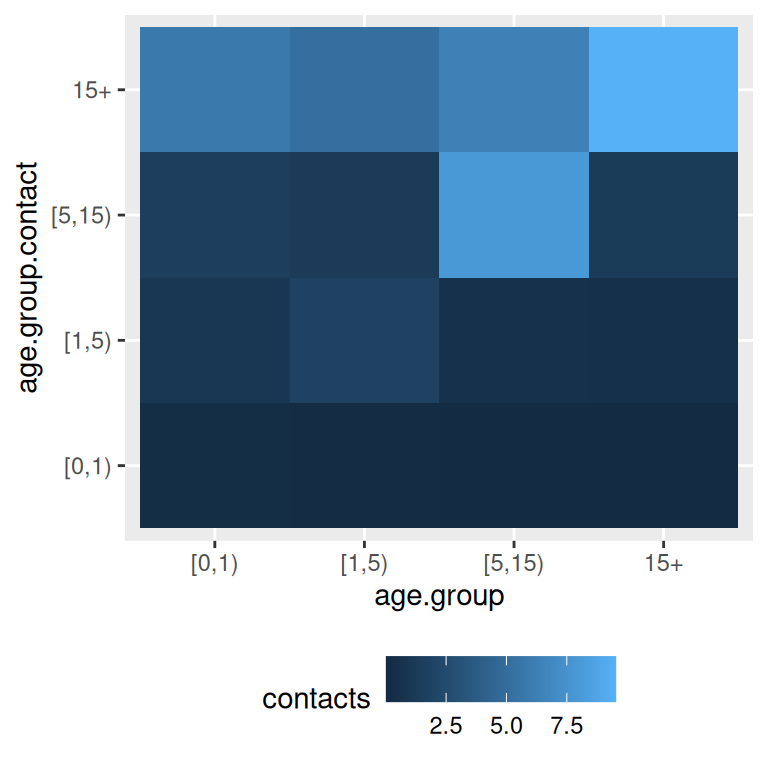

# The socialmixr package

[socialmixr](https://github.com/epiforecasts/socialmixr) is an `R`
package to derive social mixing matrices from survey data. These are
particularly useful for age-structured [infectious disease
models](https://en.wikipedia.org/wiki/Mathematical_modelling_of_infectious_disease).
For background on age-specific mixing matrices and what data inform
them, see, for example, the paper on POLYMOD by
\[@mossong_social_2008\].

## Usage

At the heart of the `socialmixr` package is the
[`contact_matrix()`](https://epiforecasts.io/socialmixr/reference/contact_matrix.md)
function. This extracts a contact matrix from survey data. You can use
the `R` help to find out about usage of the
[`contact_matrix()`](https://epiforecasts.io/socialmixr/reference/contact_matrix.md)
function, including a list of examples:

``` r
?contact_matrix
```

The POLYMOD data are included with the package and can be loaded using

``` r
data(polymod)
```

An example use would be

``` r
contact_matrix(polymod, countries = "United Kingdom", age_limits = c(0, 1, 5, 15))
#> $matrix
#>          contact.age.group
#> age.group      [0,1)     [1,5)   [5,15)      15+
#>    [0,1)  0.40000000 0.8000000 1.266667 5.933333
#>    [1,5)  0.11250000 1.9375000 1.462500 5.450000
#>    [5,15) 0.02450980 0.5049020 7.946078 6.215686
#>    15+    0.03230337 0.3581461 1.290730 9.594101
#> 
#> $participants
#>    age.group participants proportion
#>       <char>        <int>      <num>
#> 1:     [0,1)           15 0.01483680
#> 2:     [1,5)           80 0.07912957
#> 3:    [5,15)          204 0.20178042
#> 4:       15+          712 0.70425321
```

This generates a contact matrix from the UK part of the POLYMOD study,
with age groups 0-1, 1-5, 5-15 and 15+ years. It contains the mean
number of contacts that each member of an age group (row) has reported
with members of the same or another age group (column).

## Surveys

The key argument to the
[`contact_matrix()`](https://epiforecasts.io/socialmixr/reference/contact_matrix.md)
function is the `survey` that it supposed to use. The `socialmixr`
package includes the POLYMOD survey, which will be used if not survey is
specified. It also provides access to all surveys in the [Social contact
data](https://zenodo.org/communities/social_contact_data) community on
[Zenodo](https://zenodo.org). The available surveys can be listed (if an
internet connection is available) with

``` r
list_surveys()
```

A survey can be downloaded using the
[`get_survey()`](https://epiforecasts.io/socialmixr/reference/get_survey.md)
command. This will get the relevant data of a survey given its Zenodo
DOI (as returned by
[`list_surveys()`](https://epiforecasts.io/socialmixr/reference/list_surveys.md)).
All other relevant commands in the `socialmixr` package accept a DOI,
but if a survey is to be used repeatedly it is worth downloading it and
storing it locally to avoid the need for a network connection and speed
up processing.

``` r
peru_survey <- get_survey("https://doi.org/10.5281/zenodo.1095664")
saveRDS(peru_survey, "peru.rds")
```

This way, the `peru` data set can be loaded in the future without the
need for an internet connection using

``` r
peru_survey <- readRDS("peru.rds")
```

Some surveys may contain data from multiple countries. To check this,
use the `survey_countries` function

``` r
survey_countries(polymod)
#> Warning: `survey_countries()` was deprecated in socialmixr 0.5.0.
#> ℹ Please use `contactsurveys::download_survey()` instead.
#> ℹ We recommend using contactsurveys::download_survey() to download your
#>   surveys, and then you can load them with socialmixr::load_survey() and
#>   explore which countries are in the data.
#> [1] "Italy"          "Germany"        "Luxembourg"     "Netherlands"   
#> [5] "Poland"         "United Kingdom" "Finland"        "Belgium"
```

If one wishes to get a contact matrix for one or more specific
countries, a `countries` argument can be passed to
[`contact_matrix()`](https://epiforecasts.io/socialmixr/reference/contact_matrix.md).
If this is not done, the different surveys contained in a dataset are
combined as if they were one single sample (i.e., not applying any
population-weighting by country or other correction).

By default, socialmixr uses the POLYMOD survey. A reference for any
given survey can be obtained using
[`get_citation()`](https://epiforecasts.io/socialmixr/reference/get_citation.md),
e.g.

``` r
get_citation(polymod)
#> Warning: `get_citation()` was deprecated in socialmixr 0.5.0.
#> ℹ Please use `contactsurveys::get_citation()` instead.
#> Mossong J, Hens N, Jit M, Beutels P, Auranen K, Mikolajczyk R, Massari
#> M, Salmaso S, Tomba GS, Wallinga J, Heijne J, Sadkowska-Todys M,
#> Rosinska M, Edmunds WJ (2017). "POLYMOD social contact data."
#> doi:10.5281/zenodo.1157934 <https://doi.org/10.5281/zenodo.1157934>,
#> Version 1.1.
```

## Bootstrapping

To get an idea of uncertainty of the contact matrices, a bootstrap can
be used using the `sample_participants` argument of
[`contact_matrix()`](https://epiforecasts.io/socialmixr/reference/contact_matrix.md).
If this argument is set to TRUE, participants are sampled (with
replacement, to get the same number of participants of the original
study) every time the
[`contact_matrix()`](https://epiforecasts.io/socialmixr/reference/contact_matrix.md)
function is called, and thus a different matrix returned every time.
From these matrices, derived quantities can be obtained, for example the
mean:

``` r
m <- replicate(
  n = 5,
  contact_matrix(
    polymod,
    countries = "United Kingdom", age_limits = c(0, 1, 5, 15),
    sample_participants = TRUE
  )
)
mr <- Reduce("+", lapply(m["matrix", ], function(x) x / ncol(m)))
mr
#>          contact.age.group
#> age.group      [0,1)     [1,5)   [5,15)      15+
#>    [0,1)  0.46530920 0.8326295 1.422675 5.762695
#>    [1,5)  0.09704109 2.0063072 1.403241 5.336624
#>    [5,15) 0.02011632 0.4777570 7.464501 5.917705
#>    15+    0.03044331 0.3534616 1.302445 9.588787
```

## Demography

Obtaining symmetric contact matrices, splitting out their components
(see below) and age-specific participant weights require information
about the underlying demographic composition of the survey population.
This can be passed to
[`contact_matrix()`](https://epiforecasts.io/socialmixr/reference/contact_matrix.md)
as the `survey_pop` argument, a `data.frame` with two columns,
`lower.age.limit` (denoting the lower end of the age groups) and
`population` (denoting the number of people in each age group). If no
`survey_pop` is not given,
[`contact_matrix()`](https://epiforecasts.io/socialmixr/reference/contact_matrix.md)
will try to obtain the age structure of the population (as per the
`countries` argument) from the [World Population
Prospects](https://population.un.org/wpp/) of the United Nations, using
estimates from the year that closest matches the year in which the
contact survey was conducted.

If demographic information is used, this is returned by
[`contact_matrix()`](https://epiforecasts.io/socialmixr/reference/contact_matrix.md)
as the `demography` field in the results list. It is possible to enforce
or prevent the function to return demography data by using the
`return_demography` option.

``` r
contact_matrix(polymod,
  countries = "United Kingdom", age_limits = c(0, 20),
  return_demography = TRUE
)$demography
#>    age.group population proportion  year
#>       <char>      <num>      <num> <int>
#> 1:    [0,20)   14799290  0.2454816  2005
#> 2:       20+   45487461  0.7545184  2005
```

## Symmetric contact matrices

Conceivably, contact matrices should be symmetric: the total number of
contacts made by members of one age group with those of another should
be the same as vice versa. Mathematically, if $m_{ij}$ is the mean
number of contacts made by members of age group $i$ with members of age
group $j$, and the total number of people in age group $i$ is $N_{i}$,
then

$$m_{ij}N_{i} = m_{ji}N_{j}$$

Because of variation in the sample from which the contact matrix is
obtained, this relationship is usually not fulfilled exactly. In order
to obtain a symmetric contact matrix that fulfills it, one can use

$$m\prime_{ij} = \frac{1}{2N_{i}}\left( m_{ij}N_{i} + m_{ji}N_{j} \right)$$

To get this version of the contact matrix, use `symmetric = TRUE` when
calling the
[`contact_matrix()`](https://epiforecasts.io/socialmixr/reference/contact_matrix.md)
function.

``` r
contact_matrix(polymod, countries = "United Kingdom", age_limits = c(0, 1, 5, 15), symmetric = TRUE)
#> Warning: Not all age groups represented in population data (5-year age band).
#> ℹ Linearly estimating age group sizes from the 5-year bands.
#> Warning in normalise_weighted_matrix(survey_pop = survey_pop, weighted_matrix = weighted.matrix, : Large differences in the size of the sub-populations with the current age
#> breaks are likely to result in artefacts after making the matrix symmetric.
#> ! Please reconsider the age breaks to obtain more equally sized
#>   sub-populations.
#> ℹ Normalization factors: [0.3 and 2.9]
#> $matrix
#>          contact.age.group
#> age.group      [0,1)     [1,5)   [5,15)      15+
#>    [0,1)  0.40000000 0.6250000 0.764365 4.122919
#>    [1,5)  0.15625000 1.9375000 1.406063 5.929829
#>    [5,15) 0.07148821 0.5260153 7.946078 7.428739
#>    15+    0.05759306 0.3313352 1.109550 9.594101
#> 
#> $demography
#>    age.group population proportion  year
#>       <char>      <num>      <num> <int>
#> 1:     [0,1)     690734 0.01145748  2005
#> 2:     [1,5)    2762936 0.04582990  2005
#> 3:    [5,15)    7385454 0.12250542  2005
#> 4:       15+   49447627 0.82020720  2005
#> 
#> $participants
#>    age.group participants proportion
#>       <char>        <int>      <num>
#> 1:     [0,1)           15 0.01483680
#> 2:     [1,5)           80 0.07912957
#> 3:    [5,15)          204 0.20178042
#> 4:       15+          712 0.70425321
```

## Contact rates per capita

The contact matrix per capita $c_{ij}$ contains the social contact rates
of one individual of age $i$ with one individual of age $j$, given the
population details. For example, $c_{ij}$ is used in infectious disease
modelling to calculate the force of infection, which is based on the
likelihood that one susceptible individual of age $i$ will be in contact
with one infectious individual of age $j$. The contact rates per capita
are calculated as follows:

$$c_{ij} = \frac{m_{ij}}{N_{j}}$$

To get the per capita contact matrix, use `per_capita = TRUE` when
calling the
[`contact_matrix()`](https://epiforecasts.io/socialmixr/reference/contact_matrix.md)
function. Please note that if the option `symmetric = TRUE` is
specified, the contact matrix $m_{ij}$ can show asymmetry if the
sub-population sizes are different, but the contact matrix per capita
will be fully symmetric:

$$c\prime_{ij} = \frac{m_{ij}N_{i} + m_{ji}N_{j}}{2N_{i}N_{j}} = c\prime_{ji}$$

``` r
contact_matrix(survey = polymod, countries = "Germany", age_limits = c(0, 60), symmetric = TRUE, per_capita = TRUE)
#> $matrix
#>          contact.age.group
#> age.group   [0,60)       60+
#>    [0,60) 7.743879 0.8967442
#>    60+    2.711694 2.1267606
#> 
#> $matrix.per.capita
#>          contact.age.group
#> age.group       [0,60)          60+
#>    [0,60) 1.261735e-07 4.418248e-08
#>    60+    4.418248e-08 1.047852e-07
#> 
#> $demography
#>    age.group population proportion  year
#>       <char>      <num>      <num> <int>
#> 1:    [0,60)   61374868  0.7514869  2005
#> 2:       60+   20296375  0.2485131  2005
#> 
#> $participants
#>    age.group participants proportion
#>       <char>        <int>      <num>
#> 1:    [0,60)         1062  0.8329412
#> 2:       60+          213  0.1670588
```

## Splitting contact matrices

The
[`contact_matrix()`](https://epiforecasts.io/socialmixr/reference/contact_matrix.md)
contains a simple model for the elements of the contact matrix, by which
it is split into a *global* component, as well as three components
representing *contacts*, *assortativity* and *demography*. In other
words, the elements $m_{ij}$ of the contact matrix are modeled as

$$m_{ij} = cqd_{i}a_{ij}n_{j}$$

where $c$ is the mean number of contacts across the whole population,
$cqd_{i}$ is the number of contacts that a member of group $i$ makes
across age groups, $n_{j}$ is the proportion of the surveyed population
in age group $j$. The constant $q$ is set so that $cq$ is equal to the
value of the largest eigenvalue of $m_{ij}$; if used in an infectious
disease model and assumed that every contact leads to infection, $cq$
can be replaced by the basic reproduction number $R_{0}$.

To model the contact matrix in this way with the
[`contact_matrix()`](https://epiforecasts.io/socialmixr/reference/contact_matrix.md)
function, set `split = TRUE`. The components of the matrix are returned
as elements `mean.contacts` ($c$), `normalisation` ($q$), `contacts`
($d_{i}$), `matrix` ($a_{ij}$) and `demography` ($n_{j}$) of the
resulting list.

``` r
contact_matrix(polymod, countries = "United Kingdom", age_limits = c(0, 1, 5, 15), split = TRUE)
#> Warning: Not all age groups represented in population data (5-year age band).
#> ℹ Linearly estimating age group sizes from the 5-year bands.
#> $mean.contacts
#> [1] 11.55481
#> 
#> $normalisation
#> [1] 1.039163
#> 
#> $contacts
#> [1] 0.6995727 0.7464190 1.2235173 0.9390331
#> 
#> $matrix
#>          contact.age.group
#> age.group     [0,1)     [1,5)   [5,15)       15+
#>    [0,1)  4.1561551 2.0780776 1.230914 0.8611839
#>    [1,5)  1.0955555 4.7169752 1.332022 0.7413849
#>    [5,15) 0.1456110 0.7498969 4.415104 0.5158328
#>    15+    0.2500527 0.6930808 0.934443 1.0374170
#> 
#> $demography
#>    age.group population proportion  year
#>       <char>      <num>      <num> <int>
#> 1:     [0,1)     690734 0.01145748  2005
#> 2:     [1,5)    2762936 0.04582990  2005
#> 3:    [5,15)    7385454 0.12250542  2005
#> 4:       15+   49447627 0.82020720  2005
#> 
#> $participants
#>    age.group participants proportion
#>       <char>        <int>      <num>
#> 1:     [0,1)           15 0.01483680
#> 2:     [1,5)           80 0.07912957
#> 3:    [5,15)          204 0.20178042
#> 4:       15+          712 0.70425321
```

## Filtering

The `filter` argument to
[`contact_matrix()`](https://epiforecasts.io/socialmixr/reference/contact_matrix.md)
can be used to select particular participants or contacts. For example,
in the `polymod` dataset, the indicators `cnt_home`, `cnt_work`,
`cnt_school`, `cnt_transport`, `cnt_leisure` and `cnt_otherplace` take
value 0 or 1 depending on where a contact occurred. Any filter can be
applied to the data, if given as a list of the form
(column=filter_value). As such, only contacts that have ‘filter_value’
in ‘column’ will be considered for the generated contact matrix:

``` r
# contact matrix for school-related contacts
contact_matrix(polymod, age_limits = c(0, 20, 60), filter = list(cnt_school = 1))$matrix
#>          contact.age.group
#> age.group     [0,20)    [20,60)        60+
#>   [0,20)  5.17103805 1.09641670 0.03583303
#>   [20,60) 0.45714286 0.47542857 0.01457143
#>   60+     0.08980827 0.07366297 0.03531786

# contact matrix for work-related contacts involving physical contact
contact_matrix(polymod, age_limits = c(0, 20, 60), filter = list(cnt_work = 1, phys_contact = 1))$matrix
#>          contact.age.group
#> age.group     [0,20)    [20,60)         60+
#>   [0,20)  0.04285187 0.06353897 0.009235316
#>   [20,60) 0.16057143 1.27000000 0.146285714
#>   60+     0.04238143 0.29465187 0.062563068

# contact matrix for daily contacts at home with males
contact_matrix(polymod, age_limits = c(0, 20, 60), filter = list(cnt_home = 1, cnt_gender = "M", duration_multi = 5))$matrix
#>          contact.age.group
#> age.group     [0,20)   [20,60)        60+
#>   [0,20)  0.39268563 0.5858884 0.03103066
#>   [20,60) 0.25971429 0.3948571 0.04885714
#>   60+     0.05751766 0.1160444 0.23915237
```

## Participant weights

### Temporal aspects and demography

Participant weights are commonly used to align sample and population
characteristics in terms of temporal aspects and the age distribution.
For example, the day of the week has been reported as a driving factor
for social contact behavior, hence to obtain a weekly average, the
survey data should represent the weekly 2/5 distribution of weekend/week
days. To align the survey data to this distribution, one can obtain
participant weights in the form of:
$$w_{\text{day.of.week}} = \frac{5/7}{N_{\text{weekday}}/N}{\mspace{6mu}\text{OR}\mspace{6mu}}\frac{2/7}{N_{\text{weekend}}/N}$$
with sample size $N$, and $N_{weekday}$ and $N_{weekend}$ the number of
participants that were surveyed during weekdays and weekend days,
respectively. It is possible to remove the constant values
(e.g. $w = 5/N_{weekday}$), which results in the same standardized
weights. However, we opt to use the relative proportions to calculate
weights to enable truncation with a generic threshold (see below).

Another driver of social contact patterns is age. To improve the
representativeness of survey data, age-specific weights can be
calculated as: $$w_{age} = \frac{P_{a}\ /\ P}{N_{a}\ /\ N}$$ with $P$
the population size, $P_{a}$ the population fraction of age $a$, $N$ the
survey sample size and $N_{a}$ the survey fraction of age $a$. The
combination of age-specific and temporal weights for participant $i$ of
age $a$ can be constructed as:
$$w_{i} = w_{\text{age}}*w_{\text{day.of.week}}$$ Finally, the weights
can to be standardized as follows:
$${\widetilde{w}}_{i} = \frac{w_{i}}{\sum\limits_{}^{}w_{}}*N$$

If the social contact analysis is based on stratification by splitting
the population into non-overlapping groups, it requires the weights to
be standardized so that the weighted totals within mutually exclusive
cells equal the known population totals
\[@kolenikov_post-stratification_2016\]. The post-stratification cells
need to be mutually exclusive and cover the whole population. The
post-stratified (PS) weight for participant $i$ of is:
$${\widetilde{w}}_{i}^{PS} = \frac{w_{i}}{\sum\limits_{\text{j}}^{\text{group g}}w_{j}}*N_{g}$$

Temporal weights are activated in
[`contact_matrix()`](https://epiforecasts.io/socialmixr/reference/contact_matrix.md)
by `weigh_dayofweek = TRUE` and age-specific weights by
`weigh_age = TRUE`. The post-stratification weights are calculated by
default. It is possible to obtain the participant weights via the option
`return_part_weights = TRUE`.

``` r
contact_matrix(
  survey = polymod, age_limits = c(0, 18, 60), weigh_dayofweek = TRUE,
  weigh_age = TRUE, return_part_weights = TRUE
)
#> $matrix
#>          contact.age.group
#> age.group    [0,18)   [18,60)       60+
#>   [0,18)  8.5152158  5.839458 0.7193179
#>   [18,60) 2.0433998 10.318853 1.2413142
#>   60+     0.7761051  4.354554 2.4995467
#> 
#> $demography
#>    age.group population proportion  year
#>       <char>      <num>      <num> <int>
#> 1:    [0,18)   52955807  0.1948624  2005
#> 2:   [18,60)  157719526  0.5803634  2005
#> 3:       60+   61084635  0.2247742  2005
#> 
#> $participants
#>    age.group participants proportion
#>       <char>        <int>      <num>
#> 1:    [0,18)         2462  0.3420395
#> 2:   [18,60)         3745  0.5202834
#> 3:       60+          991  0.1376771
#> 
#> $participants.weights
#>      age.group participant.age is.weekday    weight participants   proportion
#>         <fctr>           <int>     <lgcl>     <num>        <int>        <num>
#>   1:    [0,18)               0      FALSE 1.4566422           27 0.0037510420
#>   2:    [0,18)               0       TRUE 1.3087772           66 0.0091692137
#>   3:    [0,18)               1      FALSE 1.1288977           32 0.0044456794
#>   4:    [0,18)               1       TRUE 1.0143024           88 0.0122256182
#>   5:    [0,18)               2      FALSE 0.9473268           39 0.0054181717
#>  ---                                                                         
#> 167:       60+              83       TRUE 5.6502663            4 0.0005557099
#> 168:       60+              84      FALSE 8.3848408            1 0.0001389275
#> 169:       60+              84       TRUE 7.5336884            2 0.0002778550
#> 170:       60+              85       TRUE 3.1671409            3 0.0004167824
#> 171:       60+              90       TRUE 4.7540746            1 0.0001389275
```

### User-defined participant weights

The
[`contact_matrix()`](https://epiforecasts.io/socialmixr/reference/contact_matrix.md)
allows to specify and use your own participant weights. Therefore,
provide the names of the columns of the participant data you want to use
to weight the reported contacts via the `weights` argument.

``` r
# e.g. use household size as (dummy) weight to provide more importance to participant data from large households
contact_matrix(survey = polymod, age_limits = c(0, 18, 60), weights = "hh_size")
#> $matrix
#>          contact.age.group
#> age.group    [0,18)   [18,60)       60+
#>   [0,18)  8.9599558  5.907367 0.7338418
#>   [18,60) 2.4650353 10.960550 1.2399199
#>   60+     0.9909593  5.659468 2.7081868
#> 
#> $participants
#>    age.group participants proportion
#>       <char>        <int>      <num>
#> 1:    [0,18)         2462  0.3420395
#> 2:   [18,60)         3745  0.5202834
#> 3:       60+          991  0.1376771
```

### Weight threshold

If the survey population differs extensively from the demography, some
participants can end up with relatively high weights and as such, an
excessive contribution to the population average. This warrants the
limitation of single participant influences by a truncation of the
weights. To enable this in
[`contact_matrix()`](https://epiforecasts.io/socialmixr/reference/contact_matrix.md),
you need to provide a numeric `weight_threshold`. This truncation is
applied on the standardized weights, followed by another standardization
to make sure that the sum of the weights still equals the sample size.
The latter can lead to final weights of which some little exceed the
given threshold value.

``` r
contact_matrix(
  survey = polymod, age_limits = c(0, 18, 60), weigh_dayofweek = TRUE,
  weigh_age = TRUE, return_part_weights = TRUE, weight_threshold = 3
)
#> $matrix
#>          contact.age.group
#> age.group    [0,18)   [18,60)       60+
#>   [0,18)  8.5152158  5.839458 0.7193179
#>   [18,60) 2.0433998 10.318853 1.2413142
#>   60+     0.7720958  4.410151 2.5401091
#> 
#> $demography
#>    age.group population proportion  year
#>       <char>      <num>      <num> <int>
#> 1:    [0,18)   52955807  0.1948624  2005
#> 2:   [18,60)  157719526  0.5803634  2005
#> 3:       60+   61084635  0.2247742  2005
#> 
#> $participants
#>    age.group participants proportion
#>       <char>        <int>      <num>
#> 1:    [0,18)         2462  0.3420395
#> 2:   [18,60)         3745  0.5202834
#> 3:       60+          991  0.1376771
#> 
#> $participants.weights
#>      age.group participant.age is.weekday    weight participants   proportion
#>         <fctr>           <int>     <lgcl>     <num>        <int>        <num>
#>   1:    [0,18)               0      FALSE 1.4566422           27 0.0037510420
#>   2:    [0,18)               0       TRUE 1.3087772           66 0.0091692137
#>   3:    [0,18)               1      FALSE 1.1288977           32 0.0044456794
#>   4:    [0,18)               1       TRUE 1.0143024           88 0.0122256182
#>   5:    [0,18)               2      FALSE 0.9473268           39 0.0054181717
#>  ---                                                                         
#> 167:       60+              83       TRUE 3.1063091            4 0.0005557099
#> 168:       60+              84      FALSE 3.1063091            1 0.0001389275
#> 169:       60+              84       TRUE 3.1063091            2 0.0002778550
#> 170:       60+              85       TRUE 3.1063091            3 0.0004167824
#> 171:       60+              90       TRUE 3.1063091            1 0.0001389275
```

### Numerical example

With these numeric examples, we show the importance of
post-stratification weights in contrast to using the crude weights
directly within age-groups. We will apply the weights by age and day of
week separately in these examples, though the combination is
straightforward via multiplication.

#### Get survey data

We start from a survey including 6 participants of 1, 2 and 3 years of
age. The ages are not equally represented in the sample, though we
assume they are equally present in the reference population. We will
calculate the weighted average number of contacts by age and by age
group, using {1,2} and {3} years of age. The following table shows the
reported number of contacts per participant $i$, represented by $m_{i}$:

| age | day.of.week | age.group | m_i |
|----:|:------------|:----------|----:|
|   1 | weekend     | A         |   3 |
|   1 | weekend     | A         |   2 |
|   2 | weekend     | A         |   9 |
|   2 | week        | A         |  10 |
|   2 | week        | A         |   8 |
|   3 | week        | B         |  15 |

The summary statistics for the sample (N) and reference population (P)
are as follows

``` r
N <- 6
N_age <- c(2, 3, 1)
N_age.group <- c(5, 1)
N_day.of.week <- c(3, 3)

P <- 3000
P_age <- c(1000, 1000, 1000)
P_age.group <- c(2000, 1000)

P_day.of.week <- c(5 / 7, 2 / 7) * 3000
```

This survey data results in an unweighted average number of contacts:

    #> unweighted average number of contacts: 7.83

and age-specific unweighted averages on the number of contacts:

| age | age.group |  m_i |
|----:|:----------|-----:|
|   1 | A         |  2.5 |
|   2 | A         |  9.0 |
|   3 | B         | 15.0 |

#### Weight by day of week

The following table contains the participants weights based on the
survey day with and without the population and sample size constants
($w$ and $w\prime$, respectively). Note that the standardized weights
$\widetilde{w}$ and $\widetilde{w\prime}$ are the same:

| age | day.of.week | age.group | m_i |    w | w_tilde |  w_dot | w_dot_tilde |
|----:|:------------|:----------|----:|-----:|--------:|-------:|------------:|
|   1 | weekend     | A         |   3 | 0.57 |    0.57 | 285.71 |        0.57 |
|   1 | weekend     | A         |   2 | 0.57 |    0.57 | 285.71 |        0.57 |
|   2 | weekend     | A         |   9 | 0.57 |    0.57 | 285.71 |        0.57 |
|   2 | week        | A         |  10 | 1.43 |    1.43 | 714.29 |        1.43 |
|   2 | week        | A         |   8 | 1.43 |    1.43 | 714.29 |        1.43 |
|   3 | week        | B         |  15 | 1.43 |    1.43 | 714.29 |        1.43 |

Note the different scale of $w$ and $w\prime$, and the more
straightforward interpretation of the numerical value of $w$ in terms of
relative differences to apply truncation. Using the standardized
weights, we are able to calculate the weighted number of contacts:

| age | day.of.week | age.group | m_i |    w | w_tilde | m_i \* w_tilde |
|----:|:------------|:----------|----:|-----:|--------:|---------------:|
|   1 | weekend     | A         |   3 | 0.57 |    0.57 |           1.71 |
|   1 | weekend     | A         |   2 | 0.57 |    0.57 |           1.14 |
|   2 | weekend     | A         |   9 | 0.57 |    0.57 |           5.13 |
|   2 | week        | A         |  10 | 1.43 |    1.43 |          14.30 |
|   2 | week        | A         |   8 | 1.43 |    1.43 |          11.44 |
|   3 | week        | B         |  15 | 1.43 |    1.43 |          21.45 |

    #> weighted average number of contacts: 9.2

If the population-based weights are directly used in age-specific
groups, the contact behavior of the 3 year-old participant, which
participated during week day, is inflated due to the
under-representation of week days in the survey sample. In addition, the
number of contacts for 1 year-old participants is decreased because of
the over-representation of weekend days in the survey. Using the
population-weights within the two aggregated age groups, we obtain a
more intuitive weighting for age group A, but it is still skewed for
individuals in age group B. As such, this weighted average for age group
B has no meaning in terms of social contact behavior:

[TABLE]

If we subdivide the population, we need to use post-stratification
weights (“w_PS”) in which the weighted totals within mutually exclusive
cells equal the sample size. For the age groups, this goes as follows:

| age | day.of.week | age.group | m_i |    w | w_tilde | w_PS |
|----:|:------------|:----------|----:|-----:|--------:|-----:|
|   1 | weekend     | A         |   3 | 0.57 |    0.57 | 0.62 |
|   1 | weekend     | A         |   2 | 0.57 |    0.57 | 0.62 |
|   2 | weekend     | A         |   9 | 0.57 |    0.57 | 0.62 |
|   2 | week        | A         |  10 | 1.43 |    1.43 | 1.56 |
|   2 | week        | A         |   8 | 1.43 |    1.43 | 1.56 |
|   3 | week        | B         |  15 | 1.43 |    1.43 | 1.00 |

The weighted means equal:

| age.group | m_i \* w_PS |
|:----------|------------:|
| A         |       7.352 |
| B         |      15.000 |

#### Weight by age

We repeated the example by calculating age-specific participant weights
on the population and age-group level:

| age | day.of.week | age.group | m_i |    w | w_tilde | w_PS |
|----:|:------------|:----------|----:|-----:|--------:|-----:|
|   1 | weekend     | A         |   3 | 1.00 |    1.00 | 1.25 |
|   1 | weekend     | A         |   2 | 1.00 |    1.00 | 1.25 |
|   2 | weekend     | A         |   9 | 0.67 |    0.67 | 0.83 |
|   2 | week        | A         |  10 | 0.67 |    0.67 | 0.83 |
|   2 | week        | A         |   8 | 0.67 |    0.67 | 0.83 |
|   3 | week        | B         |  15 | 2.00 |    2.00 | 1.00 |

    #> weighted average number of contacts: 8.85

If the age-specific weights are directly used within the age groups, the
contact behavior for age group B is inflated to unrealistic levels and
the number of contacts for age group A is artificially low:

[TABLE]

Using the post-stratification weights, we end up with:

| age.group | m_i \* w_PS |
|:----------|------------:|
| A         |       5.732 |
| B         |      15.000 |

#### Apply threshold

We start with survey data of 14 participants of 1, 2 and 3 years of age,
sampled from a population in which all ages are equally present. Given
the high representation of participants aged 1 year, the age-specific
proportions are skewed in comparison with the reference population. If
we calculate the age-specific weights and (un)weighted average number of
contacts, we end up with:

| age | day.of.week | age.group | m_i |    w | w_tilde |
|----:|:------------|:----------|----:|-----:|--------:|
|   1 | weekend     | A         |   3 | 0.47 |    0.47 |
|   1 | weekend     | A         |   2 | 0.47 |    0.47 |
|   1 | weekend     | A         |   3 | 0.47 |    0.47 |
|   1 | weekend     | A         |   2 | 0.47 |    0.47 |
|   1 | weekend     | A         |   3 | 0.47 |    0.47 |
|   1 | weekend     | A         |   2 | 0.47 |    0.47 |
|   1 | weekend     | A         |   3 | 0.47 |    0.47 |
|   1 | weekend     | A         |   2 | 0.47 |    0.47 |
|   1 | weekend     | A         |   3 | 0.47 |    0.47 |
|   1 | weekend     | A         |   2 | 0.47 |    0.47 |
|   2 | weekend     | A         |   9 | 1.56 |    1.56 |
|   2 | week        | A         |  10 | 1.56 |    1.56 |
|   2 | week        | A         |   8 | 1.56 |    1.56 |
|   3 | week        | B         |  30 | 4.67 |    4.67 |

    #> unweighted average number of contacts: 5.86
    #> weighted average number of contacts: 13.86

The single participant of 3 years of age has a very large influence on
the weighted population average. As such, we propose to truncate the
relative age-specific weights $w$ at 3. As such, the weighted population
average equals:

    #> weighted average number of contacts after truncation: 10.28

## Plotting

### Using ggplot2

The contact matrices can be plotted by using the `geom_tile()` function
of the `ggplot2` package.

``` r
df <- reshape2::melt(mr, varnames = c("age.group", "age.group.contact"), value.name = "contacts")
ggplot(df, aes(x = age.group, y = age.group.contact, fill = contacts)) +
  theme(legend.position = "bottom") +
  geom_tile()
```



### Using R base

The contact matrices can also be plotted with the
[`matrix_plot()`](https://epiforecasts.io/socialmixr/reference/matrix_plot.md)
function as a grid of colored rectangles with the numeric values in the
cells. Heat colors are used by default, though this can be changed.

``` r
matrix_plot(mr)
```


``` r
matrix_plot(mr, color.palette = gray.colors)
```


## References
