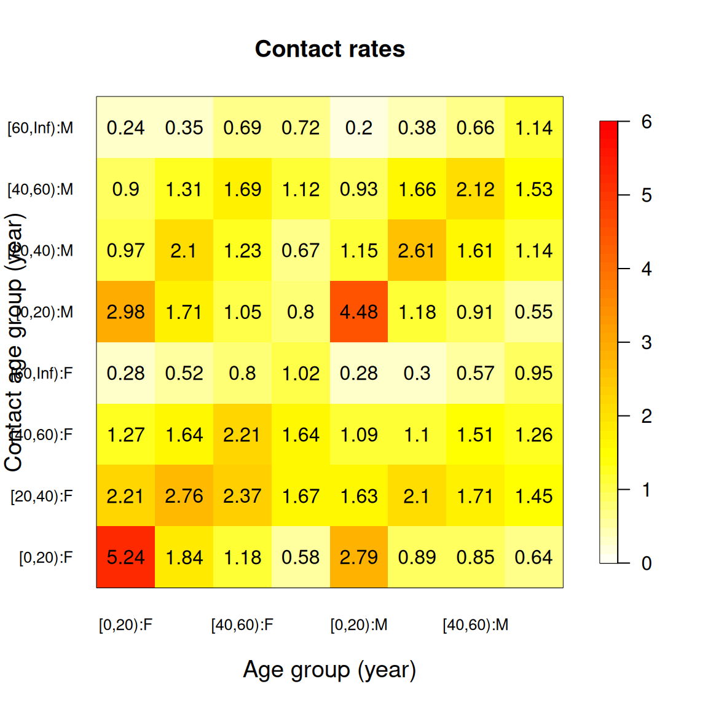

# Contact matrices across more than one grouping

Most of the time a contact matrix is indexed by age alone: rows and
columns are age groups, and each cell is a mean number of contacts. But
contact surveys record more than age, and mixing usually depends on
those other variables too. Men and women mix differently, and so do
people in different settings.
[`compute_matrix()`](https://epiforecasts.io/socialmixr/reference/compute_matrix.md)
can build a matrix over any combination of groupings, and the
post-processing functions carry those groupings through. This vignette
covers the two-dimensional case; the same recipes extend to three or
more.

The idea, and the flattened representation used below, follow Manna et
al. ([2024](#ref-manna_generalized_2024)).

## Building a two-way matrix

Start from the usual pipeline, but hand
[`compute_matrix()`](https://epiforecasts.io/socialmixr/reference/compute_matrix.md)
a `by` argument naming the groupings you want. Here we cross age with
the participant’s gender.

The gender column in POLYMOD carries a few blank entries on the contact
side, so we drop those first. A matrix can only be built over levels
that are actually recorded, and
[`symmetrise()`](https://epiforecasts.io/socialmixr/reference/symmetrise.md)
later on will need the two sides to share them.

``` r

data(polymod)

uk <- polymod[country == "United Kingdom"]
uk$participants <- uk$participants[part_gender %in% c("F", "M")]
uk$contacts <- uk$contacts[cnt_gender %in% c("F", "M")]

result <- uk |>
  assign_age_groups(age_limits = c(0, 20, 40, 60)) |>
  compute_matrix(by = c("age", "gender"))
```

With two groupings the result is no longer a plain matrix. Its `matrix`
element is a four-dimensional array: the first two axes index the
participant (age, then gender), the last two index the contact.

``` r

dim(result$matrix)
#> [1] 4 2 4 2
```

Four age groups and two genders give a `4 x 2` block on each side. The
`groupings` field records what produced those axes, and you can read it
back:

``` r

result$groupings
#> [[1]]
#> [[1]]$name
#> [1] "age"
#> 
#> [[1]]$part
#> [1] "age.group"
#> 
#> [[1]]$cnt
#> [1] "contact.age.group"
#> 
#> 
#> [[2]]
#> [[2]]$name
#> [1] "gender"
#> 
#> [[2]]$part
#> [1] "part_gender"
#> 
#> [[2]]$cnt
#> [1] "cnt_gender"
```

## The flattened view

A four-dimensional array is awkward to read and to plot.
[`flatten()`](https://epiforecasts.io/socialmixr/reference/flatten.md)
collapses it to the two-dimensional form of Manna et al.
([2024](#ref-manna_generalized_2024)): a single `T x T` matrix whose
rows and columns run over every combination of grouping levels, labelled
with a colon.

``` r

flatten(result)
#>             [0,20):F [20,40):F [40,60):F [60,Inf):F  [0,20):M [20,40):M
#> [0,20):F   5.2378641  2.208738  1.266990  0.2815534 2.9757282 0.9708738
#> [20,40):F  1.8421053  2.759398  1.639098  0.5187970 1.7067669 2.0977444
#> [40,60):F  1.1833333  2.366667  2.208333  0.8000000 1.0500000 1.2333333
#> [60,Inf):F 0.5781250  1.671875  1.640625  1.0156250 0.7968750 0.6718750
#> [0,20):M   2.7878788  1.626263  1.085859  0.2777778 4.4848485 1.1515152
#> [20,40):M  0.8869565  2.095652  1.095652  0.2956522 1.1826087 2.6086957
#> [40,60):M  0.8547009  1.709402  1.512821  0.5726496 0.9145299 1.6068376
#> [60,Inf):M 0.6379310  1.448276  1.258621  0.9482759 0.5517241 1.1379310
#>            [40,60):M [60,Inf):M
#> [0,20):F   0.8980583  0.2427184
#> [20,40):F  1.3082707  0.3533835
#> [40,60):F  1.6916667  0.6916667
#> [60,Inf):F 1.1250000  0.7187500
#> [0,20):M   0.9343434  0.2020202
#> [20,40):M  1.6608696  0.3826087
#> [40,60):M  2.1196581  0.6581197
#> [60,Inf):M 1.5344828  1.1379310
```

For a plain age-only matrix
[`flatten()`](https://epiforecasts.io/socialmixr/reference/flatten.md)
returns it unchanged, so you can reach for it whenever you want the 2-D
picture and not worry about how many groupings went in.

[`as.matrix()`](https://rdrr.io/r/base/matrix.html) gives you the same
thing, and [`plot()`](https://rdrr.io/r/graphics/plot.default.html)
draws it as a heatmap:

``` r

plot(result)
```



The eight rows and eight columns are the age and gender strata; the
block structure shows, for instance, how within-gender contacts compare
to across-gender ones.

## Post-processing across groupings

[`symmetrise()`](https://epiforecasts.io/socialmixr/reference/symmetrise.md)
and
[`per_capita()`](https://epiforecasts.io/socialmixr/reference/per_capita.md)
need to know the population behind each stratum. With one grouping that
was a population by age; with several it is a population by every
combination.
[`align_ages()`](https://epiforecasts.io/socialmixr/reference/align_ages.md)
builds it for you from a table that has an `age` column plus a column
for each other grouping.

``` r

population <- expand.grid(
  age = limits_to_age_groups(0:90, notation = "brackets"),
  gender = c("F", "M"),
  stringsAsFactors = FALSE
)
population$population <- round(1e5 * exp(-(0:90) / 60))

survey_pop <- align_ages(population, result)
survey_pop
#>        age gender population
#> 1   [0,20)      F    1715025
#> 2  [20,40)      F    1228870
#> 3  [40,60)      F     880524
#> 4 [60,Inf)      F     898067
#> 5   [0,20)      M    1715025
#> 6  [20,40)      M    1228870
#> 7  [40,60)      M     880524
#> 8 [60,Inf)      M     898067
```

[`align_ages()`](https://epiforecasts.io/socialmixr/reference/align_ages.md)
coarsens the age column to the matrix’s age groups and matches the other
groupings by name, so the result is exactly the `survey_pop` the
post-processing functions expect. From here they behave as they do for a
single grouping:

``` r

symmetric <- symmetrise(result, survey_pop = survey_pop)
per_capita_rates <- per_capita(result, survey_pop = survey_pop)
```

[`symmetrise()`](https://epiforecasts.io/socialmixr/reference/symmetrise.md)
enforces reciprocity across the full set of strata, so it insists the
participant and contact sides carry the same levels. That is why we
tidied the gender column at the start.

## Choosing the groupings

Each entry in `by` names a grouping. `"age"` picks up the columns
[`assign_age_groups()`](https://epiforecasts.io/socialmixr/reference/assign_age_groups.md)
writes. A bare name such as `"gender"` resolves to the survey’s
`part_gender` and `cnt_gender` columns. When the two sides are named
differently, give the pair explicitly:

``` r

uk |>
  assign_age_groups(age_limits = c(0, 20, 40, 60)) |>
  compute_matrix(by = list("age", c(part = "part_gender", cnt = "cnt_gender")))
```

Any number of groupings works the same way; the array simply gains two
axes for each, and
[`flatten()`](https://epiforecasts.io/socialmixr/reference/flatten.md),
[`plot()`](https://rdrr.io/r/graphics/plot.default.html),
[`as.matrix()`](https://rdrr.io/r/base/matrix.html),
[`symmetrise()`](https://epiforecasts.io/socialmixr/reference/symmetrise.md)
and
[`per_capita()`](https://epiforecasts.io/socialmixr/reference/per_capita.md)
carry them through.
[`split_matrix()`](https://epiforecasts.io/socialmixr/reference/split_matrix.md)
is the exception: its decomposition into mean, normalisation and
assortativity is defined for age-only matrices, so it still expects a
single grouping.

## References

Manna, Adriana, Lorenzo Dall’Amico, Michele Tizzoni, Márton Karsai, and
Nicola Perra. 2024. “Generalized Contact Matrices Allow Integrating
Socioeconomic Variables into Epidemic Models.” *Science Advances* 10
(41): eadk4606. <https://doi.org/10.1126/sciadv.adk4606>.
