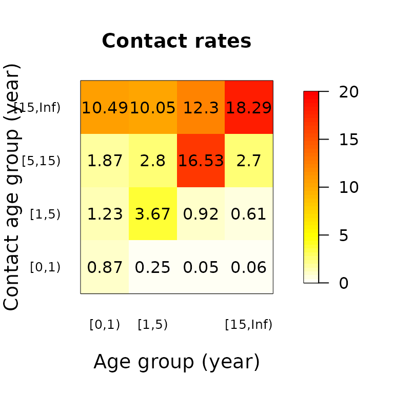
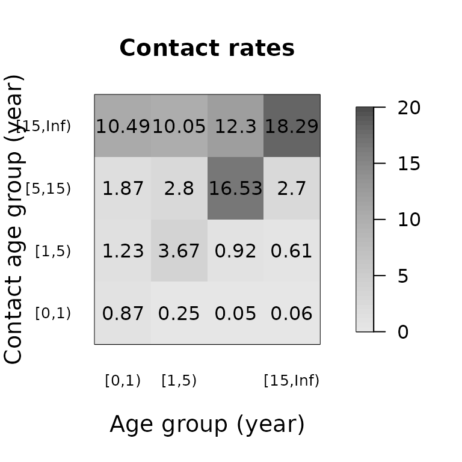

# Introduction to socialmixr

[socialmixr](https://github.com/epiforecasts/socialmixr) is an `R`
package to derive social mixing matrices from survey data. These are
particularly useful for age-structured [infectious disease
models](https://en.wikipedia.org/wiki/Mathematical_modelling_of_infectious_disease).
For background on age-specific mixing matrices and what data inform
them, see, for example, the paper on POLYMOD by ([Mossong et al.
2008](#ref-mossong_social_2008)).

## Setup

This vignette uses the POLYMOD survey data which is included in
socialmixr, and ggplot2 for plotting. To download other surveys from the
[Social contact
data](https://zenodo.org/communities/social_contact_data) community on
Zenodo, use the
[contactsurveys](https://cran.r-project.org/package=contactsurveys)
package.

``` r
library(socialmixr)
library(ggplot2)
data(polymod)
```

## The pipeline workflow

`socialmixr` provides a small set of composable functions that each
perform one step in turning a survey into a contact matrix:

1.  `survey[expr]` – filter participants or contacts with an expression.
2.  [`assign_age_groups()`](https://epiforecasts.io/socialmixr/reference/assign_age_groups.md)
    – impute missing ages and assign participants and contacts to age
    groups.
3.  [`weigh()`](https://epiforecasts.io/socialmixr/reference/weigh.md) –
    optionally attach participant weights (day of week, age,
    user-defined).
4.  [`compute_matrix()`](https://epiforecasts.io/socialmixr/reference/compute_matrix.md)
    – compute the mean contact matrix.
5.  [`symmetrise()`](https://epiforecasts.io/socialmixr/reference/symmetrise.md),
    [`split_matrix()`](https://epiforecasts.io/socialmixr/reference/split_matrix.md),
    [`per_capita()`](https://epiforecasts.io/socialmixr/reference/per_capita.md)
    – optional post-processing.

A minimal example extracting a matrix for the UK part of POLYMOD:

``` r
polymod[country == "United Kingdom"] |>
  assign_age_groups(age_limits = c(0, 1, 5, 15)) |>
  compute_matrix()
#> 
#> ── Contact matrix (4 age groups) ──
#> 
#> Ages: "[0,1)", "[1,5)", "[5,15)", and "[15,Inf)"
#> Participants: 1011
#> 
#>           contact.age.group
#> age.group       [0,1)     [1,5)   [5,15) [15,Inf)
#>   [0,1)    0.40000000 0.8000000 1.266667 5.933333
#>   [1,5)    0.11250000 1.9375000 1.462500 5.450000
#>   [5,15)   0.02450980 0.5049020 7.946078 6.215686
#>   [15,Inf) 0.03230337 0.3581461 1.290730 9.594101
```

This produces a contact matrix with age groups 0-1, 1-5, 5-15 and 15+
years. It contains the mean number of contacts that each member of an
age group (row) has reported with members of the same or another age
group (column).

### Assigning age groups

[`assign_age_groups()`](https://epiforecasts.io/socialmixr/reference/assign_age_groups.md)
prepares the survey for matrix computation. It imputes participant and
contact ages from any available ranges, drops or keeps rows with missing
ages (configurable via `missing_participant_age` and
`missing_contact_age`), and adds `age.group` and `contact.age.group`
columns using the `age_limits` you supply:

``` r
uk_grouped <- polymod[country == "United Kingdom"] |>
  assign_age_groups(age_limits = c(0, 1, 5, 15))

head(uk_grouped$participants[, c("part_id", "part_age", "age.group")])
#>    part_id part_age age.group
#>      <int>    <int>    <fctr>
#> 1:    4536        0     [0,1)
#> 2:    4538        0     [0,1)
#> 3:    4540        0     [0,1)
#> 4:    4541        0     [0,1)
#> 5:    4542        0     [0,1)
#> 6:    4546        0     [0,1)
head(uk_grouped$contacts[, c("part_id", "cnt_age", "contact.age.group")])
#>    part_id cnt_age contact.age.group
#>      <int>   <int>            <fctr>
#> 1:    4517       4             [1,5)
#> 2:    4517      40          [15,Inf)
#> 3:    4517      31          [15,Inf)
#> 4:    4517      52          [15,Inf)
#> 5:    4517      29          [15,Inf)
#> 6:    4517      59          [15,Inf)
```

The resulting survey object can be inspected, subset, or passed through
any number of
[`weigh()`](https://epiforecasts.io/socialmixr/reference/weigh.md) calls
before
[`compute_matrix()`](https://epiforecasts.io/socialmixr/reference/compute_matrix.md).
If no `age_limits` are supplied, age groups are inferred from
participant and contact ages.

## Surveys

Some surveys contain data from multiple countries. The POLYMOD survey,
for example, contains data from:

``` r
unique(polymod$participants$country)
#> [1] Italy          Germany        Luxembourg     Netherlands    Poland        
#> [6] United Kingdom Finland        Belgium       
#> 8 Levels: Belgium Finland Germany Italy Luxembourg Netherlands ... United Kingdom
```

Use the subset method `[` on a survey to restrict to one or more
countries or any other column in the participant or contact data:

``` r
polymod[country %in% c("United Kingdom", "Germany")]
#> $participants
#> Key: <hh_id>
#>            hh_id part_id part_gender part_occupation part_occupation_detail
#>           <char>   <int>      <char>           <int>                  <int>
#>    1: Mo08HH1000    1000           F               1                      8
#>    2: Mo08HH1001    1001           M               1                      8
#>    3: Mo08HH1002    1002           F               1                      6
#>    4: Mo08HH1003    1003           F               1                      7
#>    5: Mo08HH1004    1004           F               1                      8
#>   ---                                                                      
#> 2349:  Mo08HH995     995           M               4                      8
#> 2350:  Mo08HH996     996           F               3                      6
#> 2351:  Mo08HH997     997           F               5                     NA
#> 2352:  Mo08HH998     998           M               4                      7
#> 2353:  Mo08HH999     999           M               1                      7
#>       part_education part_education_length participant_school_year
#>                <int>                 <int>                   <int>
#>    1:              2                    12                      NA
#>    2:              2                    12                      NA
#>    3:              6                    18                      NA
#>    4:              2                    12                      NA
#>    5:              1                    10                      NA
#>   ---                                                             
#> 2349:              2                    12                      NA
#> 2350:              2                    12                      NA
#> 2351:              1                    10                      NA
#> 2352:              2                    12                      NA
#> 2353:              2                    12                      NA
#>       participant_nationality child_care child_care_detail child_relationship
#>                        <char>     <char>             <int>              <int>
#>    1:                                  Y                NA                 NA
#>    2:                                  Y                NA                  2
#>    3:                                  Y                NA                  1
#>    4:                                  Y                NA                  1
#>    5:                                  Y                NA                  2
#>   ---                                                                        
#> 2349:                                  Y                NA                  1
#> 2350:                                  Y                NA                  1
#> 2351:                                  Y                NA                  1
#> 2352:                                  Y                NA                  1
#> 2353:                                  Y                NA                  2
#>       child_nationality problems diary_how diary_missed_unsp diary_missed_skin
#>                  <char>   <char>     <int>             <int>             <int>
#>    1:                                    1                NA                NA
#>    2:                                   NA                NA                NA
#>    3:                                   NA                NA                NA
#>    4:                                   NA                NA                NA
#>    5:                                   NA                NA                NA
#>   ---                                                                         
#> 2349:                                   NA                NA                NA
#> 2350:                                    1                NA                NA
#> 2351:                                    1                NA                NA
#> 2352:                                    1                NA                NA
#> 2353:                                    1                NA                NA
#>       diary_missed_noskin  sday_id  type   day month  year dayofweek hh_age_1
#>                     <int>    <int> <int> <int> <int> <int>     <int>    <int>
#>    1:                  NA 20060612     3    12     6  2006         1        7
#>    2:                  NA 20060522     3    22     5  2006         1        7
#>    3:                  NA 20060522     3    22     5  2006         1        7
#>    4:                  NA 20060520     3    20     5  2006         6        7
#>    5:                  NA 20060526     3    26     5  2006         5       29
#>   ---                                                                        
#> 2349:                  NA 20060618     3    18     6  2006         0        8
#> 2350:                  NA 20060117     3    17     1  2006         2        7
#> 2351:                  NA 20060618     3    18     6  2006         0        7
#> 2352:                  NA 20060706     3     6     7  2006         4        7
#> 2353:                  NA 20060612     3    12     6  2006         1        1
#>       hh_age_2 hh_age_3 hh_age_4 hh_age_5 hh_age_6 hh_age_7 hh_age_8 hh_age_9
#>          <int>    <int>    <int>    <int>    <int>    <int>    <int>    <int>
#>    1:       32       NA       NA       NA       NA       NA       NA       NA
#>    2:       14       37       41       NA       NA       NA       NA       NA
#>    3:       11       33       37       NA       NA       NA       NA       NA
#>    4:       31       34       NA       NA       NA       NA       NA       NA
#>    5:       NA       NA       NA       NA       NA       NA       NA       NA
#>   ---                                                                        
#> 2349:       14       15       44       NA       NA       NA       NA       NA
#> 2350:       16       40       NA       NA       NA       NA       NA       NA
#> 2351:       11       15       40       44       NA       NA       NA       NA
#> 2352:       22       48       50       NA       NA       NA       NA       NA
#> 2353:        7       25       29       NA       NA       NA       NA       NA
#>       hh_age_10 hh_age_11 hh_age_12 hh_age_13 hh_age_14 hh_age_15 hh_age_16
#>           <int>     <int>     <int>     <int>     <int>     <int>    <lgcl>
#>    1:        NA        NA        NA        NA        NA        NA        NA
#>    2:        NA        NA        NA        NA        NA        NA        NA
#>    3:        NA        NA        NA        NA        NA        NA        NA
#>    4:        NA        NA        NA        NA        NA        NA        NA
#>    5:        NA        NA        NA        NA        NA        NA        NA
#>   ---                                                                      
#> 2349:        NA        NA        NA        NA        NA        NA        NA
#> 2350:        NA        NA        NA        NA        NA        NA        NA
#> 2351:        NA        NA        NA        NA        NA        NA        NA
#> 2352:        NA        NA        NA        NA        NA        NA        NA
#> 2353:        NA        NA        NA        NA        NA        NA        NA
#>       hh_age_17 hh_age_18 hh_age_19 hh_age_20 class_size country hh_size
#>          <lgcl>    <lgcl>    <lgcl>    <lgcl>      <int>  <fctr>   <int>
#>    1:        NA        NA        NA        NA         22 Germany       2
#>    2:        NA        NA        NA        NA         22 Germany       4
#>    3:        NA        NA        NA        NA         18 Germany       4
#>    4:        NA        NA        NA        NA         20 Germany       3
#>    5:        NA        NA        NA        NA         10 Germany       1
#>   ---                                                                   
#> 2349:        NA        NA        NA        NA         15 Germany       4
#> 2350:        NA        NA        NA        NA          9 Germany       3
#> 2351:        NA        NA        NA        NA         28 Germany       5
#> 2352:        NA        NA        NA        NA         21 Germany       4
#> 2353:        NA        NA        NA        NA         30 Germany       4
#>       part_age_exact
#>                <int>
#>    1:              7
#>    2:              7
#>    3:              7
#>    4:              7
#>    5:              7
#>   ---               
#> 2349:              7
#> 2350:              7
#> 2351:              7
#> 2352:              7
#> 2353:              7
#> 
#> $contacts
#>        cont_id part_id cnt_age_exact cnt_age_est_min cnt_age_est_max cnt_gender
#>          <int>   <int>         <int>           <int>           <int>     <char>
#>     1:   16785     846            43              NA              NA          M
#>     2:   16786     846            70              NA              NA          F
#>     3:   16787     846            68              NA              NA          M
#>     4:   16788     846            11              NA              NA          F
#>     5:   16789     846            13              NA              NA          F
#>    ---                                                                         
#> 22531:   77894    5522            NA              10              20          F
#> 22532:   77895    5522            35              NA              NA          F
#> 22533:   77896    5522            50              NA              NA          M
#> 22534:   77897    5522            NA              30              40          M
#> 22535:   77898    5522            NA              40              50          M
#>        cnt_home cnt_work cnt_school cnt_transport cnt_leisure cnt_otherplace
#>           <int>    <int>      <int>         <int>       <int>          <int>
#>     1:        1        0          0             0           1              1
#>     2:        1        0          0             0           1              0
#>     3:        1        0          0             0           1              0
#>     4:        0        0          0             0           1              0
#>     5:        1        0          0             0           1              0
#>    ---                                                                      
#> 22531:        1        0          0             0           0              0
#> 22532:        1        0          0             0           0              0
#> 22533:        0        1          0             0           0              0
#> 22534:        0        1          0             0           0              0
#> 22535:        0        1          0             0           0              0
#>        frequency_multi phys_contact duration_multi
#>                  <int>        <int>          <int>
#>     1:               1            1              5
#>     2:               1            1              3
#>     3:               1            1              3
#>     4:               2            1              4
#>     5:               1            1              4
#>    ---                                            
#> 22531:               1            2              1
#> 22532:               1            1              5
#> 22533:               2            1              3
#> 22534:               2            2              3
#> 22535:               1            1              4
#> 
#> $reference
#> $reference$title
#> [1] "POLYMOD social contact data"
#> 
#> $reference$bibtype
#> [1] "Misc"
#> 
#> $reference$author
#>  [1] "Joël Mossong"               "Niel Hens"                 
#>  [3] "Mark Jit"                   "Philippe Beutels"          
#>  [5] "Kari Auranen"               "Rafael Mikolajczyk"        
#>  [7] "Marco Massari"              "Stefania Salmaso"          
#>  [9] "Gianpaolo Scalia Tomba"     "Jacco Wallinga"            
#> [11] "Janneke Heijne"             "Malgorzata Sadkowska-Todys"
#> [13] "Magdalena Rosinska"         "W. John Edmunds"           
#> 
#> $reference$year
#> [1] 2017
#> 
#> $reference$note
#> [1] "Version 1.1"
#> 
#> $reference$doi
#> [1] "10.5281/zenodo.1157934"
#> 
#> 
#> attr(,"class")
#> [1] "contact_survey"
```

When participants are filtered, contacts are automatically pruned to
matching participants. If this subsetting is not done, the different
sub-surveys contained in a dataset are combined as if they were a single
sample (i.e., not applying any population-weighting by country or other
correction).

## Bootstrapping

To get an idea of the uncertainty in the contact matrices, participants
can be resampled with replacement. A short helper replicates participant
(and matching contact) rows for each occurrence of a resampled ID, so
that duplicates are preserved:

``` r
bootstrap <- function(survey) {
  sampled_ids <- sample(
    unique(survey$participants$part_id),
    replace = TRUE
  )
  survey$participants <- survey$participants[
    list(sampled_ids), on = "part_id"
  ]
  survey$contacts <- survey$contacts[
    list(sampled_ids),
    on = "part_id",
    nomatch = NULL,
    allow.cartesian = TRUE
  ]
  survey
}

uk <- polymod[country == "United Kingdom"] |>
  assign_age_groups(age_limits = c(0, 1, 5, 15))

m <- suppressWarnings(
  replicate(n = 5, uk |> bootstrap() |> compute_matrix())
)
mr <- Reduce("+", lapply(m["matrix", ], function(x) x / ncol(m)))
mr
#>           contact.age.group
#> age.group       [0,1)     [1,5)    [5,15) [15,Inf)
#>   [0,1)    0.86707602 1.2341520  1.873860 10.49181
#>   [1,5)    0.25116125 3.6745839  2.798376 10.05348
#>   [5,15)   0.05037865 0.9228788 16.525251 12.29984
#>   [15,Inf) 0.06248427 0.6102873  2.696695 18.29206
```

From these matrices, derived quantities can be obtained, for example the
mean across samples as shown above.

## Demography

Obtaining symmetric contact matrices, splitting out their components
(see below) and population-based participant weights require information
about the underlying demographic composition of the survey population.
This is represented as a `data.frame` with columns `lower.age.limit`
(the lower end of each age group) and `population` (the number of people
in that age group).

For recent UN World Population Prospects data, the `wpp2024` package is
available from GitHub (`remotes::install_github("PPgp/wpp2024")`):

``` r
data("popAge1dt", package = "wpp2024")
uk_pop <- popAge1dt[name == "United Kingdom" & year == 2020,
  .(lower.age.limit = age, population = pop * 1000)
]
head(uk_pop)
#>    lower.age.limit population
#>              <int>      <num>
#> 1:               0     703192
#> 2:               1     732072
#> 3:               2     762303
#> 4:               3     787284
#> 5:               4     812300
#> 6:               5     814132
```

Any comparable data frame will work, e.g. constructed by hand:

``` r
custom_pop <- data.frame(
  lower.age.limit = c(0, 18, 60),
  population = c(12000000, 35000000, 20000000)
)
```

If the survey has a `country` column,
[`survey_country_population()`](https://epiforecasts.io/socialmixr/reference/survey_country_population.md)
looks up country- and year-specific population data:

``` r
survey_country_population(polymod, countries = "United Kingdom")
#>     lower.age.limit population
#>               <int>      <num>
#>  1:               0    3453670
#>  2:               5    3558887
#>  3:              10    3826567
#>  4:              15    3960166
#>  5:              20    3906577
#>  6:              25    3755132
#>  7:              30    4169859
#>  8:              35    4694734
#>  9:              40    4655093
#> 10:              45    3989175
#> 11:              50    3615150
#> 12:              55    3902231
#> 13:              60    3126452
#> 14:              65    2710063
#> 15:              70    2352113
#> 16:              75    1964744
#> 17:              80    1480606
#> 18:              85     757996
#> 19:              90     324245
#> 20:              95      74738
#> 21:             100       8553
#>     lower.age.limit population
#>               <int>      <num>
```

This uses the older
[`wpp2017`](https://cran.r-project.org/package=wpp2017) package, an
optional (Suggests) dependency that needs to be installed separately. It
is kept for backwards compatibility; use more recent population data (as
shown above) where possible.

## Symmetric contact matrices

Conceivably, contact matrices should be symmetric: the total number of
contacts made by members of one age group with those of another should
be the same as vice versa. Mathematically, if $m_{ij}$ is the mean
number of contacts made by members of age group $i$ with members of age
group $j$, and the total number of people in age group $i$ is $N_{i}$,
then

$$m_{ij}N_{i} = m_{ji}N_{j}$$

Because of variation in the sample from which the contact matrix is
obtained, this relationship is usually not fulfilled exactly. In order
to obtain a symmetric contact matrix that fulfills it, one can use

$$m\prime_{ij} = \frac{1}{2N_{i}}\left( m_{ij}N_{i} + m_{ji}N_{j} \right)$$

To get this version of the contact matrix, pipe the matrix through
[`symmetrise()`](https://epiforecasts.io/socialmixr/reference/symmetrise.md),
passing the population data:

``` r
uk_pop <- survey_country_population(polymod, countries = "United Kingdom")

polymod[country == "United Kingdom"] |>
  assign_age_groups(age_limits = c(0, 1, 5, 15)) |>
  compute_matrix() |>
  symmetrise(survey_pop = uk_pop)
#>           contact.age.group
#> age.group       [0,1)     [1,5)   [5,15) [15,Inf)
#>   [0,1)    0.40000000 0.6250000 0.764365 4.122919
#>   [1,5)    0.15625000 1.9375000 1.406063 5.929829
#>   [5,15)   0.07148821 0.5260153 7.946078 7.428739
#>   [15,Inf) 0.05759306 0.3313352 1.109550 9.594101
```

## Contact rates per capita

The contact matrix per capita $c_{ij}$ contains the social contact rates
of one individual of age $i$ with one individual of age $j$, given the
population details. For example, $c_{ij}$ is used in infectious disease
modelling to calculate the force of infection, which is based on the
likelihood that one susceptible individual of age $i$ will be in contact
with one infectious individual of age $j$. The contact rates per capita
are calculated as follows:

$$c_{ij} = \frac{m_{ij}}{N_{j}}$$

Pipe the matrix through
[`per_capita()`](https://epiforecasts.io/socialmixr/reference/per_capita.md)
to convert to per-capita rates. If combined with
[`symmetrise()`](https://epiforecasts.io/socialmixr/reference/symmetrise.md),
the contact matrix $m_{ij}$ can show asymmetry if the sub-population
sizes are different, but the contact matrix per capita will be fully
symmetric:

$$c\prime_{ij} = \frac{m_{ij}N_{i} + m_{ji}N_{j}}{2N_{i}N_{j}} = c\prime_{ji}$$

``` r
de_pop <- survey_country_population(polymod, countries = "Germany")

polymod[country == "Germany"] |>
  assign_age_groups(age_limits = c(0, 60)) |>
  compute_matrix() |>
  symmetrise(survey_pop = de_pop) |>
  per_capita(survey_pop = de_pop)
#>           contact.age.group
#> age.group        [0,60)     [60,Inf)
#>   [0,60)   1.261735e-07 4.418248e-08
#>   [60,Inf) 4.418248e-08 1.047852e-07
```

## Splitting contact matrices

[`split_matrix()`](https://epiforecasts.io/socialmixr/reference/split_matrix.md)
decomposes the contact matrix into a *global* component as well as
components representing *contacts*, *assortativity* and *demography*.
The elements $m_{ij}$ of the contact matrix are modelled as

$$m_{ij} = cqd_{i}a_{ij}n_{j}$$

where $c$ is the mean number of contacts across the whole population,
$cqd_{i}$ is the number of contacts that a member of group $i$ makes
across age groups, and $n_{j}$ is the proportion of the surveyed
population in age group $j$. The constant $q$ is set so that $cq$ is
equal to the value of the largest eigenvalue of $m_{ij}$; if used in an
infectious disease model and assumed that every contact leads to
infection, $cq$ can be replaced by the basic reproduction number
$R_{0}$.

[`split_matrix()`](https://epiforecasts.io/socialmixr/reference/split_matrix.md)
returns the assortativity matrix $a_{ij}$ in `$matrix`, with additional
components `$mean.contacts` ($c$), `$normalisation` ($q$) and
`$contacts` ($d_{i}$).

``` r
polymod[country == "United Kingdom"] |>
  assign_age_groups(age_limits = c(0, 1, 5, 15)) |>
  compute_matrix() |>
  split_matrix(survey_pop = uk_pop)
#> Warning: Not all age groups represented in population data (5-year age band).
#> ℹ Linearly estimating age group sizes from the 5-year bands.
#> 
#> ── Contact matrix (4 age groups) ──
#> 
#> Ages: "[0,1)", "[1,5)", "[5,15)", and "[15,Inf)"
#> Participants: 1011
#> Mean contacts: 11.55
#> 
#>           contact.age.group
#> age.group      [0,1)     [1,5)   [5,15)  [15,Inf)
#>   [0,1)    4.1561551 2.0780776 1.230914 0.8611839
#>   [1,5)    1.0955555 4.7169752 1.332022 0.7413849
#>   [5,15)   0.1456110 0.7498969 4.415104 0.5158328
#>   [15,Inf) 0.2500527 0.6930808 0.934443 1.0374170
```

## Filtering

The `[` method can be used to select particular participants or
contacts. For example, in the `polymod` dataset, the indicators
`cnt_home`, `cnt_work`, `cnt_school`, `cnt_transport`, `cnt_leisure` and
`cnt_otherplace` take value 0 or 1 depending on where a contact
occurred. The filter is evaluated against whichever table contains the
referenced columns (participants, contacts, or both). Multiple filters
can be chained:

``` r
# contact matrix for school-related contacts
polymod[cnt_school == 1] |>
  assign_age_groups(age_limits = c(0, 20, 60)) |>
  compute_matrix()
#>           contact.age.group
#> age.group      [0,20)    [20,60)   [60,Inf)
#>   [0,20)   5.15826279 1.09311741 0.03570114
#>   [20,60)  0.45610034 0.47434436 0.01453820
#>   [60,Inf) 0.08917836 0.07314629 0.03507014

# contact matrix for work-related contacts involving physical contact
polymod[cnt_work == 1][phys_contact == 1] |>
  assign_age_groups(age_limits = c(0, 20, 60)) |>
  compute_matrix()
#>           contact.age.group
#> age.group      [0,20)    [20,60)    [60,Inf)
#>   [0,20)   0.04266274 0.06325855 0.009194557
#>   [20,60)  0.16020525 1.26966933 0.145952109
#>   [60,Inf) 0.04212638 0.29287864 0.062186560

# contact matrix for daily contacts at home with males
polymod[cnt_home == 1][cnt_gender == "M"][duration_multi == 5] |>
  assign_age_groups(age_limits = c(0, 20, 60)) |>
  compute_matrix()
#>           contact.age.group
#> age.group      [0,20)   [20,60)   [60,Inf)
#>   [0,20)   0.39242369 0.5855094 0.03089371
#>   [20,60)  0.25919589 0.3940690 0.04875962
#>   [60,Inf) 0.05717151 0.1153460 0.23871615
```

## Participant weights

### Temporal aspects and demography

Participant weights are commonly used to align sample and population
characteristics in terms of temporal aspects and the age distribution.
For example, the day of the week has been reported as a driving factor
for social contact behaviour, hence to obtain a weekly average, the
survey data should represent the weekly 2/5 distribution of weekend/week
days. To align the survey data to this distribution, one can obtain
participant weights in the form of:
$$w_{\text{day.of.week}} = \frac{5/7}{N_{\text{weekday}}/N}{\mspace{6mu}\text{OR}\mspace{6mu}}\frac{2/7}{N_{\text{weekend}}/N}$$
with sample size $N$, and $N_{weekday}$ and $N_{weekend}$ the number of
participants that were surveyed during weekdays and weekend days,
respectively.

Another driver of social contact patterns is age. To improve the
representativeness of survey data, age-specific weights can be
calculated as: $$w_{age} = \frac{P_{a}\ /\ P}{N_{a}\ /\ N}$$ with $P$
the population size, $P_{a}$ the population fraction of age $a$, $N$ the
survey sample size and $N_{a}$ the survey fraction of age $a$. The
combination of age-specific and temporal weights for participant $i$ of
age $a$ can be constructed as:
$$w_{i} = w_{\text{age}}*w_{\text{day.of.week}}$$

If the social contact analysis is based on stratification by splitting
the population into non-overlapping groups, it requires the weights to
be standardised so that the weighted totals within mutually exclusive
cells equal the known population totals ([Kolenikov
2016](#ref-kolenikov_post-stratification_2016)). The post-stratification
cells need to be mutually exclusive and cover the whole population.
[`compute_matrix()`](https://epiforecasts.io/socialmixr/reference/compute_matrix.md)
applies this post-stratification normalisation within age groups.

[`weigh()`](https://epiforecasts.io/socialmixr/reference/weigh.md) is
composable: each call multiplies new weights into the participants’
`weight` column. In POLYMOD, the `dayofweek` column uses 0 for Sunday
and 6 for Saturday, so weekdays are 1-5 and weekend days are 0 and 6:

``` r
polymod[country == "United Kingdom"] |>
  assign_age_groups(age_limits = c(0, 18, 60)) |>
  weigh("dayofweek", target = c(5, 2), groups = list(1:5, c(0, 6))) |>
  weigh("part_age", target = uk_pop) |>
  compute_matrix()
#>           contact.age.group
#> age.group    [0,18)  [18,60)  [60,Inf)
#>   [0,18)   7.637824 5.372202 0.4878625
#>   [18,60)  2.279212 7.924999 1.0941688
#>   [60,Inf) 1.187088 5.303965 2.2302108
```

The first
[`weigh()`](https://epiforecasts.io/socialmixr/reference/weigh.md) call
assigns weekday participants a total weight of 5 and weekend
participants a total weight of 2 (the weekly 5/2 split). The second call
post-stratifies against the population structure in `uk_pop` (passed as
a data frame).

### User-defined participant weights

[`weigh()`](https://epiforecasts.io/socialmixr/reference/weigh.md) with
no `target` multiplies an existing participant column directly into the
weight. For instance, to give more importance to participants from large
households:

``` r
polymod |>
  assign_age_groups(age_limits = c(0, 18, 60)) |>
  weigh("hh_size") |>
  compute_matrix()
#>           contact.age.group
#> age.group     [0,18)   [18,60)  [60,Inf)
#>   [0,18)   8.9599558  5.907367 0.7338418
#>   [18,60)  2.4650353 10.960550 1.2399199
#>   [60,Inf) 0.9909593  5.659468 2.7081868
```

### Weight threshold

If the survey population differs extensively from the demography, some
participants can end up with relatively high weights and as such, an
excessive contribution to the population average. This warrants the
limitation of single participant influences by a truncation of the
weights.
[`compute_matrix()`](https://epiforecasts.io/socialmixr/reference/compute_matrix.md)
accepts a numeric `weight_threshold` which caps the standardised weights
and re-normalises so that the weight sum equals the group size. Weights
close to the threshold may slightly exceed it after re-normalisation.

``` r
polymod[country == "United Kingdom"] |>
  assign_age_groups(age_limits = c(0, 18, 60)) |>
  weigh("dayofweek", target = c(5, 2), groups = list(1:5, c(0, 6))) |>
  weigh("part_age", target = uk_pop) |>
  compute_matrix(weight_threshold = 3)
#>           contact.age.group
#> age.group    [0,18)  [18,60)  [60,Inf)
#>   [0,18)   7.637824 5.372202 0.4878625
#>   [18,60)  2.282014 7.932570 1.0774717
#>   [60,Inf) 1.110740 5.275613 2.2700262
```

### Numerical example

With these numeric examples, we show the importance of
post-stratification weights in contrast to using the crude weights
directly within age-groups. We will apply the weights by age and day of
week separately in these examples, though the combination is
straightforward via multiplication.

#### Get survey data

We start from a survey including 6 participants of 1, 2 and 3 years of
age. The ages are not equally represented in the sample, though we
assume they are equally present in the reference population. We will
calculate the weighted average number of contacts by age and by age
group, using {1,2} and {3} years of age. The following table shows the
reported number of contacts per participant $i$, represented by $m_{i}$:

| age | day.of.week | age.group | m_i |
|----:|:------------|:----------|----:|
|   1 | weekend     | A         |   3 |
|   1 | weekend     | A         |   2 |
|   2 | weekend     | A         |   9 |
|   2 | week        | A         |  10 |
|   2 | week        | A         |   8 |
|   3 | week        | B         |  15 |

The summary statistics for the sample (N) and reference population (P)
are as follows

``` r
N <- 6
N_age <- c(2, 3, 1)
N_age.group <- c(5, 1)
N_day.of.week <- c(3, 3)

P <- 3000
P_age <- c(1000, 1000, 1000)
P_age.group <- c(2000, 1000)

P_day.of.week <- c(5 / 7, 2 / 7) * 3000
```

This survey data results in an unweighted average number of contacts:

    #> unweighted average number of contacts: 7.83

and age-specific unweighted averages on the number of contacts:

| age | age.group |  m_i |
|----:|:----------|-----:|
|   1 | A         |  2.5 |
|   2 | A         |  9.0 |
|   3 | B         | 15.0 |

#### Weight by day of week

The following table contains the participants weights based on the
survey day with and without the population and sample size constants
($w$ and $w\prime$, respectively). Note that the standardised weights
$\widetilde{w}$ and $\widetilde{w\prime}$ are the same:

| age | day.of.week | age.group | m_i |    w | w_tilde |  w_dot | w_dot_tilde |
|----:|:------------|:----------|----:|-----:|--------:|-------:|------------:|
|   1 | weekend     | A         |   3 | 0.57 |    0.57 | 285.71 |        0.57 |
|   1 | weekend     | A         |   2 | 0.57 |    0.57 | 285.71 |        0.57 |
|   2 | weekend     | A         |   9 | 0.57 |    0.57 | 285.71 |        0.57 |
|   2 | week        | A         |  10 | 1.43 |    1.43 | 714.29 |        1.43 |
|   2 | week        | A         |   8 | 1.43 |    1.43 | 714.29 |        1.43 |
|   3 | week        | B         |  15 | 1.43 |    1.43 | 714.29 |        1.43 |

Note the different scale of $w$ and $w\prime$, and the more
straightforward interpretation of the numerical value of $w$ in terms of
relative differences to apply truncation. Using the standardised
weights, we are able to calculate the weighted number of contacts:

| age | day.of.week | age.group | m_i |    w | w_tilde | m_i \* w_tilde |
|----:|:------------|:----------|----:|-----:|--------:|---------------:|
|   1 | weekend     | A         |   3 | 0.57 |    0.57 |           1.71 |
|   1 | weekend     | A         |   2 | 0.57 |    0.57 |           1.14 |
|   2 | weekend     | A         |   9 | 0.57 |    0.57 |           5.13 |
|   2 | week        | A         |  10 | 1.43 |    1.43 |          14.30 |
|   2 | week        | A         |   8 | 1.43 |    1.43 |          11.44 |
|   3 | week        | B         |  15 | 1.43 |    1.43 |          21.45 |

    #> weighted average number of contacts: 9.2

If the population-based weights are directly used in age-specific
groups, the contact behaviour of the 3 year-old participant, which
participated during week day, is inflated due to the
under-representation of week days in the survey sample. In addition, the
number of contacts for 1 year-old participants is decreased because of
the over-representation of weekend days in the survey. Using the
population-weights within the two aggregated age groups, we obtain a
more intuitive weighting for age group A, but it is still skewed for
individuals in age group B. As such, this weighted average for age group
B has no meaning in terms of social contact behaviour:

[TABLE]

If we subdivide the population, we need to use post-stratification
weights (“w_PS”) in which the weighted totals within mutually exclusive
cells equal the sample size. For the age groups, this goes as follows:

| age | day.of.week | age.group | m_i |    w | w_tilde | w_PS |
|----:|:------------|:----------|----:|-----:|--------:|-----:|
|   1 | weekend     | A         |   3 | 0.57 |    0.57 | 0.62 |
|   1 | weekend     | A         |   2 | 0.57 |    0.57 | 0.62 |
|   2 | weekend     | A         |   9 | 0.57 |    0.57 | 0.62 |
|   2 | week        | A         |  10 | 1.43 |    1.43 | 1.56 |
|   2 | week        | A         |   8 | 1.43 |    1.43 | 1.56 |
|   3 | week        | B         |  15 | 1.43 |    1.43 | 1.00 |

The weighted means equal:

| age.group | m_i \* w_PS |
|:----------|------------:|
| A         |       7.352 |
| B         |      15.000 |

#### Weight by age

We repeated the example by calculating age-specific participant weights
on the population and age-group level:

| age | day.of.week | age.group | m_i |    w | w_tilde | w_PS |
|----:|:------------|:----------|----:|-----:|--------:|-----:|
|   1 | weekend     | A         |   3 | 1.00 |    1.00 | 1.25 |
|   1 | weekend     | A         |   2 | 1.00 |    1.00 | 1.25 |
|   2 | weekend     | A         |   9 | 0.67 |    0.67 | 0.83 |
|   2 | week        | A         |  10 | 0.67 |    0.67 | 0.83 |
|   2 | week        | A         |   8 | 0.67 |    0.67 | 0.83 |
|   3 | week        | B         |  15 | 2.00 |    2.00 | 1.00 |

    #> weighted average number of contacts: 8.85

If the age-specific weights are directly used within the age groups, the
contact behaviour for age group B is inflated to unrealistic levels and
the number of contacts for age group A is artificially low:

[TABLE]

Using the post-stratification weights, we end up with:

| age.group | m_i \* w_PS |
|:----------|------------:|
| A         |       5.732 |
| B         |      15.000 |

#### Apply threshold

We start with survey data of 14 participants of 1, 2 and 3 years of age,
sampled from a population in which all ages are equally present. Given
the high representation of participants aged 1 year, the age-specific
proportions are skewed in comparison with the reference population. If
we calculate the age-specific weights and (un)weighted average number of
contacts, we end up with:

| age | day.of.week | age.group | m_i |    w | w_tilde |
|----:|:------------|:----------|----:|-----:|--------:|
|   1 | weekend     | A         |   3 | 0.47 |    0.47 |
|   1 | weekend     | A         |   2 | 0.47 |    0.47 |
|   1 | weekend     | A         |   3 | 0.47 |    0.47 |
|   1 | weekend     | A         |   2 | 0.47 |    0.47 |
|   1 | weekend     | A         |   3 | 0.47 |    0.47 |
|   1 | weekend     | A         |   2 | 0.47 |    0.47 |
|   1 | weekend     | A         |   3 | 0.47 |    0.47 |
|   1 | weekend     | A         |   2 | 0.47 |    0.47 |
|   1 | weekend     | A         |   3 | 0.47 |    0.47 |
|   1 | weekend     | A         |   2 | 0.47 |    0.47 |
|   2 | weekend     | A         |   9 | 1.56 |    1.56 |
|   2 | week        | A         |  10 | 1.56 |    1.56 |
|   2 | week        | A         |   8 | 1.56 |    1.56 |
|   3 | week        | B         |  30 | 4.67 |    4.67 |

    #> unweighted average number of contacts: 5.86
    #> weighted average number of contacts: 13.86

The single participant of 3 years of age has a very large influence on
the weighted population average. As such, we propose to truncate the
relative age-specific weights $w$ at 3. As such, the weighted population
average equals:

    #> weighted average number of contacts after truncation: 10.28

## Plotting

### Using ggplot2

The contact matrices can be plotted by using the
[`geom_tile()`](https://ggplot2.tidyverse.org/reference/geom_tile.html)
function of the `ggplot2` package.

``` r
df <- reshape2::melt(
  mr,
  varnames = c("age.group", "age.group.contact"),
  value.name = "contacts"
)
ggplot(df, aes(x = age.group, y = age.group.contact, fill = contacts)) +
  theme(legend.position = "bottom") +
  geom_tile()
```


### Using R base

The contact matrices can also be plotted with the
[`matrix_plot()`](https://epiforecasts.io/socialmixr/reference/matrix_plot.md)
function as a grid of coloured rectangles with the numeric values in the
cells. Heat colours are used by default, though this can be changed.

``` r
matrix_plot(mr)
```



``` r
matrix_plot(mr, color.palette = gray.colors)
```



## References

Hens, Niel, Girma Minalu Ayele, Nele Goeyvaerts, Marc Aerts, Joel
Mossong, John W. Edmunds, and Philippe Beutels. 2009. “Estimating the
Impact of School Closure on Social Mixing Behaviour and the Transmission
of Close Contact Infections in Eight European Countries.” *BMC
Infectious Diseases* 9 (1): 1–12.
<https://doi.org/10.1186/1471-2334-9-187>.

Kolenikov, Stas. 2016. “Post-Stratification or Non-Response Adjustment?”
*Survey Practice* 9 (3): 2809. <https://doi.org/10.29115/SP-2016-0014>.

Mossong, Joël, Niel Hens, Mark Jit, Philippe Beutels, Kari Auranen,
Rafael Mikolajczyk, Marco Massari, et al. 2008. “Social Contacts and
Mixing Patterns Relevant to the Spread of Infectious Diseases.” *PLOS
Medicine* 5 (3): e74. <https://doi.org/10.1371/journal.pmed.0050074>.

Willem, Lander, Kim Van Kerckhove, Dennis L. Chao, Niel Hens, and
Philippe Beutels. 2012. “A Nice Day for an Infection? Weather Conditions
and Social Contact Patterns Relevant to Influenza Transmission.” *PLOS
ONE* 7 (11): e48695. <https://doi.org/10.1371/journal.pone.0048695>.
